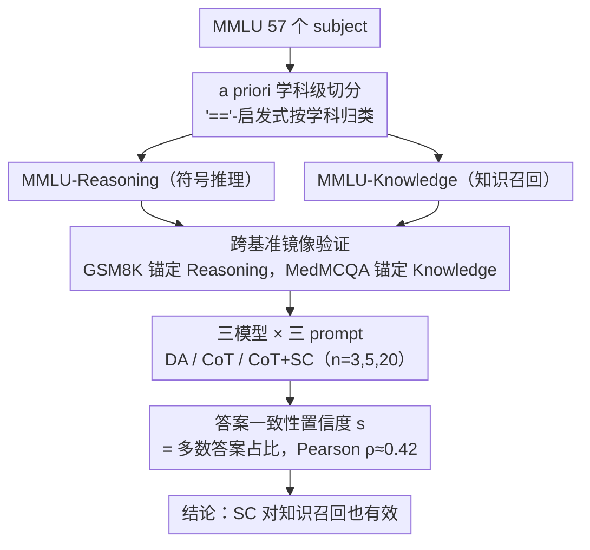

# Does Self-Consistency Improve the Recall of Encyclopedic Knowledge?

**会议**: ACL 2026  
**arXiv**: [2604.19395](https://arxiv.org/abs/2604.19395)  
**代码**: 暂无（论文未释出）  
**领域**: LLM 推理 / 知识召回 / 评测  
**关键词**: Self-Consistency, Chain-of-Thought, MMLU Split, Knowledge Recall, Symbolic Reasoning

## 一句话总结
作者对 MMLU 按学科应用 Sprague 等的 "=="-启发式把 57 个 subject 拆成 **符号推理** 与 **知识召回** 两个子集（约 1:2），实证证明 self-consistency (SC) 不仅在符号推理上有效——这是 CoT 已经擅长的领域——**在知识召回上也能持续增益**（n=20 时 +2.48），把 GPT-4o 的 MMLU 整体准确率推到 88.93%，并用"多数答案占比"作为置信度信号 (Pearson ρ ≈ 0.42) 给出机制解释。

## 研究背景与动机

**领域现状**：Chain-of-Thought (CoT) 已是 LLM 评测的标配，但 Sprague et al. (2025) 报告 CoT 在 MMLU 上 95% 的增益其实来自含符号推理（公式 / 数值）的题目；纯靠"百科知识召回"的题目几乎不受益。Self-Consistency (SC) 是 CoT 之上采样多条 reasoning path 再 majority vote，过去主要在算术 / 常识推理上验证。

**现有痛点**：既然 SC 完全建立在 CoT 之上，而 CoT 对知识召回类问题（如"富士山多高？"）几乎没用，那 SC 对知识召回是否也无用？此前 Chung et al. (2024) 虽在 MMLU 上跑过 SC，但 **没有把符号推理和知识召回分开报**，这两类信号被混在一起，掩盖了 SC 在不同问题类型上的真实贡献。

**核心矛盾**：MMLU 是混合任务，57 个 subject 既包含数学/物理/经济计量这种典型符号推理，也包含历史/法律/医学事实这种纯知识召回，但官方 supercategory（STEM / humanities）的划分是按学科归属的，**与推理类型不正交**（如计量经济学被归在 humanities）。没有一个干净的 a priori 切分，就无法回答 SC 对知识召回的真实效用。

**本文目标**：(RQ1) 知识召回类问题能否从多条 reasoning path 中受益？(RQ2) 若能，是通过什么机制？

**切入角度**：与其训练新的题型分类器，作者复用 Sprague 等 (2025) 的 "=="-启发式（如果一道题的问题或答案中出现 "=" 等数学符号，则判为符号推理），但把它从 **post-hoc 实例级模型相关** 升级为 **a priori 学科级模型无关** 的稳定切分。

**核心 idea**：用一个简单但稳定的 a priori 学科级二分把 MMLU 切成 reasoning / knowledge 两半，并用 GSM8K（纯符号推理）和 MedMCQA（几乎纯知识召回）作为原型基准做镜像验证；在这个干净的实验台上重测 SC，证明它对知识召回有效，并把"多数答案占比"形式化为置信度信号。

## 方法详解

### 整体框架
这篇论文不训练任何模型，整套工作都是 zero-shot 推理实验，目的是回答一个被前人含糊带过的问题：self-consistency (SC) 到底是只对符号推理有用，还是对纯知识召回也有用。它分四步搭实验台：先用 "=="-启发式把 MMLU 的 57 个 subject 在学科层面切成 reasoning / knowledge 两个子集（比例约 1:2）；再用两个推理类型纯净的外部基准 GSM8K（纯符号推理）和 MedMCQA（几乎纯知识召回）做镜像验证，确认切分是干净的；然后在 GPT-4o (2024-08-06)、GPT-4o-mini、Qwen2.5-32B-Instruct 上对比 Direct Answer (DA)、CoT、CoT+SC（$n \in \{3, 5, 20\}$，nucleus sampling top-$p=0.9$）；最后引入置信度 $s = \frac{|\text{majority answer}|}{|\text{valid answers}|}$，做它与正确性的 Pearson 相关分析，给出 SC 为何有效的机制解释。

### 关键设计

**1. a priori 学科级切分：把 MMLU 拆成推理类型纯净的两半**

MMLU 是个混合数据集，官方的 STEM / humanities 划分按学科归属走，和"推理类型"并不正交（计量经济学被归在 humanities 却是典型符号推理），所以没法直接用它来分别测 SC 在两类问题上的效用。作者复用 Sprague et al. (2025) 的实例级启发式——题目或答案里出现 "=" 这类数学等价符号就判为符号推理——但把它从"实例级、post-hoc、依赖模型输出"升级成"学科级、a priori、模型无关"：某学科样本里 "==" 出现率超过阈值，整科归入 reasoning，并在同一学科簇内传播（college math 归入则 elementary math 也归入），最终切出 reasoning : knowledge ≈ 1 : 2。这么改的好处是稳定可复现——实例级分类会因模型不同而结果不同，学科级切分则是固定的、别人能直接拿去复用。验证侧 Appendix E 用 CoT 增益曲线做数据驱动验证，AUC 高达 0.96，说明这个启发式切出来的子集，和"CoT 实际增益最大的那批题"高度吻合。

**2. 跨基准镜像验证：用两个边界清晰的原型基准夹逼 MMLU 切分的可信度**

光在 MMLU 内部很难自证子集"纯净"，于是作者引入两个推理类型明确的外部锚点来夹逼。GSM8K 是纯算术推理；MedMCQA 是医学单选，4,183 道题里只有 16 道出现 "=="（≈0.4%），可当作纯知识召回。逻辑很直白：如果 MMLU 切分是对的，那么 CoT 对 MMLU-Reasoning 的增益模式应该和 GSM8K 一致、对 MMLU-Knowledge 的增益模式应该和 MedMCQA 一致。Table 1 完全证实了这一点——CoT 在 GSM8K 上 +37.3、MMLU-Reasoning 上 +14.9（同属"大幅受益"），在 MedMCQA 上 +1.69、MMLU-Knowledge 上 +1.56（同属"几乎不受益"），两两对应。比起重新人工标注题型，用原型基准做镜像是成本低得多又可信的验证手段。

**3. 答案一致性作为置信度信号 $s$：把 majority vote 从投票机制升级成可量化的机制解释**

SC 在知识召回上有效这件事需要一个机制层面的解释，否则容易被"知识召回是单步演绎、多条路径没意义"的直觉反驳。作者把 majority vote 形式化为置信度 $s = \frac{\text{count of majority answer}}{\text{number of valid answers}}$——比如三条路径给出 $\{A, A, C\}$，多数答案 A 的置信度就是 $s = 2/3$。在 MMLU 上算 $s$ 与预测正确性的 Pearson 相关 $\rho$：$n=5$ 时 0.40、$n=20$ 时 0.42，reasoning 子集略高 (0.46)、knowledge 子集 0.42，说明"多数占比"是个跨问题类型都成立的可靠置信信号。由此 SC 的工作机制就清楚了：它不是靠"探索 + 综合多条推理路径"取胜，而是靠"过滤掉那些得出不同结论的不稳定路径"。作者还用定性样例佐证——哪怕是知识题，LLM 也会编出多个看似合理却互相冲突的解释，SC 恰好能把这种不稳定性压下去。

### 损失函数 / 训练策略
零训练，纯 inference。配置：MMLU 用 14,042 条测试集、GSM8K 用 1,319 条、MedMCQA 用 4,183 条验证集；GPT-4o-mini 上另用 285 条 dev 集配 4-shot 做 zero/few-shot 对比；CoT 最大输出 1000 tokens、DA 20 tokens；显著性用 paired bootstrap resampling（$p < 0.05$）。

## 实验关键数据

### 主实验
**GPT-4o 在 MMLU / GSM8K / MedMCQA 上准确率 (%)**：

| Prompt / Sampling | MMLU All | MMLU Reasoning | MMLU Knowledge | GSM8K | MedMCQA |
|-------------------|----------|----------------|----------------|-------|---------|
| DA, nucleus | 83.26 | 75.45 | 85.56 | 46.93 | 75.07 |
| CoT, nucleus | 87.86 (+4.60) | 90.38 (+14.93) | 87.12 (+1.56) | 84.23 (+37.30) | 76.76 (+1.69) |
| CoT + SC ($n=5$) | 88.64 (+5.38) | 91.32 (+15.87) | 87.85 (+2.29) | 84.31 (+37.38) | 77.67 (+2.60) |
| CoT + SC ($n=20$) | **88.93 (+5.67)** | **91.94 (+16.49)** | **88.04 (+2.48)** | **84.46 (+37.53)** | 77.41 (+2.34) |

CoT 提升大头来自 reasoning（+14.93 vs +1.56），与 Sprague et al. 的发现一致；但 SC 在 knowledge 上仍能再加 +0.92 (87.12 → 88.04)，且达到 $p<0.05$ 显著性。MedMCQA 上 SC 也加 +0.6~0.9，方向一致。

### 消融实验

| 配置 | MMLU dev (GPT-4o-mini) All / Reasoning / Knowledge | 说明 |
|------|--------------------------------------------------|------|
| 0-shot CoT | 80.35 / 84.44 / 78.46 | baseline |
| 0-shot CoT+SC ($n=5$) | 83.16 / 86.67 / 81.54 | 零示例 + SC 整体 +2.81 |
| 0-shot CoT+SC ($n=20$) | 82.81 / 88.89 / 80.00 | reasoning 子集 +4.45，最大增益 |
| 4-shot CoT | 80.35 / 80.00 / 80.51 | 与 0-shot CoT 持平 |
| 4-shot CoT+SC ($n=20$) | 82.46 / 85.56 / 81.03 | few-shot + SC 整体 +2.11 |
| Pearson ρ ($n=5$) | All 0.40 / Reasoning 0.43 / Knowledge 0.40 | 置信度信号有效 |
| Pearson ρ ($n=20$) | All 0.42 / Reasoning 0.46 / Knowledge 0.42 | 样本越多相关性越高 |

### 关键发现
- **SC 对知识召回有效**：在 MMLU-Knowledge 上 $n=20$ SC 比 vanilla CoT 多 +0.92，达到统计显著，颠覆"SC 只对符号推理有用"的常识。
- **多数答案占比 $s$ 是跨任务通用的置信信号**：ρ ≈ 0.42，与基于 logit 的置信度相比对 first-token bias 更鲁棒（参考 Wang et al. 2024a 的"我答案是 C"现象）。
- **零示例反而比少示例好**：Table 3 显示 0-shot CoT+SC 在 GPT-4o-mini 上与 4-shot 持平甚至更好，说明任意答案抽取 + SC 比示例约束更灵活。
- **GPT-4o 上 MMLU 整体冲到 88.93%**：是同等模型下当时最佳；说明 SC 仍是 GPT-4 时代被低估的简单技巧。
- **代价是线性算力**：$n=5$ 多花 5× 推理算力换 +0.7 点 knowledge 收益，回报率递减，工业部署需要权衡。
- **失败定性观察**：即使是知识题，LLM 也会生成多个"听起来都很合理"但相互冲突的解释（如"这里通常会做态势分析"），SC 通过过滤掉那些产生少数答案的路径来稳定输出。

## 亮点与洞察
- **"a priori 切分"研究范式**：先定义稳定的、不依赖模型输出的题型分类，再做技术效用对比，这是一种"可被复用的实验台"——其他研究者可直接套用 reasoning / knowledge split 重测自己的方法。
- **跨基准镜像验证**：用 GSM8K + MedMCQA 作为推理类型纯净的"锚点"，用它们的表现模式去验证 MMLU 子集的纯净度，是低成本高可信度的验证技巧，可迁移到任何混合 benchmark 的子集合理性论证。
- **majority vote → 置信度信号**：把朴素的多数投票形式化为 $s$ 并测它与正确性的相关，给出了 SC 工作的 **机制层** 解释，而非仅做 end metric 比较。这是把"工程技巧"升级为"可解释方法"的范式动作。
- **打脸"CoT 不帮助知识召回 ⇒ SC 也不帮助"的链式推断**：作者用反事实证明 CoT 与 SC 解决的问题不同——CoT 把"无推理"升级为"有推理"，SC 则是把"不稳定推理"升级为"稳定推理"；后者对所有推理类型（哪怕只是 1-step deduction）都有用。

## 局限与展望
- **学科级切分是粗粒度近似**：作者自己承认有些 subject 内部题型混合，subject 级切分是次优解。可以用实例级分类器（如真在 instance level 训一个 reasoning vs knowledge classifier）更精细。
- **SC 的成本随 $n$ 线性增长**：$n=5$ 换 +0.7 knowledge 准确率，工业上多数场景不值；论文未提算力优化（如早停 / 自适应 $n$）。
- **任务形式仅限 MCQA + 开放式数值**：作者承诺 universal self-consistency 可扩展到任意任务，但本文没实际跑生成任务（如摘要 / 翻译）的 SC 效果。
- **未对比更强的推理 paradigm**：与 self-refine、tree-of-thought 等更复杂的 reasoning enhancement 对比缺失，无法判断 SC 在更强基线之上是否还有边际收益。
- **GPT-4o 黑盒**：分析无法触及内部表征，机制解释只能停留在 prompt-output 行为层。

## 相关工作与启发
- **vs Sprague et al. 2025 ("To CoT or not to CoT")**: 他们用 "=="-启发式做 instance-level、post-hoc 分类来论证 "CoT 主要帮符号推理"；本文把它升级为 a priori subject-level 切分，并把分析对象从 CoT 推进到 SC，得出"SC 同时帮两类"的更强结论。
- **vs Chung et al. 2024 (Flan-PaLM SC on MMLU)**: 他们在 MMLU 上跑过 SC 但没按 subject 分解，本文是首次明确量化 SC 在"知识召回"子集上的贡献。
- **vs Wang et al. 2023 (原 SC paper)**: 原文聚焦算术/常识推理，本文延伸到知识召回，证明 SC 的适用面比作者最初设想更广。
- **vs MMLU-Pro / MMLU-CF / MMLU-Redux**: 这些工作做 instance-level 数据修正，本文做 subject-level 分组，两者正交可叠加。

## 评分
- 新颖性: ⭐⭐⭐ 没有提出新技术，但研究问题尖锐、切入巧妙；"a priori subject-level split + cross-benchmark mirror validation"是一个值得复用的方法学贡献。
- 实验充分度: ⭐⭐⭐⭐ 3 个模型 × 3 个基准 × 多 $n$ × 0-shot/4-shot × Pearson 相关分析 + 定性样例 + bootstrap 显著性检验，small paper 但实验密度很高。
- 写作质量: ⭐⭐⭐⭐⭐ 问题陈述清晰、动机链 (CoT → SC → 知识召回) 一气呵成，表格设计极简但信息密度极高，是 short paper 写作典范。
- 价值: ⭐⭐⭐⭐ 直接 actionable——所有用 LLM 评测的研究都应把"是否在 knowledge subset 上有提升"作为单独维度报告；同时 $s$ 作为通用置信度信号对 calibration 研究有现成用法。

<!-- RELATED:START -->

## 相关论文

- [\[ACL 2026\] Reliability-Aware Adaptive Self-Consistency for Efficient Sampling in LLM Reasoning](reliability-aware_adaptive_self-consistency_for_efficient_sampling_in_llm_reason.md)
- [\[ICML 2025\] Self-Consistency Preference Optimization](../../ICML2025/llm_reasoning/self-consistency_preference_optimization.md)
- [\[ACL 2025\] Ranked Voting based Self-Consistency of Large Language Models](../../ACL2025/llm_reasoning/ranked_voting_based_self-consistency_of_large_language_models.md)
- [\[ACL 2026\] Self-Consistency from Only Two Samples: CoT-PoT Ensembling for Efficient LLM Reasoning](self-consistency_from_only_two_samples_cot-pot_ensembling_for_efficient_llm_reas.md)
- [\[ACL 2026\] Learning to Edit Knowledge via Instruction-based Chain-of-Thought Prompting](learning_to_edit_knowledge_via_instruction-based_chain-of-thought_prompting.md)

<!-- RELATED:END -->
