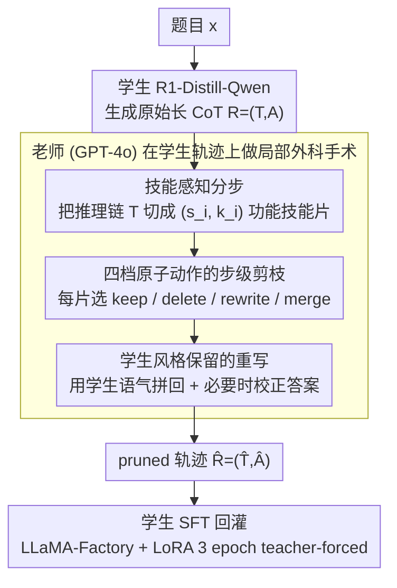

# DRP: Distilled Reasoning Pruning with Skill-aware Step Decomposition for Efficient Large Reasoning Models

**会议**: ACL 2026  
**arXiv**: [2505.13975](https://arxiv.org/abs/2505.13975)  
**代码**: https://github.com/YuxuanJiang1/DRP （有）  
**领域**: LLM 推理 / 蒸馏 / 高效推理  
**关键词**: Long-CoT 剪枝、技能感知分步、蒸馏、过度思考、Short-CoT 老师

## 一句话总结
DRP 让"短 CoT 老师 (GPT-4o)"在"长 CoT 学生 (R1-Distill-Qwen)"自己的推理轨迹上做技能级分步+剪枝/重写，再把这条"裁掉冗余但保留学生说话风格"的轨迹蒸馏回学生，在 GSM8K 把 7B 模型 token 从 917 砍到 328（−64%）的同时把 Pass@1 从 91.7% 提到 94.1%，且在 AIME/AMC/MATH500 等 OOD 任务上同时降 token、涨准确率。

## 研究背景与动机

**领域现状**：Large Reasoning Models（o1、DeepSeek-R1 及其 distill 系列）通过显式 Long-CoT 把数学/逻辑任务的 SOTA 又往前推了一截，但代价是输出 verbose——一道 GSM8K 题学生模型平均要吐近千 token，AIME 一题能吐 8k+，推理成本和延迟都成倍上涨。

**现有痛点**：业界压 token 的三大流派各有短板：(i) **prompt-based** (如 TALE) 用 token budget 提示约束生成，在 GSM8K 上轻微掉点但到了 AIME 立刻崩；(ii) **SFT-based** (如 CoT-Valve) 用越来越短的 CoT 蒸馏，但在 MATH500/AMC 上准确率明显回退；(iii) **RL-based** (如 ThinkPrune) 用 length penalty 直接奖励短输出，对 1.5B 还行但通常要复杂的 reward 设计且 OOD 不稳。

**核心矛盾**：**学生 Long-CoT 风格和老师 Short-CoT 风格存在 "learnability gap"**——直接拿 GPT-4o 蒸馏出来的 186-token 简短答案去 fine-tune 学生，学生不知道"我自己写的那种反思 + 回溯结构"该怎么压缩，结果在 OOD 上 MATH500 掉到 88.6%、AIME 掉 2 题。换句话说，"剪枝"和"蒸馏"两条路各自都会损精度，能不能合起来？

**本文目标**：在保持学生原本的 long-form reasoning 结构的前提下，让一个老师只剪冗余、不重写风格，从而既减 token 又涨精度。

**切入角度**：作者的关键观察是——**学生 Long-CoT 内部其实是按"功能技能 (skill)"组合的**（读题→列方程→算术→比较→验证），所以可以让老师先把学生轨迹按 skill 切片，再针对每一片做 keep / delete / rewrite / merge 这种"局部外科手术"，而不是整段重写。

**核心 idea**：把"老师蒸馏"换成"老师做技能级剪枝"——让老师在学生自己的轨迹上动刀，保留学生的说话风格和结构骨架、删掉冗余分支，再把这条 pruned 轨迹回灌给学生 SFT。

## 方法详解

### 整体框架
DRP 要解决的是 Large Reasoning Models 的"过度思考"——R1-Distill-Qwen 这类长 CoT 学生一道 GSM8K 题平均要吐近千 token、AIME 一题能吐 8k+，推理成本和延迟都成倍上涨。它的核心思路反常规：不让老师重写答案，而是让老师在学生自己的轨迹上"做局部外科手术"，只剪冗余、不换风格。整条 pipeline 分三段：先用 R1-Distill-Qwen-1.5B/7B 在 GSM8K 训练集 + PRM12K 上跑出原始长 CoT $R=(T,A)$（$T$ 是 `<think>` 里的推理链、$A$ 是答案）；再把 $T$ 交给老师（默认 GPT-4o）做技能感知分步、逐步剪枝、风格化重写，必要时同步修正答案，产出 pruned 版 $\hat{R}=(\hat{T},\hat{A})$；最后用 $(x,\hat{R})$ 作为训练对，让学生通过 LLaMA-Factory + LoRA 跑 3 epoch teacher-forced 的标准 SFT，把这条"裁掉冗余但仍是自己说话风格"的轨迹学回去。

### 关键设计

**1. 技能感知分步：先按"功能技能"切片，再谈剪枝**

要判断"哪一步多余"，前提是先把推理链切成语义连贯的步骤——而简单按句号或 `\n\n` 切出来的边界往往跨在一个完整推理动作的中间，老师没法在统一粒度上判断。DRP 让老师把学生的长 CoT $T$ 切成 $\{(s_1,k_1),\ldots,(s_m,k_m)\}$，每段 $s_i$ 是一个 token span，$k_i$ 是它承担的功能技能标签（如 "Reading given quantity"、"Algebraic representation"、"Interpreting fractions of a subset"、"Arithmetic"、"Comparison"、"Logical inference"）。给每步贴上"它在做什么功能"的标签后，边界更稳定、语义更内聚，老师后续才能在一致的粒度上判断每片是否冗余。作者实测（Tab.2）skill 分法平均每道 GSM8K 题切出 12.6 步、default 分法只有 8.3 步，但 skill 分法在 AMC 上反而准确率高 2/40、token 还少 1.7k——说明"分得更细"加"标签明确"才是更好的剪枝基础，而不是负担。

**2. 四档原子动作的步级剪枝：对每片做 keep/delete/rewrite/merge**

切好片之后，老师对每个 $(s_i,k_i)$ 选一种原子动作产出 $\hat{s}_i$：**Keep**（本身已精简且必要）、**Delete**（冗余的 verbose 自我纠正或回溯）、**Rewrite**（核心逻辑保留、换更短的表达）、**Merge**（把相邻原子操作并成一步，避免无谓换行）；最后把保留下来的 $\{\hat{s}_1,\ldots,\hat{s}_{m'}\}$（$m'\le m$）重新拼成一段连贯的 $\hat{T}$，并检查它和原答案 $A$ 是否一致，必要时改成 $\hat{A}$。这套"四选一"回应了一个核心痛点——单纯求短并不等于好：直接蒸馏 GPT-4o 那种仅 186-token 的简洁答案，在 OOD 上掉得很厉害（Tab.4）。保留 keep/rewrite/merge 而不是一刀切"全部重写"，能让 pruned trace 仍然走学生熟悉的"长链路 + 反思"骨架，只是去掉多余回溯，因此学生学得动（learnability gap 小）、迁移性也好。

**3. 学生风格保留的重写：拼回去时用学生的语气，而不是 GPT-4o 的数学体**

把裁完的离散步骤拼回一段流畅文本时，最容易踩的坑是老师顺手把整段改成自己简洁的数学表达，这等于偷偷把学生的推理风格也换掉了。DRP 在 prompt 里明确要求老师 "preserve the tone and speaking style of the student model"——只重组、不换腔调。这一步是 DRP 与"直接 distill GPT-4o 简洁答案"之间最本质的差别：后者把整个推理风格连根换掉，前者只换掉冗余。作者把它上升为全文的中心论点——"有效的训练 CoT 应当既信息充分、又在结构上和学生自身的推理过程一致"。Tab.4 的对照很有说服力：distill from GPT-4o（~186 token avg）在 OOD 上 MATH500 只有 88.6% / AMC 28/40，而 DRP（~330 token avg）做到 93.0% / 33/40，证明保留结构比追求更短更重要。

### 损失函数 / 训练策略
- **损失**：标准 NLL，$\mathcal{L}_{\text{SFT}} = -\sum_{i=1}^n \log P_\theta(y_i \mid x, y_{<i})$，$y$ 是 $\hat{R} = (\hat{T}, \hat{A})$ 的全部 token。
- **训练数据**：GSM8K 训练集 + PRM12K，全部经过老师剪枝。
- **学生模型**：R1-Distill-Qwen-1.5B / 7B。
- **老师模型**：GPT-4o (默认)，消融用 Gemini 2.0 Flash / ChatGPT / DeepSeek-V3。
- **训练设置**：LLaMA-Factory + LoRA，3 epoch，cosine LR；推理用 vLLM，max length 131072。
- **评估**：lm-evaluation-harness 跑 zero-shot，Pass@1 平均 5 runs；token 数用 Qwen tokenizer 数，并设 12k token cutoff 屏蔽 degenerate loop 样本（cutoff 经验上覆盖 99% 正确响应）。

## 实验关键数据

### 主实验
Tab.1：DRP 与三大基线（TALE prompt、CoT-Valve SFT、ThinkPrune RL）在 R1-Distill-Qwen 7B/1.5B + 4 个 math benchmark 上的 Pass@1 与 #Tokens 对比：

| 模型 | 方法 | GSM8K (Acc / Tok) | MATH500 OOD | AIME24 OOD | AMC OOD |
|------|------|-------------------|-------------|------------|---------|
| 7B Base | — | 91.7% / 917 | 92.4% / 2486 | 15/30 / 8674 | 31/40 / 4845 |
| 7B | +TALE | 91.0% / 522 | 91.6% / 2530 | 10/30 / 8602 | 31/40 / 3998 |
| 7B | +CoT-Valve | 90.8% / 364 | 89.4% / 1975 | 13/30 / 6315 | 30/40 / 3157 |
| 7B | **+DRP** | **94.1% / 328 (−64%)** | **93.0% / 1781 (−28%)** | **15/30 / 4966 (−43%)** | **33/40 / 3258 (−33%)** |
| 1.5B Base | — | 70.7% / 1443 | 80.4% / 3276 | 6/30 / 10484 | 23/40 / 6516 |
| 1.5B | +ThinkPrune | 80.0% / 712 | 79.2% / 2006 | 9/30 / 5745 | 25/40 / 3291 |
| 1.5B | **+DRP** | **83.4% / 721 (−50%)** | **82.0% / 2122 (−35%)** | **10/30 / 6135 (−42%)** | **27/40 / 3657 (−44%)** |

DRP 是表中唯一一个在所有 4 个 benchmark 上都做到"同时降 token + 同时涨准确率"的方法；1.5B 学生 GSM8K 直接 +12.7 个百分点。

### 消融实验
RQ1 (Tab.2) skill 分步 vs default 分步 vs 不分步（7B 学生）：

| 配置 | GSM8K (Acc / Tok) | MATH500 | AIME24 | AMC |
|------|-------------------|---------|--------|-----|
| 7B base | 91.7% / 917 | 92.4% / 2486 | 15/30 / 8674 | 31/40 / 4845 |
| No decomposing | 91.0% / 434 | 88.6% / 2102 | 13/30 / 6201 | 29/40 / 4028 |
| Default split | 92.7% / 350 | 92.0% / 1905 | 14/30 / 4678 | 31/40 / 4975 |
| **DRP (skill)** | **94.1% / 328** | **93.0% / 1781** | **15/30 / 4966** | **33/40 / 3258** |

RQ2 (Tab.4) DRP vs 直接 distill GPT-4o：

| 配置 | GSM8K | MATH500 | AIME24 | AMC |
|------|-------|---------|--------|-----|
| 7B base | 91.7% / 917 | 92.4% / 2486 | 15/30 / 8674 | 31/40 / 4845 |
| Distill (GPT-4o 短答案, ~186 tok avg) | 90.7% / 425 | 88.6% / 2152 | 13/30 / 6417 | 28/40 / 4279 |
| **DRP (~330 tok avg)** | **94.1% / 328** | **93.0% / 1781** | **15/30 / 4966** | **33/40 / 3258** |

RQ3 (Tab.3) 老师模型敏感度：GPT-4o (94.1% GSM8K) / Gemini 2.0 Flash (93.2%) / DeepSeek-V3 (92.7%) / ChatGPT (91.2%)，全部优于 baseline。

### 关键发现
- **结构 > 长度**：直接蒸馏 GPT-4o 短答案能把 GSM8K token 砍到 425，但 MATH500/AIME24/AMC 全部掉点；DRP 反而稍长 (~330 GSM8K) 却在 OOD 上同步涨点——验证"保留学生原生骨架"比"逼到最短"更重要。
- **小模型受益更大**：1.5B 学生 GSM8K 直接 +12.7 个百分点、AIME 多对 4 题、AMC 多对 4 题；7B 学生主要靠 token 减少（GSM8K −64%）。说明 DRP 对"capacity 不够导致 overthinking"的小模型尤其有效。
- **Skill 分步是必需品**：完全不分步会让 MATH500 从 92.4% 掉到 88.6%、AMC 从 31/40 掉到 29/40；改成按句号分也比 skill 分差 1-2 个百分点，并且 token 还更多——说明粒度和功能标签共同决定了剪枝质量。
- **老师选择不敏感**：4 个老师都能涨点，最弱的 ChatGPT 也在 AIME/AMC 上稳定 +1 题，说明 DRP 不绑死特定 family；但 GPT-4o 在 token 压缩上最强（GSM8K 328 vs Gemini 419）。
- **Token 分布的长尾被砍掉**：Fig.3 显示 AMC 上 baseline 有近 max-length 的二次峰（degenerate loop），DRP 后这个长尾峰消失，证明它不只是"平均变短"，而是从根上减少了模型陷入循环死生成的概率。

## 亮点与洞察
- **"老师不教，老师裁"是个反直觉的好 setup**：传统蒸馏让老师重写整个答案、学生只学最终风格，结果学生学不像；DRP 让老师只做"局部编辑"——保留学生骨架、删冗余、改风格化拼接——既绕过了 learnability gap，又能利用大模型的"判断哪步多余"能力。
- **Skill 标签把"剪枝判断"变成了细粒度可追溯操作**：相比"按句号切"，按 skill 切让老师能在每一片上独立判断 keep/delete/rewrite/merge，结构化的 prompt 一致性更高，是把 LLM-as-pruner 落地的关键 trick，可以迁移到其他 long-CoT 编辑/审计任务。
- **"短不一定好"的负面证据非常有力**：Tab.4 直接蒸馏 186-token 的简洁答案在 OOD 上崩，把"压缩 = 短"这种简单直觉打掉，并把 DRP 的 380-token 设成了 "sweet spot"。
- **degenerate-loop 长尾问题的实证显式化**：作者通过 12k cutoff 把模型陷入循环的样本量化出来，并展示 DRP 让长尾完全消失——这对生产环境部署的 LRM 推理稳定性有直接意义。

## 局限与展望
- **目前只在 R1-Distill-Qwen 1.5B/7B 两个学生上验证**：作者自己也指出小尺寸开源 LRM 数量有限，方法在更大学生（R1-Distill-Qwen-14B/32B、Qwen3 系列、Llama-Reasoning-70B）上的边际收益是否还在不确定。
- **依赖闭源大模型当老师**：GPT-4o 作为默认 teacher 成本不低；虽然 Gemini Flash / DeepSeek-V3 也行，但 prompt 的稳定性、API 成本、batch throughput 在大规模训练数据生成时不是小开销。
- **任务范围窄**：实验仅覆盖数学（GSM8K/MATH500/AIME/AMC），代码、agent planning、科学推理、长上下文 reading 等都没测；DRP 假设的"按 skill 可分"在这些领域是否同样自然有待验证。
- **没有 RL 上的组合**：DRP 是纯 SFT 的，是否能作为 ThinkPrune / S-GRPO 等 RL 方法的 warm-start（先 DRP 把分布拉到"短而准"，再 RL 微调）是值得一做的方向。
- **没有 cost-benefit 分析**：相比 ThinkPrune 的 RL 训练成本，DRP 节省了 RL，但要消耗大量 GPT-4o API；缺一张"老师成本 vs 学生精度增益"曲线。

## 相关工作与启发
- **vs CoT-Valve (Ma et al. 2025)**：CoT-Valve 用多轮 SFT 在越来越短的 CoT 上训练，本质上还是"逼到更短"，OOD 会掉精度；DRP 用 skill-aware editing 替代了"全长度 sweep"，结构性更好。
- **vs TALE (Han et al. 2024)**：TALE 用 prompt 加 token budget，零训练但控不住复杂 reasoning；DRP 是训练时干预，效果更鲁棒。
- **vs ThinkPrune (Hou et al. 2025)**：ThinkPrune 用 RL + target length 逐步收紧，对小模型有效；DRP 在 1.5B 上比 ThinkPrune 同步把 GSM8K 准确率从 80.0% 推到 83.4%，token 数相当，说明 SFT-with-pruned-teacher 是 RL 之外的一个轻量替代。
- **vs 自我精修 (Madaan et al. 2023 Self-Refine)**：Self-Refine 让模型自己反思自己；DRP 用外部更强老师做剪枝判断，避开了 R1-Distill-Qwen 自己判断不准的问题。
- **启发**：把"老师做局部编辑"的思路从 reasoning 推广到代码（保留学生写法，老师删冗余分支）、对话（保留学生风格，老师删多余道歉/澄清）、agent trace（保留行动序列，老师删失败回溯），都是顺理成章的扩展。

## 评分
- 新颖性: ⭐⭐⭐⭐ "老师不重写、老师按 skill 裁"是 Long-CoT 蒸馏里一个清晰的新视角。
- 实验充分度: ⭐⭐⭐ 主表 + 三组消融 + 四个老师模型敏感度，覆盖到位；但只测数学、只用 2 个学生 size，缺 RL 头对头。
- 写作质量: ⭐⭐⭐⭐ Fig.2 一张图把"分步→剪枝→重写"讲清楚，"结构 vs 长度"的对照实验论证有力。
- 价值: ⭐⭐⭐⭐ 推理高效化是当前 LRM 部署最痛的问题之一，DRP 是个轻量、可迁移、效果显著的方案。

<!-- RELATED:START -->

## 相关论文

- [\[ACL 2026\] Step-GRPO: Internalizing Dynamic Early Exit for Efficient Reasoning](step-grpo_internalizing_dynamic_early_exit_for_efficient_reasoning.md)
- [\[ACL 2026\] ReProbe: Efficient Test-Time Scaling of Multi-Step Reasoning by Probing Internal States of Large Language Models](reprobe_efficient_test-time_scaling_of_multi-step_reasoning_by_probing_internal_.md)
- [\[ACL 2026\] DELTA: Dynamic Layer-Aware Token Attention for Efficient Long-Context Reasoning](delta_dynamic_layer-aware_token_attention_for_efficient_long-context_reasoning.md)
- [\[ACL 2026\] Stabilizing Efficient Reasoning with Step-Level Advantage Selection](stabilizing_efficient_reasoning_with_step-level_advantage_selection.md)
- [\[ACL 2026\] Efficient Test-Time Scaling via Temporal Reasoning Aggregation](efficient_test-time_scaling_via_temporal_reasoning_aggregation.md)

<!-- RELATED:END -->
