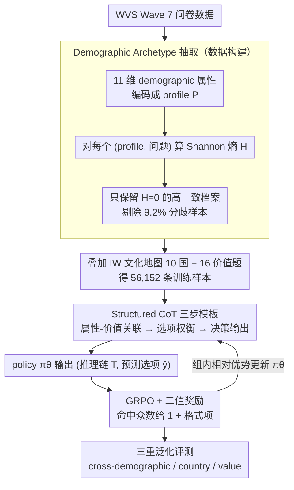

# DVMap: Fine-Grained Pluralistic Value Alignment via High-Consensus Demographic-Value Mapping

**会议**: ACL 2026  
**arXiv**: [2605.14420](https://arxiv.org/abs/2605.14420)  
**代码**: https://github.com/EnlightenedAI/DVMap  
**领域**: LLM 对齐 / 价值观  
**关键词**: 多元价值对齐、Demographic Archetype、Structured CoT、GRPO、跨文化泛化

## 一句话总结
DVMap 把 LLM 的"多元价值对齐"从粗粒度的国家标签下沉到 11 维 demographic 属性档案，先用 Shannon 熵 = 0 的"高一致性档案"过滤出 5.6 万条 WVS 数据，再用 Structured CoT + GRPO（二值奖励）训练 Qwen3-8B，使其在 cross-demographic / cross-country / cross-value 三重泛化测试中超越 DeepSeek-v3.2、并和 GPT-4o 持平。

## 研究背景与动机

**领域现状**：主流 LLM 价值对齐要么走 RLHF（Bai et al. 2022、Rafailov 2023），要么走"prompt 工程 + 多文化微调"，标签层级基本停留在"国家"——例如让模型"以日本人身份回答"。基准如 WVS、GlobalOpinionQA 也常用国家粒度评估。

**现有痛点**：作者用 WVS Wave 7 做实证发现两件事：(1) 在同一个国家内，几乎一半价值问题的 Shannon 熵 > 1.0，存在巨大 intra-country heterogeneity；(2) 用随机森林做 Mean Decrease Impurity 分析，"Religion / Income / Occupation"对价值预测的贡献度普遍**超过 Country**。换言之，国家标签远不足以刻画一个人的价值，反而抹平了重要差异。

**核心矛盾**：要表达"多元价值"必须细粒度，但细到个体又无监督信号；现有方法在"宏观国家"与"微观个体"之间留下空白。

**本文目标**：在国家与个体之间找一个**可学习、可泛化**的中间粒度——即"demographic archetype"，并解决三个子问题：(1) 如何从 WVS 抽出**高一致**子集；(2) 如何让模型显式推理"人口属性 → 价值"链路；(3) 如何在不破坏通用能力的情况下精确锚定群体分布。

**切入角度**：观察到当 demographic profile 完全一致（11 维全匹配）的样本组里，仍有 9.2% 价值回答内部分歧——这部分本质上是噪声；而剩下 H=0 的样本才是稳定的"原型回答"。

**核心 idea**：用熵阈值过滤建立"高共识 demographic-value 语料"，再用 Structured CoT 把"属性→价值"的隐式映射显式化，最后用 GRPO 的二值奖励"以简胜繁"地锚定分布。

## 方法详解

### 整体框架
整套 pipeline 由三大阶段组成：(1) **数据构建**——从 WVS Wave 7 出发，先按 11 维 demographic 属性做 archetype 聚合，对每个 profile-question 对计算 Shannon 熵，只保留 $H=0$ 的样本，叠加 Inglehart-Welzel 文化地图的 10 国采样和 16 个价值题筛选，最终得到 56,152 条训练样本；(2) **群体价值对齐（demographic value alignment）训练**——给定 profile $P$、问题 $Q$ 与 Structured CoT 指令 $I_{cot}$，policy $\pi_\theta$ 输出 $(T,\hat y)\sim\pi_\theta(\cdot|P,Q,I_{cot})$，用 GRPO + 二值奖励 $r=\mathbb{I}(\hat y=y_i)+\beta r_{format}$ 把输出分布锚定到 WVS 真值；(3) **三重泛化评测**——额外构造 21,553 条样本覆盖 cross-demographic（6,240）/ cross-country（7,973，含 8 个未见国家）/ cross-value（7,340，含 7 个未见价值题）。前两阶段是论文的三个核心设计所在：数据侧的「Demographic Archetype 抽取」，训练侧的「Structured CoT 三步模板」与「GRPO + 二值奖励」协同——前者塑形推理、后者锚定分布。

### 关键设计

**1. Demographic Archetype 抽取：用熵 = 0 严过滤把"人口原型 → 稳定价值"的子集挑出来**

以往多文化微调把"同一国家所有人的回答"直接拿来训练，等于在监督信号里塞进了 intra-country 的异质性噪声——这正是背景里实证出的痛点。DVMap 换一种聚合方式：先按 Bourdieu 社会分层，把每个 WVS 被访者用 11 维属性（Country / Gender / Age / Marital / Parenthood / Income / Occupation / Work Nature / Education / Religion / Language）编码成一个 profile $P$，约 32.8% 的 profile 会出现多人重叠。对每个 $(P, Q)$ 对计算这组人回答的 Shannon 熵 $H$，**只保留 $H=0$（组内完全一致）的 profile-value 对**，把约 9.2% 的"分歧档案"整组剔除。这样留下的不是"某国平均意见"，而是"某类人口原型的稳定众数回答"，相当于在拟合前就把标签噪声从源头清掉——消融里它比 majority voting 还多涨 1.4% Acc，说明这步过滤本身就是数据侧最大的杠杆。

**2. Structured CoT 三步模板：把"人口属性 → 价值"的隐式社会学关联显式化成可监督的推理链**

光有干净数据还不够，模型需要学会"为什么这类人会这样选"，否则容易退化成按字段查表。但放开让它自由推理又会产生"逻辑幻觉"——消融里 Base 在推理期临时加 CoT 反而掉了 0.8% ACC。DVMap 的做法是用指令模板 $I_{cot}$ 把推理硬编码成固定三步：(i) Demographic-Value Correlation Analysis，逐属性分析问题是否触及该身份的核心利益或信念冲突；(ii) Option Trade-off，逐个选项评估与人口画像的兼容性；(iii) Decision Output，把最终选项放进 `<answer></answer>`。关键在于这条思维链不是推理期临时挂上去的，而是和下面的 GRPO 训练绑定，让中间推理在 RL 信号下获得隐式监督、被逐步塑形成稳定的"角色扮演 + 选项权衡"模式，相当于给模型一个安全的思维支架。

**3. GRPO + 极简二值奖励：用最干净的命中信号把输出分布峰值锚到 archetype 众数上**

按直觉，价值是有序的 Likert 量表（Strongly Disagree ↔ Strongly Agree），奖励似乎应该按距离连续加权才"信息更多"。DVMap 反其道而行，只用最简单的二值奖励

$$r=\mathbb{I}(\hat y=y_i)+\beta r_{format}$$

命中目标众数 $y_i$ 给 1、否则给 0，再加一个格式项；选项之间的相对优劣交给 GRPO 在组内基线下算 Relative Advantage。背后的假设是：LLM 预训练时早已编码了"Agree ↔ Strongly Agree"这类自然语义拓扑，token 嵌入空间本身就能插值出有序分布，连续奖励不但没必要，反而会和这套既有拓扑互相干扰。消融把它和 Likert-adjusted 软奖励 $r=\alpha(1-|\hat y-y|/(L-1))+\beta r_{format}$ 对比，结果二值奖励 ACC 高 1.6%、WD 低 0.013——"以简胜繁"在这里是实打实的。

### 损失函数 / 训练策略
GRPO 学习率 $5\times 10^{-6}$，温度 $T=0.7$，每条样本 8 次 rollout，全局 batch=64，仅训 1 epoch 防止过拟合；硬件 8×A100 80GB；用 VeRL + FSDP2 + Flash-Attention + bfloat16。基础模型覆盖 Qwen3 0.6B/1.7B/4B/8B 与 Llama-3.2-3B-Instruct。评测三指标：精确匹配 Acc、Likert Consistency $\text{LC}=1-\frac{1}{N}\sum\frac{|\hat y-y|}{K-1}$、Wasserstein Distance $\text{WD}=\sum_k|\text{CDF}_{pred}(k)-\text{CDF}_{real}(k)|$。

## 实验关键数据

### 主实验
在 cross-demographic 测试集（不重叠 profile）上与主流大模型对比，Qwen3-8B-DVMap 仅 8B 参数即超越 GPT-4o：

| 模型 | 参数规模 | Acc ↑ | LC ↑ | WD ↓ |
|------|---------|-------|------|------|
| Qwen3-14B | 14B | 46.2 | 83.5 | 0.1460 |
| Qwen3-next-80B-a3B | 80B (3B act) | 47.6 | 82.5 | 0.1449 |
| Llama-3.3-70B-Instruct | 70B | 46.4 | 83.3 | 0.1504 |
| DeepSeek-v3.2-exp | 671B (MoE) | 45.1 | 82.3 | 0.1342 |
| Claude-3.7-sonnet | – | 26.9 | 46.4 | 0.1503 |
| GPT-4o-mini | – | 46.3 | 82.4 | 0.1476 |
| GPT-4o | – | 48.5 | 83.8 | 0.1418 |
| **Qwen3-8B-DVMap** | **8B** | **48.6** | **83.9** | **0.1321** |

cross-country 上仅训 10 国，0.6B/1.7B/4B/8B 在 8 个未见国家分别提升 +16.2 / +10.7 / +2.8 / +5.3 % Acc；Llama-3.2-3B 的 cross-demographic 也从 36.2 % 涨到 49.0 %，证明跨架构有效。

### 消融实验
基于 Qwen3-4B，三组消融均指向核心设计：

| 维度 | 配置 | Acc % | LC % | WD |
|------|------|-------|------|-----|
| 数据过滤 | Base | 44.3 | 82.2 | 0.158 |
| 数据过滤 | Majority Voting ($H\ge 0$) | 46.5 | 83.1 | 0.149 |
| 数据过滤 | **DVMap ($H=0$ 严过滤)** | **47.9** | **83.7** | **0.142** |
| 推理策略 | Base + 推理时 CoT | 43.5 | 82.1 | 0.166 |
| 推理策略 | Standard RL（自由推理） | 46.2 | 83.2 | 0.151 |
| 推理策略 | **DVMap（Structured CoT + RL）** | **47.9** | **83.7** | **0.142** |
| 奖励函数 | Likert-adjusted 软奖励 | 46.3 | 83.4 | 0.155 |
| 奖励函数 | **DVMap（二值奖励）** | **47.9** | **83.7** | **0.142** |

### 关键发现
- **过滤策略是数据侧最大杠杆**：$H=0$ 严过滤比 majority voting 多涨 1.4% Acc，说明"内部不一致样本"是显著的标签噪声，比扩大数据量更值得花精力。
- **Structured CoT 必须与训练协同**：单独推理期加 CoT 反而掉点，说明"思维链"只有在被 RL 信号塑形后才稳定；这给"测试时 CoT vs 训练时 CoT"提供了直接证据。
- **二值奖励 > Likert 软奖励**：与一般"reward 越细越好"直觉相反，作者用 GRPO 内部相对优势 + 预训练语义拓扑的天然有序性，把奖励复杂度降到最低反而最好。
- **真正学的是因果而非记忆**：robustness 分析把 Income 高低反转（其余 10 属性不变）后，DVMap 的 value flip rate 在非财务领域显著低于 base，说明它在"按多维身份综合判断"而非"靠收入字段查表"。
- **alignment tax 几乎为零**：MMLU/ARC-E/GSM8K/HellaSwag 上波动 <0.1%，IFEval 反而 +0.48%，证明 GRPO + 二值奖励不会损害通用能力。

## 亮点与洞察
- **把"价值对齐"重述成"流形映射"**：作者明确把目标说成"学 demographics → values 的 manifold mapping"，于是 cross-country/value 泛化就是验证流形的连续性，这种几何视角让评测设计自然落到三重泛化基准上。
- **Shannon 熵 = 0 的严过滤是一招便宜的高 ROI 操作**：思想朴素但效果立竿见影，未来任何"群体偏好对齐"工作都可以照搬"先按高维属性聚合 → 再用熵阈值过滤"。
- **以"简胜繁"的奖励工程**：和 RLHF 圈普遍堆复杂偏好/距离奖励的趋势反着走，提供了一个反例——预训练好的语义拓扑本身就是一种隐式奖励 prior。
- **Robustness 案例（俄罗斯丧偶女性）**：DVMap 把"高收入"权衡为"丧偶情感冲击 + 俄罗斯文化谦逊"后仍输出 Rather happy，而 base 直接被收入翻转拉成 Very happy——这种"intersectionality"行为是对齐研究里少见的可解释成功案例。

## 局限与展望
- WVS 是静态快照，无法反映价值随时间的动态演化，对快速变化的社会议题（如 AI 伦理）失效快。
- 11 维 demographic profile 是统计抽象，捕获的是"社会学角色"而非"心理学个体"，对个体差异巨大的小众群体仍会失真。
- 评测是多选题判别式的，无法度量模型在开放生成中是否能用 identity-specific 的语气和修辞作答；从 discrimination 到 generation 的桥梁尚未搭。
- 未来可与 personalized alignment（Guan et al. 2025）结合，把 archetype 作为先验、个体微调作为后验，做"分层贝叶斯式"的对齐。

## 相关工作与启发
- **vs CultureLLM / CulturePark (Li et al. 2024a/b)**：他们仍用国家级文化标签做微调；DVMap 用 11 维属性 + 熵过滤把粒度往下推一格，避免了"假装日本人"式的浅层 prompt 注入。
- **vs Modular Pluralism (Feng et al. 2024)**：他们靠多 LLM 协作完成多元化输出；DVMap 在单模型内部完成 archetype 泛化，部署成本低。
- **vs RLHF (Bai et al. 2022) / DPO (Rafailov 2023)**：传统 RLHF 学的是"普适偏好"，本文是 GRPO + 二值奖励 + 群体目标，把"对齐"重新定义为"分布锚定"。
- **启发**：把"高一致子集 + Structured CoT + 极简奖励"这三件套作为模板，可以迁移到任何"群体行为预测"任务（如医患偏好、法律量刑、消费决策）——核心是先用熵阈值找到"原型可学习的子集"。

## 评分
- 新颖性: ⭐⭐⭐⭐ 把价值对齐粒度下推到 demographic archetype 并提供三重泛化基准，思路清晰且基础扎实。
- 实验充分度: ⭐⭐⭐⭐⭐ 三重泛化 + 跨架构 + 三项消融 + robustness + general utility，覆盖面很全。
- 写作质量: ⭐⭐⭐⭐ 实证—方法—评测—消融递进顺畅，社会学背景描写到位；少量小节略冗。
- 价值: ⭐⭐⭐⭐⭐ 直接缓解"Western-centric bias"工业痛点，且方法可低成本复刻到其他群体场景。

<!-- RELATED:START -->

## 相关论文

- [\[AAAI 2026\] Improving Value-based Process Verifier via Low-Cost Variance Reduction](../../AAAI2026/llm_reasoning/improving_value-based_process_verifier_via_low-cost_variance_reduction.md)
- [\[ACL 2026\] ToolPRM: Fine-Grained Inference Scaling of Structured Outputs for Function Calling](toolprm_fine-grained_inference_scaling_of_structured_outputs_for_function_callin.md)
- [\[NeurIPS 2025\] Value-Guided Search for Efficient Chain-of-Thought Reasoning](../../NeurIPS2025/llm_reasoning/value-guided_search_for_efficient_chain-of-thought_reasoning.md)
- [\[ICLR 2026\] Fine-R1: Make Multi-modal LLMs Excel in Fine-Grained Visual Recognition by Chain-of-Thought Reasoning](../../ICLR2026/llm_reasoning/fine-r1_make_multi-modal_llms_excel_in_fine-grained_visual_recognition_by_chain-.md)
- [\[AAAI 2026\] Jupiter: Enhancing LLM Data Analysis Capabilities via Notebook and Inference-Time Value-Guided Search](../../AAAI2026/llm_reasoning/jupiter_enhancing_llm_data_analysis_capabilities_via_notebook_and_inference-time.md)

<!-- RELATED:END -->
