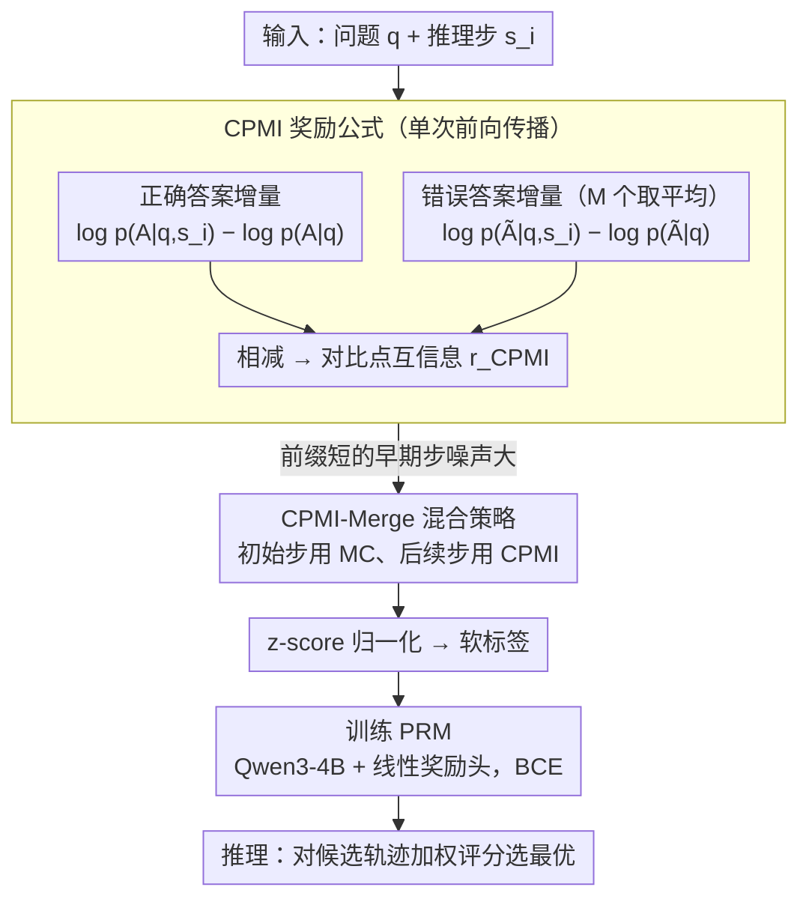

# Efficient Process Reward Modeling via Contrastive Mutual Information

**会议**: ACL 2026  
**arXiv**: [2604.10660](https://arxiv.org/abs/2604.10660)  
**代码**: [GitHub](https://github.com/nakyungLee20/CPMI)  
**领域**: LLM推理  
**关键词**: 过程奖励模型, 步级监督, 互信息, 对比学习, 数学推理

## 一句话总结
提出 CPMI（Contrastive Pointwise Mutual Information），一种高效的自动步级奖励标注方法，通过对比推理步骤对正确答案和错误答案的条件概率变化量来估计步级贡献，比 Monte Carlo 估计减少 84% 构建时间和 98% token 生成量，同时在过程级评估和数学推理基准上取得更高准确率。

## 研究背景与动机

**领域现状**：过程奖励模型（PRM）通过评估中间推理步骤的正确性来验证 CoT 轨迹，比仅评估最终答案的 ORM 更可靠。但训练 PRM 需要步级标注数据——传统上由人类标注或高性能 LLM 标注。

**现有痛点**：(1) 人工标注步级奖励成本极高且耗时；(2) 自动化方法如 Monte Carlo 估计需要大量 LLM 滚动（rollout）来获得低方差的奖励信号，计算开销大——每步需要采样数十条轨迹来估计正确率；(3) MC 估计在推理链早期步骤尤其不稳定（因为前缀短，后续变异大）。

**核心矛盾**：步级监督信号的获取成本与 PRM 的训练需求之间存在巨大差距——需要大量高质量标注但获取成本极高。

**本文目标**：设计一种只需单次前向传播即可估计步级奖励的方法，消除对多次 MC 滚动的依赖。

**切入角度**：从 TD(λ) 角度理解 MC 估计（λ→1，长期回报）和本文方法（λ→0，单步自举）的关系。假设预训练 LLM 已经编码了足够的数学知识，可以通过观察加入某步后模型对正确答案的概率变化来推断该步的贡献。

**核心 idea**：步级奖励 = (加入该步后正确答案的 log 概率增量) - (加入该步后错误答案的 log 概率增量)，即对比性的点互信息。

## 方法详解

### 整体框架
对每个推理步：(1) 计算"有该步"和"无该步"时模型输出正确答案的 log 概率差异；(2) 同样计算对错误答案的差异；(3) 两者之差即为 CPMI 奖励。然后用归一化的 CPMI 作为软标签训练 PRM。推理时用 PRM 对候选轨迹评分选择最优。

### 关键设计

**1. CPMI 奖励公式：用一次前向传播的概率增量替代几十条 MC 滚动**

MC 估计的痛点是贵——每步要采样数十条完整轨迹才能压低方差，而且推理链早期步骤前缀短、后续变异大，估计尤其不稳。CPMI 换一个视角：既然预训练 LLM 已经编码了足够的数学知识，那么"加入某步后模型对答案的概率怎么变"本身就是这步贡献的信号。它定义步级奖励为

$$r_{\text{CPMI}}^i = [\log p_\theta(A|q,s_i) - \log p_\theta(A|q)] - \frac{1}{M}\sum_{m=1}^M [\log p_\theta(\tilde{A}|q,s_i) - \log p_\theta(\tilde{A}|q)]$$

第一项量化这步把正确答案 $A$ 的 log 概率抬高了多少，第二项（对 $M$ 个错误答案 $\tilde A$ 取平均）量化它把错误答案压低了多少，两者相减就是"对比性的点互信息"。关键在那个减号：纯 PMI 只看正确答案，缺乏判别力——一步既可能真的有用、也可能只是泛泛地抬高所有答案的概率；引入对错误答案的对比后，只有"同时拉高正确、压低错误"的步骤才拿高分，奖励信号的区分度因此显著提升。整套估计只需若干次前向传播、不生成任何新 token，这正是它把构建时间砍掉 84%、token 砍掉 98% 的来源。

**2. 理论连接 CPMI ≈ Jeffreys 散度：给这个启发式公式一个对称性保证**

这样一个看似拼凑的对比式子凭什么可靠？作者证明，在数学推理"单一正确答案"的假设下，CPMI 可被解释为"有该步"和"无该步"两个条件答案分布之间 Jeffreys 散度（对称 KL）的近似。这一步把 CPMI 从启发式抬成有理论依托的度量：Jeffreys 散度的对称性恰好对应公式里的双向惩罚——它既奖励让正确答案概率上升的步骤，也奖励让错误答案概率下降的步骤，于是 CPMI 天然偏好那些"引起答案分布大幅且对称偏移"的关键步骤，而不是只盯单边。

**3. CPMI-Merge 混合策略：用 MC 补 CPMI 在推理链开头的不稳**

CPMI 是局部自举的，前缀越短、上下文越少，早期步骤（尤其 step 1）的概率增量噪声越大。CPMI-Merge 的思路是各取所长：在初始步骤改用 MC 估计提供全局信息，后续步骤再切回 CPMI 拿密集而廉价的反馈。作者把它放进 TD($\lambda$) 框架里看得很清楚——MC 对应 $\lambda\to 1$（看长期全回报，准但贵），CPMI 对应 $\lambda\to 0$（单步自举，省但早期抖），Merge 就是在两端之间找平衡点，用极少量 MC 调用换回早期稳定性，仍保住大部分效率优势。

### 训练与推理
用 Qwen3-4B-Base 作为 PRM 骨干，附加两层线性奖励头。BCE 损失训练，CPMI 奖励经 z-score 归一化后作为软标签。推理时对候选轨迹按 PRM 加权评分选择最优。

## 实验关键数据

### 主实验（效率 + 质量）

| 奖励类型 | AUC | PB | PRMB | MATH | 时间(比) | Token(比) |
|---------|-----|-----|------|------|---------|----------|
| MC | 0.759 | 27.7 | 38.8 | 45.4 | 1.00 | 1.00 |
| PAV | 0.757 | 36.6 | 49.6 | 47.2 | 1.17 | 2.38 |
| **CPMI** | **0.765** | 34.6 | **58.8** | 48.2 | **0.16 (↓84%)** | **0.02 (↓98%)** |
| **CPMI_Merge** | **0.766** | **36.8** | **60.7** | **49.4** | 0.30 (↓70%) | 0.18 (↓82%) |

### 消融实验

| 配置 | 说明 |
|------|------|
| 无对比（仅 PMI） | AUC 下降，缺乏判别力 |
| 无 prompt 平均 | 奖励方差增大 |
| 不同 M（错误样本数） | M=4 最优平衡 |
| CPMI-Merge (step 1) | 比纯 CPMI 更稳定 |

### 关键发现
- **CPMI 减少 84% 构建时间和 98% token 生成**同时质量更高（AUC 0.765 vs MC 0.759）
- **在过程级基准 PRMB 上大幅超越 MC（58.8 vs 38.8）**，说明 CPMI 产生的步级信号对过程级验证更有效
- **对比信号是关键**：去掉对比项（只用 PMI）效果显著下降
- **CPMI-Merge 进一步提升稳定性**：在保持大部分效率优势的前提下消除了早期步骤的噪声
- **RelEff（相对效率比）**高达 6-10 倍，说明 CPMI 在质量-成本 trade-off 上远优于 MC

## 亮点与洞察
- **从 TD-λ 角度统一理解 MC 和 CPMI**是理论上的优雅贡献——MC = λ→1（全回报），CPMI = λ→0（自举），将强化学习的经典框架用于 PRM 训练
- **98% 的 token 减少**意味着 CPMI 使大规模 PRM 数据集构建变得实际可行——从"需要 GPU 集群数天"变为"单机数小时"
- **CPMI 奖励的理论保证**（Jeffreys 散度近似）使其不只是启发式方法，而有理论基础

## 局限与展望
- CPMI 依赖预训练 LLM 的内部概率分布质量——如果模型的数学知识不足，概率估计可能不可靠
- 仅在数学推理任务上验证，在代码生成、逻辑推理等其他需要 PRM 的任务上效果待确认
- 硬负样本的构造策略（M=4 + 启发式扰动）可能不够系统化
- CPMI 在推理链早期步骤不稳定的问题需要 CPMI-Merge 来缓解，增加了设计复杂度
- 单一正确答案的假设在某些任务中可能不成立

## 相关工作与启发
- **vs MC 估计 (Math-Shepherd)**: MC 需要每步采样数十条完整轨迹，CPMI 只需一次前向传播
- **vs PAV (Setlur et al.)**: PAV 仍依赖 MC 滚动，CPMI 完全消除了滚动需求
- **vs 对比解码 (Li et al.)**: 对比解码在推理时操控 logit，CPMI 在训练数据构建时使用对比信号，用途不同但哲学相通

## 评分
- 新颖性: ⭐⭐⭐⭐⭐ CPMI 公式优雅，TD-λ 理论连接深刻
- 实验充分度: ⭐⭐⭐⭐⭐ 效率+质量全面对比，理论和实验互相验证
- 写作质量: ⭐⭐⭐⭐⭐ 理论推导清晰，实验设计严谨
- 价值: ⭐⭐⭐⭐⭐ 98% token 减少使大规模 PRM 训练变得可行，对推理增强领域有重大影响

<!-- RELATED:START -->

## 相关论文

- [\[ACL 2026\] C2: Scalable Rubric-Augmented Reward Modeling from Binary Preferences](c2_scalable_rubric-augmented_reward_modeling_from_binary_preferences.md)
- [\[ACL 2026\] Process Reward Models Meet Planning: Generating Precise and Scalable Datasets for Step-Level Rewards](process_reward_models_meet_planning_generating_precise_and_scalable_datasets_for.md)
- [\[ACL 2025\] Dynamic and Generalizable Process Reward Modeling (DG-PRM)](../../ACL2025/llm_reasoning/dgprm_dynamic_process_reward.md)
- [\[ICML 2026\] GRPO is Secretly a Process Reward Model](../../ICML2026/llm_reasoning/grpo_is_secretly_a_process_reward_model.md)
- [\[ACL 2026\] HISR: Hindsight Information Modulated Segmental Process Rewards for Multi-turn Agentic Reinforcement Learning](hisr_hindsight_information_modulated_segmental_process_rewards_for_multi-turn_ag.md)

<!-- RELATED:END -->
