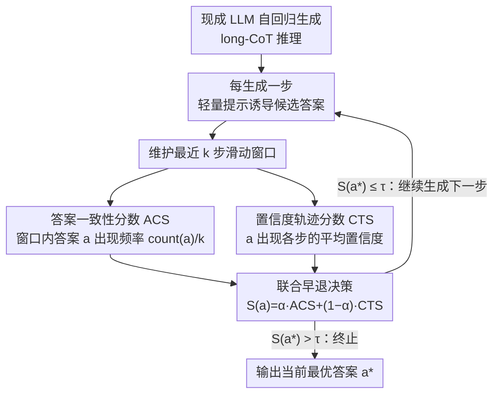

# Efficient Test-Time Scaling via Temporal Reasoning Aggregation

**会议**: ACL 2026 Findings  
**arXiv**: [2604.17304](https://arxiv.org/abs/2604.17304)  
**代码**: [https://github.com/qianfantianyuzhouzhou/TRACE](https://github.com/qianfantianyuzhouzhou/TRACE)  
**领域**: LLM推理效率  
**关键词**: 测试时扩展, 早退策略, 推理收敛, 多步聚合, 过度思考

## 一句话总结

提出 TRACE 框架，通过在滑动窗口内聚合多步答案一致性和置信度轨迹两种互补信号来判断推理是否收敛，实现无需训练的动态早退，在减少25-30% token 用量的同时准确率仅降1-2%。

## 研究背景与动机

**领域现状**：测试时扩展（Test-time Scaling）通过增加推理时计算量（延长思维链或搜索多条路径）来提升 LLM 推理性能。但这导致大量不必要的 token 生成——模型经常在已经得出正确答案后继续推理（过度思考现象）。

**现有痛点**：现有动态早退方法主要依赖单步置信度信号来决定是否终止推理。但研究表明单步置信度在多步推理中不可靠——它反映的是单步的确定性而非跨步的稳定性。例如，模型可能对一个错误的中间步骤给出很高的置信度，导致过早终止。

**核心矛盾**：过早终止会导致错误输出，过晚终止浪费资源。单步置信度无法区分"真正的推理收敛"和"短暂的高置信错误步骤"。推理收敛本质上是一个时序现象，需要跨多步的稳定性信号。

**本文目标**：设计一种基于多步证据聚合的早退策略，提供比单步置信度更可靠的推理收敛判断。

**切入角度**：受 self-consistency 方法启发——如果多个推理路径给出相同答案，则该答案更可能正确。将此思路从多次采样推广到单次推理的多个步骤。

**核心 idea**：在滑动窗口内同时追踪两个互补信号：（1）答案一致性——预测答案在多步中是否持续一致；（2）置信度轨迹——置信度是否沿时间稳定演变。两者联合判断推理是否真正收敛。

## 方法详解

### 整体框架

TRACE 想解决的是 long-CoT 推理里"答案已经对了却还在继续想"的过度思考问题：它在自回归生成时维护一个覆盖最近 $k$ 步的滑动窗口，每生成一步就用一个轻量辅助提示从当前上下文里诱导出一个候选最终答案，再在窗口内同时算"答案一致性分数 ACS"和"置信度轨迹分数 CTS"，把两者加权成统一稳定性分数，一旦超过阈值 $\tau$ 就立刻停下、输出当前最优答案。整个过程不碰模型权重、不需要训练，套在任何现成 LLM 上即可。

### 关键设计

**1. 答案一致性分数 ACS：用"答案在多步里是否反复出现"取代单步置信度**

单步置信度的毛病在于它只反映模型对当前这一步的确定性，碰到一个错得很自信的中间步就会被骗着提前终止。ACS 换了个视角：每一步都从当前推理上下文里诱导一个候选答案，统计某个答案 $a$ 在窗口内出现的频率 $\text{ACS}(a)=\text{count}(a)/k$。推理真正收敛时，正确答案会在连续若干步里稳定复现、ACS 自然走高；而短暂的高置信错误步因为答案对不上号、出现一两次就被后续步否决，拿不到高 ACS。这本质上是把 self-consistency 的"多次采样投票"思路搬到了"单次推理的多步之间"。

**2. 置信度轨迹分数 CTS：看置信度是不是持续高，而非某一步偶然高**

光看答案一致还不够——答案一致但每步都犹犹豫豫，可能只是模型在反复抄一个没把握的猜测。CTS 用归一化熵 $\tilde{H}$ 把每一步的确定性量化为 $c = 1 - \frac{1}{n}\sum_j \tilde{H}(p_j)$，再对候选答案 $a$ 在它出现的那些步上取平均置信度 $\text{CTS}(a) = \frac{1}{\text{count}(a)}\sum_{t \in \mathcal{T}(a)} c_t$。这样"持续高置信"（收敛信号）和"零星高置信"（噪声）就被区分开了：只有当某个答案不仅反复出现、而且每次出现时模型都很笃定，CTS 才会高。

**3. 联合早退决策：ACS 看一致、CTS 看笃定，两者互补才敢停**

最终把两路信号融成统一稳定性分数 $S(a) = \alpha \cdot \text{ACS}(a) + (1-\alpha) \cdot \text{CTS}(a)$，取得分最高的候选 $a^\star$，当 $S(a^\star) > \tau$ 时终止并输出 $a^\star$，$\alpha$ 调节两路信号的相对权重。之所以要联合，是因为单看任一路都有盲区——ACS 高 CTS 低意味着"答案稳定但模型没底"，CTS 高 ACS 低意味着"某步很自信但答案还在变"，只有两者同时达标才说明推理既一致又笃定，这时停才安全。消融里"仅 ACS / 仅 CTS"都只是中等、"ACS+CTS"才最优，正印证了这种互补性。

### 损失函数 / 训练策略

TRACE 是无训练的推理时方法，直接应用于现成模型。在 Qwen3-8B 和 DeepSeek-R1-Distill-Llama-8B 上评估，基准包括 OlympiadBench、MATH500、AIME24、AMC23、AIME25。超参数 $\alpha$ 和阈值 $\tau$ 通过验证集调优。

## 实验关键数据

### 主实验

| 方法 | 平均准确率 | 平均 token 消耗率 | 说明 |
|------|----------|----------------|------|
| Vanilla (全量推理) | 基准 | 100% | 完整推理 |
| 单步置信度早退 | -11% | ~60% | 过早终止导致严重掉点 |
| TRACE | -1~2% | 70-75% | 最优权衡 |

### 消融实验

| 信号组合 | 效果 | 说明 |
|---------|------|------|
| 仅 ACS | 中等 | 答案一致但置信度可能低 |
| 仅 CTS | 中等 | 置信高但答案可能不一致 |
| ACS + CTS | 最优 | 互补信号联合判断 |

### 关键发现

- 单步置信度早退在困难基准上总体准确率仅0.44（vs 全量推理0.55），证实了单步信号的不可靠性
- TRACE 减少25-30% token 同时准确率仅降1-2%，显著优于现有动态推理方法
- 相比最强早退基线，TRACE 在相当或更低 token 预算下提升2-4个点的平均准确率
- 滑动窗口大小 $k$ 的选择影响灵敏度——太小则信号不稳定，太大则检测延迟

## 亮点与洞察

- **从"单步判断"到"多步聚合"的范式转变很有说服力**：Figure 1 的案例清晰展示了单步高置信度如何误导早退，而 TRACE 通过观察多步一致性避免了误判
- **答案诱导的设计巧妙**：在每步用轻量提示诱导候选答案而不打断推理，实现了对"推理过程中间状态"的实时监测
- **无训练即插即用的实用性强**：不需要修改模型或额外训练，直接降低推理成本

## 局限与展望

- 每步的答案诱导需要额外的前向传播，引入一定开销
- 对非数学推理任务（如代码生成、自然语言推理）的适用性未充分验证
- 阈值 $\tau$ 和窗口大小 $k$ 需要在验证集上调优，不同数据集可能需要不同设置
- 当推理确实需要长链（而非过度思考）时，TRACE 可能误判为收敛

## 相关工作与启发

- **vs 单步置信度早退**: 单步信号在多步推理中系统性不可靠，TRACE 通过时序聚合提供更稳定的收敛信号
- **vs RL方法（如长度惩罚训练）**: RL 方法需要额外训练且对奖励设计敏感，TRACE 无训练直接应用，更灵活

## 评分

- 新颖性: ⭐⭐⭐⭐ 多步聚合的思路自然合理，ACS+CTS 的设计巧妙但技术上不复杂
- 实验充分度: ⭐⭐⭐⭐⭐ 5个数学基准+2个模型+多种基线+详细消融，非常充分
- 写作质量: ⭐⭐⭐⭐ 动机通过实验清晰建立，方法描述简洁

<!-- RELATED:START -->

## 相关论文

- [\[ICLR 2026\] Plan and Budget: Effective and Efficient Test-Time Scaling on Reasoning LLMs](../../ICLR2026/llm_reasoning/plan_and_budget_effective_and_efficient_test-time_scaling_on_reasoning_large_lan.md)
- [\[ACL 2026\] ReProbe: Efficient Test-Time Scaling of Multi-Step Reasoning by Probing Internal States of Large Language Models](reprobe_efficient_test-time_scaling_of_multi-step_reasoning_by_probing_internal_.md)
- [\[ICLR 2026\] Efficient Test-Time Scaling for Small Vision-Language Models](../../ICLR2026/llm_reasoning/efficient_test-time_scaling_for_small_vision-language_models.md)
- [\[ACL 2026\] Parallel Test-Time Scaling for Latent Reasoning Models](parallel_test-time_scaling_for_latent_reasoning_models.md)
- [\[ICLR 2026\] Understanding the Role of Training Data in Test-Time Scaling](../../ICLR2026/llm_reasoning/understanding_the_role_of_training_data_in_test-time_scaling.md)

<!-- RELATED:END -->
