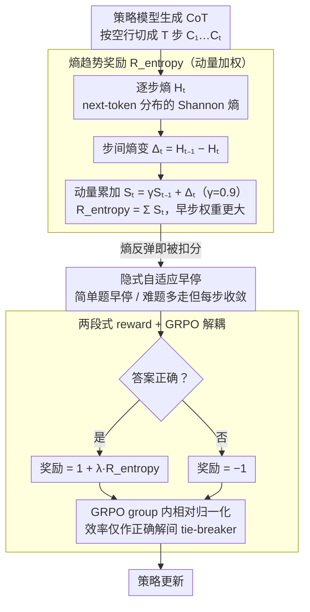

# ETR: Entropy Trend Reward for Efficient Chain-of-Thought Reasoning

**会议**: ACL 2026  
**arXiv**: [2604.05355](https://arxiv.org/abs/2604.05355)  
**代码**: https://github.com/Xuan1030/ETR  
**领域**: LLM 推理 / RL / CoT 压缩 / GRPO  
**关键词**: 思维链效率、熵趋势奖励、GRPO、动量、自适应早停

## 一句话总结
提出 ETR (Entropy Trend Reward)：用动量加权的逐步熵下降作为 reward shaping 项加进 GRPO，让 LLM 的 CoT 自适应地在 "全局熵下降" 约束下提前收敛，相同正确性下平均压缩 CoT 长度 35–65%；在 DeepSeek-R1-Distill-7B 上带来 +9.9% 准确率同时减少 67% token。

## 研究背景与动机

**领域现状**：long-CoT 推理 (R1 / o1 / Qwen3) 是当前 LLM 推理 SOTA 的主流范式，但 "overthinking" 让模型在简单题上也生成上万 token——平均推理延迟随长度线性增加，部署成本居高不下。现有效率改进路线分三类：(1) 训练自由的 prompt / 早停 (DEER / NoThink / CGRS)；(2) variable-length SFT (TokenSkip / Liu 等)；(3) RL 奖励设计 (LCPO / O1-Pruner / PEAR)。

**现有痛点**：长度惩罚类奖励是 content-blind 的——同样长度的 token 可能贡献完全不同信息量；熵相关方法 (PEAR / Li 2025 / Agarwal 2025) 进一步看模型不确定性，但都在 "全局压低熵" 上做文章。这等于隐式假设 "CoT 任意时刻都应低不确定性"，与人类推理 "先发散探索 → 后收敛确定" 的自然过程相悖；强行抑制就把 self-reflection 一并抹掉了。

**核心矛盾**：高 entropy 时刻其实是 self-reflection 的发生点 (出现 "wait / but / hmm" 这类标志词)；全局压低熵会把有用的反思和冗余的发散一起干掉，破坏正确性；不压又控不住长度。

**本文目标**：(1) 找到一个真正反映 "推理是不是在收敛" 的轨迹级信号；(2) 把这个信号用到 GRPO 里作为 shaping reward，而非硬约束；(3) 让模型对简单题自然短、对难题自然长，无需手工长度规则。

**切入角度**：作者在 MATH500 上做了一个关键实验——计算每条 CoT 的 step index 与 step entropy 的 Spearman ρ，发现 ρ 越负 (即熵随步数显著下降) 长度越短，ρ 越正长度越长。这把 "推理效率" 与 "熵轨迹的方向性" 关联起来。

**核心 idea**：奖励 "全局熵下降趋势" 而非 "瞬时低熵"——允许局部反思与小幅波动，但要求整体上不确定性沿着 CoT 单调下降，从而让模型自然学到 instance-adaptive 的早停行为。

## 方法详解

### 整体框架
ETR 的思路是"既不改 GRPO 优化算法、也不加任何硬性长度约束，只重写 reward"。最终奖励写成两段：
$$R(q,o)=\begin{cases}-1,&\text{若答错}\\ 1+\lambda R_{\text{entropy}}(o),&\text{若答对}\end{cases}$$
其中 $R_{\text{entropy}}(o)$ 是基于轨迹熵的 shaping 项。GRPO 在同一题的 group 内对优势做相对归一化，于是 ETR 信号只在"正确解之间比谁更高效"，把效率约束牢牢锁在不损正确性的前提下。

### 关键设计

**1. 基于动量的熵趋势奖励：奖励整条 CoT 的"熵下降方向"，而不是瞬时低熵**

现有 entropy 类方法都在"全局压低熵"上做文章，等于假设 CoT 任意时刻都该低不确定性，结果把高熵处的 self-reflection（"wait / but / hmm"）一并抹掉。ETR 改成奖励趋势：把 CoT 按 "\n\n" 切成步 $\{C_1,\dots,C_T\}$，每步算 next-token 分布的 Shannon 熵 $H_t=H(p_\theta(\cdot\mid C_{1:t}))$，步间熵变 $\Delta_t=H_{t-1}-H_t$，引入动量状态 $S_t=\gamma S_{t-1}+\Delta_t$（$S_1=0$，$\gamma=0.9$），最终 $R_{\text{entropy}}(o)=\sum_{t=2}^{T}S_t=\sum_t \alpha_t\Delta_t$，权重 $\alpha_t=\frac{1-\gamma^{T-t+1}}{1-\gamma}$ 关于 $t$ 严格递减。关键就在这个递减权重：朴素的"总熵下降" $R_{\text{naive}}=H_1-H_T$ 会 telescope 成只依赖首尾，分不清"平滑下降"和"反复振荡但首尾相同"两种轨迹；动量公式给每一步的熵变都赋予梯度信号，又通过早步加权更重把"尽早收敛"直接编码进 reward。

**2. 隐式 instance-adaptive 早停：不写长度上限，让简单题自然短、难题自然长**

显式 budget（LCPO / O1-Pruner）要提前定长度上限，对题目难度一刀切。ETR 靠奖励结构自然实现自适应：因为 $R_{\text{entropy}}=\sum_t S_t$ 累加动量状态，多走一步只有当 $S_{t+1}>0$（即 $\Delta_{t+1}$ 继续下降）时才有收益，一旦熵开始反弹（$\Delta_t<0$）就被反复扣分，振荡式的 self-reflection 循环被自动压制。于是简单题熵快速塌缩、早停；难题需要逐步消歧、自然多走几步但每步都被要求贡献熵下降。这和全局熵最小化（PEAR / Li 2025）的根本区别是 ETR 允许"暂时上升换长远下降"，正对应人类"先试假设、不对就回溯"的推理节奏。

**3. 与 GRPO 解耦的两段式 reward：先保正确，再谈效率**

如果把 entropy reward 直接加进全局 reward，模型会为了短而牺牲正确性（消融里 No $R_{\text{corr}}$ 缩到 1.2k 但 AMC23 从 80 跌到 65 就是证据）。ETR 把 reward 切成两段——答错恒为 $-1$，答对才拿 $1+\lambda R_{\text{entropy}}$；再借 GRPO 的 group 内相对归一化 $\hat{A}_i=(r_i-\bar{r})/\sigma_r$，让 ETR 信号只在"同题的多条正确解"之间分高低。这样"正确性是硬约束、效率只是 tie-breaker"，两个目标被干净地分了层，不会跨题被效率反噬精度。

### 损失函数 / 训练策略
GRPO 标准 PPO-clipped 目标 + group 内 advantage 归一化，KL 系数 $\beta$；reward 如上；$\lambda$ 控制 entropy shaping 强度；$\gamma=0.9$ 是动量；训练数据来自 DeepMath-103K 中 difficulty 5–10 的 7000 题；用 LoRA + VeRL 框架在 8×H100 上训练；batch 32, lr $1\times10^{-5}$, max length 16384, 每题 5 rollout。

## 实验关键数据

### 主实验
在 AMC23 / AIME24 / MATH500 / GPQA-Diamond 4 个 benchmark 上 (greedy pass@1)：

| 模型 | 方法 | Overall Acc ↑ | Overall Len ↓ | AES ↑ |
|------|-----|--------------|--------------|------|
| DeepSeek-R1-Distill-7B | Original | 58.1 | 8.5k | 0.00 |
| DeepSeek-R1-Distill-7B | DEER | 60.9 | 6.2k | 0.51 |
| DeepSeek-R1-Distill-7B | NoThink | 59.5 | 4.0k | 0.65 |
| DeepSeek-R1-Distill-7B | LCPO | 58.6 | 3.8k | 0.60 |
| DeepSeek-R1-Distill-7B | O1-Pruner | 66.9 | 4.8k | 1.18 |
| DeepSeek-R1-Distill-7B | PEAR | 69.8 | 5.1k | 1.41 |
| **DeepSeek-R1-Distill-7B** | **ETR** | **68.0** | **2.8k** | **1.53** |
| Qwen3-4B | Original | 69.5 | 8.7k | 0.00 |
| Qwen3-4B | PEAR | 77.2 | 6.7k | 0.79 |
| **Qwen3-4B** | **ETR** | **77.1** | **4.4k** | **1.03** |
| Qwen3-8B | Original | 74.0 | 8.9k | 0.00 |
| Qwen3-8B | PEAR | 74.6 | 7.6k | 0.18 |
| **Qwen3-8B** | **ETR** | **79.1** | **5.1k** | **0.77** |

DeepSeek-R1-Distill-7B 上 ETR 把 CoT 从 8.5k 压到 2.8k (压缩率 33%)，同时准确率从 58.1 提到 68.0；AIME24 单项更夸张 (11.8k → 4.6k，43.3 → 56.7)。

### 消融实验
DeepSeek-R1-Distill-7B 上对比不同熵奖励设计：

| Reward 设计 | AMC23 Acc / Len | AIME24 Acc / Len | MATH500 Acc / Len | GPQA-D Acc / Len | AES |
|-------------|-----------------|------------------|-------------------|------------------|------|
| Original | 80.0 / 6.6k | 43.3 / 11.8k | 85.0 / 4.2k | 24.2 / 11.3k | 0.00 |
| Min. $H$ (全局压熵) | 80.0 / 2.1k | 43.3 / 5.1k | 88.2 / 1.3k | 38.3 / 2.1k | 1.06 |
| Max. $H$ (反向最大化) | 10.0 / 15.1k | 0.0 / 16.4k | 9.0 / 15.3k | 1.5 / 16.0k | -5.4 |
| No $\gamma$ (无动量, telescope) | 87.5 / 4.9k | 46.7 / 10.0k | 87.8 / 3.6k | 31.8 / 10.0k | 0.61 |
| No $R_{\text{corr}}$ (去正确性) | 65.0 / 1.2k | 23.3 / 1.4k | 78.6 / 0.7k | 29.8 / 0.7k | 0.11 |
| **Ours (Full ETR)** | **87.5 / 2.4k** | **56.7 / 4.6k** | **90.6 / 1.5k** | **37.4 / 2.5k** | **1.53** |

### 关键发现
- **动量是必需的**：去掉动量退化为 telescope-only 形式，CoT 长度几乎压不下来 (4.9k vs ETR 2.4k)，因为只看首尾的奖励对中间步骤没有梯度信号；动量让每步的熵变都参与塑形。
- **熵下降趋势 ≠ 全局压低熵**：Min. $H$ 比 ETR AES 低很多 (1.06 vs 1.53)，且对反思 token 数量大幅压制；ETR 反而保留适度的 self-reflection 但每步保持低 verbosity——Figure 6 验证了 "ETR 通过降低每步话痨度而非禁止反思来压缩 CoT" 这一行为差异。
- **正确性必须硬约束**：去掉 $R_{\text{corr}}$ 后 CoT 缩到 1.2k 但 AMC23 从 80 跌到 65，证明 entropy shaping 单独使用会让模型 "短而错"。
- **Spearman ρ 反转验证收敛性**：ETR 训练后，各模型的 ρ(step, $H_t$) 从正/接近零变为负，说明熵真的沿步数下降——这是 ETR 把假设变成训练后行为的最直接证据。
- **跨模型族泛化**：在 DeepSeek-R1-Distill 和 Qwen3 两个家族、4B–8B 范围都拿到最高 AES，说明方法不依赖特定架构或预训练范式。
- **难题反而获得最大收益**：AIME24 上 +13.4 准确率同时减少 60% 长度，正好对应 "难题需要更多步但每步要有效信息"。

## 亮点与洞察
- "看熵的趋势而非绝对值" 是一个观念跳变——把推理过程当作动态系统而非静态分布建模，让 RL reward 第一次能直接奖励 "收敛速度" 这个抽象概念。
- 动量加权的 $\alpha_t$ 严格递减性质让奖励隐式编码了 "尽早收敛优先" 的偏好，相当于把 "Chain-of-Thought 应快速逼近答案" 的人类直觉数学化到 reward 中——这是一个非常优雅的设计。
- 与 PEAR 等 entropy 类方法相比，ETR 关键差别在于 "允许暂时上升换长远下降"，与人类推理的 explore-then-exploit 节奏天然对齐；这种 "局部容忍但全局严格" 的思想也可迁移到工具调用控制、Agent rollback 策略等场景。
- Figure 6 把 "CoT 压缩" 拆成步数 / 每步 token / 反思词数三个维度，发现 ETR 主要靠降每步话痨度而非裁步数——这种行为级 attribution 很罕见，是评估 reasoning compression 的良好方法学示范。
- 两段式 reward (错 -1, 对 $1+\lambda R$) + GRPO 相对归一化的组合，干净解决了多目标 RL 中常见的 "效率冲掉准确性" 难题，模板上可被复用到 latency / safety / format 等其他次要目标。

## 局限与展望
- 作者承认受算力限制，对照实验只到 8B + LoRA；更大规模 (32B / 70B) 上 ETR 行为是否一致需验证，尤其大模型可能内部就已收敛得很快。
- $\lambda$ 与 $\gamma$ 都是固定经验值；不同任务难度下最优 $\lambda$ 可能差异较大，论文未给出自适应调参方案。
- 熵计算依赖 next-token 预测分布，所以只适用于 white-box 自训模型；对闭源 API (GPT-4 / Claude) 不能直接用。
- 步的切分用 "\n\n" 启发式，对一些喜欢用单段长文本的模型可能不够鲁棒；语义级 step 划分可能更精确。
- 仅在数学 / GPQA 等 reasoning benchmark 验证，对编程 / 工具调用 / 多轮对话场景的迁移性未明确。
- ETR 把熵当作内省信号，但熵高 ≠ 真有信息，若模型本身预测分布失校准，ETR 可能学到错误的 trajectory pattern；与外部 verifier 结合可能更稳健。

## 相关工作与启发
- **vs PEAR (Huang 2025a)**：同样在 GRPO 里用熵 reward，PEAR 走全局压熵路线 (保持准确率但 CoT 仍长)；ETR 看趋势而非绝对值，AES 在 DeepSeek-R1-Distill-7B 上 1.53 > PEAR 1.41，更显著的是长度压到 2.8k vs 5.1k。
- **vs O1-Pruner / LCPO (length-based RL)**：那些用长度惩罚训练，content-blind 容易掉精度；ETR 用 "效率作正确解 tie-breaker" 避免效率冲准确性。
- **vs DEER / NoThink (training-free)**：训练自由方法在大模型上效果差且缺乏可控性；ETR 通过 RL 训练学到泛化的早停行为，AES 显著更高。
- **vs Min. $H$ / Compressing-CoT via Step Entropy (Li 2025)**：那些全局压熵的方法会同时抹掉有用的 self-reflection；ETR 通过 Figure 6 的行为分析证明自己保留反思但压低每步 verbosity，是更聪明的压缩方式。
- **vs Token-skip / Variable-length SFT (Xia 2025 / Liu 2024)**：那些需要带标签 CoT 数据做 SFT，泛化受限；ETR 用 RL 信号无需标注数据。
- **可迁移启发**：动量加权的 $\alpha_t$ 递减结构和 "全局趋势 + 局部容忍" 的 reward 设计哲学，对于所有需要 "压缩输出长度但保留质量" 的任务 (代码生成、文档摘要、多步规划) 都有借鉴价值。

## 评分
- 新颖性: ⭐⭐⭐⭐ "看熵的趋势" 是个清晰的视角转换，动量加权设计也优雅；不过 entropy reward 大方向上 PEAR 等先做了。
- 实验充分度: ⭐⭐⭐⭐ 3 个模型 × 4 个 benchmark + 完整消融 (Min/Max/无动量/无正确性) + Spearman ρ 验证 + 行为分解 Figure 6。
- 写作质量: ⭐⭐⭐⭐ 动机推导直接 (Spearman ρ vs 长度的散点图说服力强)，公式与算法清晰；类比人类推理的论述很到位。
- 价值: ⭐⭐⭐⭐ 在 reasoning model 时代直接命中 overthinking 痛点，AES 第一 + 跨家族泛化，对生产部署直接可用。

<!-- RELATED:START -->

## 相关论文

- [\[ACL 2026\] Efficient Process Reward Modeling via Contrastive Mutual Information](efficient_process_reward_modeling_via_contrastive_mutual_information.md)
- [\[ACL 2026\] Revisiting Entropy in Reinforcement Learning for Large Reasoning Models](revisiting_entropy_in_reinforcement_learning_for_large_reasoning_models.md)
- [\[ICLR 2026\] DRPO: Efficient Reasoning via Decoupled Reward Policy Optimization](../../ICLR2026/llm_reasoning/drpo_efficient_reasoning_via_decoupled_reward_policy_optimization.md)
- [\[NeurIPS 2025\] Re-FORC: Adaptive Reward Prediction for Efficient Chain-of-Thought Reasoning](../../NeurIPS2025/llm_reasoning/re-forc_adaptive_reward_prediction_for_efficient_chain-of-thought_reasoning.md)
- [\[ACL 2026\] Reinforced Efficient Reasoning via Semantically Diverse Exploration](reinforced_efficient_reasoning_via_semantically_diverse_exploration.md)

<!-- RELATED:END -->
