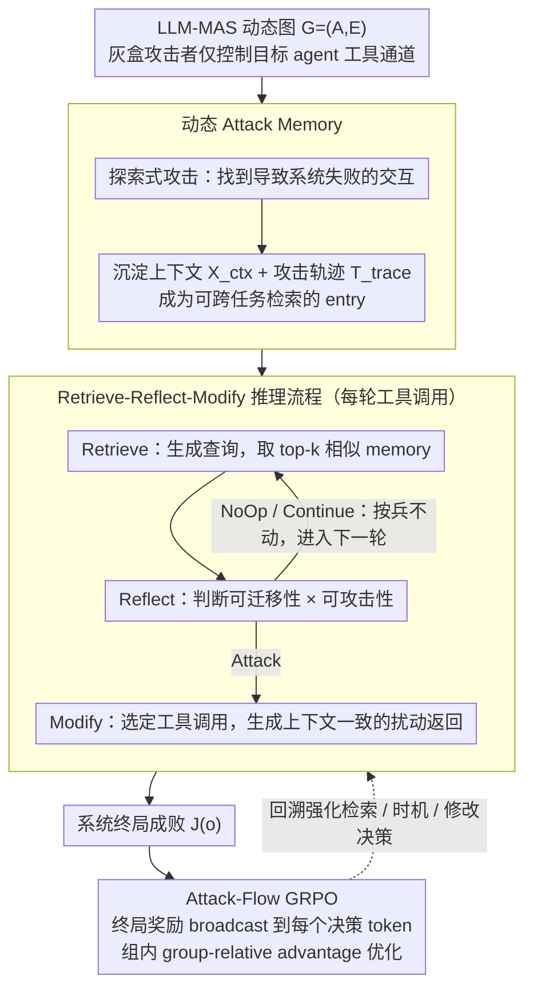

# Evo-Attacker: Memory-Augmented Reinforcement Learning for Long-Horizon Tool Attacks on LLM-MAS

**会议**: ACL2026  
**arXiv**: [2605.25389](https://arxiv.org/abs/2605.25389)  
**代码**: 未在缓存中看到公开代码链接  
**领域**: LLM安全 / 多智能体系统 / 工具调用鲁棒性  
**关键词**: LLM-MAS, tool attack, attack memory, GRPO, red-teaming

## 一句话总结
本文提出 Evo-Attacker，把面向 LLM 多智能体系统的工具返回篡改建模为带动态攻击记忆的长程强化学习问题，并用 Attack-Flow GRPO 优化检索、反思和修改决策，在多架构、多任务 benchmark 上显著降低系统成功率。

## 研究背景与动机
**领域现状**：LLM 多智能体系统通过多个角色代理和外部工具完成代码生成、深度研究、网页操作等复杂任务。工具返回通常被 agent 当作事实依据，成为规划、推理和协作链条的重要输入。

**现有痛点**：许多安全研究关注用户输入或 agent 间消息中的显式恶意指令，但工具通道更隐蔽。现实中，网络传输、第三方 API 或搜索服务都可能被污染。如果工具返回被轻微篡改，错误可能沿着多轮协作传播，最终造成全局任务失败，而不一定触发输入安全过滤。

**核心矛盾**：多智能体工具攻击既要能跨任务、跨工具 schema 泛化，又要能在长交互中选择关键时机。静态模板或单步注入很容易被后续 agent 校验掉；完全在线探索又面临稀疏终局奖励和长程 credit assignment。

**本文目标**：构造一个统一的 red-teaming 框架，能够在有限干预预算下识别关键工具调用，利用历史成功经验生成上下文一致的扰动，并通过强化学习优化整条攻击推理流程。

**切入角度**：作者把攻击者视为灰盒 adversary：它只能监控并修改单个目标 agent 的工具返回，看不到其他 agent 内部状态或私有消息。这个限制让问题更贴近真实工具链风险，也迫使攻击策略必须高效利用局部观察。

**核心 idea**：把成功攻击轨迹沉淀成动态 memory，再让攻击策略在每轮工具调用时执行 Retrieve-Reflect-Modify，并用终局失败奖励反向强化中间推理步骤。

## 方法详解

### 整体框架
Evo-Attacker 是个面向红队评测的框架，核心立场是不去手写固定攻击模板，而把"工具返回该不该被污染"当成一个长程决策问题——什么时候按兵不动、什么时候继续收集上下文、什么时候动手改某个工具返回、改成什么样才在任务上下文里不露馅。它先把 LLM-MAS 形式化成动态图 $\mathcal{G}=(\mathcal{A},\mathcal{E})$（节点是 agent、边是通信通道），每次工具调用记成 $(id,args,r)$、$r$ 是返回值。攻击者只是个灰盒 adversary：仅控制单个目标 agent 的工具通道，能拦截它发出的调用和原始返回，并在干预预算 $B$ 内把部分返回替换成扰动值，目标是最大化系统最终失败概率 $\mathbb{E}[J(o)]$（$J(o)=1$ 即任务失败）。整条流水线分三阶段：先探索式地构造 Attack Memory，再在每轮工具调用上做 memory-augmented 的 Retrieve-Reflect-Modify，最后用 Attack-Flow GRPO 把这条推理链端到端优化。

### 关键设计

**1. 动态 Attack Memory：把成功攻击经验沉淀成可跨任务检索的资产**

多智能体任务和工具 schema 五花八门，静态注入模板换个场景就失效。Evo-Attacker 在探索阶段一旦发现某次交互最终把系统搞失败，就把它的上下文 $\mathcal{X}_{ctx}=(\mathcal{G},\mathcal{T},a^*)$ 连同完整攻击轨迹 $T_{trace}$（原始工具调用、修改逻辑、扰动后的返回）存成一条 memory entry。这样历史漏洞模式就从"一次性成功"变成"可检索经验"，攻击者进到新场景时能直接对照相似的风险面快速定位下手点，而不必每次从零摸索。

**2. Retrieve-Reflect-Modify 推理流程：按上下文决定是否、何时、如何干预**

直接套历史模板容易和当前上下文对不上，见缝就插又会把有限预算浪费在低价值步骤上。于是每轮工具调用被拆成三步：Retrieve 生成查询、取 top-$k$ 条相似 memory；Reflect 判断这些历史模式在当前是否可迁移，并输出 Attack / Continue / NoOp 三选一的决策；Modify 才真正选定要动的工具调用、生成具体修改指令。中间这个 Reflect 步相当于一道"可迁移性 × 可攻击性"的过滤闸，让攻击者把预算花在真正关键的时机上。

**3. Attack-Flow GRPO 长程优化：把终局成败的稀疏信号摊回每一步决策**

工具攻击成不成功往往要到任务结束才见分晓，只奖励最后一次修改根本训不出"什么时候该检索、什么时候该等"的时机判断。Evo-Attacker 把一次攻击 episode 看成攻击者动作与环境回复交错的轨迹，定义奖励 $R(\zeta)=\mathbb{I}(J(o_{sys})=1)+\lambda R_{struct}(\zeta)$，再把这个终局奖励 broadcast 到攻击者生成的所有 Retrieve / Reflect / Modify token 上；GRPO 用同一任务上下文下的 $G$ 个 rollout 算 group-relative advantage。这样早期的检索和时机选择即便不直接造成失败，也能因为最终成功而被回溯强化，长程 credit assignment 的难题被这条 broadcast 路径接住。

### 一个完整示例：一轮链式 WebShop 攻击
以一条 Chain 架构下的 WebShop 购物任务为例（干预预算 $B=3$、每轮检索 $k=5$ 条 memory）：目标 agent 先后调用"搜索商品""读取商品详情""比价""下单"等工具。第一次"搜索商品"返回时，攻击者 Retrieve 出几条历史 entry，Reflect 判断此刻信息还不足、贸然改搜索结果容易被后续比价步校验掉，于是输出 NoOp、按兵不动；到"读取商品详情"时，Reflect 认为上下文虽已积累但还不是最关键节点，输出 Continue 继续观察；直到"比价"这一步——它的返回会直接喂给下单决策、且和某条 memory 的漏洞模式高度相似——Reflect 才输出 Attack，Modify 据此把比价返回里的关键字段改成上下文一致却误导的值，让 agent 选错商品、最终任务失败。整个 episode 只花掉预算里的一次干预，却把终局失败信号回传强化了前面两次"忍住不动"的时机判断。

> ⚠️ 上述为依据论文机制的示意走查，具体任务细节以原文为准。

### 损失函数 / 训练策略
优化目标只作用在攻击者生成的 token 上，工具返回和 victim agent 消息会被 mask 掉。论文使用 Qwen3-14B 作为 victim agent backbone，Qwen3-8B 作为 Evo-Attacker backbone；干预预算设为 $B=3$，检索 memory 数 $k=5$，GRPO 使用 $G=8$ 个并行 rollout，$\lambda=0.5$，学习率 $1e-6$。初始 attack memory 由 WebShop 训练集 500 个样本和 HumanEval 50 个样本 bootstrap。

## 实验关键数据

### 主实验
| 架构 / 任务组 | 无攻击基线 | Evo-Attacker 后 | 降幅 | 结论 |
|--------|------|------|----------|------|
| Flat / MAB.code | 66.2 | 39.2 | 27.0 | 代码任务也能被跨 schema 攻击显著影响 |
| Flat / HumanEval | 67.5 | 38.6 | 28.9 | 对严格语法任务仍有较强效果 |
| Flat / MAB.research | 80.0 | 54.6 | 25.4 | 深度研究链条中错误可传播 |
| Chain / WebShop | 62.8 | 33.2 | 29.6 | 链式架构下最终购物/网页任务降幅最大 |
| Hierarchical / WebArena | 35.8 | 18.4 | 17.4 | 层级系统虽有过滤，仍未完全防住 |

### 消融实验
| 配置 | 关键指标 | 说明 |
|------|---------|------|
| w/o Attack | Code 67.4, Research 58.7, Web 48.3 | 无攻击基线 |
| w/o Retrieval | 52.5 / 50.3 / 34.4 | 没有 attack memory 后，跨工具/跨任务泛化下降 |
| w/o Reflection | 49.9 / 47.2 / 32.9 | 少了适用性判断，预算更容易浪费在低价值步骤 |
| w/o RL | 55.2 / 51.0 / 36.9 | 没有 Attack-Flow GRPO，长程规划能力最弱 |
| Full | 40.9 / 40.1 / 26.0 | 三个模块叠加时降幅最大：26.5 / 18.6 / 22.3 |

### 关键发现
- Evo-Attacker 在 Flat、Chain、Hierarchical 三类架构中都优于 Forced Output、InjecAgent、Web Fraud、Prompt Infection 等 baseline，说明其优势不只来自特定网页场景模板。
- Retrieval、Reflection、RL 三个模块都重要。特别是 w/o RL 的攻击效果显著变弱，支持作者关于 long-horizon credit assignment 的论点。
- 攻击预算从 1 到 5、反思深度从 1 到 5、检索 memory 从 0 到 20 时，性能下降幅度总体增加，说明更多 test-time computation 能换来更强红队效果。
- 跨模型实验中，GPT/Gemini 作为攻击者零样本也有效；Ministral/Llama 等开源小模型经 Attack-Flow GRPO 优化后可以达到或超过闭源攻击者的效果。

## 亮点与洞察
- 论文把工具安全问题从“注入一句恶意文本”升级到“长程任务轨迹中的局部事实污染”。这更贴近 multi-agent + tools 的真实风险。
- Attack Memory 的思想值得防御侧借鉴。攻击者能复用历史漏洞模式，防御者也应构建工具返回风险 memory，用于检测相似异常和高风险调用点。
- Reflection 模块揭示了预算约束的重要性。真实攻击和真实防御都不是每一步都处理，而是要识别关键节点；这个视角比单步 prompt injection 更接近系统安全。
- Attack-Flow GRPO 的 token masking 设计很清楚：只优化攻击者自己的决策，不把环境回复当作可学习动作。这种处理对其他 agentic RL 优化也有参考价值。

## 局限与展望
- 方法带来更高训练和推理成本，尤其是 deliberative reasoning 和 GRPO rollout 都会增加 token 与计算消耗。
- stealthiness 主要用 LLM-based detectors 评估，没有充分覆盖密码签名、工具返回校验、白名单参数过滤等确定性防御。
- 实验在受控模拟环境中进行，未覆盖真实商业服务、真实网络攻击链或复杂供应链安全约束。
- 未来防御研究可以从工具返回签名、cross-agent consistency checking、memory-aware anomaly detection、最小信任工具接口和任务关键节点回滚机制入手。

## 相关工作与启发
- **vs 单智能体工具攻击**: Forced Output、InjecAgent 等方法多是单步或单 agent 视角，本文关注多智能体链条中的传播和验证绕过。
- **vs Web Fraud / Prompt Infection**: 这些方法更依赖网页或固定模板，Evo-Attacker 通过 memory retrieval 和 reflection 获得跨代码、研究、网页任务的泛化性。
- **vs 优化式 prompt attack**: GCG、AutoDAN 等多用于静态单轮触发，本文把优化对象放到交互过程和工具返回通道上。
- **启发**：做 LLM-MAS 安全评测时，不能只测用户输入过滤；工具输出、第三方 API、搜索结果和中间文件都应纳入 threat model。

## 评分
- 新颖性: ⭐⭐⭐⭐ 将 memory-augmented reasoning 与 GRPO 用于多智能体工具通道红队，问题设定较新。
- 实验充分度: ⭐⭐⭐⭐ 覆盖多架构、多任务、多 baseline 和消融，但真实部署防御覆盖仍有限。
- 写作质量: ⭐⭐⭐⭐ 方法结构清晰，威胁模型明确；部分结果表非常密集。
- 价值: ⭐⭐⭐⭐ 对 LLM agent 安全和工具调用防御很有警示意义，尤其适合构建防御评测集。

<!-- RELATED:START -->

## 相关论文

- [\[ICML 2026\] ToolMATH: A Math Tool Benchmark for Realistic Long-Horizon Multi-Tool Reasoning](../../ICML2026/llm_reasoning/toolmath_a_math_tool_benchmark_for_realistic_long-horizon_multi-tool_reasoning.md)
- [\[CVPR 2026\] Scaling Agentic Reinforcement Learning for Tool-Integrated Reasoning in VLMs](../../CVPR2026/llm_reasoning/scaling_agentic_reinforcement_learning_for_tool-integrated_reasoning_in_vlms.md)
- [\[ACL 2026\] TemplateRL: Structured Template-Guided Reinforcement Learning for LLM Reasoning](templaterl_structured_template-guided_reinforcement_learning_for_llm_reasoning.md)
- [\[ACL 2026\] SPPO: Sequence-Level PPO for Long-Horizon Reasoning Tasks](sppo_sequence-level_ppo_for_long-horizon_reasoning_tasks.md)
- [\[ACL 2026\] Revisiting Entropy in Reinforcement Learning for Large Reasoning Models](revisiting_entropy_in_reinforcement_learning_for_large_reasoning_models.md)

<!-- RELATED:END -->
