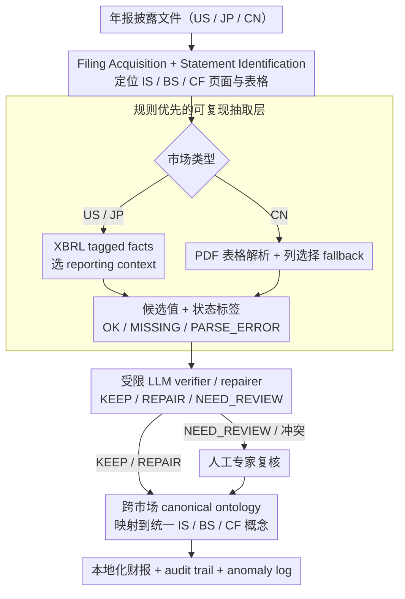

# FinReporting: An Agentic Workflow for Localized Reporting of Cross-Jurisdiction Financial Disclosures

**会议**: ACL2026  
**arXiv**: [2604.05966](https://arxiv.org/abs/2604.05966)  
**代码**: Demo: https://huggingface.co/spaces/BoomQ/FinReporting-Demo  
**领域**: 金融 NLP / LLM Agent  
**关键词**: 财务披露, 跨司法辖区, agentic workflow, canonical ontology, LLM guardrail  

## 一句话总结
FinReporting 把跨美国、日本、中国财报本地化拆成“规则抽取 + 本体映射 + 受限 LLM 校验/修复 + 人工复核”的可审计 agent workflow，用统一 IS/BS/CF schema 缓解不同司法辖区财务披露格式和会计语义不一致的问题。

## 研究背景与动机
**领域现状**：金融 NLP 已经从情感分析、风险预测扩展到财报问答、结构化抽取、XBRL 查询和金融 agent。LLM 可以帮助用户从长财报中抽取指标、总结披露内容、回答财务问题，降低阅读完整年报的成本。

**现有痛点**：很多系统默认单一市场场景：用户知道当地会计准则、披露格式和分类体系，只需要在熟悉的税onomies 中检索信息。但全球投资者经常要理解其他市场公司的报表。美国和日本较多依赖 XBRL，机器可读性强；中国年报更多是 PDF 表格，存在版式变化、表格断裂、OCR 噪声和公司自定义项目。相同标签可能含义不同，相同概念又可能被不同标签表示。

**核心矛盾**：跨司法辖区“本地化财报”不是简单翻译字段名，也不是把 PDF 表格抽出来即可。真正难点是语义对齐和聚合约定：某个 line item 应该映射到 home-market 的哪个 canonical concept？如果抽取缺失或疑似错误，系统要能明确标记、修复或交给专家，而不是让 LLM 自由生成一个看似合理的数字。

**本文目标**：作者提出 FinReporting，希望把美国、日本、中国年报中的核心财务项目映射到统一的 Income Statement、Balance Sheet、Cash Flow schema，并在每一步留下 audit trail、quality signal 和 anomaly log，支持跨市场比较和下游财务问答。

**切入角度**：论文把 LLM 定位为受限 verifier，而不是 extractor 或 generator。规则层先产生可复现候选值，LLM 只在明确证据和决策空间内执行 KEEP、REPAIR 或 NEED_REVIEW，最终由人类专家处理高影响或证据不足案例。

**核心 idea**：用 canonical financial ontology 统一跨市场语义，再把 LLM 放进带 guardrails 的校验/修复层，让跨司法辖区财报本地化既自动化又可审计。

## 方法详解
FinReporting 是一篇系统论文，整条流水线由三层串起来：确定性规则处理层负责产出可复现的候选值，LLM guardrail 层负责在有证据时校验和修复，条件专家复核层兜底处理高影响或证据不足的案例。（cache 中的 PDF 文本有颜色控制残留，但主流程和实验表格仍然可读。）

### 整体框架
输入是某个市场、某家公司的年报披露文件。系统先做 Filing Acquisition 和 Statement Identification：美国、日本市场直接读取 XBRL tagged facts；中国市场则要先定位公开年报 PDF，再检测 IS/BS/CF 相关的页面和表格。接着进入 Extraction，两类市场分流处理——XBRL-native 市场主要是选对 reporting context（consolidated vs separate、period length、instant/duration），PDF-centric 市场则要做文档分解、表格解析、列选择 fallback 和逐字段的 status labeling。

抽取出本地项目后，受限 LLM verifier 先在有证据时校验或修复候选值，通过的项目再用 global ontology 映射到统一的 canonical schema，覆盖 IS/BS/CF 的核心概念，同时保留本地标签、单位、币种、会计准则等元数据。最终输出一套 localized financial statements，外加 anomaly log、audit trail 和 structured workbook，可通过 demo 的市场选择、公司选择、三张表 tab、模板 QA 和下载功能查看。整条链路的设计目标是：每一步都留痕，既能自动化又能审计。

### 关键设计
**1. 规则优先的可复现抽取层：先用确定性规则产出候选值，把 LLM 幻觉挡在数值层之外**

财务数值一旦错了代价极高，所以绝不能让自由文本生成直接进入数值。这一层对 US/JP 走 XBRL tagged facts 加 reporting context 选择，对 CN 走 PDF 表格解析加 fallback，并给每个字段打上 OK、MISSING、PARSE_ERROR、NOT_APPLICABLE 等状态标签。规则层覆盖面虽有限，但它的好处是错误可定位、可复现，状态标签还把缺失和不确定性显式暴露出来，而不是用一个看似合理的数字悄悄填上。

**2. 受限 LLM verifier / repairer：把 LLM 的决策空间锁死成三选一，让它只做有证据的校验而非凭空生成**

自由 LLM 抽取最危险的失败模式是"看起来合理但实际不对"的未标记错误。FinReporting 因此把 LLM 放在规则层之后，且只允许它在 KEEP、REPAIR、NEED_REVIEW 之间做选择：只有当字段确实可修复、证据明确来自 filing context、且候选值与证据一致时才允许 REPAIR，否则一律回退到 NEED_REVIEW，所有决策连同证据和失败原因一并记录。这样 LLM 承担的是推理和证据核对，而不是生成财报数字——把它放回了高风险金融场景里更可信的位置。

**3. 跨市场 canonical ontology：用一套统一概念库存把"同名不同义、异名同义"的跨市场项目对齐**

跨司法辖区财报最棘手的不是翻译字段名，而是语义对齐——美国、日本、中国对同一个会计概念可能用不同标签，同一个标签又可能含义不同。如果没有本体层，校验通过的候选值也只是一堆各市场口径的局部数字，跨市场比较和 QA 无从谈起。FinReporting 围绕 Income Statement、Balance Sheet、Cash Flow 定义一组 canonical concepts，把各市场的本地标签都映射到这套统一库存上；实验里共享子集落在 18 个目标字段（IS 5 个、BS 7 个、CF 6 个）。有了这层映射，下游才谈得上跨市场 benchmarking 和统一 schema 下的财务问答。

### 一个完整示例：一条中国 PDF 财报里的 "营业收入" 字段如何走完三层
假设要本地化一家中国公司的年报，目标字段是利润表里的"营业收入"。规则层先定位年报 PDF 中的利润表，解析出"营业收入 = 1,203,456 万元"这个候选值，并打上 `OK` 状态；若表格断裂导致只抓到半行，它会改打 `PARSE_ERROR` 而不是猜一个数。候选值进入 LLM verifier：模型比对 filing 上下文，确认数字与原文一致，于是输出 `KEEP`，把它映射到 canonical 的 Revenue 概念。再设想另一个字段"财务费用"规则层抽成了负数但证据显示应为正——verifier 发现冲突，但 filing 里有明确依据可改，于是给出 `REPAIR` 并记录证据；而当某个公司自定义口径的项目在本体里找不到对应概念、证据又不足时，verifier 直接判 `NEED_REVIEW`，连同 anomaly log 推给人工专家。一条字段就这样从"规则候选 → LLM 三选一 → （必要时）人工兜底"走完，全程每一步都留下 audit trail。

### 损失函数 / 训练策略
本文不训练新模型，而是给出系统工作流与评测方案。LLM guardrail 层实验中用 GPT-4o，并横向比较了 GPT-5.2、GPT-5 mini、GPT-4o、Gemini-2.5-Flash、Gemini-2.5-Flash-Lite、DeepSeek-Chat 等 backbone。系统级指标有三个：Filled Rate (FR) 是非空输出比例；Conflict Rate (CR) 是因规则输出与 LLM verifier 冲突或证据不足而触发 human review 的比例；Accuracy (ACC) 是相对人工标注的准确率。

> ⚠️ 部分 backbone 名称（如 GPT-5.2）以原文为准。

## 实验关键数据

### 主实验
| 司法辖区 | 指标 | LLMReporting | FinReporting | 观察 |
|--------|------|------|----------|------|
| US | FR | 94.44 | 95.56 | XBRL 标准化强，覆盖最高 |
| US | CR | 5.56 | 15.56 | FinReporting 更主动暴露冲突/复核信号 |
| US | ACC | 89.38 | 90.23 | 小幅提升 |
| JP | FR | 84.44 | 84.44 | 日本 XBRL 仍有更大标签/报告变化 |
| JP | CR | 15.56 | 15.56 | 两者冲突率相同 |
| JP | ACC | 88.36 | 88.36 | 未见提升 |
| CN | FR | 63.33 | 63.33 | PDF-centric 环境覆盖仍低 |
| CN | CR | 26.67 | 40.56 | 更多 NEED_REVIEW / 冲突暴露 |
| CN | ACC | 78.15 | 82.11 | 在最难市场上提升最大 |

### LLM backbone 比较（US filings）
| Backbone | FR | CR | ACC | Cost ($) |
|------|---------|------|------|------|
| GPT-5.2 | 95.56 | 8.89 | 90.23 | 36.96 |
| GPT-5 mini | 95.56 | 15.00 | 90.23 | 17.77 |
| GPT-4o | 95.56 | 15.56 | 90.00 | 34.04 |
| Gemini-2.5-Flash | 95.56 | 12.78 | 90.23 | 7.27 |
| Gemini-2.5-Flash-Lite | 95.56 | 8.89 | 90.00 | 1.47 |
| DeepSeek-Chat | 95.56 | 100.00 | 90.23 | 2.41 |

### 关键发现
- 覆盖率主要由 pipeline 和数据源结构决定，而不是由 LLM backbone 决定：US backbone 表中 FR 全部为 95.56。
- CN 场景准确率从 78.15 提升到 82.11，是最能体现 verification/repair 价值的场景，但 FR 仍只有 63.33。
- 更强/更贵的模型并不一定带来更高 ACC。Gemini-2.5-Flash-Lite 成本 1.47 美元，ACC 90.00，已经接近 GPT-5.2 的 90.23。
- DeepSeek-Chat 的 CR 为 100.00，说明某些 backbone 在该 guardrail 设定下可能过度触发冲突或无法稳定完成受限校验。

## 亮点与洞察
- **LLM 被放在正确的位置**：论文没有让 LLM 直接读财报生成数值，而是让规则层负责候选值，LLM 负责证据核查和有限修复。这是高风险金融场景里更可信的架构。
- **CR 不是纯坏指标**：FinReporting 在 US/CN 的 CR 更高，表面看像冲突更多，但实际上可能代表系统更愿意把不确定性暴露给 human review，而不是静默输出。
- **PDF-centric 市场才是真压力测试**：US/JP XBRL 已经提供机器可读结构，CN 的版式、表格和 OCR 噪声更接近真实文档 AI 难题，因此 CN 上的提升更有意义。
- **成本分析有部署价值**：如果填充率由规则 pipeline 主导，LLM 只做 verifier，那么便宜模型可能足够。这对企业级财报处理很重要。

## 局限与展望
- 当前只覆盖美国、日本、中国三个司法辖区，且只评测 annual filings、非金融企业、consolidated statements 和 18 个核心 IS/BS/CF 字段。
- CN PDF 场景仍然覆盖不足，FR 只有 63.33。版式变化、表格碎片、OCR 噪声和公司特有披露习惯仍会导致 MISSING、PARSE_ERROR 或 NEED_REVIEW。
- canonical ontology 是人为预定义的，可能无法覆盖长尾 taxonomy、公司特定口径或市场特有会计语义，存在解释偏差。
- 系统是 auditable assistant，不是全自动财务报告工具。高风险投资、审计和监管决策仍必须人工核对原始 filing。
- 未来可扩展到 footnotes、segment disclosures、更多期间、多市场长尾字段，并加入更严格的 provenance tracking 和 numerical consistency checks。

## 相关工作与启发
- **vs XBRL Agent / XBRL-centered systems**: 这些系统适合机器可读披露，但往往默认固定 taxonomy；FinReporting 显式处理跨司法辖区异质性和 PDF 市场。
- **vs FinQA / TAT-QA / ConvFinQA**: 这些 benchmark 关注财务问答和数值推理，FinReporting 更偏上游结构化和本地化，将异构 disclosure 转成统一 schema。
- **vs 自由 LLM financial annotator**: 自由生成更灵活但风险高；本文的 KEEP/REPAIR/NEED_REVIEW 设计值得迁移到其他高风险文档抽取任务，如医疗保险、法律合规和审计。
- **启发**：高风险 agent 系统的关键不是“自动化每一步”，而是让每一步的证据、状态、修复和失败原因可追踪。

## 评分
- 新颖性: ⭐⭐⭐⭐☆ canonical ontology + guardrailed LLM verifier 的系统设计扎实，虽然单个组件并非全新。
- 实验充分度: ⭐⭐⭐☆☆ 覆盖 90 家公司和三市场，但字段数较少，JP 未体现提升，更多长尾场景仍缺。
- 写作质量: ⭐⭐⭐☆☆ 思路清楚，但 cache 中 PDF 颜色残留严重，正文部分实验细节较压缩。
- 价值: ⭐⭐⭐⭐☆ 对金融 NLP agent 和高风险文档结构化很有工程参考价值，特别是“LLM 只做有证据的 verifier”这一点。

<!-- RELATED:START -->

## 相关论文

- [\[ACL 2026\] Towards Effective In-context Cross-domain Knowledge Transfer via Domain-invariant-neurons-based Retrieval](towards_effective_in-context_cross-domain_knowledge_transfer_via_domain-invarian.md)
- [\[AAAI 2026\] L2V-CoT: Cross-Modal Transfer of Chain-of-Thought Reasoning via Latent Intervention](../../AAAI2026/llm_reasoning/l2v-cot_cross-modal_transfer_of_chain-of-thought_reasoning_v.md)
- [\[CVPR 2026\] Scaling Agentic Reinforcement Learning for Tool-Integrated Reasoning in VLMs](../../CVPR2026/llm_reasoning/scaling_agentic_reinforcement_learning_for_tool-integrated_reasoning_in_vlms.md)
- [\[ACL 2026\] HISR: Hindsight Information Modulated Segmental Process Rewards for Multi-turn Agentic Reinforcement Learning](hisr_hindsight_information_modulated_segmental_process_rewards_for_multi-turn_ag.md)
- [\[ICML 2026\] Deliberate Evolution: Agentic Reasoning for Sample-Efficient Symbolic Regression with LLMs](../../ICML2026/llm_reasoning/deliberate_evolution_agentic_reasoning_for_sample-efficient_symbolic_regression_.md)

<!-- RELATED:END -->
