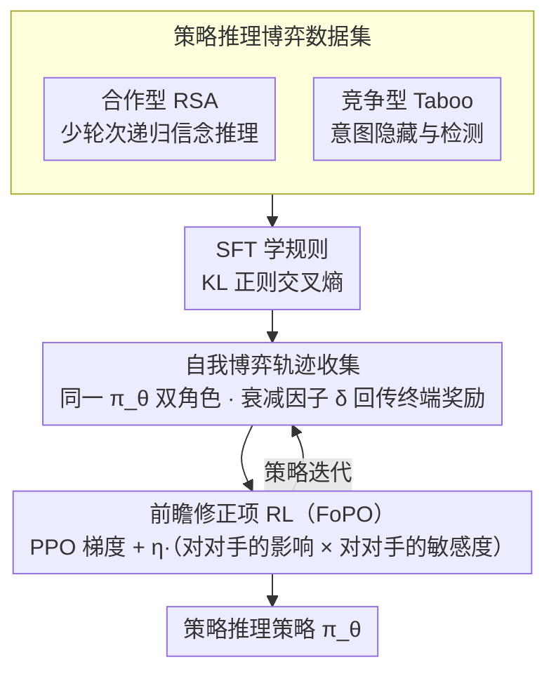

# Foresight Optimization for Strategic Reasoning in Large Language Models

**会议**: ACL 2026  
**arXiv**: [2604.13592](https://arxiv.org/abs/2604.13592)  
**代码**: [GitHub](https://github.com/wangjs9/ForesightOptim)  
**领域**: LLM 推理 / 博弈策略  
**关键词**: 策略推理, 前瞻优化, 对手建模, 自我博弈, 多智能体

## 一句话总结

本文提出 Foresight Policy Optimization（FoPO），通过在策略优化中引入对手建模的前瞻修正项，使 LLM 能够显式预见对手行为并据此调整自身策略，在合作（Cooperative RSA）和竞争（Competitive Taboo）两类博弈任务上显著提升策略推理能力，并在跨域 γ-Bench 上取得一致性提升。

## 研究背景与动机

**领域现状**：LLM 的推理能力已有显著进步（数学推理、逻辑推理等），但在多智能体环境中的策略推理（strategic reasoning）——即预见对手行为并据此制定最优决策的能力——仍然不足。现有推理增强方法（CoT、搜索方法、图结构框架）各有专长，但均未显式建模"前瞻"这一策略推理的核心特征。

**现有痛点**：(1) PPO 等标准 RL 方法仅优化自身策略而不考虑对手的响应——每次更新是孤立的，缺乏对对手未来行为的预判；(2) 现有博弈数据集（如国际象棋、扑克）的领域复杂度过高，其中领域专业知识的需求远超策略推理本身，难以进行受控研究；(3) 博弈论中的对手建模方法（如 LOLA）需要计算二阶信息（混合 Hessian），对大模型而言计算不可行。

**核心矛盾**：策略推理的本质是"前瞻"——预判对手未来会如何行动、自身行动如何影响对手，但现有 RL 优化框架将自身和对手视为独立过程，缺乏这种耦合。

**本文目标**：设计一种计算高效的前瞻策略优化方法，使 LLM 能在策略更新中显式考虑对手的响应，并构建适合受控研究的博弈数据集。

**切入角度**：借鉴博弈论中的对手建模原理（opponent modeling），将对手策略变化对自身价值的影响以梯度修正项的形式嵌入 PPO 的更新公式中，通过梯度截断避免二阶计算。

**核心 idea**：在标准 PPO 更新上增加一个"前瞻修正项"，该项耦合了两个因素：(1) 自身行动对对手学习梯度的影响（influence），(2) 对手策略变化对自身目标的敏感度（sensitivity），从而实现对未来对手行为的显式预判。

## 方法详解

### 整体框架

FoPO 建立在自我博弈 RL 之上：从同一个 LLM 策略 $\pi_\theta$ 实例化两个角色相对的智能体，先用 SFT 让它学会游戏规则，再通过 RL 自我博弈打磨策略推理。它要解决的核心问题是——标准 PPO 把自己和对手当成两条互不相干的优化过程，每次更新只顾自身回报，看不见对手会怎么反应。FoPO 的做法是在 PPO 的梯度更新里塞进一个"前瞻修正项"，让每一步更新在优化自身收益的同时，显式预判对手将如何被自己的策略变化牵动，从而把"预见对手"这件策略推理的本质事写进优化目标。为了能做受控研究，作者还专门配了一对合作型（Cooperative RSA）与竞争型（Competitive Taboo）的语言博弈数据集，把领域知识负担压到最低、只留下纯粹的策略推理。

### 关键设计

**1. 前瞻修正项：把对手的反应写进梯度更新**

FoPO 的参数更新写作

$$\theta_{t+1} \leftarrow \theta_t + \alpha \nabla_\theta [r^1_t \hat{A}^{1,clip}_t] - \alpha\beta \nabla_\theta \text{KL} + \alpha\eta (O^1 \nabla_\theta r^2_{t+1})^\top (\nabla_\theta r^1_t \nabla_\theta O^2)$$

前两项就是带 KL 正则的标准 PPO，真正的新意在第三项——它由两个因子耦合而成：一是**对对手的影响** $\nabla_\theta r^1_t \nabla_\theta O^2$，刻画自身策略变化如何改变对手的学习梯度；二是**对对手的敏感度** $O^1 \nabla_\theta r^2_{t+1}$，刻画对手策略一旦变化又会如何反过来影响自身目标。两者相乘，就让本次更新提前把"我动一步、对手会怎么动、对手动了又怎样回到我身上"这条链路纳入考量。博弈论里的对手建模（如 LOLA）要算混合 Hessian，对大模型不可行；FoPO 用梯度截断把这个二阶项降到一阶近似，前瞻能力才在 LLM 规模上落地，权重由超参 $\eta$ 控制。

**2. 合作型数据集 Cooperative RSA：用最少轮次逼出递归信念推理**

合作场景基于 Rational Speech Acts 框架设计成一个参考博弈：说话者逐步给出目标对象的特征，听者据此推断目标，目标是用尽量少的交互轮次完成识别，奖励与对话轮数负相关。要做得高效，说话者必须预判听者会怎样解读自己给的线索、听者也要反推说话者为何偏偏选这条线索——这种你来我往的递归信念推理天然就是"前瞻"，恰好为前瞻修正项提供了对路的训练与评估信号。

**3. 竞争型数据集 Competitive Taboo：用对抗诱导逼出意图隐藏与检测**

竞争场景里攻击者试图通过对话把防守者诱导到说出目标词，防守者则要识别目标词又不被牵着走，赢者得 +1、输者得 −1。攻击者得预判防守者的警惕程度来调整诱导策略，防守者得从对话里反推攻击者的真实意图来识破操纵，双方都被逼着做前瞻推理。它与合作型 RSA 构成互补的一对——一个考"为对方着想"的递归信念，一个考"与对方博弈"的意图攻防，合起来覆盖策略推理的两个面向。

### 损失函数 / 训练策略

训练分三阶段：(1) SFT 阶段用带 KL 正则的交叉熵损失让模型先学会游戏规则；(2) 轨迹收集阶段通过自我博弈生成对话轨迹，并用衰减因子 $\delta$ 把终端奖励逐步向前传播到每一轮；(3) RL 阶段以 FoPO 做策略优化，前瞻修正项的权重为 $\eta$。前瞻修正与具体 RL 算法解耦，因此也能无缝接入 GRPO 得到 GR.FoPO。

## 实验关键数据

### 主实验

**γ-Bench 跨域评估（Taboo + RSA 训练）**

| 方法 | Backbone | Guessing | Bar | Dollar | Diner | Pirate | 平均 |
|------|----------|----------|-----|--------|-------|--------|------|
| PPO | Llama-3-8B | 78.29 | 72.00 | 60.99 | 97.80 | 49.58 | 56.71 |
| ArCHer | Llama-3-8B | 78.78 | 73.83 | 57.17 | 93.40 | 46.19 | 54.46 |
| **FoPO** | Llama-3-8B | **80.47** | **72.83** | **64.61** | **98.40** | **58.05** | **60.08** |
| PPO | Qwen3-14B | 93.88 | 43.83 | 85.79 | 32.40 | 83.07 | 62.10 |
| **FoPO** | Qwen3-14B | **94.12** | **52.33** | **87.85** | **32.70** | **84.04** | **64.30** |

### 消融实验

**不同训练数据的迁移效果（Llama-3-8B SFT → γ-Bench 平均）**

| 训练数据 | 平均分 | 相对基线提升 |
|----------|--------|-------------|
| 无训练 | 51.90 | — |
| 20 Questions | 55.19 | +3.29 |
| Guess My City | 53.37 | +1.47 |
| Taboo | 56.47 | +4.57 |
| RSA | 56.54 | +4.64 |
| **Taboo + RSA** | **57.23** | **+5.33** |

### 关键发现

- FoPO 在两个 backbone（Llama-3-8B 和 Qwen3-14B）和三种训练配置上均一致优于 PPO、GRPO 和 ArCHer
- 前瞻修正可无缝集成到 GRPO 中（GR.FoPO），且保持 GRPO 对 PPO 的优势
- 合作型 RSA 数据集的迁移效果优于竞争型 Taboo，因为合作推理更强调对手建模
- GRPO 在 RSA 上出现概率崩塌（因连续奖励导致优势估计惩罚了次优但成功的轨迹），但在 Taboo（二值奖励）上正常
- OpenAI o3 在防守者角色上表现优异（反应式推理），但在攻击者角色上挣扎（主动式策略推理），揭示了当前 LLM 在前瞻推理上的根本局限

## 亮点与洞察

- 前瞻修正项的设计简洁高效——通过梯度截断将二阶对手建模降为一阶计算，使其在大模型上可行
- 合作与竞争两种任务的对比揭示了策略推理的不同面向：合作需要递归信念推理，竞争需要意图隐藏与检测
- GRPO 在连续奖励任务上崩塌的发现具有独立价值，揭示了 group relative 方法的一个潜在局限

## 局限与展望

- 仅关注纯语言对话博弈，未涉及带有世界状态的复杂多智能体环境
- 两人博弈设置，未扩展到多方交互场景
- 前瞻修正项的权重 $\eta$ 需要手动调节，缺乏自适应机制
- 未探索策略推理与长期规划、心智理论等认知能力的交互

## 相关工作与启发

- **vs PPO**: PPO 孤立优化自身策略；FoPO 通过前瞻修正项耦合自身与对手的策略更新
- **vs LOLA**: LOLA 需要计算混合 Hessian（二阶信息），计算不可行；FoPO 通过梯度截断实现高效近似
- **vs ArCHer**: ArCHer 是多轮 RL 方法但不建模对手；FoPO 显式建模对手响应
- **vs Self-Play**: 标准自我博弈通过对抗隐式改善策略；FoPO 在优化目标中显式编码前瞻

## 评分

- 新颖性: ⭐⭐⭐⭐ 前瞻修正项设计新颖，将博弈论中的对手建模高效适配到 LLM
- 实验充分度: ⭐⭐⭐⭐⭐ 两个 backbone × 三种数据配置 × 多种基线 × 域内域外评估，非常全面
- 写作质量: ⭐⭐⭐⭐ 方法阐述清晰，但表格密度较高，阅读负担偏重
- 价值: ⭐⭐⭐⭐ 为 LLM 在多智能体场景中的策略推理提供了可行的优化框架

<!-- RELATED:START -->

## 相关论文

- [\[ACL 2026\] SeLaR: Selective Latent Reasoning in Large Language Models](selar_selective_latent_reasoning_in_large_language_models.md)
- [\[ICML 2026\] Reasoning Structure of Large Language Models](../../ICML2026/llm_reasoning/reasoning_structure_of_large_language_models.md)
- [\[ACL 2026\] JTPRO: A Joint Tool-Prompt Reflective Optimization Framework for Language Agents](jtpro_a_joint_tool-prompt_reflective_optimization_framework_for_language_agents.md)
- [\[ACL 2026\] Chain-of-Thought as a Lens: Evaluating Structured Reasoning Alignment between Human Preferences and Large Language Models](chain-of-thought_as_a_lens_evaluating_structured_reasoning_alignment_between_hum.md)
- [\[ACL 2026\] Dissecting Failure Dynamics in Large Language Model Reasoning](dissecting_failure_dynamics_in_large_language_model_reasoning.md)

<!-- RELATED:END -->
