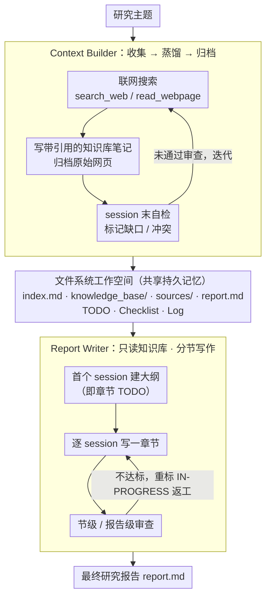

# FS-Researcher: Test-Time Scaling for Long-Horizon Research Tasks with File-System-Based Agents

**会议**: ACL 2026  
**arXiv**: [2602.01566](https://arxiv.org/abs/2602.01566)  
**代码**: [https://github.com/Ignoramus0817/FS-Researcher](https://github.com/Ignoramus0817/FS-Researcher)  
**领域**: LLM推理  
**关键词**: 深度研究, 文件系统, 测试时扩展, 知识库构建, 双Agent框架

## 一句话总结

本文提出 FS-Researcher，一个基于文件系统的双 Agent 深度研究框架，通过 Context Builder 构建层次化知识库、Report Writer 分节撰写报告，利用持久化工作空间突破上下文窗口限制，在 DeepResearch Bench 上达到 53.94 RACE（SOTA），并展示了上下文构建计算量与报告质量的正相关测试时扩展效应。

## 研究背景与动机

**领域现状**：深度研究（Deep Research）是 LLM Agent 的前沿代表性任务，要求 Agent 从互联网系统性地收集证据并综合成长篇报告。OpenAI、Google、Anthropic 等已推出商业深度研究产品，展现了人类级别的性能。

**现有痛点**：(1) 模型上下文长度有限，而深度研究的长轨迹任务容易超出上下文容量，导致 Agent 执行中断；(2) 现有方法（静态管线、单 Agent 流程）中 thoughts、tool observations 和报告草稿竞争有限的 token 预算，导致覆盖不全和过早综合；(3) 当前的压缩策略（如摘要化 tool 观察）虽延长了轨迹，但引入有损瓶颈——细粒度证据和来源可能丢失，且仍受上下文硬限制约束。

**核心矛盾**：深度研究任务需要的信息量（数百个网页、数万 token 的报告）与模型上下文窗口容量之间存在根本性矛盾。现有方法要么截断信息，要么有损压缩，无法真正实现测试时扩展（分配更多计算以提升质量）。

**本文目标**：(1) 设计一个可扩展至上下文窗口之外的深度研究框架；(2) 验证框架能否通过增加计算来持续提升报告质量；(3) 在多个基准上超越闭源和开源 SOTA。

**切入角度**：受编程 Agent 和 AI IDE（Cursor、Claude Code）的启发——文件系统工作空间是长时间工具使用和迭代开发的有效基础设施。将此范式迁移到深度研究，用文件系统作为持久外部记忆。

**核心 idea**：用文件系统替代上下文窗口作为 Agent 的记忆基础设施——信息存入文件而非保留在上下文中，按需加载，支持无限扩展和跨 session 迭代优化。

## 方法详解

### 整体框架

FS-Researcher 想解决的核心矛盾是：深度研究要消化数百个网页、产出数万 token 的报告，信息量远超模型上下文窗口，硬塞就会截断或有损压缩。它的破局思路是把记忆从上下文搬到文件系统——信息写进文件、按需加载，从而突破窗口上限。整个框架是双 Agent、两阶段：Context Builder 像图书管理员一样浏览互联网、写结构化笔记、归档原始网页，搭起一座层次化知识库；Report Writer 随后以这座知识库为唯一事实来源，分节把报告写出来。两个 Agent 共享同一个文件系统工作空间，里面既有交付物（知识库、报告），也有控制文件（TODO、Checklist、Log），各自都能独立迭代优化。

### 关键设计

**1. 文件系统工作空间：用持久化外部记忆替掉上下文窗口，让信息量不再受 token 预算约束**

深度研究的长轨迹里，thoughts、tool observations 和报告草稿一直在抢有限的 token 预算，结果是覆盖不全、过早综合。FS-Researcher 干脆把所有东西外化成 Markdown 文件：交付物有 `index.md`、`knowledge_base/`、`sources/`、`report.md`，控制文件有 todos、checklist、logs。Agent 每个 session 开始时先检查工作空间状态再制定计划，session 结束时对照 checklist 审查，把没达标的项标成 `[IN-PROGRESS]`，下个 session 接着干。工具集也分两类——文件系统工具（`ls`、`grep`、`read_file`、`insert`/`delete`/`replace`）和网络浏览工具（`search_web`、`read_webpage`）。这样做有三重好处：它镜像了人类处理复杂任务的原生方式；存储量远超上下文窗口、按需访问不溢出；中间产物持久可回溯，支持跨 session 反复打磨。

**2. Context Builder：把信息系统性地收集、蒸馏、归档进结构化知识库，而不是堆在上下文里**

如果像传统做法那样在上下文里直接累积事实，很快就会撑爆窗口，且结构混乱不利于检索。Context Builder 的交付物是三件套：`index.md`（目录，含主题分解和 KB 结构）、`knowledge_base/`（树状笔记目录，每条陈述都附引用指回 `sources/`）、`sources/`（归档的原始网页）。它的工作流是非线性的——`index.md` 和 `knowledge_base/` 随浏览过程动态更新；每个 session 结束做一次自检，找出知识库里的错误、缺口或冲突并标记待处理，可一直迭代到耗尽 session 预算或通过审查。把信息外化成文件，知识库就能长到远超上下文容量，而结构化组织又让下游的 Report Writer 能按需精准检索。

**3. Report Writer：砍掉联网能力、只读知识库，用分节多 session 写作换取深度与自纠正**

一次性生成整篇报告，往往退化成事实罗列、缺乏深度分析。Report Writer 因此被设计成只能从知识库读事实（移除网络浏览工具），并采用多 session 分节流程：第一个 session 先建大纲（同时充当 TODO），之后每个 session 只挑一个章节来写；每节写完做节级审查（对照 checklist），全部完成再做报告级审查，发现问题就把相关章节重标为 `[IN-PROGRESS]` 返工，且不设 session 预算上限。分节写作的价值在于提供频繁的"重新锚定"机会——每写一节都回到知识库做局部规划和自我纠正，避免越写越飘。

### 一个完整示例：一次"某新兴电池技术综述"请求如何在工作空间里跑完

给定研究主题后，Context Builder 先建空工作空间，在 `index.md` 里把主题拆成几个子方向并列出 TODO，然后开始联网：每读一个网页就在 `sources/` 归档原文、在 `knowledge_base/` 对应子目录写一条带引用的笔记。第一个 session 结束时它自检发现"成本数据有缺口、两处数字冲突"，标记待处理；第二、第三个 session 补齐缺口、消解冲突，知识库逐步从粗到精。审查通过后切换到 Report Writer：它读 `knowledge_base/` 先在 `report.md` 写出大纲（即章节 TODO），随后每个 session 写一章——写完"技术原理"节做节级 checklist 审查通过，写"成本分析"节时发现引用对不上知识库，于是把该节重标 `[IN-PROGRESS]` 回炉重写；所有章节过审后再做一次报告级审查定稿。全程信息都躺在文件里按需加载，上下文窗口从不被撑爆，而文件 I/O 延迟可忽略（占总时间 <0.03%）。

### 损失函数 / 训练策略

本文是框架工作，不涉及模型训练。两个 Agent 都由标准 ReAct 架构驱动：

$$T_i, A_i = M_\theta(T_{j<i}, A_{j<i}, O_{j<i}, P), \quad O_i = \mathrm{Execute}(A_i)$$

其中 $T_i$、$A_i$、$O_i$ 分别是第 $i$ 步的思考、动作和执行观察，$P$ 是 prompt。框架支持 GPT-5、Claude-Sonnet-4.5、Gemini-2.5-Pro 等多种骨干模型。

## 实验关键数据

### 主实验

**DeepResearch Bench 性能对比**

| 方法 | 骨干模型 | Comp. | Insight | Instr. | Read. | RACE |
|------|---------|-------|---------|--------|-------|------|
| OpenAI-DeepResearch | - | 46.46 | 43.73 | 49.39 | 47.22 | 46.45 |
| Gemini-2.5-Pro-DR | - | 49.51 | 49.45 | 50.12 | 50.00 | 49.71 |
| WebWeaver | Qwen3-235B | 51.45 | 51.39 | 50.26 | 48.98 | 50.80 |
| RhinoInsight | Gemini-2.5-Pro | 50.51 | 51.45 | 51.72 | 50.00 | 50.92 |
| **FS-Researcher** | Claude-Sonnet-4.5 | **54.25** | **55.85** | **52.47** | **51.54** | **53.94** |
| **FS-Researcher** | GPT-5 | 51.96 | 54.44 | 52.14 | 51.26 | 52.76 |

**DeepConsult 性能对比**

| 方法 | Win% | Tie% | Lose% | Avg Score |
|------|------|------|-------|-----------|
| OpenAI-DeepResearch | 0.00 | 100.00 | 0.00 | 5.00 |
| WebWeaver | 66.16 | 12.14 | 21.68 | 6.94 |
| **FS-Researcher** (Claude) | **80.00** | 10.42 | 9.58 | **8.33** |

**BrowseComp 准确率**

| 方法 | 准确率 |
|------|-------|
| Claude-Sonnet-4.5 (官方) | 43.9% |
| FS-Researcher (Claude) | **55.0%** |
| GPT-5 (官方) | 54.9% |
| FS-Researcher (GPT-5) | **68.0%** |

### 消融实验

**模块消融（GPT-5 骨干，10 个采样查询）**

| 配置 | Comp. | Insight | Instr. | Read. | RACE |
|------|-------|---------|--------|-------|------|
| FS-Researcher (完整) | 51.96 | 54.44 | 52.14 | 51.26 | 52.76 |
| - 持久化工作空间 | 48.38(-3.58) | 46.49(-7.95) | 50.78 | 49.92 | 48.69(-4.07) |
| - 双Agent→单Agent | 40.90(-11.06) | 37.55(-16.89) | 46.30 | 44.78 | 42.41(-10.35) |
| - 分节写作→一次性生成 | 47.06(-4.90) | 45.64(-8.80) | 50.50 | 46.46 | 47.63(-5.13) |

### 关键发现

- FS-Researcher 在三个基准上一致超越闭源和开源 SOTA，证明文件系统范式的框架级优势独立于骨干模型
- 双 Agent 消融影响最大（RACE -10.35），说明证据收集与报告撰写的分离是核心设计
- 增加 Context Builder 轮次（3→5→10）持续提升报告质量（Insight 从 49.48 到 55.88），但可读性在 5 轮后略有下降，因为信息密度增加导致写作风格更技术化
- 持久化工作空间对 Insight 影响最大（-7.95），说明结构化知识库对深度分析至关重要
- 用更小的摘要模型压缩上下文可降低 Context Builder 成本 47%，质量损失可忽略

## 亮点与洞察

- 文件系统作为 Agent 外部记忆的范式转换——从"信息放在上下文中"到"信息放在文件中按需加载"，是一个简洁但深刻的架构创新
- 双 Agent 分离解决了一个根本问题：信息收集和报告撰写需要不同的认知模式，混合在一起会导致过早综合和浅层探索
- 测试时扩展效应（更多计算→更好报告）的成功验证为 Agent 系统的 scaling law 提供了初步证据

## 局限与展望

- 框架依赖较强的骨干模型——需要强大的多轮规划、网络搜索和长文写作能力，小模型可能频繁提前终止
- 可读性与全面性之间存在权衡——更丰富的知识库导致更技术化的写作风格
- 未研究多 Agent 协作（如多个 Context Builder 并行搜索不同子主题）
- 存储原始网页可能涉及版权和隐私问题

## 相关工作与启发

- **vs OpenAI/Google Deep Research**: 商业产品技术不透明，FS-Researcher 是可复现的开源替代方案，且在多个基准上超越
- **vs LangChain Open Deep Research**: 在相同 GPT-5 骨干下，FS-Researcher RACE 提升 +2.16，证明框架贡献独立于模型
- **vs 摘要压缩方法**: 摘要压缩是有损的且仍受上下文限制，文件系统方法是无损的且无上限

## 评分

- 新颖性: ⭐⭐⭐⭐⭐ 文件系统作为 Agent 记忆的范式创新简洁而有效，测试时扩展效应验证有价值
- 实验充分度: ⭐⭐⭐⭐⭐ 三个基准、三个骨干模型、三个消融实验、scaling 分析和案例研究
- 写作质量: ⭐⭐⭐⭐⭐ 动机清晰、方法描述详尽、消融设计合理
- 价值: ⭐⭐⭐⭐⭐ 为深度研究 Agent 提供了可复现的 SOTA 框架和设计原则

<!-- RELATED:START -->

## 相关论文

- [\[ACL 2026\] SPPO: Sequence-Level PPO for Long-Horizon Reasoning Tasks](sppo_sequence-level_ppo_for_long-horizon_reasoning_tasks.md)
- [\[ACL 2026\] Efficient Test-Time Scaling via Temporal Reasoning Aggregation](efficient_test-time_scaling_via_temporal_reasoning_aggregation.md)
- [\[ACL 2026\] Scaling Test-Time Compute to Achieve IOI Gold Medal with Open-Weight Models](scaling_test-time_compute_to_achieve_ioi_gold_medal_with_open-weight_models.md)
- [\[ACL 2026\] Parallel Test-Time Scaling for Latent Reasoning Models](parallel_test-time_scaling_for_latent_reasoning_models.md)
- [\[ACL 2026\] ReProbe: Efficient Test-Time Scaling of Multi-Step Reasoning by Probing Internal States of Large Language Models](reprobe_efficient_test-time_scaling_of_multi-step_reasoning_by_probing_internal_.md)

<!-- RELATED:END -->
