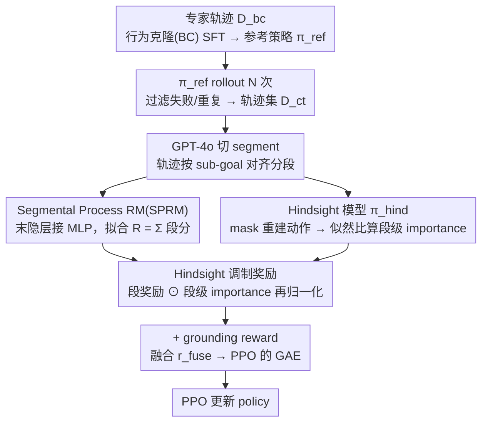

# HISR: Hindsight Information Modulated Segmental Process Rewards for Multi-turn Agentic Reinforcement Learning

**会议**: ACL 2026  
**arXiv**: [2603.18683](https://arxiv.org/abs/2603.18683)  
**代码**: 即将开源  
**领域**: LLM Agent / 多轮强化学习 / 过程奖励  
**关键词**: agentic RL, segmental process reward, hindsight model, credit assignment, PPO

## 一句话总结
HISR 用 GPT-4o 把 agent 轨迹切成与 sub-goal 对齐的 segment，再让一个 hindsight 模型与 policy 模型的似然比给每段算一个 importance 分数，去 modulate 段级过程奖励——在 Alfworld / Virtualhome / Webshop 上把信用分配做得更靠谱，平均得分较 SPA 涨 5+。

## 研究背景与动机

**领域现状**：让 LLM 当 agent 解决多轮决策（家务、网购等）依赖多轮 RL（PPO/GRPO）。reward model 是核心：(a) outcome RM（轨迹末尾一个标量）；(b) 用 MCTS 或 GPT-4 标 turn-level 伪 process reward；(c) 像 SPA 这样直接用 outcome 间接监督 turn-level credit。

**现有痛点**：
- outcome RM：长 horizon 下"延迟奖励"难传到早期 action，credit assignment 几乎瞎传。
- turn-level pseudo label：MCTS/GPT-4 标注成本高、噪声大。
- 无标签 turn-level：完全忽略 action importance，process reward "unfocused"。
- **共性问题**：以上都按 turn 给奖励，但一个 sub-goal 往往跨多 turn（如"先找物再清洁"），turn-level 粒度过细，把同一子目标的不同动作拆得七零八落。

**核心矛盾**：reward 粒度 vs 标注成本 vs 信号 focus 三者难兼得——越细越焦不准、越粗越不能传。

**本文目标**：(1) 把粒度从 turn 升到 sub-goal segment；(2) 不引入额外人工 process label 的情况下，给 segment 加 action importance 信号。

**切入角度**：借鉴 Hindsight Credit Assignment（Harutyunyan 2019）——已知轨迹结果之后，"事后回看"一个动作的合理性比"事前预测"更能反映它对结果的真实贡献。

**核心 idea**：用 GPT-4o 切 segment + segment-level RM 给段级 reward；再用 hindsight model 与 policy model 的 token 级似然比聚合到 segment 上，乘进 reward 里，得到 "sub-goal 对齐 + 重要动作被放大" 的修正奖励。

## 方法详解

### 整体框架
三阶段：
1. **行为克隆 + 轨迹采集**：在专家轨迹 $D_{bc}$ 上 SFT 得到参考策略 $\pi_{ref}$；再让 $\pi_{ref}$ 在环境里跑 $N$ 次 rollout，过滤失败/重复样本，得到 $D_{ct} = \{(\tau_{i,j}, R_{i,j})\}$。
2. **构造两个辅助模型**：用 GPT-4o 把每条轨迹切成 segment $\tau^s = \{s_1, \dots, s_n\}$，训练 Segmental Process RM（SPRM）和 hindsight 模型 $\pi_{hind}$。
3. **PPO 训练**：用 SPRM 预测段级 reward $\hat R$，用 hindsight/policy 似然比算段级 importance $\hat z_s$，乘起来再归一化得 $\hat R_{him}$，加 grounding reward 后驱动 PPO。

### 关键设计

**1. Segmental Process Reward Model（SPRM）：把轨迹末尾的一个标量拆成与 sub-goal 对齐的连续段奖励**

turn-level 奖励把同一个子目标（如「先找物、再清洁」）的多个动作拆得七零八落，粒度太碎；而重新用 GPT-4 给每个 turn 打 pseudo label 又贵又吵。SPRM 选了第三条路：在参考策略 $\pi_{ref}$ 的最后隐层接一个 MLP，在每个 segment 的结束 token 处输出该段得分 $r_i = W_2(\text{SiLU}(W_1 h_i))$，再用

$$\mathcal{L}_{sprm}(\tau^s) = \big(R - \sum_{i=1}^n r_i\big)^2$$

把轨迹的标量 outcome $R$ 拟合成各段贡献之和。这等价于让模型自己学一个「任务进度估计器」——只需要末尾一个 outcome 标签，不需要逐 turn 标注，就把奖励粒度落在与 sub-goal 天然对齐的 segment 上，既不碎也不贵。

**2. Hindsight Model 与似然比 importance：在不引入过程标签的前提下，给每个动作算一个「事后回看的重要性」**

段奖励解决了粒度，但同一段里哪个动作才是真正关键，仍然没有信号。本文借鉴 Hindsight Credit Assignment——已知轨迹结果后回看一个动作，比事前预测更能反映它对成功的真实贡献。具体做法是在 $\pi_{ref}$ 上再训练一个 hindsight 模型 $\pi_{hind}$，目标类似 masked language modeling：mask 掉每个 turn 的 response $a_k$，让它在已知整条轨迹其余部分（包含后续 token）的条件下重建 $a_k$。然后定义 token 级似然比

$$r(a_k^j) = \frac{\pi_{hind}(a_k^j \mid o, a_{<k}, a_{>k}, a_k^{<j})}{\pi_{policy}(a_k^j \mid o_{\le k}, a_{<k}, a_k^{<j})}$$

再聚合成动作级 importance $z(a_k) = \exp\!\big(\frac{1}{\beta |a_k|} \sum_j \log r(a_k^j)\big)$，并把同段各 turn 的 $z(a_k)$ 累加得段级 importance $z(s_i)$。直觉很清楚：若 $z(a_k) > 1$，说明知道结果之后回看，agent 反而更倾向选这个动作，这个动作对最终成功就更关键。整套机制只靠 hindsight 与 policy 两套模型的似然差异捕获过程信息，没有任何额外的人工过程标签——这正是它相对 PRM4A 等 MCTS 标注方法的工程优势。

**3. Hindsight-modulated reward + grounding reward：用重要性放大关键段奖励，再补一道可执行性约束**

有了段奖励 $\hat R$ 和段级重要性 $\hat z_s$，就把二者逐元素相乘并归一化，让关键段的奖励被放大、次要段被压低：

$$\hat R_{him} = \frac{\hat R \odot \hat z_s}{\|\hat R \odot \hat z_s\|}$$

但只抓「正确性」还不够——不加约束时 agent 容易生成环境里根本执行不了的幻觉动作。于是再叠加一个 grounding reward $\hat r^g$（动作合法记 1、否则记 0），融合成 $\hat r^{fuse} = (1-\alpha)\,\hat r^{him} + \alpha\,\hat r^g$。$\hat R_{him}$ 管「做得对」、$\hat r^g$ 管「做得到」，两者互补。最终 $\hat r^{fuse}$ 喂进 PPO 的 GAE，按 $\delta_t = \hat r_t^{fuse} + \gamma V_\phi(s_{t+1}) - V_\phi(s_t)$ 计算 advantage 驱动训练。

### 损失函数 / 训练策略
- BC 阶段：只对 thought-action token 算 NLL，跳过 observation token 提升训练稳定性。
- SPRM 训练：仅用 segment-level MSE，对 outcome 单一标签即可，无需逐 turn 标。
- PPO 阶段：clip-objective $\mathcal{L}_{clip}(\theta) = \mathbb{E}_t[\min(\frac{\pi_\theta}{\pi_{\theta_{old}}} \hat A_t^{fuse}, \text{clip}(\cdot, 1-\epsilon, 1+\epsilon) \hat A_t^{fuse})]$，advantage 用 GAE。

## 实验关键数据

### 主实验
在 Alfworld（6 个子任务：PICK/CLEAN/HEAT/COOL/LOOK/PICK2）、Virtualhome、Webshop 上比 12+ 基线。

| 方法 | 类型 | Alfworld-Avg | Virtualhome | Webshop |
|------|------|--------------|-------------|---------|
| GPT-4o | PE | 48.0 | 20.8 | 23.7 |
| Gemini2.5pro | PE | 60.3 | 31.7 | 35.9 |
| SFT | BC | 73.1 | 51.8 | 62.0 |
| DPO | BC | 76.1 | 52.8 | 62.6 |
| PPO | RL | 73.9 | 51.0 | 62.1 |
| GRPO | RL | 73.4 | 51.2 | 61.8 |
| RAGEN | RL | 75.4 | 52.1 | 63.0 |
| PRM4A | RL | 73.9 | — | — |
| SPA (prior SOTA) | RL | 79.1 | 53.4 | 64.1 |
| **HISR** | RL | **83.6** | **59.1** | **69.1** |

HISR 在三个 benchmark 同时刷新 SOTA：Alfworld 平均 +4.5，Virtualhome +5.7，Webshop +5.0；其中 LOOK 子任务 100% 完成。

### 消融实验

| 配置 | Alfworld-Avg | Virtualhome | Webshop | 说明 |
|------|--------------|-------------|---------|------|
| HISR (full) | 83.6 | 59.1 | 69.1 | 完整方法 |
| w/o HIM (无 hindsight modulation) | 80.6 | 55.1 | 63.7 | 只用 SPRM 段奖励 |
| w/o SPR (无段级 RM，turn-level) | 82.1 | 57.9 | 69.1 | 用 turn-level 进度估计 |
| w/o BOTH (退化为 outcome) | 87.5 (单任务) | — | — | 失去过程信号 |

### 关键发现
- HIM 模块贡献最大：去掉它在 Webshop 上掉 5+，证明 hindsight 比 segment 化的边际收益更大。
- 但段化也必不可少：去 SPR 后在 Virtualhome 上掉 1.2 分；二者互补。
- HISR 在长 horizon 子任务（PICK2 等需要多步组合）上提升最明显（PICK2 从 SPA 的 58.8 → 82.4），印证粒度 + importance 双修正对长链推理最有用。

## 亮点与洞察
- **Hindsight credit assignment 的 LLM 化**：经典 hindsight 思想（已知 outcome 反推 action 重要性）在 LLM agent 上几乎没人做，HISR 借两套语言模型的似然比把这件事自然实现了，几乎无新增超参。
- **不需要 process label 也能算 importance**：这是与 PRM4A 等 MCTS 标注方法的核心差异，工程上极友好。
- **段化 reward 与子目标对齐**：把"做家务/购物"这种本身就有清晰 sub-goal 的任务的 reward 粒度对齐到任务结构，是 LLM agent RL 的一种朴素但有效的归纳偏置。

## 局限与展望
- 依赖 GPT-4o 切 segment，迁移到没有 GPT-4 友好结构的新任务可能需要重设分段策略。
- Hindsight 模型与 policy 模型同源（都从 $\pi_{ref}$ 出发），可能放大相似的偏差。
- $\beta$ 和 $\alpha$ 是超参，论文未细致分析其敏感性。
- 论文标注 "Work on progress"，部分实验和分析仍在迭代。

## 相关工作与启发
- **vs SPA (Wang 2025a)**：同样用 outcome 监督 process，但 SPA 给 turn-level、HISR 给 segment-level 且额外用 hindsight modulate，三个 benchmark 全面更优。
- **vs PRM4A**：PRM4A 需要 MCTS 提供伪标，HISR 完全 label-free。
- **vs RAGEN**：RAGEN 关注探索/数据多样性，HISR 关注 credit assignment，两者可叠加。

## 评分
- 新颖性: ⭐⭐⭐⭐ Hindsight credit assignment 首次在 LLM agent RL 里以似然比形式落地。
- 实验充分度: ⭐⭐⭐⭐ 3 个 benchmark + 12 基线 + 完整消融，但缺超参敏感性分析。
- 写作质量: ⭐⭐⭐⭐ 公式 + 图 2 流程图把双模型协同讲得清楚。
- 价值: ⭐⭐⭐⭐ 对所有长 horizon LLM agent RL 都是即插即用的奖励增强方案。

<!-- RELATED:START -->

## 相关论文

- [\[ACL 2026\] MTR-Bench: A Comprehensive Benchmark for Multi-Turn Reasoning Evaluation](mtr-bench_a_comprehensive_benchmark_for_multi-turn_reasoning_evaluation.md)
- [\[ACL 2026\] Efficient Process Reward Modeling via Contrastive Mutual Information](efficient_process_reward_modeling_via_contrastive_mutual_information.md)
- [\[CVPR 2026\] Scaling Agentic Reinforcement Learning for Tool-Integrated Reasoning in VLMs](../../CVPR2026/llm_reasoning/scaling_agentic_reinforcement_learning_for_tool-integrated_reasoning_in_vlms.md)
- [\[ACL 2026\] CSRP: Chain-of-Thought Reasoning for Chinese Text Correction via Reinforcement Learning with Efficiency-Aware Rewards](csrp_chain-of-thought_reasoning_for_chinese_text_correction_via_reinforcement_le.md)
- [\[ACL 2026\] Process Reward Models Meet Planning: Generating Precise and Scalable Datasets for Step-Level Rewards](process_reward_models_meet_planning_generating_precise_and_scalable_datasets_for.md)

<!-- RELATED:END -->
