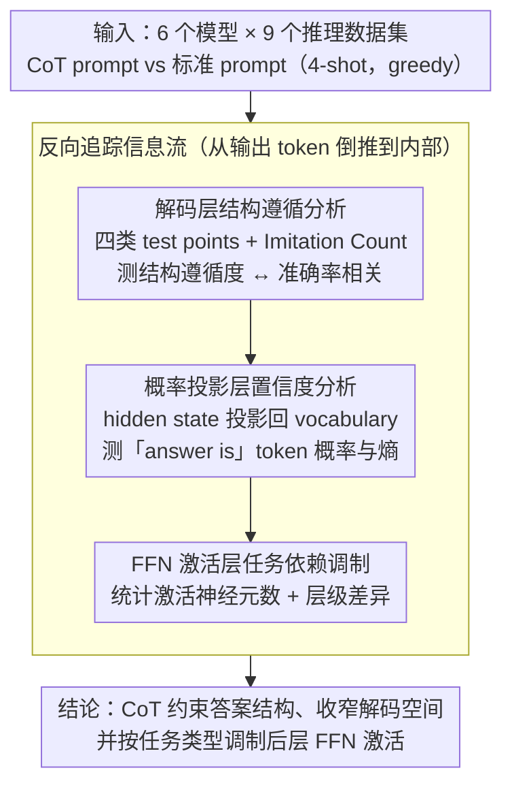

# How Chain-of-Thought Works? Tracing Information Flow from Decoding, Projection, and Activation

**会议**: ACL2026  
**arXiv**: [2507.20758](https://arxiv.org/abs/2507.20758)  
**代码**: https://github.com/How-Young-X/cot  
**领域**: LLM推理 / 机制可解释性 / Prompt分析  
**关键词**: Chain-of-Thought, 信息流追踪, decoding space pruning, neuron activation, mechanistic interpretability  

## 一句话总结
这篇论文从解码、概率投影和 FFN 激活三个层面反向追踪 CoT 的信息流，发现 CoT 可能主要通过约束答案结构、降低预测熵，并按任务类型调节神经元激活来提升推理表现，而不只是让模型“真的更会逻辑推理”。

## 研究背景与动机
**领域现状**：Chain-of-Thought prompting 已经是提升 LLM 多步推理能力的经典方法，在算术、常识和符号推理任务中都能带来明显收益。许多工作提出了 CoT 的变体，但 vanilla CoT 为什么有效仍缺少直接的机制证据。

**现有痛点**：已有解释常停留在行为层面，例如“CoT 降低任务复杂度”“模型模仿答案模板”“prompt 格式比逻辑内容更重要”。这些说法有直觉合理性，却很少把外部输出变化和模型内部概率/激活变化连起来。

**核心矛盾**：CoT 的最终文本看起来像推理，但这不等于模型内部真的按人类逻辑执行了推理。要理解 CoT，必须从输出 token 往回看：生成分布是否变窄、答案空间是否更集中、内部神经元是否以不同方式参与计算。

**本文目标**：建立一个信息流分析框架，从 decoding、projection、activation 三个阶段解释 CoT 如何改变模型行为，并回答 CoT 到底是在扩展推理能力，还是在约束输出空间和激活模式。

**切入角度**：作者选择 vanilla CoT、6 个 3B-70B 规模模型、9 个推理数据集，在相同 prompt 设置下比较 CoT 和 standard prompt，并把结果映射到关键词模仿、答案结构遵循、token 概率、熵和 FFN 激活上。

**核心 idea**：把 CoT 看成一种信息流调控器：它在解码层提供结构模板，在概率投影层收窄候选答案分布，在激活层按任务类型选择性减少或增加后层 FFN 神经元参与。

## 方法详解
论文没有提出新的推理模型，而是提出一个机制分析流程。它先看生成文本是否模仿 prompt 中的结构，再看这些结构是否导致概率分布更集中，最后看 FFN 层的激活数量和层间差异是否发生系统性变化。

### 整体框架

实验覆盖三类任务：算术推理包括 GSM8K、SVAMP、AQuA；常识推理包括 Bamboogle、StrategyQA、Date、Sports；符号推理包括 Coin Flip 和 Last Letters Concatenation。模型包括 LLaMA3.1 8B/70B、Gemma2 2B/9B/27B 和 LLaMA3.2-3B。所有实验使用 4-shot prompt，greedy decoding，最大生成长度为 300 token。

分析顺序是反向的：先看 decoding，也就是输出文本如何借用 prompt 和问题中的关键词；再看 projection，即 hidden state 投影到 vocabulary 后的 token probability 和 entropy；最后看 activation，即 FFN 中有多少 neuron 被激活，以及 CoT 与 standard prompt 的层级差异。

### 关键设计

**1. 解码层的结构遵循分析：检验 CoT 的收益究竟来自模板结构还是真逻辑**

已有解释多停留在「CoT 模仿答案模板」这种行为层直觉，却没把它量化。作者为此定义四类 test points——time、action、loc&peo、number，逐一统计生成文本里这些关键词是来自 prompt 还是来自问题本身；并进一步刻画 CoT reasoning structure，即「input entity 经过 operation 得到 generated entity，再接 final answer statement」这一固定骨架，用 Imitation Count 衡量生成结果对这套结构的遵循程度。设计的关键判据是：如果 CoT 的好处真来自结构模板，那么结构遵循度就该和任务准确率强相关——这比只看最终准确率更能解释「为什么 prompt 格式比逻辑内容更重要」。

**2. 概率投影层的置信度分析：看 CoT 是否真在收窄答案的解码空间**

文本上多输出几步解释，不等于模型在答案处更确定。作者把 hidden state 投影回 vocabulary，跟踪常见决策短语「answer is ...」的 token probability sequence，并用 KDE 对比 CoT 与 standard prompt 的概率分布；对 AQuA、Sports、Coin Flip 这类闭集答案空间，进一步取答案候选 token 的 top-k 概率并计算 entropy。判据是：若 CoT 确实在 prune 解码空间，那么生成答案 token 时概率应当更集中、熵应当更低，而不只是把中间文字写得更长。

**3. FFN 激活层的任务依赖调制：追问 CoT 是否改变了内部神经元的参与方式**

如果 CoT 只是输出格式变化，内部计算未必有系统差异。作者把 FFN 激活函数输出大于 0 的单元视为 activated neuron，统计生成过程中各层平均激活数量，并比较 CoT 与 standard prompt 的差值——总体激活量反映全局效率，layer-wise difference 揭示 CoT 主要作用在哪些层。结果恰恰发现差异并不均匀：它集中在后 1/3 层，且方向随任务类型相反——开放域任务后层多为负差（CoT 像剪枝器，减少激活帮模型聚焦），闭集任务后层多为正差（CoT 像放大器，增加激活帮模型更充分比较有限选项）。这说明 CoT 对内部处理方式有真实且任务依赖的影响，而非单纯的表层格式变化。

### 损失函数 / 训练策略

本文不训练新模型，也没有新的损失函数。所有模型都是预训练 LLM，在 standard prompt 与 CoT prompt 下做推理对比。关键测量包括：结构遵循度与准确率的 Pearson correlation 和 $R^2$；答案候选概率的 entropy；FFN 激活计数 $A_t^{(l)}$，即第 $t$ 个生成 token 在第 $l$ 层中 activation output 大于 0 的神经元数量；以及 CoT 与 standard prompt 的 layer-wise activation difference。

## 实验关键数据

### 主实验

| 数据集 | 答案空间 | LLaMA3.1-8B Standard Acc | LLaMA3.1-8B CoT Acc | 相对提升 |
|--------|----------|--------------------------|---------------------|----------|
| AQuA | 闭集选项 | 0.3110 | 0.4961 | +59.49% |
| Sports | Yes/No | 0.7497 | 0.9395 | +25.30% |
| Coin Flip | Yes/No | 0.4580 | 1.0000 | +118.34% |
| GSM8K | 开放数值 | 0.1774 | 0.7771 | +338.03% |
| Date | 格式化日期 | 0.4417 | 0.7100 | +67.4% |
| Last Letter Concat | 开放文本 | 0.0000 | 0.4496 | 缓存表中记为无穷大 |

这个表来自附录中 LLaMA3.1-8B 的结果。它说明在不同答案空间下，CoT 都能明显提升准确率；尤其 GSM8K 和 Last Letter 这类 standard prompt 很弱的任务，结构化中间步骤带来的相对收益最大。

### 消融实验

| 分析对象 | 缓存中给出的关键数值/现象 | 解释 |
|------|--------------------------|------|
| 结构遵循度与 GSM8K 准确率 | Pearson $r=0.75$ 到 $0.92$；4/5 个模型达到 $p<0.05$；$R^2=0.57$ 到 $0.84$ | 结构遵循度可以解释大量性能方差 |
| CoT token probability | CoT 的“answer is ...”概率分布比 standard prompt 更高且更集中 | CoT 收窄 decoding space，提高答案阶段信心 |
| 闭集答案 entropy | AQuA/Sports/Coin Flip 中，正确答案 entropy 低于错误答案，CoT 低于 standard prompt | CoT 让候选答案分布更尖锐 |
| 总体 FFN 激活 | LLaMA3.1-70B 在 AQuA 上 standard prompt 约激活 820K neurons，CoT 约 790K | CoT 在部分任务中减少无关激活，形成更聚焦处理 |
| 层级激活差异 | 差异主要集中在后 1/3 层；开放域任务后层多为负差，闭集任务后层多为正差 | CoT 在开放域像 pruner，在闭集任务像 amplifier |

### 关键发现

- CoT 不只是让模型输出更长文本，而是让生成更接近特定 reasoning structure。结构遵循越强，GSM8K 准确率越高。
- Projection 层的证据支持 decoding space pruning：CoT 下答案 token 的概率更集中，闭集任务的答案熵更低。
- Activation 层呈现任务依赖性：开放域任务中 CoT 倾向减少后层激活，可能帮模型聚焦；闭集任务中 CoT 倾向增加后层激活，可能帮模型更充分比较有限选项。

## 亮点与洞察
- **解释 CoT 的角度更可操作**：论文没有泛泛说 CoT 帮助推理，而是把效果分解成结构遵循、概率集中和激活调制三个可测现象。
- **“结构比逻辑内容更关键”的证据更强**：结构遵循与准确率的高相关说明，CoT 的一部分收益来自把输出路径约束进稳定模板，而不是每一步自然语言都必须逻辑完全可信。
- **任务依赖激活很有启发**：同样是 CoT，在开放域任务中像剪枝器，在闭集任务中像放大器。这说明后续 prompt 或 inference 优化不应假设 CoT 对所有任务有统一机制。
- **对高效推理有实际意义**：如果 CoT 的关键在于结构和答案空间约束，那么可以设计更短、更结构化的 prompt，或只在需要的后层/阶段触发增强，而不是盲目拉长 chain。

## 局限与展望

- **相关性还不是因果证明**：作者明确指出，结构遵循与准确率、CoT 与激活差异之间虽然有强证据，但仍是启发式或相关性解释，不能完全证明具体神经机制导致了性能提升。
- **解释粒度仍碎片化**：研究分别分析 decoding、projection、activation，但还没有把三者组成一个严格统一的因果链。不同层面之间如何相互驱动仍需更强干预实验。
- **模型内部仍是黑箱**：单个 FFN neuron 的功能、高维表示含义和跨层信息流仍然难以确定。用 activated count 只能看粗粒度参与程度，无法直接说明具体知识或算法在哪里执行。
- **任务覆盖有限**：实验集中在 vanilla CoT 和典型推理 benchmark。对 self-consistency、tool-augmented CoT、agentic planning 或长上下文复杂任务，机制可能不完全相同。

## 相关工作与启发
- **vs CoT 行为分析**：早期工作观察到 CoT 能提升准确率或模仿模板，本文进一步把模板模仿量化为 test points 和 Imitation Count，并与准确率建立统计联系。
- **vs 机制可解释性研究**：已有工作分析 FFN 记忆、reasoning neurons、activation sparsity 和 logit lens；本文把这些思路用于 CoT，重点追踪 prompt 如何改变输出概率和 FFN 激活。
- **vs prompt format 研究**：Madaan 等工作认为格式和结构会影响 CoT 效果，本文给出了更直接的 decoding/projection/activation 证据。
- **对 prompt 设计的启发**：与其追求更长 CoT，不如设计与任务答案空间匹配的结构模板；对闭集任务可强调选项比较，对开放域任务可强调分步剪枝和中间实体约束。

## 评分
- 新颖性: ⭐⭐⭐⭐ 从三个信息流阶段系统分析 CoT，尤其任务依赖激活发现较有新意。
- 实验充分度: ⭐⭐⭐⭐ 覆盖 6 个模型和 9 个数据集，分析维度多；但部分核心结果以图形/趋势呈现，表格化数值不够完整。
- 写作质量: ⭐⭐⭐⭐ 叙事清晰，局限性诚实；但部分公式和表格编号在缓存文本中略显混乱。
- 价值: ⭐⭐⭐⭐ 对理解 CoT 和设计更高效 prompt 很有帮助，适合作为机制解释方向的参考。

<!-- RELATED:START -->

## 相关论文

- [\[ICML 2026\] How Far Ahead Do LLMs Plan? Uncovering the Latent Horizon in Chain-of-Thought Reasoning](../../ICML2026/llm_reasoning/how_far_ahead_do_llms_plan_uncovering_the_latent_horizon_in_chain-of-thought_rea.md)
- [\[CVPR 2026\] Rationale-Enhanced Decoding for Multi-modal Chain-of-Thought](../../CVPR2026/llm_reasoning/rationale-enhanced_decoding_for_multi-modal_chain-of-thought.md)
- [\[ACL 2026\] AIM-CoT: Active Information-driven Multimodal Chain-of-Thought for Vision-Language Reasoning](aim-cot_active_information-driven_multimodal_chain-of-thought_for_vision-languag.md)
- [\[ACL 2026\] Reasoning Fails Where Step Flow Breaks](reasoning_fails_where_step_flow_breaks.md)
- [\[ICLR 2026\] AIMCoT: Active Information-driven Multimodal Chain-of-Thought for Vision-Language Reasoning](../../ICLR2026/llm_reasoning/aimcot_active_information-driven_multimodal_chain-of-thought_for_vision-language.md)

<!-- RELATED:END -->
