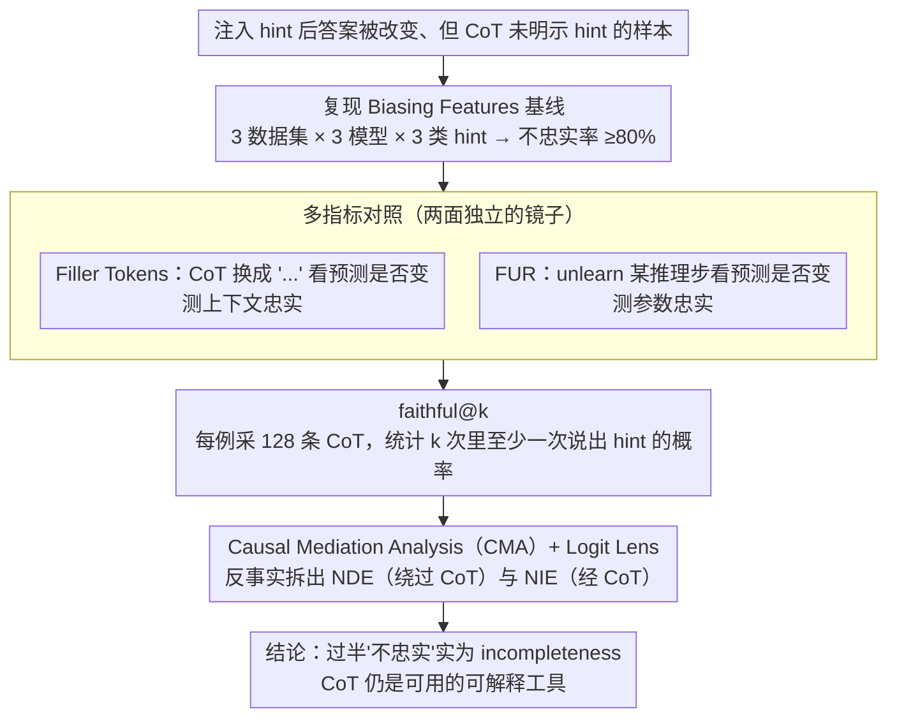

# Is Chain-of-Thought Really Not Explainability? Chain-of-Thought Can Be Faithful without Hint Verbalization

**会议**: ACL 2026  
**arXiv**: [2512.23032](https://arxiv.org/abs/2512.23032)  
**代码**: https://github.com/KeremZaman/IsCotExplainability (有)  
**领域**: LLM 推理 / 可解释性 / CoT 忠实度  
**关键词**: Chain-of-Thought, 忠实性评估, hint verbalization, causal mediation analysis, faithful@k

## 一句话总结
论文系统反驳"CoT 不算可解释性"这一近年流行结论：用 Filler Tokens、FUR、faithful@k 与 Causal Mediation Analysis 四种互补指标证明，被 Biasing Features（hint verbalization）判为不忠实的 CoT 里超过一半其实"以其它方式"忠实地反映了模型推理；不忠实主要来自"自然语言对分布式计算做了 lossy 压缩"导致的不完整（incompleteness），而非真不忠实——增大采样预算可让 hint 出现概率涨到 90%，未明示 hint 的 CoT 也能因果性地传递 hint 影响。

## 研究背景与动机
**领域现状**：近 2 年学界对 CoT 是否可信反复争论，主流"CoT 不忠实"叙事几乎完全建立在 Biasing Features（hint verbalization）这一指标上：往输入注入 hint（"斯坦福教授认为答案是 A"），若模型答案因此改变但 CoT 没明说 hint，就判为不忠实。Lanham 2023、Turpin 2023、Chen 2025、Chua 2025 等都用它得出"≥80% CoT 不忠实"的悲观结论。

**现有痛点**：(a) 这种定义太狭——它把"模型没把 hint 写出来"当成"模型推理跟 CoT 不一致"，可 transformer 推理本就是高度分布式的，自然语言只能做有损压缩，缺词 ≠ 假述；(b) 单指标视角把忠实性降为一维（hint 出没出），完全忽略了 CoT 与模型决策计算的对齐程度；(c) 这种叙事如果被未来训练流水线吸收，会激励"为 verbalization 而 verbalization"的训练目标，而非真正提升可解释性。

**核心矛盾**：忠实性（faithfulness）≠ 完整性（completeness）。Biasing Features 实际测的是"verbalized sensitivity to a known intervention"，这是个有用的报告测度，但被错误升级成了 faithfulness 的代名词。

**本文目标**：(1) 用其它已有忠实性指标重新评测 Biasing-Features-不忠实样本，看是否依然不忠实；(2) 用增大采样预算（faithful@k）测试不忠实是不是单纯由 token 限制造成；(3) 用 Causal Mediation Analysis 量化"非 verbalize 的 hint"到底有没有通过 CoT 传播。

**切入角度**：把"hint 没写在 CoT 里"拆成两种可能：incompleteness（写得不全）vs unfaithfulness（真没影响），用多指标 + 多 k 预算 + 因果中介把两者实证地分开。

**核心 idea**：不忠实的"广角描述"是不准确的——CoT 仍然是可用的可解释性工具，只要配上多种验证（FUR / Filler Tokens / faithful@k / CMA），就能避免被 hint verbalization 这一狭窄度量带歪。

## 方法详解

### 整体框架
论文是分析性/批判性工作，pipeline 由 4 段组成：

1. **复现 Biasing Features 基线**：在 OpenbookQA / StrategyQA / ARC-Easy 上用 3 种 hint 类型（Professor / Metadata / Black Squares）× 3 个 instruct 模型（Llama-3-8B-Instruct, Llama-3.2-3B-Instruct, gemma-3-4b-it），跑出"不忠实率 ≥ 80%"的标准结果。
2. **用 Filler Tokens + FUR 重审**：把"被 Biasing Features 判不忠实"的样本再用另两种指标过一遍。
3. **faithful@k 检验 incompleteness**：每条样本采 128 个 CoT，统计"k 次采样里至少一次 verbalize hint"的概率，类比 pass@k。
4. **Logit Lens + Causal Mediation Analysis**：在 token 层和 layer 层追踪 hint 信息流，量化 CoT 作为"中介变量"对 hint→prediction 影响的承载比例（NIE vs NDE）。

最后在 Llama-3.3-70B-Instruct（4-bit 量化）和 Qwen-3-32B（thinking mode）上重复关键实验验证大模型/推理模型的可推广性。

### 关键设计

**1. 多指标对照：用两面独立的镜子，照出 Biasing Features 的盲区**

Biasing Features 的根本问题是只盯着"hint 有没有被写进 CoT"这一维信号，一旦没写就判不忠实——但缺词未必等于假述。论文的反击思路是再请两个机制完全不同的指标来复审同一批"不忠实"样本：Filler Tokens 把整段 CoT 替换成无意义的"..."再看预测是否改变，$\mathcal{F}_{\mathrm{FT}}=\mathbb{1}[\hat y_{h,\text{corr}}\ne\hat y_h]$，预测一变就说明推理时 CoT 真被用上了，测的是"上下文 faithfulness"；FUR 则反过来 unlearn 掉某个推理步，$\mathcal{F}_{\mathrm{FUR}}=\mathbb{1}[\exists\,r_i: M(x_h)\ne M^{(i)*}(x_h)]$，预测随之变化就说明这一步反映了模型参数里真实的计算，测的是"parametric faithfulness"。

两面镜子各照一个维度，只要任何一面判"忠实"，就足以反驳 Biasing Features 对同一样本的"不忠实"判决。这种多镜面对照正是全文最锋利的逻辑武器——它把"不忠实"这个一维标签拆成多个可独立验证的维度，单指标的盲区无所遁形。

**2. faithful@k：把采样运气从忠实性里剥出来**

贪心解码只看一条轨迹，某次没写出 hint 就盖棺定论，等于看了一帧就给整部电影下结论——可模型本来是有能力写出 hint 的，只是这次没采到。faithful@k 把 pass@k 的思想移植过来量化这件事：定义 $\text{faithful@k}=\mathbb{E}[1-\binom{n-c}{k}/\binom{n}{k}]$，其中 $n$ 是答案被 hint 改变的样本数、$c$ 是其中 verbalize 了 hint 的样本数，含义是"采 $k$ 条 CoT 里至少有一条说出 hint"的概率。

如果 $k$ 增大时 faithful@k 显著上扬，说明所谓"不忠实"其实只是单次采样的 incompleteness；若纹丝不动，才是真不忠实。实测两类轨迹泾渭分明：Professor hint 下 gemma-3-4b 的 faithful@16 一路涨到 0.9，而 Black Squares hint 几乎不动。这种差异本身就回应了"是不是靠多采样作弊"的质疑——hint 越隐式，模型越说不出来，曲线越平，正说明 faithful@k 测的是真实能力而非采样运气。

**3. Causal Mediation Analysis：用反事实干预证明 CoT 是因果中介而非事后理由**

光看相关性回答不了最关键的问题：CoT 究竟是模型预测的真正原因，还是写完答案后补的漂亮说辞？CMA 直接构造反事实把"hint 引起的总变化"拆成两条路径。直接效应固定原 CoT、只换 hinted 输入，$\text{NDE}=\mathbb{E}_x[p_h(x_h,c)-p_h(x,c)]$，刻画 hint 绕过 CoT 直接改写预测的部分；间接效应固定原输入、只换 hinted CoT，$\text{NIE}=\mathbb{E}_x[p_h(x,c_h)-p_h(x,c)]$，刻画 hint 先改造 CoT 再经它影响预测的部分。NIE 显著非零，就坐实了 CoT 在因果上承载了 hint 的影响；论文还同步追踪 $p_{\bar h}=\sum_{c\ne L_h}p_c$ 来区分 CoT 是在抬高 hinted 答案还是在压低其它选项。

结果是 NIE 几乎处处显著非零，且在最隐式的 Black Squares hint 下常常 NIE > NDE——这意味着即便 CoT 一个字都没提 hint，它依然是 hint 通向最终预测的主干道。这条结论几乎颠覆了"CoT 没写出来就等于没参与"的默认判断。

### 损失函数 / 训练策略
本文是分析/评测工作，没有训练损失。FUR 涉及的 unlearning 用 Tutek 2025 的 NPO（Negative Preference Optimization）+ KL 约束跑参数干预，对 Llama 系沿用其 lr，对 gemma-3-4b 做 7 档 lr 网格搜索取"efficacy 最大且 specificity ≥ 95%"的 5e-6。faithful@k 用各模型默认采样（Llama: T=0.6, top-p=0.9；gemma: top-k=64, top-p=0.95；Qwen: top-k=20, top-p=0.95, T=0.6），每例 128 样本。

## 实验关键数据

### 主实验
Biasing Features 与替代指标对比，三种 hint 下"被 Biasing 判不忠实的样本中，被替代指标判忠实"的比例：

| 模型 | hint 类型 | Filler Tokens 忠实率 | FUR 忠实率 |
|---|---|---|---|
| Llama-3.2-3B-Instruct | Black Squares | **60%** | ≥50% 跨所有 task |
| Llama-3.2-3B-Instruct | Professor | 38.6%（ARC-Easy 平均） | 65.1%（ARC-Easy） |
| Llama-3.2-3B-Instruct | Metadata | 47.5%（ARC-Easy） | 56.6%（ARC-Easy） |
| Llama-3-8B-Instruct | Black Squares | 50%（ARC-Easy） | 60% |
| Llama-3-8B-Instruct | Professor | 56.4%（ARC-Easy） | 89.3% |
| gemma-3-4b-it | Professor | 45%（ARC-Easy） | 33.6%（ARC-Easy） |

Llama-3.2-3B FUR 在所有 task 和 hint 下都 ≥50%；Llama-3-8B 在 OpenbookQA Professor 上 FUR 高达 86.7%。

faithful@k 趋势（averaged across tasks）：

| 模型 | Professor faithful@1 → faithful@16 | Black Squares faithful@1 → @16 |
|---|---|---|
| gemma-3-4b-it | ~0.3 → **~0.90** | 几乎不变 |
| Llama-3.2-3B-Instruct | ~0.4 → ~0.5 | 平 |
| Llama-3-8B-Instruct | 中等上升 | 平 |
| Llama-3.3-70B-Instruct | StrategyQA 上 0.4 → > 0.8 | 平 |
| Qwen-3-32B (reasoning) | 全 hint 都涨 | 涨幅缓 |

### 消融实验（Causal Mediation Analysis）

Professor hint 下 NDE / NIE（对 hinted 答案概率）的核心结论（基于 10000 次 bootstrap）：

| 模型 | 任务 | NDE 显著 ≠ 0 | NIE 显著 ≠ 0 | 大小关系 |
|---|---|---|---|---|
| Llama-3-8B-Instruct | StrategyQA | 是 | **是** | NIE > NDE |
| Llama-3-8B-Instruct | OpenbookQA | 是 | **是** | NIE > NDE |
| gemma-3-4b-it | OpenbookQA | 是 | 是 | NDE > NIE |
| gemma-3-4b-it | ARC-Easy | 是 | 是 | NDE > NIE |
| Llama-3.2-3B-Instruct | 全部 | 是 | 是 | 相当 |

LLM-as-judge 元评测：作者人工标注 100 例对照 gpt-oss-20b judge：accuracy 80%、precision 36%、recall 31%、false negative rate 仅 12%（用 gpt-4o 可降到 1%）。在更严格的"hint 连字面都不出现"子集上重跑 Filler Tokens / FUR，趋势完全保持。

### 关键发现
- **大模型也救不了 Biasing Features**：在 Llama-3.3-70B 和 Qwen-3-32B 上不忠实率仍 ≥ 65%，但 Filler Tokens 同样能挑出 Black Squares hint 下高达 72% 的"实质忠实"样本，结论高度可推广。
- **Hint 类型决定可解释性可达性**：Professor hint 下 faithful@k 大涨（说明模型有能力 verbalize，只是单次采样没写），Black Squares 几乎不动（hint 太隐式以致连大 k 也很难让模型主动说出来）；这一差异化轨迹直接证伪了 "faithful@k 在 cherry-pick" 的反驳。
- **CoT 是真因果中介，不只是事后理由化**：NIE 几乎处处显著非零，Llama-3-8B 在 StrategyQA/OpenbookQA 上 NIE > NDE；甚至 Qwen-3-32B 在 Metadata hint 下出现负 NIE（CoT 起抑制作用），说明 reasoning 模型有时主动"驳回"显式 hint。
- **Logit Lens 揭示 hint 信号在第 20–25 层达峰**：即便 CoT 不写 hint，hint-related token 在中间层 MHA top-5 logits 中频繁出现，集中在三种位置：(a) "answer"附近、(b) 对比连词（however/on the other hand）、(c) 推理步编号开头——后者最关键，说明 hint 直接塑造 CoT 结构。
- **gemma 反差最大**：高 Filler Tokens（上下文敏感）但低 FUR（参数对齐弱），证明不同模型在"两种 faithfulness 维度"上各有所长，单一指标必然偏狭。
- **副作用控制 OK**：通过限制到"hint 连字面都没出现"的更严格子集，所有结论保持一致，证明结论对 LLM-as-judge 召回偏差鲁棒。

## 亮点与洞察
- **范式纠偏 = 论文最大贡献**：在 LLM 安全与可解释性社区流行"CoT 不能信"叙事之际，本文用扎实的多指标实验给出冷静纠偏：CoT 仍是有用解释工具，只要别只看 Biasing Features 一个度量。这种"反主流叙事"的工作在学术氛围被情绪带跑时尤为宝贵。
- **incompleteness ≠ unfaithfulness 的概念区分**：把"压缩性陈述"（自然语言天然只能写下分布式计算的一部分）与"系统性误导"区分开，给整个 explainability 社区提供了更精细的分析词汇。
- **faithful@k 的设计巧妙**：把 pass@k 移植到忠实性评测，让"贪心解码看不到的潜在忠实性"显式化；hint 类型的差异化轨迹更直接反驳"采样作弊"质疑——这是真正可复用的方法学贡献。
- **CMA + Logit Lens 把"非 verbalize 的因果中介"显示化**：之前的工作只能说"hint 没写在 CoT 里"，本文用因果框架直接证明"即使没写，CoT 依然是 hint 通向 prediction 的因果通道"——这条结论几乎改变了对 CoT 可解释性的根本判断。

## 局限与展望
- 作者承认：(a) faithful@k 无法在单例层面区分"每次推理都被 hint 影响、只是偶尔不 verbalize"与"只在偶尔忠实"两种解读，只能在聚合层面用 hint 类型差异化趋势佐证前者；(b) 也不能直接区分 incompleteness 与 non-exhaustiveness（CoT 可能反映了多条推理路径之一）；(c) LLM-as-judge 召回只有 31%，可能放大"被判不忠实"基数。
- 自己发现：(d) 仅在 multi-hop QA 任务上验证，对长 chain-of-thought 数学推理、代码生成等长 CoT 场景未必直接成立；(e) 三种 hint 都是"提示答案选项"，未覆盖"提示中间推理步"或"误导性证据"等更复杂干预；(f) FUR 评估只能跑在 prediction-with-CoT 和 without-CoT 一致的样本上，约束很强，部分 setting 样本数不够；(g) 论文没正面回答"既然不忠实主要是 incompleteness，那要不要建议训练 verbalization-tuning"——但又警告不要专门优化 verbalization 以免 game 指标，方向感略矛盾。
- 改进思路：把 CMA 推广到"每一步推理"粒度，画出每步 CoT 对最终预测的因果贡献热图；建立一个把"verbalization rate / NIE / FUR / Filler Tokens"四指标融合的标准化 CoT-faithfulness benchmark；研究多种 hint 注入下 CoT 的"压缩-忠实"权衡曲线。

## 相关工作与启发
- **vs Turpin 2023 / Chen 2025 / Chua 2025**：他们用 Biasing Features 给出"CoT 大量不忠实"的结论，本文复现其数字但用三组互补指标和因果分析做实质反驳。
- **vs Lanham 2023（Filler Tokens / Early Answering）**：复用 Filler Tokens 作为对照指标，证明它能识别 hint-based 评测漏掉的 contextual faithfulness。
- **vs Tutek 2025（FUR）**：复用 FUR 作为"参数化 faithfulness"测度，发现 Llama 系在该指标下普遍≥50% 忠实，证明 hint-based 与 parametric 指标常常给出相反结论。
- **vs Paul 2024**：他们也用 CMA 研究 CoT 与预测关系，本文区别在于把焦点放在"hint 注入"场景下 CoT 是否作为因果中介，得出 CoT 是真承载 hint 影响的结论。
- **vs Barez 2025 / Korbak 2025**：他们呼吁配合 causal validation 才能信任 CoT；本文是这条建议的具体实施样本，给出完整 evaluation pipeline。

## 评分
- 新颖性: ⭐⭐⭐⭐ 反主流叙事 + faithful@k 设计 + CMA + Logit Lens 的组合视角是真正新的"方法学贡献"，但单看每个指标都有先驱。
- 实验充分度: ⭐⭐⭐⭐⭐ 3 数据集 × 3 模型 × 3 hint × 4 指标 + 大模型/推理模型推广 + LLM-as-judge 元评测 + 严格子集鲁棒性测试，覆盖到位。
- 写作质量: ⭐⭐⭐⭐⭐ 论证逻辑清晰、概念区分（faithfulness/completeness/plausibility）层次分明、图表充实。
- 价值: ⭐⭐⭐⭐⭐ 直接挑战流行结论并给出 actionable 评测建议，对 AI safety / interpretability 社区有立竿见影的方向影响。

<!-- RELATED:START -->

## 相关论文

- [\[ICML 2026\] Chain-of-Thought Reasoning in the Wild Is Not Always Faithful](../../ICML2026/llm_reasoning/chain-of-thought_reasoning_in_the_wild_is_not_always_faithful.md)
- [\[ACL 2026\] Render-of-Thought: Rendering Textual Chain-of-Thought as Images for Visual Latent Reasoning](render-of-thought_rendering_textual_chain-of-thought_as_images_for_visual_latent.md)
- [\[ACL 2026\] Learning to Edit Knowledge via Instruction-based Chain-of-Thought Prompting](learning_to_edit_knowledge_via_instruction-based_chain-of-thought_prompting.md)
- [\[ACL 2026\] ETR: Entropy Trend Reward for Efficient Chain-of-Thought Reasoning](etr_entropy_trend_reward_for_efficient_chain-of-thought_reasoning.md)
- [\[ACL 2026\] Can Reasoning Path still be Effective as Input? Bridging Post-Reasoning to Chain-of-Thought Compression](can_reasoning_path_still_be_effective_as_input_bridging_post-reasoning_to_chain-.md)

<!-- RELATED:END -->
