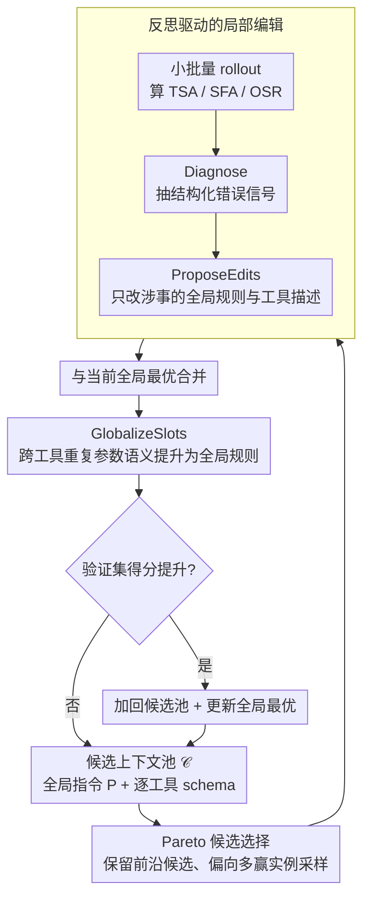

# JTPRO: A Joint Tool-Prompt Reflective Optimization Framework for Language Agents

**会议**: ACL 2026  
**arXiv**: [2604.19821](https://arxiv.org/abs/2604.19821)  
**代码**: 无  
**领域**: LLM推理  
**关键词**: 工具调用优化, 提示词优化, 反思学习, 大工具库, 联合优化

## 一句话总结
JTPRO 提出了一种无需模型微调的联合优化框架，通过反思驱动的迭代编辑同时优化全局指令和逐工具的 schema/参数描述，在大规模工具库场景下显著提升工具选择和参数填充的端到端成功率，相比 GEPA 等基线在 OSR 上提升 5%–20%。

## 研究背景与动机

**领域现状**：LLM Agent 通过外部工具扩展能力已成为主流范式，但当工具数量增长到数百甚至上千时，工具调用的可靠性急剧下降。现有方法包括微调、检索增强、提示优化等，但大多分别处理全局指令和工具描述。

**现有痛点**：当工具库变大时，存在两个核心问题：(1) 通用的全局提示无法区分相似工具，导致工具选错（tool mis-selection）；(2) 工具 schema 描述不够精确，导致参数实例化错误（slot/value errors）。作者在 ToolACE 上的实验显示，工具数从 300 扩展到 1000 时，即使使用 GPT-5 级别的模型，工具选择准确率也会显著下降。

**核心矛盾**：全局指令和工具局部描述之间存在耦合依赖——全局策略依赖工具间的区分线索，而参数填充依赖全局约定（如日期格式、数值范围）。单独优化其中任一方面都不够。

**本文目标**：设计一个无需模型微调、可迭代优化全局指令 $P$ 和逐工具 schema $\{T_i\}$ 的框架，使 Agent 在大规模工具库下的调用级正确性（工具+参数+值）最大化。

**切入角度**：作者观察到端到端成功率的瓶颈往往在参数填充（slot filling）而非工具选择，并且许多参数语义（如日期格式、布尔标志）在多个工具之间重复出现，可以通过全局化来消除冗余和不一致。

**核心 idea**：通过 Pareto 候选选择 + 反思驱动的局部编辑 + 共享参数语义全局化，联合迭代优化 Agent 的全局指令和逐工具描述。

## 方法详解

### 整体框架
JTPRO 维护一个候选上下文池 $\mathcal{C}$，每次迭代：(1) 通过 Pareto 采样选一个候选；(2) 在小批量数据上做 rollout 获取诊断反馈；(3) 基于反馈提出对全局指令 $P$ 和相关工具 schema $\{T_i\}$ 的局部编辑；(4) 将编辑后的版本与当前最佳合并；(5) 全局化重复的参数语义；(6) 验证后更新候选池和全局最优。

### 关键设计

**1. Pareto 候选选择：不押单一最优，保住探索多样性**

文本空间的迭代优化最容易犯的错是早早收敛到一个局部最优的上下文，后面怎么改都跳不出来。JTPRO 借鉴 GEPA 的 Pareto 思想来对冲这一点：候选池里只要某个上下文在至少一个训练实例上拿到过最优分，就保留它，被其它候选严格支配的才剪除；随后以偏向"赢得更多实例"的概率从这批前沿候选里采样作为本轮起点。这样既不会被单一全局最优锁死，又让历史上各有所长的版本都有机会被继续打磨，探索面始终是张开的。

**2. 反思驱动的局部编辑：只动出错的那几条规则，不推倒重写**

工具库一大，失败模式五花八门——选错工具、漏填参数、格式或取值错——粗暴地整段重写提示只会让上下文越滚越长、还容易把原本对的地方改坏。JTPRO 的做法是先在小批量上 rollout，对每个失败样本用 Diagnose 函数抽出结构化错误信号（工具混淆 / 缺失参数 / 格式值错误），再由反思器 ProposeEdits 据此生成定向编辑：哪条全局规则、哪个工具或参数描述导致了这次失败，就只改那几处。把修改严格约束在"涉事局部"，既精准消除了具体病因，又避免了上下文膨胀，让每轮迭代都是外科手术式的小改而非大动干戈。

**3. GlobalizeSlots：把跨工具重复的参数语义抽成一条全局规则**

当工具数上千，大量参数语义其实在反复出现——日期格式、数值边界、布尔标志、排序约定，在 ETID 数据集里像标识符、日期时间这样的参数族跨多达 77/124 个工具重复出现。如果每个工具的 schema 都各写一遍，不仅文本冗余、挤占了本该用来区分相似工具的描述空间，还容易出现彼此不一致的隐患。GlobalizeSlots 识别出这些共享语义，把它们提升为全局指令里的命名规则（如统一的 "DateTime Fields"），工具局部只留一个短指针引用 startDate、endDate 之类字段。一次提升，多处一致，既强制了语义统一、压掉了潜在冲突，又把腾出来的 schema 空间还给工具特有的区分线索——这恰好对准了论文发现的真正瓶颈：参数填充（SFA）而非工具选择才是端到端成功率的关键。

### 损失函数 / 训练策略
优化目标是最小化调用级损失，包含工具选择、参数填充和整体成功率三个分量。整个过程无需梯度更新，完全在文本空间迭代优化。

## 实验关键数据

### 主实验

| 模型 | 工具数 | 方法 | TSA(%) | SFA(%) | OSR(%) |
|------|--------|------|--------|--------|--------|
| GPT-5 | 500 | Base | 73.02 | 84.79 | 62.73 |
| GPT-5 | 500 | GEPA | 77.17 | 85.75 | 66.12 |
| GPT-5 | 500 | **JTPRO** | **82.28** | **90.00** | **74.38** |
| GPT-5 | 1000 | Base | 67.66 | 87.35 | 62.37 |
| GPT-5 | 1000 | GEPA | 75.13 | 86.40 | 67.77 |
| GPT-5 | 1000 | **JTPRO** | **78.72** | **89.26** | **73.55** |
| o3-mini | 1000 | Base | 58.92 | 85.04 | 51.27 |
| o3-mini | 1000 | **JTPRO** | **71.48** | **87.46** | **64.46** |

### 消融实验（ETID 数据集）

| 配置 | 说明 |
|------|------|
| 仅优化全局指令 P | 缺少工具级区分，OSR 较低 |
| 仅优化工具 schema T | 缺少全局约定，OSR 较低 |
| **联合优化 P+T (JTPRO)** | 互补增益，OSR 最优 |

### 关键发现
- **联合优化优于单独优化**：分别只优化指令或只优化工具 schema 都不如联合优化，验证了两者之间的耦合依赖
- **1000 工具场景增益最大**：工具库越大、混淆越多，JTPRO 的优势越明显（o3-mini 在 1000 工具下 OSR 提升 +13.2 个百分点）
- **SFA 是 OSR 的关键瓶颈**：在 ETID 等复杂 schema 数据集上，参数填充正确性对端到端成功率的贡献远大于工具选择
- **全局化减少冗余并提升一致性**：GlobalizeSlots 步骤不仅缩减了 schema 长度，还通过统一语义提升了参数填充准确率

## 亮点与洞察
- **联合优化的必要性论证**很有说服力：通过 Figure 1 清楚展示了 SFA 驱动 OSR，通过 Figure 2 展示了工具扩展导致的性能下降，为联合优化提供了强动机
- **GlobalizeSlots 的设计**非常实用——在企业级工具库中，大量参数语义重复（日期、ID、布尔值），将它们提升为全局规则是一个简洁有效的工程 trick，可以迁移到任何多工具 Agent 系统
- **无需微调的优化范式**：完全在文本空间操作，对闭源模型同样适用，这在实际部署中很有价值

## 局限与展望
- 仅评估了单轮工具调用场景，未涉及多轮对话中的工具链调用
- 依赖高质量标注的 tool-call traces 进行反思优化，冷启动成本较高
- 未考虑动态工具增删场景下的增量优化效率
- 可以探索与检索增强方法的更深度结合，以及向多步规划场景的扩展

## 相关工作与启发
- **vs GEPA**: GEPA 也用 Pareto 选择和反思优化，但只优化全局指令，不触及工具 schema。JTPRO 扩展到联合优化，在工具特定的区分和参数约束上有明显优势
- **vs DRAFT**: DRAFT 通过试错改进逐工具文档，但不优化全局策略。JTPRO 同时处理两层，避免了全局-局部不一致
- **vs MIPRO**: MIPRO 优化模块提示和示例，但不针对工具调用场景设计，缺少 slot-level 的诊断和全局化机制

## 评分
- 新颖性: ⭐⭐⭐⭐ 联合优化指令和工具 schema 的思路有价值，但整体框架是对 GEPA 的自然扩展
- 实验充分度: ⭐⭐⭐⭐⭐ 三个数据集、多个模型、详细消融、多种工具规模
- 写作质量: ⭐⭐⭐⭐ 问题定义清晰，但论文较长，部分内容有重复
- 价值: ⭐⭐⭐⭐ 对大规模工具调用场景有很好的实践指导意义

<!-- RELATED:START -->

## 相关论文

- [\[ICLR 2026\] Adaptive Social Learning via Mode Policy Optimization for Language Agents](../../ICLR2026/llm_reasoning/adaptive_social_learning_via_mode_policy_optimization_for_language_agents.md)
- [\[ICLR 2026\] ReForm: Reflective Autoformalization with Prospective Bounded Sequence Optimization](../../ICLR2026/llm_reasoning/reform_reflective_autoformalization_with_prospective_bounded_sequence_optimizati.md)
- [\[ICML 2026\] Diversity Over Frequency: Rethinking Tool Use in Visual Chain-of-Thought Agents](../../ICML2026/llm_reasoning/diversity_over_frequency_rethinking_tool_use_in_visual_chain-of-thought_agents.md)
- [\[ICLR 2026\] Estimating the Empowerment of Language Model Agents](../../ICLR2026/llm_reasoning/estimating_the_empowerment_of_language_model_agents.md)
- [\[ICLR 2026\] THOR: Tool-Integrated Hierarchical Optimization via RL for Mathematical Reasoning](../../ICLR2026/llm_reasoning/thor_tool-integrated_hierarchical_optimization_via_rl_for_mathematical_reasoning.md)

<!-- RELATED:END -->
