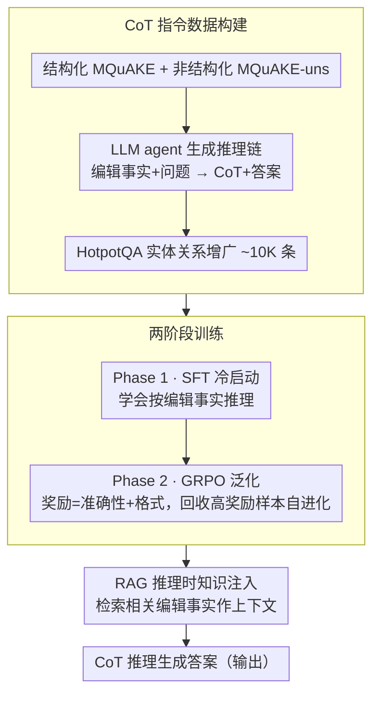

# Learning to Edit Knowledge via Instruction-based Chain-of-Thought Prompting

**会议**: ACL 2026  
**arXiv**: [2604.05540](https://arxiv.org/abs/2604.05540)  
**代码**: [https://github.com/FredJDean/CoT2Edit](https://github.com/FredJDean/CoT2Edit)  
**领域**: LLM推理 / 知识编辑  
**关键词**: 知识编辑, 思维链, GRPO, RAG, 多跳推理

## 一句话总结

CoT2Edit 提出通过 CoT 推理教 LLM 进行知识编辑的新范式——构建结构化和非结构化编辑的 CoT 指令数据，经 SFT 冷启动 + GRPO 优化训练，推理时结合 RAG 检索编辑事实，单次训练即在 6 个编辑基准上达到 SOTA 且具有强泛化能力。

## 研究背景与动机

**领域现状**：知识编辑旨在更新 LLM 中过时或错误的知识。主流方法包括上下文编辑（ICE/IKE）、参数修改（ROME/MEMIT/AlphaEdit）和训练-检索范式（LTE/EditCoT）。

**现有痛点**：(1) 定位-编辑方法（ROME/MEMIT）直接修改模型参数，与冻结的生产环境 LLM 不兼容，且存在"死记硬背"问题——精确查询能回答但语义等价查询失败；(2) LTE 不显式建模推理路径，要求单步生成正确答案易产生幻觉；(3) EditCoT 需要多模型流水线（一个生成 CoT、一个执行编辑），复杂且不可扩展；(4) 所有现有方法仅处理结构化事实三元组，忽略了新闻、文章等非结构化知识。

**核心矛盾**：现有方法将知识编辑视为"记住新事实"的记忆问题，而非"理解新事实并推理"的推理问题。SFT 容易过拟合训练分布，面对 OOD 编辑数据泛化差。

**本文目标**：构建一个单次训练即可泛化到多种编辑场景（结构化/非结构化、单跳/多跳）的知识编辑方法。

**切入角度**：将知识编辑重新定义为两阶段函数 $f_{\theta'}(e,q) = g_{\theta'}(h_{\theta'}(e,q))$——先生成可解释的推理链 $h$，再基于推理产出答案 $g$。SFT 提供冷启动，GRPO 提供泛化能力。

**核心 idea**：用 LLM agent 为结构化和非结构化编辑数据生成 CoT 指令，SFT 学习编辑推理范式，GRPO 增强对未见编辑场景的泛化能力，推理时 RAG 检索相关编辑事实。

## 方法详解

### 整体框架

三阶段：(1) 数据构建——从 MQuAKE（结构化）和 MQuAKE-uns（非结构化）生成 CoT 指令数据，从 HotpotQA 实体关系增广训练数据；(2) 训练——Phase 1 SFT 冷启动学习编辑推理模式，Phase 2 GRPO 在合并数据上增强泛化；(3) 推理——RAG 检索相关编辑事实，模型用 CoT 推理生成答案。

### 关键设计

**1. CoT 指令数据构建：把"记住新事实"改造成"基于事实逐步推理"**

现有方法只喂结构化三元组、还要求模型一步给出正确答案，既覆盖不到新闻文章这类非结构化知识，又因为缺少显式推理路径容易幻觉。CoT2Edit 让一个 LLM agent 把编辑事实和问题翻成可读的推理链：结构化数据上，agent 以编辑事实 $\mathcal{E}$ 和多跳问题 $\mathcal{Q}$ 为输入生成 $\text{Agent}(\mathcal{Q}, \mathcal{E}, \mathcal{T}) \to \text{CoT}, \mathcal{A}$；非结构化数据上，则先从编辑上下文 $\mathcal{C}$ 里抽出相关事实再推理，$\text{Agent}(\mathcal{Q}, \mathcal{C}, \mathcal{T}) \to \mathcal{E}, \text{CoT}, \mathcal{A}$。

为了让模型见过足够多样的推理形态，还借 HotpotQA 的实体关系合成约 10K 条额外指令数据做增广。这样训练集同时覆盖了结构化/非结构化两类编辑，且每条样本都自带一条把"新事实"推到"答案"的显式链路，从源头压低单步硬答带来的幻觉。

**2. 两阶段训练（SFT 冷启动 + GRPO 泛化）：先学会编辑推理的范式，再学会迁移到没见过的编辑**

纯 SFT 容易过拟合到训练里出现过的编辑模式，一遇到 OOD 的编辑数据就泛化崩掉。所以 Phase 1 先在 CoT 指令数据上做标准自回归 SFT，给模型一个"如何按编辑事实推理"的稳定冷启动；Phase 2 切到 GRPO，在合并数据上用奖励 $\mathcal{R} = \mathcal{R}_{acc} + \mathcal{R}_{format}$（答案准确性 + 含 think/answer 标签与关键词的格式）去探索多样的推理路径。

GRPO 还配了一个自进化策略：每轮把高奖励样本回收进下一轮训练集，$\mathcal{D}_{t+1} = \mathcal{D}_t \cup \{s \mid \mathcal{R}(s) > \theta\}$，让模型不断在自己已经能答好的难例上加强、加速收敛。消融里 GRPO 正是相对纯 SFT 的核心增益来源——RL 通过探索推理路径换来了对未见编辑场景的泛化，而不是死记训练分布。

**3. RAG 推理时知识注入：让知识库和推理能力彻底解耦**

如果把所有编辑事实都塞进参数，知识一更新就得重训，这对冻结的生产环境 LLM 不现实。CoT2Edit 在推理时对用户查询检索最相关的编辑事实，作为上下文交给模型，模型再用训练阶段学到的 CoT 推理能力基于这些事实作答。

这样模型只需一次性学会"如何基于给定事实推理"这件抽象能力，具体知道哪些事实则全交给可随时增删的外部知识库——知识存储和推理能力被拆成两件正交的事。也正因如此，单次训练得到的模型能直接泛化到 6 个未见编辑基准；消融里去掉 RAG 后性能下降，说明检索到的编辑事实是推理正确的关键输入。

### 损失函数 / 训练策略

SFT: 标准自回归交叉熵。GRPO: 准确性奖励 + 格式奖励（包含 think/answer 标签和关键词）。在 Llama-3.1-8B、Qwen-2.5-7B、DeepSeek-R1-Distill-Qwen-7B 上验证。

## 实验关键数据

### 主实验（6 个编辑基准上的综合表现）

| 方法 | Edit Succ | Paraphrase | Neighborhood | 适用范围 |
|------|-----------|-----------|-------------|---------|
| AlphaEdit | 88.78 | ~81 | ~70 | 仅结构化 |
| EditCoT | 86.13 | 83.55 | ~70 | 仅结构化 |
| **CoT2Edit** | **93.17** | **89** | **93** | 结构化+非结构化 |

### 消融实验

| 配置 | 效果 | 说明 |
|------|------|------|
| 仅 SFT | 过拟合，OOD 差 | 冷启动但泛化不足 |
| SFT + GRPO | 全面提升 | GRPO 是核心贡献 |
| 无数据增广 | GRPO 训练不充分 | 10K 增广数据很重要 |
| 无 RAG | 性能下降 | 检索提供关键编辑事实 |

### 关键发现

- 单次训练即泛化到 6 个未见编辑基准，证明模型学到了通用的"基于事实推理"能力
- 非结构化知识编辑准确率 92%（比 IKE 高约 20%）
- 在大规模编辑（20K-30K 事实 vs 传统 2K-3K）下仍保持 89% 改写和 93% 邻域成功率
- GRPO 是首次应用于知识编辑领域，自进化策略加速了收敛
- 首次将 GRPO 应用于知识编辑，证明 RL 在编辑泛化上优于纯 SFT

## 亮点与洞察

- 将知识编辑从"记忆问题"重新定义为"推理问题"——模型不需要记住所有编辑事实，只需学会如何基于给定事实推理。这个范式转换是根本性的
- SFT 冷启动 + GRPO 泛化的两阶段训练策略可迁移到其他需要 OOD 泛化的任务
- 自进化策略（收集高奖励样本加入训练）是一种简单但有效的数据增强方式

## 局限与展望

- RAG 检索质量直接影响编辑效果，检索不到相关事实时可能失败
- 训练数据规模约 13K，在更大规模下的 scaling 行为未验证
- 仅在 7-8B 模型上验证，更大模型可能有不同表现
- 编辑事实之间的冲突解决未显式处理

## 相关工作与启发

- **vs AlphaEdit/MEMIT**: 参数修改方法，不兼容冻结模型，且存在"死记硬背"问题。CoT2Edit 通过推理泛化到语义变体
- **vs EditCoT**: 需要两个独立 LLM（CoT 生成+编辑执行），CoT2Edit 用单模型完成。且 EditCoT 不支持非结构化编辑

## 评分

- 新颖性: ⭐⭐⭐⭐ 首次将 GRPO 用于知识编辑，推理范式替代记忆范式
- 实验充分度: ⭐⭐⭐⭐⭐ 6 个基准、3 个模型、多种编辑场景，分析全面
- 写作质量: ⭐⭐⭐⭐ 框架图清晰，方法描述完整
- 价值: ⭐⭐⭐⭐ 单次训练泛化到多场景的实用价值高

<!-- RELATED:START -->

## 相关论文

- [\[ECCV 2024\] Controllable Navigation Instruction Generation with Chain of Thought Prompting](../../ECCV2024/llm_reasoning/controllable_navigation_instruction_generation_with_chain_of_thought_prompting.md)
- [\[ACL 2026\] ETR: Entropy Trend Reward for Efficient Chain-of-Thought Reasoning](etr_entropy_trend_reward_for_efficient_chain-of-thought_reasoning.md)
- [\[ACL 2026\] Revisiting Entropy in Reinforcement Learning for Large Reasoning Models](revisiting_entropy_in_reinforcement_learning_for_large_reasoning_models.md)
- [\[ACL 2026\] TemplateRL: Structured Template-Guided Reinforcement Learning for LLM Reasoning](templaterl_structured_template-guided_reinforcement_learning_for_llm_reasoning.md)
- [\[ACL 2026\] Does Self-Consistency Improve the Recall of Encyclopedic Knowledge?](does_self-consistency_improve_the_recall_of_encyclopedic_knowledge.md)

<!-- RELATED:END -->
