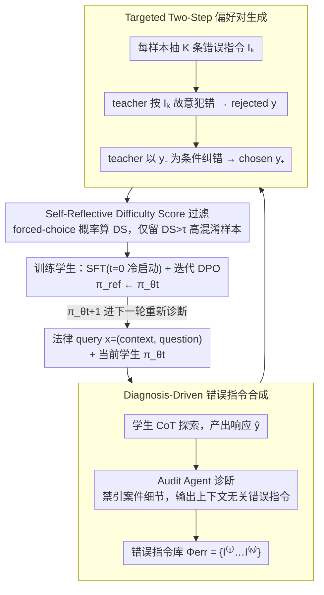

# LegalDrill: Diagnosis-Driven Synthesis for Legal Reasoning in Small Language Models

**会议**: ACL 2026  
**arXiv**: [2604.23809](https://arxiv.org/abs/2604.23809)  
**代码**: 待确认  
**领域**: 法律 / 小模型 / 知识蒸馏 / DPO  
**关键词**: 法律推理、SLM 蒸馏、诊断驱动合成、Difficulty Score、迭代 DPO

## 一句话总结
LegalDrill 用 Audit Agent 诊断 0.6B/1.7B 小模型在法律推理上的具体错误模式，让强 teacher（GPT-4o / Qwen3-30B）按错误指令"刻意复现+修正"生成偏好对，再用学生自己的 forced-choice 概率算 Difficulty Score 过滤掉它已会的样本，迭代 SFT+DPO 后 1.7B 学生在 LegalBench 多个子集上逼近 30B teacher。

## 研究背景与动机
**领域现状**：法律 LLM 在判决预测、合同问答、隐私政策蕴含等任务上需求强烈，但法律文档天然敏感，不能调外部 API（GPT/Gemini）或云 RAG。结果就是只能本地部署，30B+ 的开源 LLM 又太贵，行业实际可用的是 **<3B 的 SLM**（Qwen3-0.6B/1.7B 这类）。

**现有痛点**：SLM 在法律推理上"文采像律师，逻辑像新手"——常把法条解读错、做逻辑跳跃，导致最终 yes/no 判断错。直接拿强 LLM 的 CoT 轨迹做 SFT 也不行，因为强 LLM（尤其 RL 对齐过的 o1/DeepSeek-R1 系）的链路冗长、爱自我反思、爱探索备选，SLM 容量塞不下也学不会。

**核心矛盾**：法律 SFT 数据极贵（要专业律师标注），而标准 rejection sampling（按 final verdict 是否对来选）粒度太粗——它告诉你"哪条对"但不告诉你"为什么错"，更生成不出 SLM 真正能学会的"短而精"的推理链。本质是 teacher 行为分布 ≠ student 能学的分布。

**本文目标**：(1) 把 teacher 的隐性知识转成 SLM 容量内的简洁、纠错型推理链；(2) 把训练预算花在 SLM **真正不会**的样本上，不浪费在它已会的；(3) 全程不需要人类法律专家标注。

**切入角度**：与其让 teacher 自由发挥，不如先用一个 Audit Agent **诊断学生当前的具体错误**（"误读法条"/"逻辑跳跃"），把诊断结果抽象成**与具体案件解耦的错误指令**，再让 teacher 按指令"刻意犯错 + 同步纠错"——这样生成的对比对是直接打在学生当前盲点上的"靶向训练数据"。

**核心 idea**：诊断 → 抽象错误模式 → 靶向合成偏好对 → 用学生自己的概率过滤掉对它平凡的样本 → 迭代 DPO。

## 方法详解

### 整体框架
LegalDrill 是 teacher–student 迭代框架，每轮 $t$ 三步：

- **输入**：$N$ 条法律 query $x_i = (c_i, q_i)$（context + question）、当前学生 $\pi_{\theta_t}$、teacher $\pi_{\text{teach}}$、Audit Agent $\pi_{\text{audit}}$
- **Stage 1 Exploration + Diagnosis**：让学生用 CoT 系统提示生成响应 $\hat{y}_i$；Audit Agent 读 $(x_i, \hat{y}_i)$ 产出**上下文无关**的错误指令 $\mathcal{I}^{(i)}$（如"忽略时效期"）；汇总成 Error Instruction Bank $\Phi_{\text{err}} = \{\mathcal{I}^{(1)}, ..., \mathcal{I}^{(N)}\}$
- **Stage 2 Targeted Generation**：对每个 sample $x$，从 $\Phi_{\text{err}}$ 抽 $K$ 条错误指令；teacher 先按指令生成 rejected $y_-^{(k)} \sim \pi_{\text{teach}}(\cdot \mid x, \mathcal{I}_k)$，再以此为条件生成 chosen $y_+^{(k)} \sim \pi_{\text{teach}}(\cdot \mid x, \mathcal{I}_k, y_-^{(k)})$
- **Stage 3 Self-Reflective Verification**：用学生自己算 Difficulty Score 过滤平凡样本，剩下的 $\mathcal{D}_{\text{train}}^t$ 用 SFT（首轮冷启动）+ DPO 更新学生
- **迭代**：$\pi_{\theta_{t+1}}$ 进下一轮重新诊断，参考模型 $\pi_{\text{ref}} \leftarrow \pi_{\theta_t}$

### 关键设计

**1. Diagnosis-Driven 错误指令合成：把学生的具体错误抽象成可复用、与案件解耦的"错误模板"**

直接让 teacher 随便生成 rejected，chosen 和 rejected 往往在长度、是否引经据典这些表面维度上差异过大，模型学到的是"chosen 更长"而非"chosen 推理更严谨"。LegalDrill 让 Audit Agent 读学生的响应 $(x_i, \hat{y}_i)$ 后产出诊断，但**禁止引用案件任何具体细节**，只能输出"在计算时效期时忽略时间窗"这种 context-agnostic 的错误描述，并按法律领域常见错误的 taxonomy 校准，汇总成错误指令库 $\Phi_{\text{err}} = \{\mathcal{I}^{(1)}, \dots, \mathcal{I}^{(N)}\}$。

上下文解耦带来两个好处。其一是数据扩张：每条错误指令都能与任意 context 重新组合生成新偏好对，把数据量从 $|\mathcal{D}|$ 扩到 $K \cdot |\mathcal{D}|$。其二是充当强 regularizer：由于 chosen/rejected 共享同一 context、同一错误类型，学生无法靠"长度/词汇"等表面捷径区分二者，只能被迫去学"逻辑是否严谨"这件事本身——消融里去掉这个约束后推理鲁棒性明显下降。

**2. Targeted Two-Step 偏好对生成：先按指令故意犯错，再针对这个错生成纠正版**

标准做法是 teacher 独立采样 chosen 和 rejected，二者可能在推理路径、风格、长度等多个维度同时不同，DPO 拿到的对比信号很嘈杂。LegalDrill 改成两步条件生成：第一步 teacher 按抽到的错误指令 $\mathcal{I}_k$ 故意犯错，$y_-^{(k)} \sim \pi_{\text{teach}}(\cdot \mid x, \mathcal{I}_k)$；第二步把 $y_-^{(k)}$ 作为额外输入，要求 teacher 生成专门指出并修正这个错误的 $y_+^{(k)} \sim \pi_{\text{teach}}(\cdot \mid x, \mathcal{I}_k, y_-^{(k)})$。

这样 chosen 不只是"对的答案"，而是**针对 rejected 那个具体逻辑错误的反例**——两者的差异严格收敛到"是否犯了指定的逻辑错误"这一个轴上，DPO 信号因此格外干净。配合每个 sample 从 $\Phi_{\text{err}}$ 抽 $K$ 条不同错误指令，单条 query 就能批量产出多条彼此正交、各打一个盲点的偏好对。

**3. Self-Reflective Difficulty Score 过滤：用学生自己的置信度把"它早就会的"样本剔掉**

teacher 合成的对客观质量都很高，但其中很多对学生而言"早就能区分"，再拿来训练只是浪费预算、还有退化风险。问题是直接比较整段响应的 likelihood $\pi(y \mid x)$ 会被长度和表面词汇干扰。LegalDrill 改用一个 binary forced-choice 验证 prompt $\mathcal{P}_{\text{ver}}(c, q, y)$，让学生在 $\{\texttt{correct}, \texttt{incorrect}\}$ 上打分并归一化：

$$s_{\theta_t}(y \mid x) = \frac{\pi_{\theta_t}(\texttt{correct} \mid \mathcal{P}_{\text{ver}})}{\pi_{\theta_t}(\texttt{correct}) + \pi_{\theta_t}(\texttt{incorrect})}$$

难度分 $\mathrm{DS} = s_{\theta_t}(y_-^{(k)} \mid x) - s_{\theta_t}(y_+^{(k)} \mid x)$ 衡量学生有多被错误响应骗到——只有当它给 rejected 的"正确"置信比给 chosen 还高时 DS 才大。只保留 $\mathrm{DS} > \tau$ 的高混淆样本进入 $\mathcal{D}_{\text{train}}^t$，把训练预算精确花在真盲点上。用 forced-choice 概率而非序列 likelihood，恰好避开了"长 chosen 天然 likelihood 低"的偏置陷阱，比 PPL-based 过滤鲁棒得多。

### 损失函数 / 训练策略
两阶段优化：

- **冷启动 SFT（仅 $t=0$）**：$\mathcal{L}_{\text{SFT}}(\theta_0) = -\mathbb{E}_{(x, y_+) \sim \mathcal{D}_{\text{train}}^0}[\log \pi_{\theta_0}(y_+ \mid x)]$，给后续 DPO 一个稳定起点
- **迭代 DPO**：$\mathcal{L}_{\text{DPO}}(\theta_{t+1}) = -\mathbb{E}[\log \sigma(\beta(\log\frac{\pi_{\theta_{t+1}}(y_+ \mid x)}{\pi_{\theta_t}(y_+ \mid x)} - \log\frac{\pi_{\theta_{t+1}}(y_- \mid x)}{\pi_{\theta_t}(y_- \mid x)}))]$，关键技巧是 $\pi_{\text{ref}} = \pi_{\theta_t}$（当前轮的策略当下一轮的 ref），实现 online DPO 风格的渐进式改进
- **超参**：1-3 epoch，学习率 $1 \times 10^{-4}$，$K$（每样本错误指令数）和 $\tau$（DS 阈值）按数据集调

## 实验关键数据

### 主实验
在 LegalBench 四个子集（Cos. QA / Con. QA / Sara Ent. / Priv. Ent.）+ 两个真实金融法律文档数据集（Real-World POA / Trust）上做评测，指标 Accuracy / F1 / Judge Accuracy（LLM-as-Judge 评推理质量）。

| 模型 | Cos. QA Acc | Con. QA Acc | Sara Ent. Acc | Priv. Ent. Acc | RW POA Acc | RW Trust Acc |
|------|-------------|-------------|---------------|----------------|------------|--------------|
| Qwen3-0.6B (base) | 0.69 | 0.83 | 0.59 | 0.30 | 0.76 | 0.74 |
| Qwen3-1.7B (base) | 0.79 | 0.87 | 0.66 | 0.47 | 0.78 | 0.79 |
| Qwen3-30B-A3B (teacher) | 0.98 | 0.96 | 0.86 | 0.83 | — | — |
| GPT-4o (teacher) | 0.98 | 0.92 | 0.83 | 0.67 | 0.91 | 0.89 |
| **LegalDrill-0.6B (Qwen3-30B teach)** | **0.84** | **0.91** | **0.74** | **0.81** | — | — |
| **LegalDrill-1.7B (Qwen3-30B teach)** | **0.96** | **0.93** | **0.73** | **0.85** | — | — |
| **LegalDrill-0.6B (GPT-4o teach)** | 0.86 | 0.95 | 0.75 | 0.59 | **0.87** | **0.86** |
| **LegalDrill-1.7B (GPT-4o teach)** | 0.94 | 0.97 | 0.75 | 0.60 | **0.92** | **0.90** |

亮眼数据：LegalDrill-1.7B 在 Priv. Ent. 上从 base 的 0.47 升到 0.85（+0.38），**反超 30B teacher 的 0.83**；Real-World POA 上 1.7B 学生 0.92 ≈ GPT-4o teacher 0.91；Con. QA 上 GPT-4o 蒸馏的 1.7B 拿到 0.97，已**全面超过 4o** 的 0.92。

### 消融实验

| 配置 | 趋势 | 说明 |
|------|------|------|
| Full（SFT + DPO） | 最优 | 完整 LegalDrill |
| 仅 SFT（去掉 DPO） | 全设置一致下降 | DPO 的 chosen/rejected 对比信号是涨点关键 |
| 移除 Difficulty Score 过滤 | 训练量增大但收益减少甚至退化 | 平凡样本会稀释关键梯度 |
| 移除 context-agnostic 约束 | 推理鲁棒性下降（学生学到 shortcut） | 解耦错误与上下文是 anti-shortcut 关键 |
| 增加迭代轮数 | 单调收益递减 | 学生盲点逐轮被填补 |

### 关键发现
- **DPO > SFT-only 几乎在所有 setting 都成立**：说明法律推理任务里"看反例知道哪里错"比"只看正例"更有效，符合人类律师培训中"做错题集"的直觉。
- **1.7B 学生的提升幅度 > 0.6B**：Qwen3-1.7B + LegalDrill 多个任务逼近甚至超越 30B teacher，但 0.6B 的天花板较低；说明 SLM 容量是有最低门槛的，太小的模型学不到太复杂的推理（≤0.5B 不建议）。
- **GPT-4o 不是万能 teacher**：在 Priv. Ent. 上 GPT-4o 自己只有 0.67，蒸馏 1.7B 也只到 0.60；同任务 Qwen3-30B teach 出 0.85——teacher 的领域能力是学生上限。
- **错误指令的可重组性带来 $K$ 倍数据扩张**：把 $|\mathcal{D}|$ 扩到 $K \cdot |\mathcal{D}|$，且因 context-agnostic 解耦不会过拟合到特定案件。

## 亮点与洞察
- **"上下文无关错误指令" 是反 shortcut 的妙招**：chosen 和 rejected 共享同一 context 和同一错误类型，强制 DPO 只能学习"推理是否严谨"这个 axis，而不是"哪个更长/更引经据典"。这套思路可直接迁移到任何 reasoning distillation 任务（数学、代码、医学）。
- **Difficulty Score 用 forced-choice binary 概率而非 sequence likelihood**：避开了"长 chosen 自然 likelihood 低"的偏置陷阱，是 verification reward 设计的优雅范例，比 PPL-based 过滤鲁棒得多。
- **两步条件生成 chosen|rejected**：让 teacher 先犯错再纠正，相比独立采样 chosen 和 rejected 产出的 pair 信号更纯净——这是 DPO 数据合成的通用性 best practice。
- **迭代 ref 模型**：$\pi_{\text{ref}} = \pi_{\theta_t}$ 而非固定为 base，是 online DPO/iter-DPO 的标准做法，但和 diagnosis-driven 数据循环结合起来形成了完整的"诊断→数据→训练→再诊断"飞轮。
- **真实工业数据集（金融 POA/Trust）的验证**：不是只刷 LegalBench 这种纯学术 benchmark，给出了 GPT-4o 当 teacher 时 1.7B 本地部署可达 0.9+ 准确率的工业可行性证据。

## 局限与展望
- **强依赖 teacher 在目标领域的能力**：GPT-4o 在 Priv. Ent. 上自己只 0.67，蒸馏 1.7B 自然上不去；论文未给出"teacher 弱于学生时退化"的处理方案。
- **Audit Agent 的诊断也用 teacher 实现**，与 $\pi_{\text{teach}}$ 同源，可能存在"teacher 看不出的错误"被系统性遗漏。
- **DS 阈值 $\tau$ 和 $K$ 是按数据集调的硬超参**，没给自适应方案；在新任务上需要人工调参。
- **仅评测 binary yes/no 任务**：法律里的判决书生成、合同起草等开放生成任务未覆盖，"final verdict 一致"的过滤策略也只对 yes/no 友好。
- **0.6B 学生在某些任务（如 Priv. Ent. with GPT-4o teach 仅 0.59）依然弱**：说明 sub-billion 模型可能根本撑不起复杂法律推理，需明确 SLM 下界。
- **展望**：把 Audit Agent 换成多 agent 辩论（红蓝队对抗）以发现更深层错误；把 forced-choice DS 推广到多分类/序数标签；把"诊断→合成→过滤"封装成通用 distillation toolkit 给其他 high-stakes 领域（医学、金融、合规）。

## 相关工作与启发
- **vs 标准 Rejection Sampling**: 后者按 final answer 是否对来选数据，粒度粗、生成的链对 SLM 仍嫌冗长；LegalDrill 用错误诊断把链路压短并打到盲点上，是 rejection sampling 的"精准制导"升级版。
- **vs Reasoning Compression（Zhao et al. 2025, Zhang et al. 2025）**: 它们裁剪 teacher 的长 CoT 让 SLM 能塞下；LegalDrill 不裁剪现有链而是按学生错误重新生成靶向链，从源头适配 SLM 行为分布。
- **vs SMART (Kim et al. 2025)**: SMART 推理时还要调用外部 LLM；LegalDrill 完全把知识固化进 SLM 参数，推理时零外部依赖——更适合本地隐私敏感部署。
- **vs UniLaw-R1 / 法律 PRM（Shi et al., Cai et al., Dai et al.）**: 它们设计领域专用 reward（step-wise reward、legal validity reward、信息论 reward）做 RL；LegalDrill 走 DPO 路线绕开 reward model 训练，且把"reward 设计"显式化为可读的错误指令——可解释性更强。
- **vs iterative DPO（Pang et al. 2024, Xu et al. 2025）**: 同样是迭代 ref 模型，但 LegalDrill 在数据生成端引入诊断—合成循环，比单纯迭代采样有更强的盲点针对性。

## 评分
- 新颖性: ⭐⭐⭐⭐ Diagnosis-driven + context-agnostic 错误指令 + DS 过滤的组合在 SLM 蒸馏里很新颖
- 实验充分度: ⭐⭐⭐⭐ 4 公开 + 2 真实工业 = 6 数据集，两种 teacher × 两种 student，消融到位
- 写作质量: ⭐⭐⭐⭐ 动机—方法—实验链条清晰，公式恰到好处不冗余
- 价值: ⭐⭐⭐⭐⭐ 私有部署的法律 SLM 是真实工业刚需，方法可直接复用到医学、金融等高敏领域

<!-- RELATED:START -->

## 相关论文

- [\[ACL 2026\] Accurate Legal Reasoning at Scale: Neuro-Symbolic Offloading and Structural Auditability for Robust Legal Adjudication](accurate_legal_reasoning_at_scale_neuro-symbolic_offloading_and_structural_audit.md)
- [\[ACL 2026\] TrigReason: Trigger-Based Collaboration between Small and Large Reasoning Models](trigreason_trigger-based_collaboration_between_small_and_large_reasoning_models.md)
- [\[ACL 2026\] AIM-CoT: Active Information-driven Multimodal Chain-of-Thought for Vision-Language Reasoning](aim-cot_active_information-driven_multimodal_chain-of-thought_for_vision-languag.md)
- [\[ICML 2026\] DenseSteer: Steering Small Language Models towards Dense Math Reasoning](../../ICML2026/llm_reasoning/densesteer_steering_small_language_models_towards_dense_math_reasoning.md)
- [\[ACL 2026\] RSAT: Structured Attribution Makes Small Language Models Faithful Table Reasoners](rsat_structured_attribution_makes_small_language_models_faithful_table_reasoners.md)

<!-- RELATED:END -->
