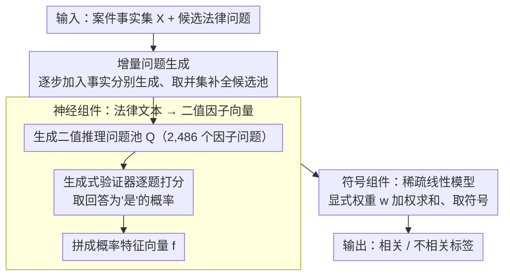

# LePREC: Reasoning as Classification over Structured Factors for Assessing Relevance of Legal Issues

**会议**: ACL 2026  
**arXiv**: [2604.19464](https://arxiv.org/abs/2604.19464)  
**代码**: 无  
**领域**: 法律NLP / 可解释性  
**关键词**: 法律问题相关性评估, 神经符号推理, 特征选择, 法律AI, 结构化因子分类

## 一句话总结

本文提出 LePREC，一种受法律专业人士启发的神经-符号框架，通过 LLM 生成推理问答对将非结构化法律文本转化为结构化特征，再利用稀疏线性模型进行相关性分类，在 769 个马来西亚合同法案例构建的 LIC 数据集上相比 GPT-4o 等 LLM 基线提升 30–40%。

## 研究背景与动机

**领域现状**：全球超过一半人口难以满足其民事司法需求。在 IRAC（Issue-Rule-Application-Conclusion）框架中，法律问题识别是关键的第一步，包括生成候选法律问题和评估其相关性。LLM 虽展现了强大的语言能力，但在真实法律场景中的精度仍然不足。

**现有痛点**：现有法律 AI 基准多限于简化或合成场景（如教科书案例），缺少基于真实法院案例的专家标注数据集。直接使用 GPT-4o 进行法律问题相关性评估仅达到 62% 的精度，因为 LLM 无法区分"与事实相关"和"真正涉及案件核心争议"的问题。

**核心矛盾**：法律专业人士评估相关性时需要考虑管辖权约束、程序性背景和案件特定因素等多层次上下文，而 LLM 倾向于进行表面事实匹配，缺乏深层法律推理能力。端到端的"黑箱"方法无法提供这种细粒度的判断。

**本文目标**：(1) 构建首个基于真实法院案例的法律问题相关性评估数据集 LIC；(2) 提出一种数据高效、可解释的神经-符号框架 LePREC，将法律推理转化为结构化因子上的统计分类。

**切入角度**：观察到法律专业人士的分析遵循两阶段过程——先识别关键分析因子（brainstorming），再权衡这些因子做出判断。这种分解天然对应神经-符号范式：神经部分提取因子，符号部分进行权衡推理。

**核心 idea**：将法律问题相关性评估从"事实-问题关系评估"重构为"因子-问题相关性分类"，通过 LLM 生成二值推理问题作为结构化特征，再用稀疏线性模型学习显式代数权重，实现可解释且数据高效的相关性判断。

## 方法详解

### 整体框架

LePREC 想解决的是：直接拿 GPT-4o 判断一个法律问题是否"真正涉及案件核心争议"只有 62% 精度，因为 LLM 做的是表面事实匹配，分不清"和事实沾边"与"切中争议"。论文的破局思路是模仿法律人的两阶段分析——先头脑风暴出一堆分析因子，再权衡这些因子下判断——把它落成一个神经-符号流水线。前半段是神经组件：用 LLM 把每个 (事实集, 候选问题) 对转写成一串二值推理问题，并用回答概率把非结构化文本压成一个数值特征向量；后半段是符号组件：在这些离散特征上训一个稀疏线性模型，用显式权重输出二值相关性标签（Relevant / Irrelevant）。整条链路既保住了 LLM 的语言理解，又把最终判断交给一个可解释、数据高效的线性分类器。

### 关键设计

**1. LIC 数据集与增量问题生成：让候选问题池足够"广"**

法律 AI 基准长期困在简化或合成的教科书案例里，缺真实法院案例上的专家标注，模型也就没法被真正考验。LePREC 从 769 个马来西亚合同法案例出发，用 GPT-4o 抽取事实和问题，再请资深法律专家标注相关性（Fleiss' $\kappa = 0.659$）。关键的巧思在生成候选问题时不一次性把所有事实灌给 LLM，而是增量地喂：给定事实列表 $\mathbf{X}=\{\mathbf{x}_1,\ldots,\mathbf{x}_m\}$，逐步加入事实分别生成问题，最终取并集 $\hat{\mathcal{Y}}=\bigcup_{i=1}^{m}\hat{\mathcal{Y}}_i$。不断变化上下文"深度"会逼 LLM 去关注不同的事实组合，从而捞出一次性生成容易漏掉的细微候选问题——这一增量策略在 FBD、EMBD 等质量指标和 Self-BLEU、Distinct-N 等多样性指标上都压过一次性生成的基线。

**2. 神经组件：把法律文本翻译成一串可计算的二值因子**

光有候选问题还不够，关键是怎么把"非结构化的法律文本"变成机器能算的特征。LePREC 对每个事实-问题对让 LLM 生成二值推理问题，累积成一个共享问题池 $\mathcal{Q}$（最终 2,486 个问题）。对池中每个问题 $q_t \in \mathcal{Q}$，用一个生成式验证器算出它在当前案例下被回答为"是"的概率 $G_{q_t}(\mathbf{X}, \hat{Y}_j) \in (0,1)$，把所有问题的概率拼成特征向量 $\mathbf{f} = G_{\mathcal{Q}}(\mathbf{X}, \hat{Y}_j) \in \mathbb{R}^h$。这里刻意用连续概率而不是直接的二值回答——初步实验发现直接让 LLM 给"是/否"很不可靠，而保留概率里的置信度信息后，分类效果稳定优于二值标签变体。

**3. 符号组件：用稀疏线性模型做可解释的相关性加权**

到了真正判断相关性这一步，论文没有再叠一个黑箱，而是直接用线性模型 $\hat{y}_j = \text{sign}(\mathbf{w}^\top \mathbf{f})$。学到的系数 $\mathbf{w}$ 天然完成了两件难事：对那些语义相似却给出冲突答案的噪声/冗余问题，自动压低权重；对只在特定案件类型才有意义的窄域问题，做自适应加权而不是一刀切地全局删除——这正好对应"窄域问题在无关案例里会引入噪声"的挑战。选线性模型而非深网络，是因为它一边给出显式的权重系数和透明的代数组合（符号可解释性），一边在参数量与训练样本量相当时反而更稳、更省数据，还顺带支持对"哪些推理问题贡献大"做统计分析。

### 一个例子：一个合同纠纷案例怎么走完两阶段

拿一个合同纠纷案例走一遍：先把案情拆成若干事实 $\mathbf{X}$ 和一个候选问题（如"是否构成违约？"）。神经组件并不直接回答这个问题，而是从共享池 $\mathcal{Q}$ 里调出 2,486 个二值推理问题（如"双方是否存在书面协议？""是否约定了履行期限？"），逐一让验证器给出回答为"是"的概率，于是这个案例-问题对被压成一个 2,486 维的概率向量 $\mathbf{f}$。符号组件再用训练好的权重 $\mathbf{w}$ 对这个向量做加权求和，取符号即得"相关 / 不相关"。整个判断可以追溯到哪几维（哪几个推理问题）权重最大，律师因此能看清模型"凭什么"这么判——而不是面对一个只会吐结论的黑箱。

### 损失函数 / 训练策略

神经组件用 GPT-4o 生成问题，生成过程与模型无关（后续稀疏特征选择会自动保留最具预测性的因子）。符号组件用标准线性分类器（SVC、LR、Ridge 等），在 LICL 上做 5 折分层交叉验证训练；特征选择实验则用 L1 正则化变体。

## 实验关键数据

### 主实验

**RQ1: SOTA LLM 基线（直接判断）**

| 方法 | F1 | Accuracy | Precision | Recall |
|------|------|------|------|------|
| Claude | 54.55 | 70.91 | 66.00 | 56.19 |
| GPT-4o | 57.80 | 70.91 | 64.46 | 58.07 |
| GenQwen | 63.70 | 68.59 | 63.84 | 63.92 |
| LegalBERT | 52.31 | 41.28 | 52.10 | 50.79 |

**RQ2: LePREC 框架（神经+符号）**

| 方法 | F1 | Accuracy | Precision | Recall |
|------|------|------|------|------|
| SVCPhi | **80.19** | 82.66 | 79.67 | **81.01** |
| LRPhi | 79.70 | 82.49 | 79.58 | 80.05 |
| RidgePhi | 80.10 | 82.91 | 80.06 | 80.28 |
| L1RegPhi | 80.01 | **83.34** | **81.13** | 79.32 |
| LDAPhi | 79.56 | 83.50 | 81.77 | 78.39 |

### 消融实验

| 配置 | F1 | 说明 |
|------|------|------|
| 线性模型 (SVC/LR/Ridge) | 79.70–80.19% | 最佳，一致且稳定 |
| 树/距离模型 (RF/KNN) | 74–75% | 略低但有竞争力 |
| 深度学习 (Transformer/FFN) | 75.44/75.65% | 非线性未带来额外增益 |
| LLM-Select 特征选择 | 45–58% | 失败，LLM 无法识别有预测力的问题 |
| L1 SVC 特征选择 | 77.60% | 仅下降 2.5 个百分点 |

### 关键发现

- LePREC 相比最佳 LLM 基线（GenQwen 63.70%）实现了约 16.5 个百分点的 F1 提升，达到 80.19%
- 线性模型（SVC、LR、Ridge）在所有分类器中表现最一致（79.70–80.19% F1），证明简单线性加权足以捕捉法律推理模式
- 稳定性分析揭示不存在普遍"黄金问题集"：L1 LR 仅 0.04–0.53% 的特征在所有折中被一致选择，L1 LR 和 L1 SVC 之间仅 38% 特征重叠
- 法律从业者访谈证实：律师不依赖固定清单推理，而是从广泛的、上下文敏感的分析因子中进行判断

## 亮点与洞察

- 将法律推理重构为结构化因子上的统计分类，巧妙地将神经-符号范式应用于法律 AI，实现了可解释性和高性能的统一
- "不存在普遍核心问题集"的发现既有定量（特征选择不稳定性）又有定性（法律从业者访谈）支撑，揭示了法律推理的根本特征
- 问题生成过程与模型无关——稀疏特征选择自动过滤模型特定噪声，这使得框架具有良好的泛化性

## 局限与展望

- 数据集仅聚焦马来西亚合同法（英联邦法系），尚未在大陆法系等其他法律体系上验证
- 依赖 LLM 生成推理问题，替代问题获取方法可能提供新洞察
- 线性模型假设线性组合能捕捉相关性模式，从详细权重分布中提取高层洞察需要仔细分析
- 部署到实际法律实践中需要额外验证以避免偏见

## 相关工作与启发

- **vs 直接 LLM 判断 (GPT-4o/Claude)**: LLM 直接判断仅达 55–58% F1，LePREC 通过分解推理过程实现 80% F1，证明结构化方法远优于端到端黑箱
- **vs LegalBERT**: 法律预训练模型因训练数据不足表现出高方差（F1 = 52.31±13.4），LePREC 通过数据高效的线性模型解决了这一问题
- **vs GCI（因果推理方法）**: GCI 的严格因果发现过度限制特征空间，LePREC 的相关性方法保留了更广泛的信号

## 评分

- 新颖性: ⭐⭐⭐⭐ 将法律推理重构为结构化因子分类的思路新颖，神经-符号分解契合法律实践
- 实验充分度: ⭐⭐⭐⭐⭐ 三个 RQ 系统回答，14 种分类器对比，稳定性分析+从业者访谈，极为全面
- 写作质量: ⭐⭐⭐⭐ 结构清晰，逻辑严密，实验设计层层递进
- 价值: ⭐⭐⭐⭐ 为法律 AI 领域提供了可解释且数据高效的新范式，LIC 数据集填补了重要空白

<!-- RELATED:START -->

## 相关论文

- [\[ACL 2026\] Accurate Legal Reasoning at Scale: Neuro-Symbolic Offloading and Structural Auditability for Robust Legal Adjudication](accurate_legal_reasoning_at_scale_neuro-symbolic_offloading_and_structural_audit.md)
- [\[ACL 2026\] LegalDrill: Diagnosis-Driven Synthesis for Legal Reasoning in Small Language Models](legaldrill_diagnosis-driven_synthesis_for_legal_reasoning_in_small_language_mode.md)
- [\[ACL 2026\] TemplateRL: Structured Template-Guided Reinforcement Learning for LLM Reasoning](templaterl_structured_template-guided_reinforcement_learning_for_llm_reasoning.md)
- [\[AAAI 2026\] From Classification to Ranking: Enhancing LLM Reasoning for MBTI Personality Detection](../../AAAI2026/llm_reasoning/from_classification_to_ranking_enhancing_llm_reasoning_capabilities_for_mbti_per.md)
- [\[ACL 2025\] Unveiling the Key Factors for Distilling Chain-of-Thought Reasoning](../../ACL2025/llm_reasoning/unveiling_the_key_factors_for_distilling_chain-of-thought_reasoning.md)

<!-- RELATED:END -->
