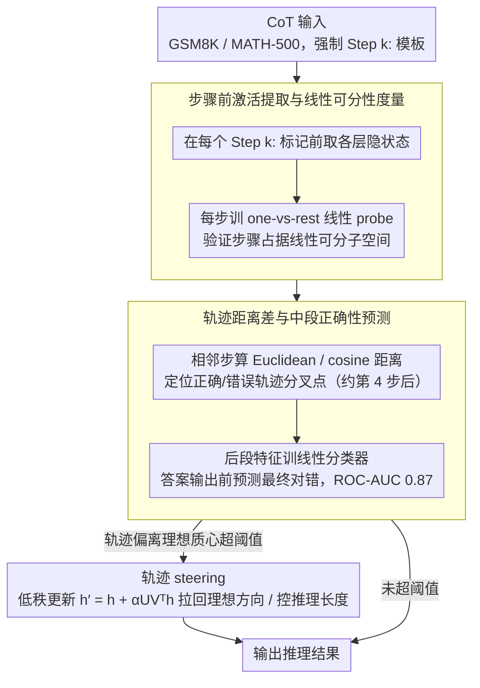

# LLM Reasoning as Trajectories: Step-Specific Representation Geometry and Correctness Signals

**会议**: ACL 2026  
**arXiv**: [2604.05655](https://arxiv.org/abs/2604.05655)  
**代码**: https://github.com/slhleosun/reasoning-trajectory  
**领域**: LLM 推理 / 可解释性 / 表征几何  
**关键词**: chain-of-thought、表征轨迹、线性可分性、correctness 预测、激活引导

## 一句话总结
本文把 LLM 的 chain-of-thought 推理看成在表征空间里的一条几何轨迹，发现 (a) 每个推理步骤都占据一个线性可分的子空间且越深层越清晰、(b) 正确与错误解在早期重叠、在后期系统性分叉，由此能在尚未输出答案时以 ROC-AUC 0.87 预测最终对错，并据此提出"轨迹引导"做推理修正和长度控制。

## 研究背景与动机
**领域现状**：LLM 的 CoT 推理通常被当作"按文本顺序生成"的黑盒，可解释性研究最多停留在"找一个 attention head 对应某种功能"或"找一个 concept direction"，少有人把整条推理过程当作连续几何对象来分析。

**现有痛点**：(a) 我们既不知道模型在某一步到底"想"到了什么阶段，也不知道为什么有的题做错；(b) 现有 inference-time intervention（test-time scaling 注入 token、固定 steering vector）多是无条件触发，缺乏"什么时候该介入"的判据，效果不稳定；(c) reasoning 训练（如蒸馏自 DeepSeek-R1）到底改变了模型什么也说不清。

**核心矛盾**：推理是一个**时间序列**过程，但绝大多数表征分析方法只在单 token / 单层上做 probing，丢掉了"步骤之间如何转移"这一关键信号。

**本文目标**：把推理过程的内部状态建模为一条轨迹 $\mathbf{h}_{t(\text{Step }1)-1}^{(\ell)},\mathbf{h}_{t(\text{Step }2)-1}^{(\ell)},\dots,\mathbf{h}_{t(\text{term})-1}^{(\ell)}$，分别回答：步骤是否对应不同子空间？正确与错误的轨迹是否可区分？能否据此中途干预？

**切入角度**：在固定 zero-shot CoT 模板下，每个 step 自然有一个"Step k:"标记 token；提取该 token 前一刻的 hidden state，就拿到"完成第 k 步后、即将进入第 k+1 步"的内部快照，避免被表面格式 token 污染。

**核心 idea**：用"步骤前激活"序列把 CoT 几何化，并用线性 probe + 距离分析揭示步骤可分性 + 正确性发散，最后基于"理想轨迹"做低秩 steering 修正。

## 方法详解

### 整体框架
研究分三块，对应三种发现：
1. **几何结构分析**：用 t-SNE 可视化 + 线性 probe（一对多分类）衡量"步骤前激活"是否占据步骤特定子空间，并跨 Base / Instruct / R1-Distill（Llama-3.1-8B 三变体）对比训练范式的影响；
2. **正确性信号分析**：把每条轨迹按最终答案对错分组，逐步计算 Euclidean / cosine 距离，观察分叉时机；训线性分类器从"晚期步骤特征"预测最终对错；
3. **轨迹 steering 干预**：构造"理想轨迹"（正确样本的平均路径），运行时若当前轨迹偏离超过阈值则触发低秩 steering 把它拉回理想方向；用同一思路控制推理长度（朝/远离 termination 子空间）。

数据用 GSM8K（7,473 train / 1,319 test）+ MATH-500，prompt 强制每步以 `Step k:` 开头、答案以 `####` 标记。

### 关键设计

**1. 步骤前激活提取与线性可分性度量：拿到"已积累的推理状态"快照**

前面说推理被当时间序列对待时丢掉了"步骤间如何转移"的信号——第一步要做的就是把每一步的内部状态干净地取出来。论文在固定 zero-shot CoT 模板下，于每个 `Step k:` 标记前一刻提取所有层的隐状态 $\mathbf{h}_{t(\text{Step }k)-1}^{(\ell)}$：在标记"前"取而不是"后"取，是为了拿到模型刚完成第 $k$ 步、还没写出格式 token 时的真实推理状态，避开格式 token 的污染。拿到激活后，对每个 step $k$ 训一个 one-vs-rest 线性分类器 $\hat y = \mathrm{sign}(w^\top h)$，正例是"恰好完成第 $k$ 步"的激活、负例是其它步。之所以用线性可分性当判据，是因为在表征学习里"信息能被一个线性 probe 直接读出"正是"该信息显式编码在表征里"的标准证据；再配合跨步骤、跨模型变体（Base/Instruct/R1-Distill）的迁移测试，排除"probe 只是学到了表面格式"的可能。

**2. 轨迹距离差与中段正确性预测：把对错信号从末尾前移到中段**

知道每步可分还不够，论文真正想要的是"在答案输出之前就判断这条推理会不会错"。做法是对每条轨迹的相邻步骤算距离 $d(\mathbf{h}_{t(a)-1}^{(L)}, \mathbf{h}_{t(b)-1}^{(L)})$，其中 Euclidean 衡量幅度、cosine 衡量方向，再用错误组减正确组的差 $\Delta(\text{Incorrect}-\text{Correct})$ 去定位两类轨迹开始分叉的步骤。结果是早步的距离统计上不可分（95% 置信区间重合），大约第 4 步之后才系统性分叉。基于这个分叉点，论文用后段激活加距离特征训一个线性分类器在 ROC-AUC 框架下预测最终对错，平均 AUC 0.83、在 layer 29 峰值 0.87。把对错信号从最终 token 推到中段的价值很直接：可以在答案写出来之前就触发干预，省下 test-time compute 并阻断错误继续传播。

**3. 轨迹 steering：基于理想轨迹的自适应低秩修正**

有了"何时会错"的判据，最后一步是"错了怎么拉回来"。论文先用正确样本激活的平均路径定义一条"理想轨迹"（质心），运行时实时追踪当前轨迹偏离这条质心的程度；一旦超过容忍阈值，就在当前激活上加一个低秩 steering 更新

$$\mathbf{h}' = \mathbf{h} + \alpha U V^\top \mathbf{h}$$

把模型推回理想方向，其中 steering 矩阵 $UV^\top$ 由正确-错误差向量的 SVD 取低秩近似得到。同一套思路还能控制推理长度：把激活朝 termination 子空间 push 就缩短 CoT、pull 就拉长。相比无条件的 test-time scaling（无差别注入 "Wait" / "Let me think again" 之类 token），门控加轨迹偏离量给出了"何时干预、干预多少"的客观判据，扰动几乎只发生在错误轨迹上，对本来就对的轨迹近乎透明。

### 损失函数 / 训练策略
本文不训模型，仅训线性 probe 和分类器（标准逻辑回归 / SVM），steering 矩阵通过对正确-错误差向量的 SVD 闭式得到，无梯度。

## 实验关键数据

### 主实验（线性 probe 步骤识别准确度，from Figure 1b / Table 1）

| Probe From | Eval On | Step 2 | Step 3 | Step 4 | Step 5 | Final Ans Marker |
|------------|---------|--------|--------|--------|--------|------------------|
| Instruct | R1-Distill | 0.99 (L18) | 0.93 (L19) | 0.87 (L12) | 0.91 (L18) | 0.87 (L23) |
| Instruct | Base | 1.00 (L12) | 0.97 (L08) | 0.95 (L08) | 0.93 (L18) | 0.97 (L21) |
| R1-Distill | Instruct | 1.00 (L03) | 0.92 (L08) | 0.88 (L07) | 0.93 (L27) | 0.98 (L19) |
| R1-Distill | Base | 1.00 (L06) | 0.94 (L04) | 0.89 (L30) | 0.91 (L08) | 0.96 (L19) |
| Base | Instruct | 1.00 (L21) | 0.98 (L18) | 0.97 (L18) | 0.97 (L23) | 1.00 (L31) |
| Base | R1-Distill | 0.99 (L12) | 0.91 (L18) | 0.90 (L18) | 0.92 (L17) | 0.94 (L02) |

跨模型迁移几乎全 >0.90，说明步骤特定的线性结构在 Base/Instruct/R1-Distill 三个训练范式下共享；R1-Distill 的差别主要是 termination 子空间在更浅层就形成（layer 0 即 0.99，Instruct 仅 0.80）。

### 消融实验

| 配置 | 关键指标 | 说明 |
|------|---------|------|
| Full（步骤前激活 + 真实步骤标签） | Step 2 probe 1.00、AUC 0.87 | 完整设置 |
| Randomly shuffled step labels（控制） | 平均 0.59 ± 0.04 | 接近 chance，证明几何结构不是 probe 过拟合 |
| Freeform prompt（不强制 `Step k:` 模板） | 各步 best-layer ≥ 0.84 | 模型在 64.5% 样本上自发用 `Step k:`，剩余在段落/句号边界提取仍可迁移 |
| 只用 Step 1 特征做对错预测 | AUC ≈ 0.63 | 早步几乎无对错信号 |
| 用最后几步特征做对错预测 | AUC 0.83 / 峰值 0.87 (layer 29) | 晚步分叉强 |

### 关键发现
- 步骤特定结构在 Base 模型里就已经存在，reasoning 训练只是把 termination 子空间从更浅层就开始凸显，并不"创造新结构"。这是个反常识发现——以为是 SFT/RLHF 教会的几何特性，其实早就在那。
- 早期轨迹对错完全无差，分叉发生在第 4 步之后；这意味着 "early exit / 早停" 对推理任务是个坏策略，前 4 步基本上都是必要的展开。
- Freeform 模板下模型自发选 `Step k:` 写法 64.5%，且 fixed 模板的 probe 直接迁移到 freeform 仍 >0.84，证明这是 reasoning 真实结构而非 prompt artifact。
- 用 mid-reasoning 预测器门控干预，比无条件注入 token / 无差别 steering 在 GSM8K/MATH-500 上一致更稳。

## 亮点与洞察
- 把 CoT 从离散 token 序列重新表述为"表征空间中的连续轨迹"是个范式级的视角切换，给可解释性社区一个新的研究单位（trajectory vs token/direction）。
- "训练只是改变几何何时出现，不改变几何形态"这条发现让我们重估 reasoning training 的作用——也许它的关键收益是 "termination calibration"（知道何时停止）而非"获得了新能力"。
- ROC-AUC 0.87 的中段对错预测器可以直接被 RL 训练用作 reward proxy，省去 outcome-based reward 的稀疏问题。
- "理想轨迹 + 低秩 steering" 这个范式给 inference-time intervention 提供了一个干净的几何抽象，可迁移到 code agent、规划等其它需要中途监督的任务。

## 局限与展望
- 只在 Llama-3.1-8B 一个 backbone + GSM8K/MATH-500 数学任务上做了完整实验，是否在 Qwen/Mistral、commonsense reasoning、code reasoning 上同样成立尚不清楚。
- "理想轨迹"用质心定义忽略了正确解可以有多种路径（多模分布）；对开放型问题（如证明题）可能不适用。
- AUC 0.87 中段预测 + steering 的实际下游 accuracy 提升被论文承认是 "modest but consistent"，说明从信号到操作的损失仍大。
- 我自己想到一个：当前激活提取依赖显式 `Step k:` 标记，对没有清晰步骤分隔的任务（自然语言生成、对话）方法需要重新设计标记策略；这是迁移到更广任务的最大瓶颈。

## 相关工作与启发
- **vs Lanham et al. (CoT faithfulness)**：他们行为级测"删步骤是否影响答案"；本文从表征侧给出几何解释，互补。
- **vs Park et al. (linear representation hypothesis)**：本文延伸"概念是线性方向"到"推理阶段是线性子空间"，扩展了 LRH 的覆盖。
- **vs Turner et al. (activation steering)**：传统 steering 是无条件加固定向量；本文用轨迹偏离作为门控，干预更精准、副作用更小。
- **vs Muennighoff et al. (s1 / Test-time scaling)**：他们靠注入 "Wait" 类 token 强行延长推理；本文用 termination subspace steering 实现同样目的但是连续可控，且能反向缩短。

## 评分
- 新颖性: ⭐⭐⭐⭐⭐ "推理 = 表征空间中的几何轨迹"是个新的研究范式抽象。
- 实验充分度: ⭐⭐⭐⭐ 跨训练范式 + 跨格式 + freeform 对照很扎实，但只在一个模型家族 + 数学任务上验证。
- 写作质量: ⭐⭐⭐⭐ 结构清晰，3 大 finding 对应 3 节，可读性强。
- 价值: ⭐⭐⭐⭐ 给可解释性、test-time intervention、reward modeling 三个方向都打开了新接口。

<!-- RELATED:START -->

## 相关论文

- [\[ACL 2026\] On the Step Length Confounding in LLM Reasoning Data Selection](on_the_step_length_confounding_in_llm_reasoning_data_selection.md)
- [\[ICLR 2026\] The Path of Least Resistance: Guiding LLM Reasoning Trajectories for Efficient Consistency](../../ICLR2026/llm_reasoning/the_path_of_least_resistance_guiding_llm_reasoning_trajectories_for_efficient_co.md)
- [\[ICLR 2026\] The Path of Least Resistance: Guiding LLM Reasoning Trajectories with Prefix Consensus](../../ICLR2026/llm_reasoning/the_path_of_least_resistance_guiding_llm_reasoning_trajectories_with_prefix_cons.md)
- [\[ACL 2026\] Which Reasoning Trajectories Teach Students to Reason Better? A Simple Metric of Informative Alignment](which_reasoning_trajectories_teach_students_to_reason_better_a_simple_metric_of_.md)
- [\[ACL 2026\] Reasoning Fails Where Step Flow Breaks](reasoning_fails_where_step_flow_breaks.md)

<!-- RELATED:END -->
