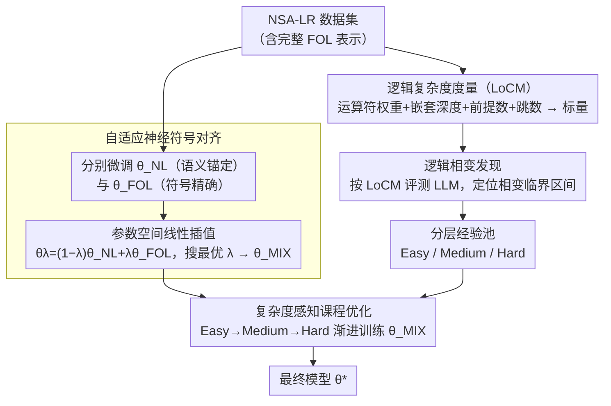

# Logical Phase Transitions: Understanding Collapse in LLM Logical Reasoning

**会议**: ACL 2026  
**arXiv**: [2601.02902](https://arxiv.org/abs/2601.02902)  
**代码**: [https://github.com/AI4SS/Logical-Phase-Transitions](https://github.com/AI4SS/Logical-Phase-Transitions)  
**领域**: LLM推理  
**关键词**: 逻辑推理, 相变现象, 课程学习, 神经符号对齐, 推理崩塌

## 一句话总结

本文发现 LLM 逻辑推理存在"逻辑相变"现象——性能在特定复杂度阈值处突然崩塌而非平滑退化，提出逻辑复杂度度量（LoCM）来量化这一现象，并设计神经符号课程调优框架（NSCT），通过自适应神经-符号对齐和复杂度感知课程优化，在五个基准上平均提升 naive prompting +1.26 和 CoT +3.95 准确率。

## 研究背景与动机

**领域现状**：符号逻辑推理是 LLM 的关键能力，支撑数学证明、法律推理等高风险领域。现有研究表明 LLM 在简单逻辑任务上表现良好，但随着复杂度增加性能显著退化。

**现有痛点**：虽然性能退化被广泛观察到，但"逻辑深度如何影响推理能力"缺乏系统刻画。现有分析依赖粗粒度的难度代理（如跳数），无法精确量化逻辑复杂度本身。现有推理增强方法（CoT、ToT、符号推理等）提升了表面性能，但对推理行为随复杂度变化的规律缺乏洞察。

**核心矛盾**：现有逻辑推理数据集缺乏完整的一阶逻辑（FOL）表示，无法精细刻画逻辑依赖结构和组合深度，导致无法发现和解释推理崩塌的根本规律。

**本文目标**：(1) 提出精确量化逻辑复杂度的指标；(2) 发现并形式化推理崩塌现象；(3) 设计针对崩塌区域的训练策略。

**切入角度**：作者类比物理学中的相变现象——水在 0°C 和 100°C 处发生突变而非连续变化。逻辑推理性能也在关键复杂度阈值处突然崩塌，具有相变的特征。

**核心 idea**：用 LoCM 量化逻辑复杂度并发现相变区间，然后用神经-符号权重插值对齐自然语言和逻辑符号表示，再通过复杂度感知课程学习在相变边界处渐进强化推理。

## 方法详解

### 整体框架

框架分三个阶段：(1) 逻辑复杂度测量——构建 NSA-LR 数据集并用 LoCM 量化每个样本的逻辑难度；(2) 逻辑相变发现——用 LoCM 评估 LLM 性能，识别相变区间，将样本分为 Easy/Medium/Hard 三个经验池；(3) 神经符号课程调优——先通过 NL-FOL 权重插值得到混合语义模型 $\theta_{MIX}$，再通过复杂度递增的课程优化得到最终模型 $\theta^*$。

### 关键设计

**1. 逻辑复杂度度量（LoCM）：给每道题一个能精确刻画"逻辑难度"的标量**

现有的复杂度估计几乎都只数"推理跳数"，可这忽略了一个事实——否定、蕴含这些不同运算符的难度天差地别，嵌套深度和前提数量也都会显著抬高难度。LoCM 的做法是把这几个维度揉进一个标量：综合逻辑运算符的类型权重 $\omega(o)$、运算符在公式里的频率 $\text{freq}(o, \phi)$（其中已计入嵌套深度 $d$ 和前提数 $N_\phi$）、以及推理跳数 $h$，再过一个单调变换 $f$ 归一化：

$$\text{LoCM}(\phi) = f\!\left(\sum_{o \in \mathcal{O}} \omega(o) \cdot \text{freq}(o, \phi) + \gamma \cdot h(\phi)\right)$$

有了这个多维度的精细分数，论文才能在后续把"逻辑深度如何影响推理"刻画清楚，进而发现单看跳数永远看不到的相变现象。

**2. 自适应神经符号对齐：用权重插值把 NL 的语义和 FOL 的精确性融到一个模型里**

逻辑推理有个天然张力：自然语言（NL）能提供语义锚定，但松散易歧义；一阶逻辑（FOL）能给精确的符号约束，但缺语义直觉——LogicAgent 等工作已证明两者互补。直接做多模态联合训练既重又难调，论文于是走了一条轻量路线：分别微调一个纯 NL 模型 $\theta_{NL}$ 和一个纯 FOL 模型 $\theta_{FOL}$，再在参数空间里线性插值 $\theta_\lambda = (1-\lambda)\theta_{NL} + \lambda\theta_{FOL}$ 构成一个混合模型族，在验证集上搜出最优 $\lambda$ 后微调得到 $\theta_{MIX}$。这本质是利用了 mode connectivity——两个同源微调模型之间的参数路径上仍是有效解——用一次插值就拿到兼具语义锚定和符号精确的混合推理能力。

**3. 复杂度感知课程优化：在相变边界上渐进强化，而不是硬塞高难样本**

相变的发现直接决定了训练策略：既然模型在高复杂度区已经"崩塌"，直接拿高复杂度样本去训根本无效，还会把训练带得不稳。论文基于 $\theta_{MIX}$，按 LoCM 把样本分成 Easy→Medium→Hard，按这个顺序组织课程；每个阶段都训当前及之前所有复杂度的样本，持续监控性能，等增益稳定了才进入下一阶段，损失用标准的 token 级交叉熵。这种渐进暴露的意义在于让模型平稳地"跨过"相变区间——一步一步把能力边界往高复杂度推，而不是在崩塌区域硬撞。

### 损失函数 / 训练策略

全程用标准 token 级交叉熵损失 $\mathcal{L}(\theta) = -\mathbb{E}[\sum_t \log p_\theta(y_t | x, y_{<t})]$。NSA-LR 数据集由 GPT-5 和 Qwen3-Max 双重翻译，不一致的部分再经 CFG 验证或人工仲裁。

## 实验关键数据

### 主实验

| 方法 | ProntoQA | ProofWriter | FOLIO | ProverQA | NSA-LR | 平均 |
|------|----------|-------------|-------|----------|--------|------|
| Naive 原始 | 55.20 | 44.16 | 60.78 | 54.13 | 49.55 | 52.76 |
| **Naive + NSCT** | **56.80** | **44.66** | **62.25** | **55.47** | **50.91** | **54.02 (+1.26)** |
| CoT 原始 | 67.60 | 55.16 | 66.17 | 60.70 | 57.70 | 61.47 |
| **CoT + NSCT** | **72.00** | **60.71** | 65.20 | **64.20** | **65.00** | **65.42 (+3.95)** |

### 消融实验（NSA-LR 数据集按复杂度分层）

| 方法 | Low | Medium | High | Overall |
|------|-----|--------|------|---------|
| CoT 原始 | 75.5 | 58.4 | 39.4 | 57.7 |
| **CoT + NSCT** | **84.0 (+8.5)** | **64.2 (+5.8)** | **46.8 (+7.4)** | **65.0 (+7.3)** |

### 关键发现

- 逻辑相变现象在所有测试的开源和闭源 LLM 上一致出现，不是模型特定的而是推理能力的普遍规律
- 相变不是单一阈值而是多个临界区间 $\mathcal{I}_k$，在区间内准确率骤降，过了区间后趋于稳定（类似固-液-气多相变）
- NSCT 在 High 复杂度样本上提升最大（+7.4），证明方法确实在相变区域起作用
- 单数据集微调往往导致其他数据集退化（特别是 FOLIO-tuned 在 ProverQA 上掉 0.33），NSCT 是唯一在所有数据集上一致提升的方法
- 相变发现与物理学中的 Landau 相变理论类比精确——控制变量（LoCM）进入临界区间后系统行为突变

## 亮点与洞察

- "逻辑相变"的概念借用自物理学但非常贴切——性能不是平滑退化而是在阈值处突变。这个发现为理解 LLM 推理能力边界提供了全新视角，解释了为什么简单增加训练数据不能改善高复杂度推理
- LoCM 的设计将逻辑运算符权重、嵌套深度、前提数和推理跳数统一为标量指标，是逻辑复杂度量化的第一次系统尝试，可作为未来研究的标准工具
- 权重插值融合 NL 和 FOL 模型的做法简单但有效，利用了 mode connectivity 的性质，比多任务联合训练更轻量

## 局限与展望

- LoCM 中运算符权重 $\omega(o)$ 的设定需要领域知识，不同逻辑体系可能需要不同权重
- 仅在 SFT 框架下验证，未探索 RL（如 GRPO）对相变区域的训练效果
- NSA-LR 数据集是合成数据，真实世界的自然语言逻辑推理可能有更复杂的噪声模式
- 相变区间的自动检测方法未详细说明，实际应用中如何确定临界区间需要更多指导

## 相关工作与启发

- **vs Apple (Shojaee et al.)**: Apple 发现程序化任务（如 Tower of Hanoi）的推理崩塌，但关注结构化谜题。本文聚焦命题/一阶逻辑的符号推理，复杂度定义、评估目标和干预方式完全不同
- **vs CoT-Valve**: CoT-Valve 控制推理链长度，本文揭示问题在于逻辑复杂度而非链长度，提供了更根本的解释

## 评分

- 新颖性: ⭐⭐⭐⭐⭐ 逻辑相变概念新颖且有实验支撑，LoCM 填补了逻辑复杂度量化的空白
- 实验充分度: ⭐⭐⭐⭐ 五个基准、多种推理方法对比，但绝对提升幅度较小
- 写作质量: ⭐⭐⭐⭐⭐ 物理学类比精确恰当，framework overview 清晰，叙事流畅
- 价值: ⭐⭐⭐⭐ 为理解 LLM 推理能力边界提供了新框架，但实际提升幅度有限（+1.26/+3.95）

<!-- RELATED:START -->

## 相关论文

- [\[ACL 2026\] Discovering a Shared Logical Subspace: Steering LLM Logical Reasoning via Alignment of Natural-Language and Symbolic Views](discovering_a_shared_logical_subspace_steering_llm_logical_reasoning_via_alignme.md)
- [\[ACL 2026\] Semantic-Aware Logical Reasoning via a Semiotic Framework](semantic-aware_logical_reasoning_via_a_semiotic_framework.md)
- [\[ICLR 2026\] LogicReward: Incentivizing LLM Reasoning via Step-Wise Logical Supervision](../../ICLR2026/llm_reasoning/logicreward_incentivizing_llm_reasoning_via_step-wise_logical_supervision.md)
- [\[ICLR 2026\] ActivationReasoning: Logical Reasoning in Latent Activation Spaces](../../ICLR2026/llm_reasoning/activationreasoning_logical_reasoning_in_latent_activation_spaces.md)
- [\[ACL 2026\] Self-Awareness before Action: Mitigating Logical Inertia via Proactive Cognitive Awareness](self-awareness_before_action_mitigating_logical_inertia_via_proactive_cognitive_.md)

<!-- RELATED:END -->
