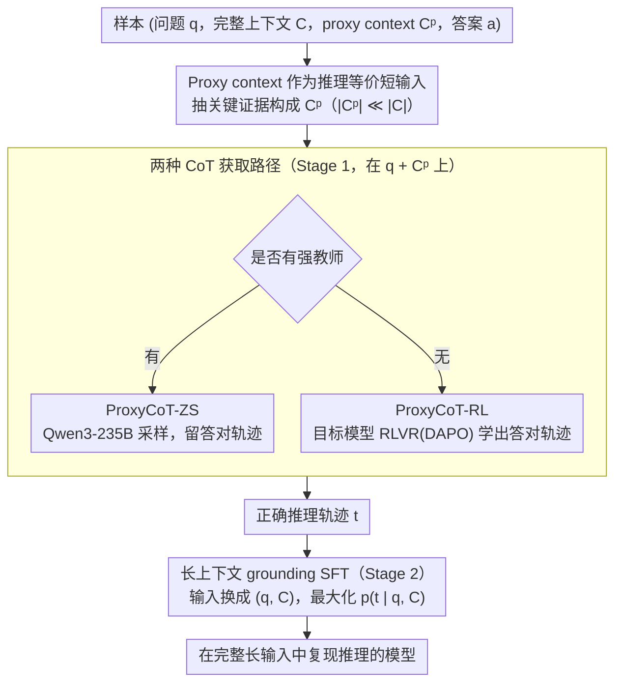

# Long-Context Reasoning Through Proxy-Based Chain-of-Thought Tuning

**会议**: ACL2026  
**arXiv**: [2605.20201](https://arxiv.org/abs/2605.20201)  
**代码**: https://github.com/oaimli/ProxyCoT  
**领域**: LLM 推理 / 长上下文 / Chain-of-Thought  
**关键词**: 长上下文推理、代理上下文、CoT 蒸馏、RLVR、ProxyCoT  

## 一句话总结
ProxyCoT 利用短而充分的 proxy context 先获得高质量推理轨迹，再把这些轨迹蒸馏到完整长上下文输入上，使 4B 模型在 SciTrek、HotpotQA 和 Loong 上显著提升长上下文推理，同时减少推理时 CoT token。

## 研究背景与动机
**领域现状**：现代 LLM 的上下文窗口已经扩展到百万甚至千万 token，但能读长文本不等于能在长文本上稳定推理。许多任务只需要从长输入中定位少量证据，再进行比较、筛选、聚合或多跳推理。

**现有痛点**：提升推理能力常用 CoT 蒸馏或强化学习。前者需要大教师模型生成高质量推理轨迹，后者需要大量采样。二者在短上下文上可行，但一旦直接放到 64K、128K 甚至更长上下文上，成本很高，而且教师模型自己也可能在长上下文中生成不可靠轨迹。

**核心矛盾**：长上下文任务的推理逻辑往往只依赖一小段关键证据，但训练和监督却被迫处理完整长输入。模型在 proxy context 上能更好地执行同样推理，却在 full context 上因证据定位和 grounding 失败而掉分。

**本文目标**：利用 proxy context 低成本获得正确 CoT，再训练模型在 full context 条件下复现这些推理轨迹，让模型把短上下文中学到的推理行为迁移到长输入。

**切入角度**：作者把 proxy context 定义为包含足够证据的短输入，满足 $|C^p|\ll |C|$，但问题、答案和推理步骤与 full context 保持一致。这样，proxy context 可视作“完美检索”的上界，也可作为低成本推理监督来源。

**核心 idea**：先在 proxy context 上用大教师或 RLVR 产生正确 CoT，再用 SFT 让学生模型在完整长上下文上生成同样的推理轨迹。

## 方法详解
ProxyCoT 是一个两阶段训练框架。第一阶段只看短 proxy context，目标是获得质量高、成本低的推理轨迹；第二阶段把这些轨迹绑定到 full long context，让模型学习在长输入中定位并使用对应证据。

### 整体框架
每个样本包含问题 $q$、完整上下文 $C$、proxy context $C^p$、答案 $a$。Stage 1 在 $(q,C^p)$ 上获得推理轨迹 $t$。如果有强教师，就用 ProxyCoT-ZS：Qwen3-235B-A22B-Thinking 在 proxy context 上采样多次，只保留答案正确的轨迹。如果没有合适教师，就用 ProxyCoT-RL：目标模型先在 proxy context 上通过 RLVR 学会生成能答对的推理轨迹。

Stage 2 使用 SFT，把 Stage 1 得到的轨迹作为监督，但输入换成 $(q,C)$。这一步要求模型在完整长上下文中复现 proxy-derived CoT，从而学习证据 grounding。论文分别在 Qwen3-4B-Instruct-2507 和 Gemma3-4B-IT 上验证，任务包括 SciTrek 和 HotpotQA，并在 Loong 上做 out-of-domain 测试。

### 关键设计

**1. Proxy context 作为推理等价短输入：用一小段关键证据替代长输入来产生推理轨迹**

直接在 64K、128K 甚至更长的 full context 上反复采样推理轨迹，成本极高，而且教师自己在长输入里也容易 grounding 失败、写出不可靠的链路。ProxyCoT 的出发点是：长上下文任务的推理逻辑往往只依赖一小段关键证据，于是把这段证据单独抽出来构成 proxy context $C^p$，满足 $|C^p|\ll|C|$，但保持与 full context 相同的问题、答案和推理步骤——相当于一个"完美检索"的上界。具体怎么抽 proxy 取决于任务结构：SciTrek 的问题大多来自文章标题、作者、引用等 metadata，就把结构化 metadata 当 proxy；HotpotQA 则直接用人工标注的 supporting sentences。因为短证据已足以答对题，在它上面训练或采样推理，远比在长输入上反复折腾更划算。

**2. 两种 CoT 获取路径：同时覆盖有强教师和无强教师两种场景**

光有 proxy context 还需要一条正确的推理轨迹作为监督，论文给了两条互补的路径。有强教师时走 ProxyCoT-ZS：让 Qwen3-235B-A22B-Thinking 在 proxy context 上多次采样，只保留答案正确的轨迹——大教师在短 proxy 上既便宜又可靠。没有合适教师时走 ProxyCoT-RL：让目标模型自己在 proxy context 上做 RLVR（DAPO），奖励取 F1 加 exact match，直接优化出能答对的轨迹。关键在于两条路径都把昂贵环节锁在短输入上：大教师不必反复读 128K 全文，RL 采样也因为输入短而真正可训练，避免了直接在 full context 上做 RL 的高成本。

**3. 长上下文 grounding SFT：把短证据上学到的推理迁回完整长输入**

如果只在 proxy 上训练，模型会依赖短证据的格式，换成真实长输入时仍然定位不到证据。第二阶段因此用 SFT 把 Stage 1 得到的轨迹 $t$ 作为监督，但输入换成完整的 $(q,C)$，目标是最大化 $p_\theta(t\mid q,C)$——强迫模型在长文本里复现出 proxy 上那条正确推理，从而真正学会在长输入中定位并使用对应证据。这一步是 full context 性能的关键来源：消融里 Qwen3-4B 单独 RLVR 的 full 指标只有 29.0，叠上 grounding SFT 后升到 46.5。

### 损失函数 / 训练策略
ProxyCoT-ZS 的 SFT 使用 $\mathcal{L}_{SFT}=-\mathbb{E}[\log p_\theta(t\mid q,C)]$。ProxyCoT-RL 先用 RLVR 在 proxy context 上优化，奖励 $R(a,\hat{a})=F1(a,\hat{a})+\mathds{1}_{a==\hat{a}}$，然后从 RL checkpoint 继续 SFT。实现上，RL 使用 OpenRLHF，batch size 64，最大生成长度 2,048，actor learning rate 为 $5e{-7}$，每个 prompt 采样 8 条轨迹，训练 10 epochs；SFT batch size 64，learning rate $5e{-6}$，前 10% steps 线性 warmup。

## 实验关键数据

### 主实验
| 数据集 / 模型 | 方法 | Proxy 指标 | Full 指标 | 说明 |
|--------|------|-----------|-----------|------|
| SciTrek / Qwen3-4B | Zero-shot | 67.2 | 30.8 | full context 明显掉分 |
| SciTrek / Qwen3-4B | ProxyCoT-ZS | 67.8 | 38.8 | 大教师 proxy CoT 蒸馏有效 |
| SciTrek / Qwen3-4B | ProxyCoT-RL | 88.5 | 46.5 | 接近 Qwen3-235B-Thinking full 48.8 |
| SciTrek / Gemma3-4B | Zero-shot | 34.2 | 3.0 | 长上下文基础能力很弱 |
| SciTrek / Gemma3-4B | ProxyCoT-RL | 69.8 | 43.7 | 提升最明显 |
| HotpotQA / Qwen3-4B | Zero-shot | 91.3 | 44.5 | proxy 上已很强，full 仍弱 |
| HotpotQA / Qwen3-4B | ProxyCoT-RL | 92.1 | 52.7 | full context 最优 |
| Loong / Gemma3-4B | Zero-shot → ProxyCoT-RL | Financial 25.85 → 32.05；Academic 3.55 → 24.32 | 无需再训练迁移 | 说明不是只记住 SciTrek 格式 |

### 消融实验
| 分析项 | 配置 | 关键结果 | 说明 |
|------|------|---------|------|
| CoT token | Qwen3-4B on SciTrek full | Zero-shot 1,744 tokens / 30.8 EM；SFT on full CoT 6,683 / 31.6；ProxyCoT-RL 617 / 46.5 | ProxyCoT-RL 更准且更短 |
| 两阶段消融 | Qwen3-4B | Stage1+Stage2 full 46.5；only RLVR full 29.0；only SFT full 46.3 | Qwen3 上 SFT grounding 是关键，RL 带来 proxy 能力提升 |
| 两阶段消融 | Gemma3-4B | Stage1+Stage2 full 43.7；only RLVR full 8.0；only SFT full 37.3 | 弱长上下文模型更依赖两阶段组合 |
| proxy 类型 | SciTrek | 随机句子 3.4；标题作者引用 24.6；结构化 metadata 91.5 | proxy 质量决定 RLVR 学到的推理是否有效 |
| proxy 噪声 | SciTrek | Oracle:Noise 1:5 为 85.3，1:0 为 91.5 | 加噪后下降有限，仍较稳健 |
| proxy 噪声 | HotpotQA | 1:5 为 83.7，1:0 为 92.2 | proxy 过噪会损伤，但不是立刻失效 |

### 关键发现
- full context 和 proxy context 的性能差距是真实瓶颈：模型不是不会推理，而是在长输入中 grounding 推理步骤困难。
- ProxyCoT-RL 通常优于 ProxyCoT-ZS，说明在 proxy context 上通过 RLVR 得到的任务特定轨迹比大教师零样本轨迹更适合蒸馏。
- 只在 full context 上 SFT 或 RLVR 不够稳定；短 proxy 上获得轨迹，再到 full context grounding，是计算和效果的折中。
- proxy 的结构化程度非常重要。SciTrek 中结构化 metadata 远优于未结构化的标题、作者和引用文本。

## 亮点与洞察
- 论文抓住了长上下文推理的一个关键事实：长输入里的大部分 token 可能只是定位负担，真正推理需要的证据很短。
- ProxyCoT 把 RAG 的“检索证据”思想转成训练信号，而不只是在推理时拼接检索结果。这让模型本身学会在长上下文中执行短证据上的推理模式。
- 617 CoT tokens 达到 46.5 EM，比 6,683 tokens 的 full-context teacher CoT SFT 更好，说明更长推理并不总是更有效，尤其当证据 grounding 错时。
- 对资源受限实验室很实用：不必让大教师反复读 128K full context，也不必在长输入上做昂贵 RL 采样。

## 局限与展望
- 方法假设能获得足够回答问题的 proxy context。很多真实任务没有人工 supporting evidence 或结构化 metadata，自动构造 proxy 仍困难。
- 如果系统本身可以用 RAG 工作流解决，ProxyCoT 与检索系统如何结合、谁负责证据选择，论文没有深入讨论。
- 实验受计算和数据限制，只覆盖英文任务；跨语言、跨领域和更长上下文的泛化仍需验证。
- proxy context 如果质量差或结构混乱，性能会显著下降；这让方法的瓶颈从“长上下文训练”转移到“高质量 proxy 构造”。
- 后续可研究自动 proxy 发现、带噪检索证据训练、与工具调用结合的长上下文 grounding，以及多语言长文推理。

## 相关工作与启发
- **vs CoT 蒸馏**: 常规 CoT 蒸馏让教师在完整输入上写轨迹，ProxyCoT 让教师或 RL 模型在短 proxy 上写轨迹，再迁移到 full context。
- **vs RLVR on full context**: 直接长上下文 RLVR 采样成本高，ProxyCoT-RL 把 RL 放在短 proxy 上，显著降低训练难度。
- **vs RAG**: RAG 在推理时检索证据，ProxyCoT 把“完美检索到的证据”作为训练阶段的中间监督，让模型长上下文能力本身变强。
- **vs 长上下文架构改进**: 稀疏注意力或 RoPE 扩展解决可读长度，ProxyCoT 解决在长输入中保持正确推理轨迹的问题。

## 评分
- 新颖性: ⭐⭐⭐⭐☆ proxy context 到 full context 的 CoT 迁移很自然但抓得准，设计简洁有效。
- 实验充分度: ⭐⭐⭐⭐☆ 覆盖两个模型、两个主数据集、Loong 迁移和多组消融，但语言和任务范围仍有限。
- 写作质量: ⭐⭐⭐⭐☆ 动机清楚，表格数据充分，读者容易理解两阶段训练为何必要。
- 价值: ⭐⭐⭐⭐⭐ 对长上下文推理训练非常实用，尤其适合计算预算有限但有短证据监督的场景。

<!-- RELATED:START -->

## 相关论文

- [\[ACL 2026\] PPA-Plan: Proactive Pitfall Avoidance for Reliable Planning in Long-Context LLM Reasoning](ppa-plan_proactive_pitfall_avoidance_for_reliable_planning_in_long-context_llm_r.md)
- [\[ACL 2026\] DELTA: Dynamic Layer-Aware Token Attention for Efficient Long-Context Reasoning](delta_dynamic_layer-aware_token_attention_for_efficient_long-context_reasoning.md)
- [\[ICLR 2026\] InftyThink: Breaking the Length Limits of Long-Context Reasoning in Large Language Models](../../ICLR2026/llm_reasoning/inftythink_breaking_the_length_limits_of_long-context_reasoning_in_large_languag.md)
- [\[ACL 2026\] Distilling Long-CoT Reasoning through Collaborative Step-wise Multi-Teacher Decoding (CoRD)](distilling_long-cot_reasoning_through_collaborative_step-wise_multi-teacher_deco.md)
- [\[ACL 2025\] Enhancing Chain-of-Thought Reasoning with Critical Representation Fine-tuning](../../ACL2025/llm_reasoning/enhancing_chain-of-thought_reasoning_with_critical_representation_fine-tuning.md)

<!-- RELATED:END -->
