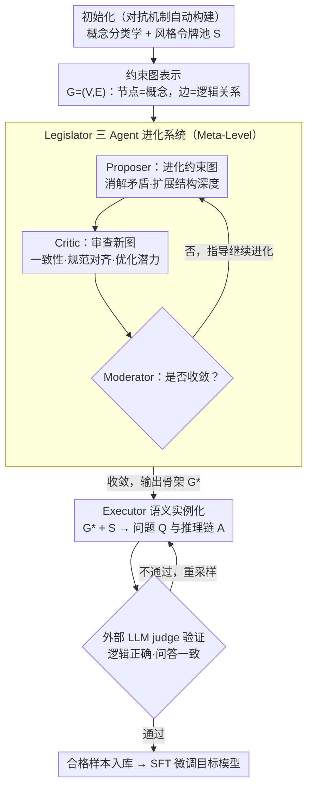

# MathAgent: Adversarial Evolution of Constraint Graphs for Mathematical Reasoning Data Synthesis

**会议**: ACL 2026  
**arXiv**: [2604.11188](https://arxiv.org/abs/2604.11188)  
**代码**: 无  
**领域**: 数据合成 / LLM推理  
**关键词**: 数学推理, 数据合成, 约束图, 对抗进化, Legislator-Executor

## 一句话总结
提出基于约束图对抗进化的分层数据合成框架 MathAgent，将数据合成从文本生成任务重构为约束图的无监督优化问题，通过 Legislator 三Agent系统进化问题骨架再由 Executor 实例化为自然语言，仅 1K 合成样本即超越 LIMO 和 s1K 在八个数学基准上的表现。

## 研究背景与动机

**领域现状**：高质量数学推理数据是提升 LLM 推理能力的关键驱动力之一。随着人工标注数据的规模瓶颈日益凸显，合成数据生成已成为主流研究方向。

**现有痛点**：(1) 种子扩展方法（如 Self-Instruct、WizardMath）受限于初始种子的"语义半径"，多样性有上界；(2) 零样本方法（如 Magpie）直接探测模型分布，缺乏结构引导，容易模式坍缩和逻辑幻觉；(3) 现有方法将数据合成视为直接的文本生成任务，模型往往停留在表面叙事模仿，未能掌握核心推理能力。

**核心矛盾**：直接在 token 空间进行数据合成，无法有效控制问题的逻辑复杂度和结构多样性——高难度、高质量的长尾样本恰恰是锻造复杂推理能力的关键，但标准方法难以发现这些样本。

**本文目标**：设计无需人工种子数据、可自动探索结构空间的合成框架，生成兼具高复杂度和高多样性的数学推理数据。

**切入角度**：将数据合成解耦为结构进化（meta-level）和语义实例化（base-level）两个阶段——先优化问题的逻辑骨架（约束图），再将骨架转化为自然语言题目。

**核心 idea**：用约束图表示数学问题的逻辑结构，通过三Agent对抗进化机制（Proposer-Critic-Moderator）持续优化图结构的复杂度和多样性，再由 Executor 生成自然语言问题和推理链。

## 方法详解

### 整体框架
MathAgent 分为两个解耦阶段：(1) Meta-Level 结构进化：Legislator 三Agent系统在约束图空间中对抗进化，产出优化的问题骨架 $\mathcal{G}^*$；(2) Base-Level 语义实例化：Executor 将 $\mathcal{G}^*$ 和风格令牌 $\mathcal{S}$ 转化为自然语言问题 Q 和推理链 A。最后通过外部模型验证筛选合格样本。

### 关键设计

**1. 约束图表示：把数学题的逻辑骨架从文字里剥离出来**

现有方法把数据合成当成直接的文本生成，模型停留在表面叙事模仿，既控制不了问题的逻辑复杂度，也发现不了高难度的长尾样本。MathAgent 的破局点是不在 token 空间合成，而是先用一张约束图 $\mathcal{G}=(\mathcal{V},\mathcal{E})$ 加风格令牌 $\mathcal{S}$ 来表示问题：节点 $\mathcal{V}$ 是数学概念，边 $\mathcal{E}$ 是它们之间的逻辑关系，$\mathcal{S}$ 控制问题类别、难度级别等全局属性。结构进化的优化目标写成 $\mathcal{G}^*=\arg\max_{\mathcal{G}}\mathcal{H}(\mathcal{G})$，其中 $\mathcal{H}$ 估计图的复杂度，同时用约束 $\mathbb{I}_{\text{valid}}(\mathcal{G}\mid\mathcal{S})=1$ 保证生成的问题仍然可解。这样一来，"问题有多难"由图结构负责，"问题怎么说"留给后面的文本生成，两个正交维度被彻底解耦，框架可以专注堆叠复杂且多样的逻辑结构，而不被表面语言模式束缚。

**2. Legislator 三 Agent 进化系统：用对抗动态把约束图越推越难、越推越多样**

有了图表示，还需要一个机制持续把它往复杂、多样的方向推。Legislator 让三个角色协同迭代：Proposer ($\mathcal{A}_P$) 根据上一轮反馈把 $\mathcal{G}_t$ 进化到 $\mathcal{G}_{t+1}$，负责消解逻辑矛盾、扩展结构深度；Critic ($\mathcal{A}_C$) 从内部一致性、规范对齐、优化潜力三个维度审查新图并写出改进报告；Moderator ($\mathcal{A}_M$) 作为战略决策者，判断进化是否已收敛——收敛就终止，否则指导 Proposer 继续改。连初始化阶段的概念分类学和风格令牌池，也由这套对抗机制自动构建。对抗驱动让系统不断探索结构空间的前沿，发现标准数据集里缺失的高难度样本；而 Moderator 的自适应截断又避免进化过头、产出不可解的问题。

**3. Executor 语义实例化：把优化好的图翻译成自然语言题目和推理链**

复杂度和多样性已经被 Legislator 在图层面保证好了，Executor 只剩"把图说成人话"这一件事。它是一个条件生成模型，基于线性化的图表示采样出问题和答案 $(Q,A)\sim P_{\text{executor}}(\cdot\mid\mathcal{G}^*,\mathcal{S})$，再交给外部 LLM judge 验证逻辑正确性与问答一致性，只有通过验证的样本才留下。因为不必再去探索复杂度空间，Executor 能把全部精力放在语言表述的多样和流畅上，生成效率也更高。

### 一个完整示例：一道竞赛题如何被"进化"出来

以生成一道竞赛级数学题为例。初始化阶段，对抗机制先搭出概念分类学（如"数论—同余""组合—容斥"）和一批风格令牌。Proposer 拿到一个浅约束图当 $\mathcal{G}_0$——比如只有"求满足某同余条件的整数个数"两三个节点。第 1 轮，Proposer 往图里加进"再叠加一个组合计数约束"的节点和边，得到更深的 $\mathcal{G}_1$；Critic 审查后指出"新增约束与原同余条件存在解空间冲突，可能无解"，写进改进报告；Moderator 判断尚未收敛，让 Proposer 据此修正。第 2 轮，Proposer 调整边的逻辑关系消除冲突，复杂度 $\mathcal{H}$ 继续上升且保持 $\mathbb{I}_{\text{valid}}=1$；Critic 认为优化潜力已低，Moderator 宣布收敛，输出 $\mathcal{G}^*$。最后 Executor 把 $\mathcal{G}^*$ 连同"竞赛风格、中等偏难"的风格令牌实例化成一道自然语言题和完整推理链，judge 验证答案自洽后入库。整个过程没有用到任何人工种子题目，难度完全由图的进化深度决定。

### 损失函数 / 训练策略
合成数据用于微调目标模型，采用标准 SFT 训练。验证阶段使用外部 LLM 作为 judge 评估合成 QA 对的逻辑正确性和一致性，仅保留通过验证的样本。

## 实验关键数据

### 主实验

| 模型 | 数据集 | GSM8K | MATH500 | AIME24 | AIME25 | 平均 |
|------|--------|-------|---------|--------|--------|------|
| Qwen3-14B | LIMO | 91.8 | 86.2 | 33.8 | 27.5 | 59.5 |
| Qwen3-14B | s1K | 87.5 | 86.4 | 37.9 | 25.0 | 60.3 |
| Qwen3-14B | **Ours** | **95.4** | **91.8** | **38.8** | **30.0** | **63.9** |
| Qwen2.5-Math-7B | LIMO | 87.4 | 72.2 | 10.8 | 14.6 | 45.6 |
| Qwen2.5-Math-7B | **Ours** | **91.6** | **82.2** | **18.8** | **18.3** | **53.5** |

### 消融实验

| 配置 | 关键指标 | 说明 |
|------|---------|------|
| 完整 MathAgent | 63.9 (Qwen3-14B Avg) | 全部组件 |
| w/o Critic | ~60.5 | 无对抗审查，结构质量下降 |
| w/o 自适应截断 | ~61.2 | 固定进化轮数，效率降低 |
| 直接文本生成 | ~58.0 | 不使用约束图，模式坍缩 |

### 关键发现
- 仅 1K 合成样本即可超越同规模的 LIMO 和 s1K，展现出极强的数据效率
- 在 AIME 等高难度竞赛基准上提升尤为显著，验证了框架在长尾高难度样本上的优势
- 跨模型系列泛化能力强：在 Qwen、Llama、Mistral、Gemma 四个系列共 10 个模型上均有效
- 越小的模型从 MathAgent 数据中受益越大，Qwen3-4B 从 base 的 42.8 提升至 53.5

## 亮点与洞察
- 将数据合成从文本空间提升到结构空间是关键创新——约束图作为中间表示，有效分离了"问题有多难"和"问题怎么说"两个正交维度
- 对抗进化机制不依赖种子数据，从模型内在的概念原语出发即可构建高质量数据，真正实现了"无中生有"
- 自适应截断机制类似于 early stopping，避免了过度进化导致的不可解问题，体现了对合成数据质量与复杂度的精细平衡

## 局限与展望
- 当前仅在数学推理领域验证，能否推广到代码生成、逻辑推理等需要结构化数据的场景尚未探索
- Legislator 系统需要多轮 LLM 交互进行进化，合成成本可能高于简单的种子扩展方法
- 外部 judge 验证可能存在自身盲点，对极端困难问题的正确性判断可能不完全可靠

## 相关工作与启发
- **vs LIMO/s1K**: 这些方法依赖精心筛选的种子数据，MathAgent 完全自动化生成且以更少数据量超越它们
- **vs Self-Instruct**: Self-Instruct 在 token 空间扩展，多样性受限于种子语义半径；MathAgent 在结构空间探索，能发现更远的分布区域
- **vs Magpie**: Magpie 零样本但缺乏结构引导易模式坍缩；MathAgent 通过约束图提供结构骨架

## 评分
- 新颖性: ⭐⭐⭐⭐⭐ 约束图+对抗进化的分层合成框架是全新范式
- 实验充分度: ⭐⭐⭐⭐⭐ 10个模型、8个基准、跨系列验证
- 写作质量: ⭐⭐⭐⭐ 形式化清晰，但部分符号略重
- 价值: ⭐⭐⭐⭐⭐ 1K数据超越主流方法，数据效率惊人

<!-- RELATED:START -->

## 相关论文

- [\[ACL 2026\] Efficient PRM Training Data Synthesis via Formal Verification](efficient_prm_training_data_synthesis_via_formal_verification.md)
- [\[ACL 2026\] Self-Reinforcing Controllable Synthesis of Rare Relational Data via Bayesian Calibration](self-reinforcing_controllable_synthesis_of_rare_relational_data_via_bayesian_cal.md)
- [\[ICML 2026\] An Information-Theoretic Criterion for Efficient Data Synthesis](../../ICML2026/llm_reasoning/an_information-theoretic_criterion_for_efficient_data_synthesis.md)
- [\[ICLR 2026\] DESIGNER: Design-Logic-Guided Multidisciplinary Data Synthesis for LLM Reasoning](../../ICLR2026/llm_reasoning/designer_design-logic-guided_multidisciplinary_data_synthesis_for_llm_reasoning.md)
- [\[ACL 2026\] LegalDrill: Diagnosis-Driven Synthesis for Legal Reasoning in Small Language Models](legaldrill_diagnosis-driven_synthesis_for_legal_reasoning_in_small_language_mode.md)

<!-- RELATED:END -->
