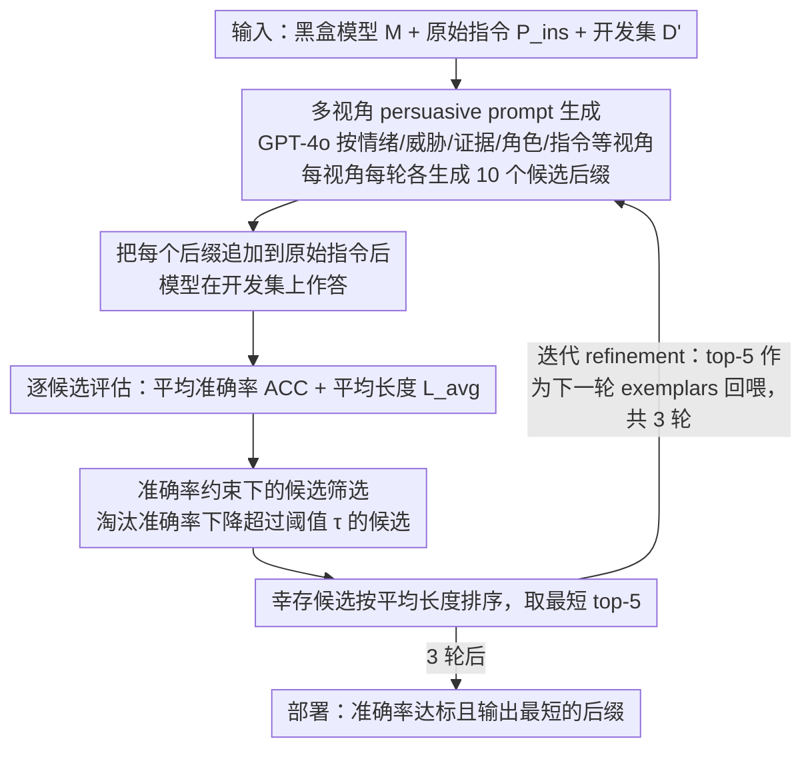

# Merlin's Whisper: Enabling Efficient Reasoning in Large Language Models via Black-box Persuasive Prompting

**会议**: ACL2026  
**arXiv**: [2510.10528](https://arxiv.org/abs/2510.10528)  
**代码**: https://github.com/hemingkx/Whisper  
**领域**: LLM推理效率 / Prompt Optimization  
**关键词**: 推理压缩、黑盒提示、persuasive prompting、overthinking、LRM效率

## 一句话总结
Whisper 把大推理模型的“少想但不降准确率”问题建模为黑盒 persuasive prompting，通过多视角自动生成和迭代筛选提示后缀，在 Qwen3、DeepSeek-R1-Distill 以及 Claude/Gemini API 上显著减少输出 token，同时基本保持推理准确率。

## 研究背景与动机
**领域现状**：DeepSeek-R1、Qwen3、o1 等大推理模型通过长链式思考提升数学和复杂任务表现，但推理轨迹越长，延迟、显存 KV cache 和 API 成本就越高。

**现有痛点**：训练式压缩方法需要额外 SFT 或 RL，成本高且可能损害跨域泛化；白盒 inference intervention 要访问模型内部状态，不适用于闭源 API；简单 prompt 如 “Be concise.” 部署方便，但压缩幅度有限或会降准确率。

**核心矛盾**：大推理模型本身可能具备“简洁推理”的潜力，但默认行为倾向于 overthinking。问题不是模型不会短答，而是用户缺少足够有效的黑盒交互方式去改变这种默认策略。

**本文目标**：作者希望在不训练模型、不访问内部激活、不修改推理引擎的前提下，通过自动生成提示后缀，让 LRM 在保持准确率的同时减少平均输出长度。

**切入角度**：论文借鉴 persuasive prompting。以往这类技术常用于研究 jailbreak 或改变模型行为，本文把它转为正向目标：说服模型采用更紧凑的推理表达。

**核心 idea**：把“高质量简洁推理提示”看成可搜索的黑盒后缀，使用多种说服视角生成候选，在开发集上按准确率约束和输出长度排序，再迭代优化。

## 方法详解
Whisper 的输入不是模型权重，而是一个初始任务指令、一个黑盒模型和一个开发集。它自动生成多个 prompt suffix，把这些 suffix 追加到原始指令后，让模型在同样问题上作答。每个候选后缀都用准确率和平均 token 数评估；准确率掉得太多的候选被丢弃，剩下的按长度排序，最短的 top-k 进入下一轮 prompt 生成。最终选择在开发集上准确率可接受且输出最短的后缀部署。

### 整体框架
给定模型 $M$、原始指令 $P_{ins}$、开发集 $D'$，Whisper 需要找到一个后缀 $P_{adv}$，使模型平均响应长度 $L_{avg}$ 尽可能小，同时平均准确率 $ACC_{avg}$ 不低于容忍阈值。作者用 GPT-4o 作为 prompt generator，每种 persuasive perspective 每轮生成 10 个候选，筛选 top-5 作为下一轮 exemplars，迭代 3 轮。

### 关键设计

**1. 多视角 persuasive prompt 生成：用多种说服策略去撬动模型的"简洁开关"**

一句 "Be concise." 之所以压缩有限，是因为它太弱，碰不到模型真正在意的点。Whisper 改用多种说服视角批量生成候选后缀：emotional appeal（情绪诉求）、threat（威胁）、evidence-based persuasion（证据论证）、role-playing（角色扮演）、detailed instruction（结构化指令）等。比如 evidence 视角会引用"短解释同样有效"这类研究式论证去说服模型，role-play 视角则让模型扮演一个必须极简表达的专家。不同模型对权威证据、角色约束、情绪语境、结构化要求的敏感性并不一样，多视角生成正是为了覆盖这种差异——实验里 Qwen3 系列更吃 evidence-based persuasion，而 DeepSeek-R1-Distill-Qwen 系列里 role-play、instruction、evidence 都能进 top 候选。

**2. 准确率约束下的候选筛选：只压长度，不许压垮准确率**

压缩很容易滑向"短但错"，NoThinking 就是反例——输出极短却大幅掉准确率，不能算成功。Whisper 因此把它当成一个 efficiency-performance trade-off 问题来选：每个候选后缀 $P_{adv}^j$ 在开发集上同时算平均长度 $L_{avg}^j$ 和平均准确率 $ACC_{avg}^j$，凡是准确率下降超过容忍阈值 $\tau$ 的候选直接淘汰，幸存的才按平均长度从短到长排序。这样进入排序的永远是"准确率达标"的后缀，保证搜索朝着"既短又准"而不是"一味更短"的方向走。

**3. 迭代 refinement：让生成器从上一轮的有效后缀里继续学**

手写 prompt 很难一次到位，Whisper 干脆在黑盒空间里做轻量级 prompt evolution：每轮筛出的 top-k 后缀作为下一轮的 exemplars 喂回 GPT-4o，让它参照这些成功例子继续合成新候选。论文实验里压缩收益从第一轮到第三轮持续累积——DeepSeek-R1-Distill-Qwen-14B 的平均 token reduction 从 18% 提到 22%，Qwen3-14B 从 32% 提到 37%——三轮之后趋于饱和。等于用很低的成本，让说服策略一轮比一轮更贴合目标模型的口味。

### 一个完整示例：一个后缀如何被搜出来

以 Qwen3-14B 为例。GPT-4o 在每种 persuasive 视角下每轮各生成 10 个候选后缀，几个视角合起来构成一批候选。每个候选被追加到原始指令后，在开发集（从 PRM800K math split 采样的 100 题）上跑一遍，得到它的平均准确率和平均 token 数。第 1 轮里，那些把准确率拉低超过 $\tau$ 的候选（比如过度威胁导致模型直接给出短而错的答案）被淘汰，剩下的按长度排序，最短的 top-5 留下来作为第 2 轮的 exemplars。GPT-4o 参照这 5 个成功后缀再生成新一批，第 2、3 轮重复同样的"生成 → 准确率筛选 → 长度排序 → 留 top-5"循环。三轮后，开发集上准确率达标且输出最短的那个（evidence 视角）后缀被选中部署——最终让 Qwen3-14B 在 GSM8K 上把平均 token 从 1568 压到 440，准确率还从 95.9 微升到 96.1。

### 损失函数 / 训练策略
Whisper 不训练目标 LRM。优化目标是开发集上的二目标选择：在准确率约束内最小化平均输出长度。实现细节中，作者从 PRM800K math split 随机采样 100 个样本作为 PDSet；推理使用 vLLM，temperature 为 0.6，top-p 为 0.95，最大生成长度为 16,384。GSM8K 和 MATH-500 每题采样 3 次，AMC 2023 和 AIME 2024 每题采样 8 次。

## 实验关键数据

### 主实验
| 模型 | 方法 | Overall Acc. | Overall Ratio | 代表性变化 |
|------|------|------|------|------|
| DeepSeek-R1-Distill-LLaMA-8B | Original | 78.5 | 100% | 原始长推理 |
| DeepSeek-R1-Distill-LLaMA-8B | Whisper | 79.0 | 80.3% | 准确率略升，平均 token 下降约 20% |
| DeepSeek-R1-Distill-Qwen-14B | Original | 85.9 | 100% | 原始长推理 |
| DeepSeek-R1-Distill-Qwen-14B | Whisper | 86.3 | 78.0% | 准确率略升，token 下降约 22% |
| Qwen3-14B | Original | 87.9 | 100% | 原始长推理 |
| Qwen3-14B | Whisper | 89.6 | 63.0% | token 下降约 37%，准确率还更高 |

### 消融实验
| Qwen3-14B 数据集 | Original Acc. / Tok. | Whisper Acc. / Tok. | Ratio |
|------|------|------|------|
| GSM8K | 95.9 / 1568 | 96.1 / 440 | 28.1% |
| MATH-500 | 94.5 / 4398 | 95.2 / 2176 | 49.5% |
| AMC 2023 | 95.0 / 6947 | 96.9 / 4019 | 57.9% |
| AIME 2024 | 66.2 / 11375 | 70.0 / 8659 | 76.1% |

### 关键发现
- Whisper 对简单问题最有效。在 GSM8K 上，Qwen3-14B 平均 token 从 1568 降到 440，接近 3.6 倍压缩，同时准确率从 95.9 提到 96.1。
- 对闭源 API 也有效：论文报告在 MATH-500 上，Claude-3.7-Sonnet-Thinking token 使用减少 46%，Gemini-2.5-Pro-Thinking 减少 50%，且保持原有推理表现。
- out-of-domain 结果显示，数学域优化出的 prompt 可以迁移到 GPQA-Diamond 和 CommonsenseQA。Qwen3-14B 在 GPQA 上 token ratio 为 43.8%，CommonsenseQA 为 41.2%，准确率基本不降。
- 不同模型对视角敏感性不同：Qwen3 系列更吃 evidence-based persuasion，DeepSeek-R1-Distill-Qwen 系列中 role-play、instruction、evidence 都能进入 top candidates。
- 迭代 refinement 有贡献：DeepSeek-R1-Distill-Qwen-14B 的平均 token reduction 从 18% 提到 22%，Qwen3-14B 从 32% 提到 37%。

## 亮点与洞察
- 论文最有意思的地方是把 persuasive prompting 从“攻击/越狱”语境转成效率优化。它说明模型行为可被语言层面的说服策略显著塑形，不一定要动权重。
- Whisper 对闭源 API 的适用性很强。很多推理效率方法只适用于开源模型，而本文的黑盒后缀搜索可以直接用于商业模型调用。
- 结果显示“简洁”不是一个简单指令，而是一种需要被模型相信、接受并稳定执行的行为模式。证据、角色和情境比 bare instruction 更容易改变模型默认的长推理习惯。
- 这类方法也提醒我们：prompt 后缀能强力改变推理长度和风格，因此生产系统需要同时管理效率 prompt 与安全/合规 prompt 的冲突。

## 局限与展望
- 开源模型实验主要集中在 Qwen3 和 DeepSeek-R1-Distill 系列，没有覆盖 Qwen3-235B-A22B 等更大推理模型。
- persuasive perspectives 的集合有限，作者只测试了少数视角；更系统的话语策略搜索可能带来更强压缩，也可能带来更复杂的安全问题。
- 主开发集来自数学推理，虽然 out-of-domain 有结果，但面向代码、法律、医学等任务还需要单独验证。
- 方法依赖开发集评估，每个候选都要实际调用模型；对昂贵闭源 API，搜索成本仍需控制。
- 某些 threat / emotional prompt 在产品语境中不一定合适，未来需要探索更中性、更可审计的 persuasive patterns。

## 相关工作与启发
- **vs SFT / RL 长度惩罚**: 训练式方法能改变模型分布，但需要算力和数据；Whisper 是 plug-and-play 黑盒方法，不改权重。
- **vs DEER / activation steering**: 白盒方法可利用内部状态提前停止或压缩 CoT，但不适用于闭源 API；Whisper 只需要输入输出访问。
- **vs BeConcise / Chain-of-Draft**: 简单短答指令通常压缩有限或损害准确率；Whisper 通过自动搜索和准确率约束找到更稳的后缀。
- **启发**: 推理系统可以把“是否需要长思考”做成可控策略。简单样本用 Whisper 类后缀压缩，难样本保留长推理或配合 verifier，可能比全局统一 CoT 更经济。

## 评分
- 新颖性: ⭐⭐⭐⭐☆ persuasive prompting 用于推理效率的角度新鲜，方法本身是轻量 prompt search。
- 实验充分度: ⭐⭐⭐⭐☆ 覆盖开源与闭源、多 benchmark 和迁移分析，但大模型与更多任务域仍可加强。
- 写作质量: ⭐⭐⭐⭐☆ 问题定义清晰，表格信息充分，部分 persuasive 示例需要读者自行判断产品可接受性。
- 价值: ⭐⭐⭐⭐⭐ 对 API 成本、延迟敏感的 LRM 应用非常实用，尤其适合不能改模型权重的场景。

<!-- RELATED:START -->

## 相关论文

- [\[ICML 2026\] Inducing Overthink: Hierarchical Genetic Algorithm-based DoS Attack on Black-Box Large Language Reasoning Models](../../ICML2026/llm_reasoning/inducing_overthink_hierarchical_genetic_algorithm-based_dos_attack_on_black-box_.md)
- [\[ACL 2026\] ReProbe: Efficient Test-Time Scaling of Multi-Step Reasoning by Probing Internal States of Large Language Models](reprobe_efficient_test-time_scaling_of_multi-step_reasoning_by_probing_internal_.md)
- [\[ICML 2026\] Diagnosing Multi-step Reasoning Failures in Black-box LLMs via Stepwise Confidence Attribution](../../ICML2026/llm_reasoning/diagnosing_multi-step_reasoning_failures_in_black-box_llms_via_stepwise_confiden.md)
- [\[ACL 2026\] SeLaR: Selective Latent Reasoning in Large Language Models](selar_selective_latent_reasoning_in_large_language_models.md)
- [\[ACL 2026\] Foresight Optimization for Strategic Reasoning in Large Language Models](foresight_optimization_for_strategic_reasoning_in_large_language_models.md)

<!-- RELATED:END -->
