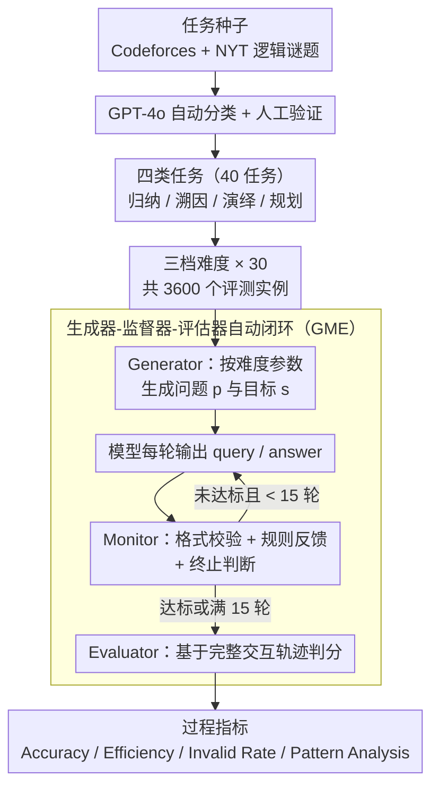

# MTR-Bench: A Comprehensive Benchmark for Multi-Turn Reasoning Evaluation

**会议**: ACL 2026  
**arXiv**: [2505.17123](https://arxiv.org/abs/2505.17123)  
**代码**: https://github.com/LittleCirc1e/mtr_bench  
**领域**: LLM 推理 / 多轮交互评测  
**关键词**: 多轮推理, 自动评测, 交互环境, 难度分层, 推理模式分析  

## 一句话总结
MTR-Bench 构建了一个包含 4 类、40 个任务、3600 个实例的自动化多轮推理评测框架，显示当前前沿推理模型在交互式、动态反馈环境中仍远未可靠。

## 研究背景与动机
**领域现状**：o1、DeepSeek-R1、QwQ 等 reasoning-enhanced LLM 在数学、代码和逻辑题上表现突出，但主流评测大多是 single-turn：模型一次性读题、一次性输出答案。这类评测很难反映真实问题求解中的交互、反馈利用和长期状态维护。

**现有痛点**：已有多轮评测如 MT-Bench 更偏对话连贯性和上下文理解，不专门测推理；GameArena 虽然关注推理，但场景数量少且依赖人类交互，难以大规模、可控地评估。人工参与也会让难度控制和自动复现实验变得困难。

**核心矛盾**：真正的推理系统需要在多轮中主动试探环境、解析反馈、修正计划，并逐步逼近目标；但如果评测环境不可自动化，就很难持续扩展和随着模型进步提高难度。

**本文目标**：构建一个可自动生成题目、自动模拟环境反馈、自动判分的多轮推理 benchmark，覆盖归纳、溯因、演绎和规划等能力，并能按难度参数控制问题复杂度。

**切入角度**：作者把评测任务拆成 Generator、Monitor 和 Evaluator 三个组件。Generator 负责生成不同难度的问题；Monitor 作为规则环境处理模型 query、返回反馈、判断终止；Evaluator 根据完整交互历史计算准确率、效率、非法操作率和推理模式。

**核心 idea**：用封闭、确定性、规则定义的交互环境隔离“纯推理能力”，避免工具使用、开放世界噪声或人工标注成本干扰评测。

## 方法详解

MTR-Bench 的核心不在模型，而在「怎么把多轮推理评测自动化」。它不给模型一个静态题面，而是把模型扔进一个由规则 monitor 控制的环境里反复行动：每轮模型必须输出合法的 query 或 answer，monitor 按任务规则返回反馈并判断是否终止；模型要么达到目标状态，要么撞上最大轮数上限。这样一来，评测就不只盯着最终答案，还能看模型有没有真在利用反馈、做计划，会不会出非法操作。

### 整体框架

整条流水线从任务种子收集开始。作者从公开网站收集高推理强度的任务，经 GPT-4o 自动分类加人工验证后归成四类——Information Probing、Dynamic Adaptation、State Operation、Strategic Gaming；每类挑 10 个任务共 40 个，每个任务再设 easy / medium / hard 三档，每档生成 30 个问题，于是总量恰好是 $4 \times 10 \times 3 \times 30 = 3600$ 个评测实例。

评测时三个组件接力：Generator 按难度参数吐出具体问题 $p$ 和推理目标 $s$；模型每轮产生 query，Monitor 作为确定性环境检查格式是否合法、按规则返回反馈、并判断是否已达目标；交互结束（达标或超过 15 轮上限）后，Evaluator 拿完整对话历史算出各项指标。

### 关键设计

**1. 四类任务，把不同推理机制拆开来测**

如果只用单一游戏或题型，模型很容易对那一类套路过拟合，评出来的「推理能力」掺水。MTR-Bench 因此用四类任务各打一个推理短板：Information Probing 测从固定隐藏信息里逐步归纳，Dynamic Adaptation 测在「答案会随错误尝试改变」的环境里做溯因，State Operation 测先从反馈推断隐藏机制再演绎执行，Strategic Gaming 测带对手或动态系统的多步规划。四类各自隔离一种能力，模型在哪一类掉链子就一目了然。

**2. Generator-Monitor-Evaluator 自动闭环，把人从评测回路里拿掉**

多轮评测最贵的两块成本是「实时环境交互」和「逐轮判分」，过去靠人来做，既难规模化也难复现。这里把它拆成三件确定性组件：Generator 用模板加难度参数批量生成问题，Monitor 是规则写死的环境，负责 query 格式校验、反馈生成和终止判断，Evaluator 则根据最终状态和整条交互轨迹算分。因为每个环节都不依赖人，benchmark 可以反复跑、可扩展，也能随模型变强直接调难度参数加码。

**3. 过程指标，而不是只看最终对错**

只报 final accuracy 会丢掉一大半诊断信息——模型可能答对了但绕了很多轮，也可能不是推理错而是格式不合法直接出局。MTR-Bench 因此同时记四个量：Accuracy 看任务是否完成，Efficiency 在「大家都答对」的题上比谁用的轮数少，Invalid Rate 测格式与操作的合法性，Pattern Analysis 则统计 Associate、Verify、Plan、Feedback 四种推理模式的出现频率。有了这组指标，才能区分「答对但低效」「会用反馈」和「根本没读懂反馈」这些截然不同的失败方式。

### 难度校准策略

本文是评测 benchmark，不训练模型，唯一带「调参」味道的环节是难度校准，且采用迭代试验：比如先用参数 $n=6,7,8$ 给每档各生成 10 个问题试跑，如果三档之间拉不出合理的性能梯度，就换成更分得开的参数（如 $n=6,9,12$）重试，确认梯度合理后再放大到全量评测。

## 实验关键数据

### 主实验
实验覆盖 reasoning-enhanced models 和 non-reasoning instruction models。表中列出各模型在三档难度上的平均准确率，来自论文主表的 AVG 列。

| 模型 | 类型 | Easy AVG | Medium AVG | Hard AVG |
|------|------|----------|------------|----------|
| o3-mini | Reasoning | 56.07 | 41.80 | 31.19 |
| DeepSeek-R1 | Reasoning | 48.62 | 37.33 | 29.19 |
| QwQ-32B | Reasoning | 49.64 | 33.72 | 25.58 |
| Qwen3-235B-A22B-Thinking | Reasoning | 47.45 | 36.20 | 29.08 |
| GPT-4o | Non-reasoning | 28.50 | 16.94 | 12.06 |
| Qwen-Max | Non-reasoning | 32.66 | 19.13 | 12.18 |
| Qwen2.5-72B-IT | Non-reasoning | 29.43 | 19.06 | 12.94 |

### 消融实验
| 分析项 | 数字 / 现象 | 说明 |
|--------|-------------|------|
| 数据规模 | 4 类、40 任务、3600 instances | 每个任务 3 个难度，每档 30 个实例 |
| 最大交互轮数 | 15 turns | 控制所有模型评测预算 |
| 种子来源 | 32 个 Codeforces 任务、8 个 New York Times 逻辑谜题 | Appendix 显示 Codeforces 平均难度 rating 为 2453.13 |
| 难度趋势 | 所有模型从 easy 到 hard 准确率下降 | 说明难度分层有效 |
| 效率分析 | o3-mini 性能最高但效率最低，R1 更高效 | 高准确率不等于更少交互轮数 |
| 小模型表现 | 小于 7B 的模型几乎没有有意义分数 | 该 benchmark 对小模型很难 |

### 关键发现
- reasoning models 明显强于 non-reasoning models，QwQ-32B 甚至超过同系列更强的非推理模型 Qwen-Max。
- R1-Distill 系列在数学和代码中常见的优势没有很好迁移到这些 OOD 多轮任务，说明 SFT distillation 不足以泛化交互推理。
- o3-mini 在 IP 和 SG 上优势突出，但在 DA 和 SO 上与 QwQ-32B、R1 更接近，说明解析复杂环境反馈仍是难点。
- Pattern Analysis 显示 QwQ-32B 和 R1 在 Associate、Verify、Feedback 上明显强于 R1-Distill-Qwen-32B，反馈利用和自检可能是多轮推理的关键能力。

## 亮点与洞察
- 这篇论文的强点是把“多轮推理”做成了可自动运行的环境，而不是人工对话评测。这样 benchmark 可以重复、可扩展，也能随模型能力提升调整难度。
- Monitor 设计很有诊断价值。模型不只会因为推理错误失败，也会因为 query format 不合法、操作越界或没有正确理解反馈而失败。
- 论文指出 o3-mini 强不只是因为更快推理，而是更善于长期规划和利用历史反馈。这对训练 agent 很有启发：多轮能力不是单步 CoT 的简单延长。
- 使用封闭规则环境会牺牲自然语言真实感，但能更干净地测抽象推理，适合做能力诊断基准。

## 局限与展望
- Strategic Gaming 目前使用随机系统策略，作者也承认未来需要更强 adversarial strategies。
- 当前交互格式是结构化的，不是自然语言聊天，因此不能评估模型在自然语言对话中推理和澄清的能力。
- 任务虽然来自公开题源并经过改造，但仍偏 puzzles / competition style，距离开放式真实 agent 任务还有距离。
- 这些交互环境天然适合强化学习训练，后续可以把 MTR-Bench 从纯评测扩展为训练和 curriculum learning 平台。

## 相关工作与启发
- **vs MT-Bench**: MT-Bench 主要看多轮对话质量和上下文理解，MTR-Bench 专门测多轮推理和环境反馈利用。
- **vs GameArena**: GameArena 更接近游戏评测，但场景少且依赖人类；MTR-Bench 有 40 个任务并支持自动判分。
- **vs AgentBench / AgentBoard**: 这些 benchmark 包含工具、网页、操作系统等开放环境；MTR-Bench 刻意使用封闭规则环境来隔离核心逻辑推理。
- **启发**: 训练 reasoning agent 时，应该单独优化反馈解析、状态跟踪、合法动作生成和长期规划，而不是只提升 single-turn final answer accuracy。

## 评分
- 新颖性: ⭐⭐⭐⭐☆ 自动化多轮推理环境设计完整，任务 taxonomy 清晰。
- 实验充分度: ⭐⭐⭐⭐☆ 覆盖模型多、指标多，过程分析比只报 accuracy 更有价值。
- 写作质量: ⭐⭐⭐⭐☆ 结构清楚，但表格较大，部分附录信息对理解任务来源很重要。
- 价值: ⭐⭐⭐⭐☆ 对评测 reasoning models 和训练交互式 agent 都有直接参考意义。

<!-- RELATED:START -->

## 相关论文

- [\[ACL 2026\] HISR: Hindsight Information Modulated Segmental Process Rewards for Multi-turn Agentic Reinforcement Learning](hisr_hindsight_information_modulated_segmental_process_rewards_for_multi-turn_ag.md)
- [\[ICML 2026\] ToolMATH: A Math Tool Benchmark for Realistic Long-Horizon Multi-Tool Reasoning](../../ICML2026/llm_reasoning/toolmath_a_math_tool_benchmark_for_realistic_long-horizon_multi-tool_reasoning.md)
- [\[CVPR 2026\] E-comIQ-ZH: A Human-Aligned Dataset and Benchmark for Fine-Grained Evaluation of E-commerce Posters with Chain-of-Thought](../../CVPR2026/llm_reasoning/e-comiq-zh_a_human-aligned_dataset_and_benchmark_for_fine-grained_evaluation_of_.md)
- [\[ACL 2026\] Scaling Evaluation-Time Compute with Reasoning Models as Evaluators](scaling_evaluation-time_compute_with_reasoning_models_as_evaluators.md)
- [\[ACL 2025\] Beyond the Answer: Advancing Multi-Hop QA with Fine-Grained Graph Reasoning and Evaluation](../../ACL2025/llm_reasoning/beyond_the_answer_advancing_multi-hop_qa_with_fine-grained_graph_reasoning_and_e.md)

<!-- RELATED:END -->
