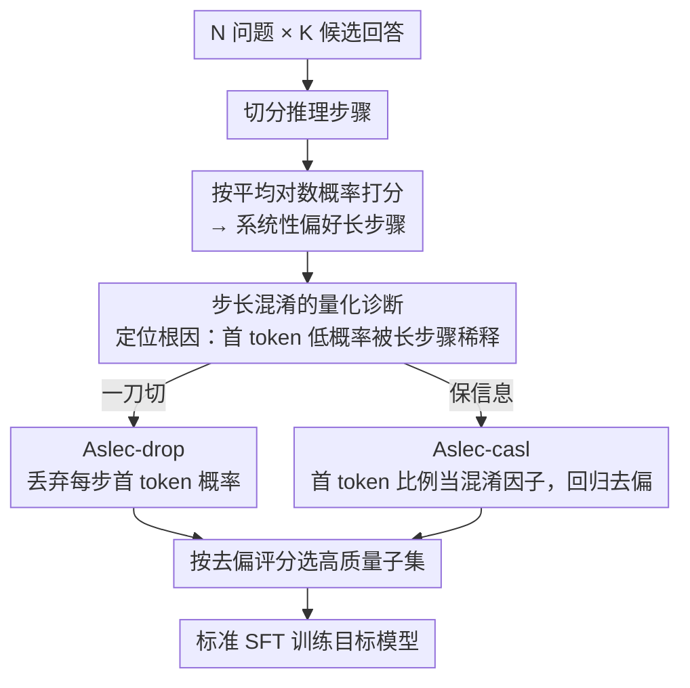

# On the Step Length Confounding in LLM Reasoning Data Selection

**会议**: ACL 2026 Findings  
**arXiv**: [2604.06834](https://arxiv.org/abs/2604.06834)  
**代码**: [GitHub](https://github.com/wangbing1416/ASLEC)  
**领域**: 社会计算  
**关键词**: 推理数据选择, 步长混淆, 自然度, 首token, 因果去偏

## 一句话总结

本文发现基于自然度的 LLM 推理数据选择方法存在"步长混淆"问题——系统性地偏好每步更长的样本而非更高质量的样本，根因是推理步骤首 token 的低概率被长步骤稀释。提出 Aslec-drop（丢弃首 token 概率）和 Aslec-casl（因果回归去偏）两种校正方法，平均准确率提升 6-9%。

## 研究背景与动机

**领域现状**：构建高质量 SFT 数据是训练大推理模型（如 DeepSeek-R1）的核心。现有数据选择方法分为启发式规则（答案正确性、多样性、难度）和基于自然度的方法（用 LLM 对数概率/困惑度评分，选择模型适应度最高的样本）。

**现有痛点**：基于自然度的方法（如 GRACE、Local LP）在长 CoT 数据集上存在严重偏差——它们系统性地偏好每步包含更多 token 的样本，而非真正高质量的样本。选出的数据的步长分布与未选数据有显著差异。

**核心矛盾**：推理步骤的首 token 通常分叉到不同推理分支，因此具有更高的熵和更低的对数概率。长步骤中首 token 的占比更小，其低概率被更多非首 token 稀释，导致长步骤的平均对数概率更高，从而更容易被选中。

**本文目标**：量化并消除这种步长混淆效应，使数据选择不受步长偏差影响。

**切入角度**：从首 token 概率入手——既然问题根源是首 token 的低概率在不同步长下产生不同影响，那就直接干预首 token 的贡献。

**核心 idea**：两种方法——Aslec-drop 直接丢弃首 token 概率不参与评分计算；Aslec-casl 将首 token 比例作为混淆因子，用因果去偏回归去除其影响。

## 方法详解

### 整体框架

任务设定是：给定 $N$ 个问题、每题 $K$ 个候选回答，要从里面挑出高质量子集做 SFT。自然度方法的标准做法是按平均对数概率打分、选分最高的，但这恰恰是步长混淆的来源。本文不改选择规则，而是在「打分」这一步动手，把首 token 对评分的贡献剥离或校正掉，再用去偏后的分数去选数据。

### 关键设计

**1. 步长混淆的量化诊断：先把病根找出来**

在动手治之前，作者先用三步把因果链坐实。第一步观察到：自然度方法选出的数据，其步长分布显著比未选数据更长。第二步逐步长统计平均对数概率，发现它随步长单调递增——步越长越容易被选。第三步定位根因：推理步骤的首 token 往往要分叉到不同推理分支，因此熵高、对数概率低；而步越长，首 token 在该步所有 token 里占比越小，它那份低概率就被更多高概率的非首 token 稀释，于是长步骤的平均对数概率被抬高。诊断到这里，干预点自然落在「首 token」上。

**2. Aslec-drop：干脆把首 token 概率从评分里丢掉**

既然首 token 是混淆源，最直接的办法就是不让它参与评分。Aslec-drop 把回答 $\mathbf{o}_i$ 切成 $L$ 个推理步骤，算平均对数概率时跳过每步的第一个 token，分母也相应换成不含首 token 的总 token 数：

$$s_i^{drop} = \frac{1}{|\mathbf{o}_i| - |\mathcal{S}_i|} \sum_{\mathbf{s}_i^l} \sum_{t=2}^{|\mathbf{s}_i^l|} \log P_\theta(s_{i,t}^l \mid \text{context})$$

这样长短步骤就站到了同一条起跑线上，混淆被一刀切掉。代价是首 token 本身携带的有用信号（它确实反映了模型在分叉点的适应度）也一并被扔了。

**3. Aslec-casl：把步长当混淆因子，用因果回归去偏**

为了既去混淆又保住首 token 的信息，Aslec-casl 换成因果去偏的思路。它把原始对数概率分解成一个线性回归：

$$s_i^{logp} = \beta_1 s_i^{first} + \beta_2 s_i^{drop} + \gamma \mathcal{Z}_i + \epsilon$$

其中 $\mathcal{Z}_i = |\mathcal{S}_i| / |\mathbf{o}_i|$ 是首 token 比例，正是那个混淆因子。用 OLS 估出它的系数 $\gamma$ 后，把它的贡献从原分里减掉，得到去偏评分 $s_i^{casl} = s_i^{logp} - \gamma \mathcal{Z}_i$。相比直接丢弃，这一步只剔除「步长比例」这条混淆通路，首 token 携带的真实信号被保留下来，因此实验里 Aslec-casl 一致优于 Aslec-drop，而且回归有闭式解、开销可忽略。

### 损失函数 / 训练策略

Aslec 是数据选择方法，本身不涉及训练。选出数据后，用标准 SFT（交叉熵损失）训练目标模型即可。

## 实验关键数据

### 主实验（LIMO-v2, Qwen3-4B-Base）

| 方法 | AIME24 | AIME25 | MATH500 | 平均 |
|------|--------|--------|---------|------|
| GRACE | 16.66 | 15.83 | 59.40 | 31.42 |
| Local LP | 19.16 | 20.83 | 71.60 | 36.50 |
| **Aslec-drop** | **30.00** (+10.84) | **28.33** (+7.50) | **77.80** (+6.20) | **44.64** |
| **Aslec-casl** | **31.66** (+12.50) | **30.83** (+10.00) | **80.00** (+8.40) | **47.54** |

### 消融实验

| 分析 | 发现 |
|------|------|
| 步长 vs 总长度 | 步长混淆效应远强于总长度效应 |
| Aslec-drop vs Aslec-casl | Aslec-casl 一致更优，因为保留了首 token 信息 |
| 跨模型一致性 | 在 Qwen3-4B、8B、32B 以及 Llama-3.1-8B 上一致有效 |

### 关键发现
- Aslec-casl 相比 SOTA 方法 Local LP 平均提升约 9.08%，Aslec-drop 提升约 6.28%
- 混淆效应在所有四种自然度方法（GRACE、Local LP、Min Entropy、Min Perplex）中一致存在
- 首 token 的低概率是混淆的根因，与先前关于推理步骤首 token 分叉行为的研究一致
- Aslec-casl 的因果回归有闭式解，计算开销可忽略
- 效果在不同模型大小（4B-32B）和不同数据集（LIMO-v2、AceReason）上一致

## 亮点与洞察
- **"步长混淆"现象的发现**本身就是重要贡献：揭示了一个在 LLM 推理数据选择中被普遍忽视但影响重大的系统性偏差，解释清晰且可复现
- **因果去偏框架的应用**很巧妙：将首 token 比例作为混淆因子，用经典的线性回归因果去偏来消除其影响，方法论上优雅且有效
- **对"首 token 分叉行为"的洞察**连接了推理数据选择和推理过程理解两个研究方向

## 局限与展望
- 线性回归假设步长混淆是线性的，可能遗漏非线性混淆效应
- 步骤分割依赖 "\n\n" 或句子边界，分割方式可能影响结果
- 仅验证了数学推理任务，代码推理、自然语言推理等其他任务的效果未知
- 首 token 的"分叉行为"假设可能不适用于所有推理模式
- 可以进一步探索将步长信息作为正则化目标融入训练

## 相关工作与启发
- **vs GRACE / Local LP**: 这些基于自然度的方法存在步长混淆，Aslec 通过干预首 token 概率直接修正
- **vs 启发式数据选择**: 启发式方法（答案正确性、难度等）不直接考虑模型适应度，Aslec 在保留自然度方法优势的同时去除偏差
- **vs IFD / Deita**: 这些方法使用模型间的 perplexity 差异或 reward model 评分，与自然度方法正交

## 评分
- 新颖性: ⭐⭐⭐⭐⭐ 发现步长混淆现象本身就是重要贡献，因果去偏方法简洁有效
- 实验充分度: ⭐⭐⭐⭐ 多模型多数据集多基准验证，分析透彻
- 写作质量: ⭐⭐⭐⭐⭐ 问题诊断→因果分析→解决方案的逻辑链非常清晰
- 价值: ⭐⭐⭐⭐⭐ 对 LLM 推理数据选择实践有直接且重大的影响

<!-- RELATED:START -->

## 相关论文

- [\[ACL 2026\] Stabilizing Efficient Reasoning with Step-Level Advantage Selection](stabilizing_efficient_reasoning_with_step-level_advantage_selection.md)
- [\[ACL 2026\] Budget-Aware Anytime Reasoning with LLM-Synthesized Preference Data](budget-aware_anytime_reasoning_with_llm-synthesized_preference_data.md)
- [\[ACL 2026\] LLM Reasoning as Trajectories: Step-Specific Representation Geometry and Correctness Signals](llm_reasoning_as_trajectories_step-specific_representation_geometry_and_correctn.md)
- [\[ACL 2026\] MathAgent: Adversarial Evolution of Constraint Graphs for Mathematical Reasoning Data Synthesis](mathagent_adversarial_evolution_of_constraint_graphs_for_mathematical_reasoning_.md)
- [\[ACL 2026\] Efficient PRM Training Data Synthesis via Formal Verification](efficient_prm_training_data_synthesis_via_formal_verification.md)

<!-- RELATED:END -->
