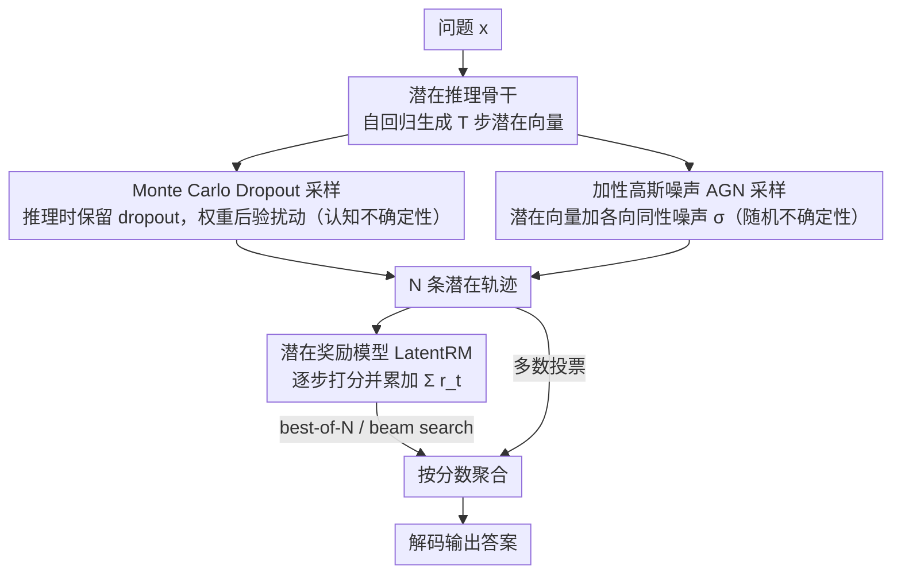

# Parallel Test-Time Scaling for Latent Reasoning Models

**会议**: ACL 2026 Main Conference  
**arXiv**: [2510.07745](https://arxiv.org/abs/2510.07745)  
**代码**: 无  
**领域**: LLM推理  
**关键词**: 测试时缩放, 潜在推理, 随机采样, 奖励模型, 并行推理

## 一句话总结

本文首次将并行测试时缩放（parallel TTS）引入潜在推理模型，提出两种基于不确定性理论的随机采样策略（MC-Dropout 和加性高斯噪声）以及一个步级对比训练的潜在奖励模型（LatentRM），使得在连续向量空间中进行推理的模型也能通过并行采样+聚合获得稳定的性能提升。

## 研究背景与动机

**领域现状**：测试时缩放（TTS）是提升 LLM 推理能力的关键方法。并行 TTS 通过生成多条推理路径并聚合结果（如多数投票、best-of-N、beam search），将额外推理计算直接转化为更强能力。目前这些方法全都依赖于 token 级别的采样机制（如 top-k、nucleus sampling）。

**现有痛点**：最近兴起的潜在推理范式（如 COCONUT、CODI、CoLaR）将推理过程从 token 空间转移到连续向量空间，更紧凑高效，但它们**无法直接使用并行 TTS**。原因有二：(1) 连续向量空间没有显式的概率分布，缺乏采样机制；(2) 没有 token 级别的概率信号用于评估和聚合推理轨迹。

**核心矛盾**：潜在推理在推理效率上有天然优势，但缺少并行缩放能力使其在推理质量上受限。如何在连续空间中引入可控的随机性，并设计有效的轨迹评估机制，是解锁潜在推理模型并行 TTS 的两大障碍。

**本文目标**：为潜在推理模型设计采样和聚合两个核心组件，使其能够像 token-based 模型一样通过并行 TTS 获益。

**切入角度**：作者从不确定性估计理论出发，将采样问题分解为两种不确定性来源——认知不确定性（epistemic）和随机不确定性（aleatoric），分别设计对应的采样策略。对于聚合问题，训练一个专门的评分模型来替代 token 概率信号。

**核心 idea**：用 MC-Dropout（认知不确定性）和加性高斯噪声（随机不确定性）在潜在空间中生成多样化推理轨迹，用步级对比训练的 LatentRM 评估和引导轨迹聚合，实现潜在推理的并行测试时缩放。

## 方法详解

### 整体框架

潜在推理模型拿到问题 $\bm{x}$ 后，在连续向量空间里自回归地生成 $T$ 步潜在向量 $\bm{h}_{1:T}$，最后经一个 end-of-thinking token 切回显式 token 生成、吐出答案。并行 TTS 想做的，是生成很多条不同的推理轨迹再聚合——但潜在空间既没有显式概率分布可采样，也没有 token 概率信号可评分，两件事都卡住了。本文于是补两个组件：用「在潜在空间注入随机性」解决采样，用「专门训练的潜在奖励模型」解决评分与聚合。具体就是先采出 $N$ 条轨迹 $\{\bm{h}^{(n)}\}_{n=1}^N$，再用 LatentRM 打分或多数投票合成最终答案。

### 关键设计

**1. Monte Carlo Dropout 采样：用权重后验的随机性产生认知不确定性**

连续空间没有 top-k / nucleus 那样现成的采样口子，第一种补法是把 dropout 在推理时也保持打开。每次前向都用一套不同的 dropout 掩码 $m^{(n)} \sim \text{Bernoulli}(p)$（加在每个 Transformer block 的前馈层之后），等价于从模型权重后验的变分近似里采出一组不同权重 $\bm{\theta}^{(n)}$，于是每次跑出来的轨迹都不一样。它捕捉的是认知不确定性——模型因训练数据有限而「拿不准」的那部分；好处是噪声强度会自适应，在模型本就不确定的区域探索得更开。

**2. 加性高斯噪声（AGN）采样：在潜在向量上直接加可控扰动产生随机不确定性**

第二种补法更直接：在每个推理步 $t$ 采一份各向同性高斯噪声 $\bm{\epsilon}_t^{(n)} \sim \mathcal{N}(0, \sigma^2 \mathbf{I})$ 加到潜在向量上，$\bm{h}_t^{(n)*} = \bm{h}_t^{(n)} + \bm{\epsilon}_t^{(n)}$，模型再基于扰动后的轨迹继续往下推。噪声强度只由 $\sigma$ 一个量控制，和模型参数无关。它对应的是随机不确定性——输入本身固有的噪声和歧义；几何上它产生各向同性的「烟花」式径向散布，在需要高多样性的设置下比 MC-Dropout 更鲁棒、coverage 衰减更慢。

**3. 潜在奖励模型（LatentRM）：给连续轨迹打分，替掉缺失的 token 概率信号**

有了多条轨迹还得能比较好坏，但传统 PRM 依赖 token 形式的推理步骤，对连续向量无能为力。LatentRM 在潜在推理骨干上加一个评分头，把隐藏状态映射成标量 $r_t = g_{\bm{\phi}}(\bm{x}, \bm{h}_{1:t})$，推理时用累积和 $\sum_t r_t$ 作为整条轨迹的质量代理。它的训练标签靠随机 rollout 拿到：对每个中间 thought 做 $M$ 次随机补全，把答对率当作该 thought 的质量。关键在训练目标——不是对每个候选独立做二分类，而是在每一步 $t$ 对所有 $N$ 个候选的分数做 softmax 比较的步级对比损失，这种「相对排序」信号比 BCE 强得多，消融里换回 BCE 就明显掉点。

### 一个完整示例：一道 GSM 题怎么走完并行 TTS

以 COCONUT 在 GSM-Test 上设 $N=32$ 为例。模型先对同一道题用 MC-Dropout（或 AGN）跑 32 次，每次因掩码 / 噪声不同而走出一条不一样的潜在轨迹；接着 LatentRM 沿每条轨迹逐步打分、累加成 $\sum_t r_t$；best-of-N 直接挑累积分最高的那条解码出答案，beam search 则在中途按分数保留 top-beam、剪掉差的轨迹，多数投票则是对 32 条解码出的答案投票。在这道题的设置下，best-of-N + LatentRM 把准确率从多数投票的 33.6% 抬到 35.4%，更难的 GSM-Hard 上从 6.1% 抬到 7.8%，说明「会打分」确实比「只数票」聚合得更准。

### 损失函数 / 训练策略

LatentRM 的训练用步级对比损失 $\mathcal{L} = -\sum_t \sum_{n=1}^N y_t^{(n)} \log p_t^{(n)}$，其中 $p_t^{(n)} = \frac{\exp(r_t^{(n)})}{\sum_{n'} \exp(r_t^{(n')})}$。监督标签来自随机 rollout 估计的经验正确率 $\tilde{y} = \frac{1}{M} \sum_m \mathbb{I}\{a_m = a^*\}$。

## 实验关键数据

### 主实验

| 模型 | 数据集 | 确定性基线 | Coverage@8 | Coverage@16 |
|------|--------|-----------|------------|-------------|
| Latent-SFT (1B) | GSM8K | 44.5% | 58.5% | 64.9% |
| Latent-SFT (1B) | MultiArith | 93.4% | 96.2% | 96.7% |
| RoT-4B | GSM8K | 37.5% | 39.4% | 39.7% |
| RoT-4B | MATH500 | 20.3% | 21.8% | 22.0% |

聚合方法对比（COCONUT, GSM-Test, N=32）：

| 聚合策略 | GSM-Test | GSM-Hard |
|---------|----------|----------|
| Majority Voting | 33.6% | 6.1% |
| Best-of-N + LatentRM | **35.4%** | **7.8%** |
| Beam Search + LatentRM | ~35% | ~7% |

### 消融实验

| 配置 | GSM-Test | GSM-Hard | 说明 |
|------|----------|----------|------|
| Full LatentRM (Best-of-8) | 35.4% | 7.8% | 完整模型 |
| w/o contrastive (用BCE) | 33.5% | 7.4% | 对比损失去掉后明显下降 |
| w/o stochastic rollouts | 30.7% | 6.0% | 随机 rollout 标注很关键 |
| Random scalar head | 28.9% | 5.8% | 低于多数投票 |

### 关键发现
- MC-Dropout 在大多数设置下 coverage 更高，尤其擅长困难问题（其方向性漂移更容易到达远离确定性解的正确区域）
- AGN 在高多样性设置下更鲁棒，coverage 衰减更缓慢，适合需要高探索性的场景
- 通过 t-SNE 可视化发现：MC-Dropout 产生方向性密集扩展（"定向漂移"），AGN 产生各向同性径向散布（"烟花"模式）
- LatentRM 的步级对比损失贡献最大，去掉后性能显著下降
- 随着采样数量增加，不同模型之间的性能差距缩小

## 亮点与洞察
- **不确定性理论驱动的采样设计**非常优雅：将采样问题分解为认知不确定性和随机不确定性两类，分别用 MC-Dropout 和 AGN 解决，且两者展现出互补的几何探索模式。这种分析框架可迁移到其他连续空间的搜索问题
- **LatentRM 的设计思路**：用随机 rollout 获得 thought 级标签 + 步级对比训练，解决了"连续向量无法评分"的核心难题，可推广到其他非 token 形式的中间表示评估
- **覆盖率 vs 多样性的"甜蜜点"分析**很有启发：过高或过低的多样性都不好，存在最优点

## 局限与展望
- 实验主要在小模型（GPT-2 124M、Llama-3.2-1B）上进行，潜在推理本身在困难数学题（AIME）和博士级别基准（GPQA）上绝对性能仍然有限
- MC-Dropout 和 AGN 都需要超参数调优（dropout rate 和噪声标准差），虽然文中提供了启发式范围
- LatentRM 需要额外训练，增加了部署复杂度
- 未探索将采样和聚合整合到强化学习框架中，通过迭代反馈优化潜在轨迹
- 潜在推理范式本身仍在发展中，与 token-based CoT 相比在复杂任务上还有差距

## 相关工作与启发
- **vs Self-Consistency（多数投票）**: Self-Consistency 在 token 空间用多样采样 + 投票，本文将类似思路推广到连续潜在空间，且通过 LatentRM 实现了比投票更强的聚合
- **vs COCONUT/CODI/CoLaR**: 这些是潜在推理基础模型，本文在它们之上添加并行 TTS 能力，是正交的增强
- **vs Stochastic Soft Thinking**: Soft Thinking 在 token 概率空间操作（软 token 是 token embedding 的混合），本文在纯潜在向量空间操作，不受词表结构约束

## 评分
- 新颖性: ⭐⭐⭐⭐ 首次将并行 TTS 引入潜在推理是清晰且有价值的贡献，但采样方法本身（dropout/noise）并不新颖
- 实验充分度: ⭐⭐⭐⭐ 覆盖多个模型/基准/采样策略，有丰富的可视化分析和消融
- 写作质量: ⭐⭐⭐⭐⭐ 动机清晰，结构合理，理论推导和实验分析都很到位
- 价值: ⭐⭐⭐⭐ 为潜在推理范式补上了重要的缩放能力，有实际指导意义

<!-- RELATED:START -->

## 相关论文

- [\[ACL 2026\] Efficient Test-Time Scaling via Temporal Reasoning Aggregation](efficient_test-time_scaling_via_temporal_reasoning_aggregation.md)
- [\[ICLR 2026\] ATTS: Asynchronous Test-Time Scaling via Conformal Prediction](../../ICLR2026/llm_reasoning/atts_asynchronous_test-time_scaling_via_conformal_prediction.md)
- [\[ACL 2026\] Scaling Test-Time Compute to Achieve IOI Gold Medal with Open-Weight Models](scaling_test-time_compute_to_achieve_ioi_gold_medal_with_open-weight_models.md)
- [\[ICLR 2026\] Understanding the Role of Training Data in Test-Time Scaling](../../ICLR2026/llm_reasoning/understanding_the_role_of_training_data_in_test-time_scaling.md)
- [\[ICLR 2026\] Plan and Budget: Effective and Efficient Test-Time Scaling on Reasoning LLMs](../../ICLR2026/llm_reasoning/plan_and_budget_effective_and_efficient_test-time_scaling_on_reasoning_large_lan.md)

<!-- RELATED:END -->
