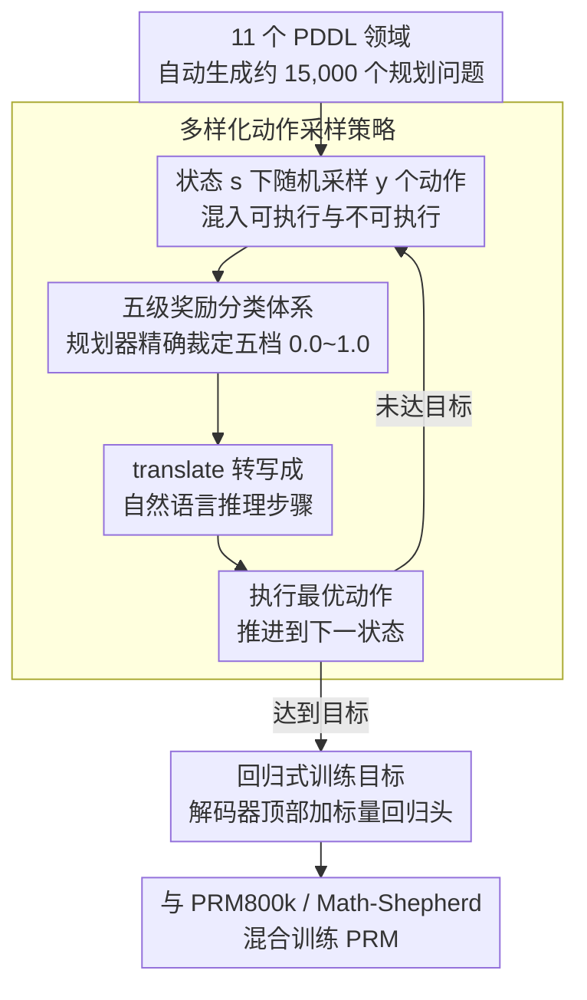

# Process Reward Models Meet Planning: Generating Precise and Scalable Datasets for Step-Level Rewards

**会议**: ACL 2026  
**arXiv**: [2604.17957](https://arxiv.org/abs/2604.17957)  
**代码**: [https://github.com/Babelscape/prm-meets-planning/](https://github.com/Babelscape/prm-meets-planning/)  
**领域**: LLM推理  
**关键词**: 过程奖励模型, PDDL, 规划问题, 步骤级奖励, 推理评估

## 一句话总结
本文提出利用规划领域定义语言（PDDL）自动生成大规模、高精度的步骤级奖励数据集，用于训练过程奖励模型（PRM），在数学和非数学推理基准上均取得显著提升。

## 研究背景与动机

**领域现状**：过程奖励模型（PRM）已成为评估大语言模型推理质量的重要工具，通过对思维链（CoT）中每一步给出奖励反馈，可以检测中间推理步骤中的错误——即使最终答案正确，中间步骤仍可能存在逻辑缺陷。

**现有痛点**：现有的 PRM 训练数据集存在三个核心问题。第一，PRM800k 依赖人工标注，成本高、难以扩展，且标注者之间的一致率仅要求 75%，意味着高达 25% 的标注可能有误。第二，Math-Shepherd 虽然采用自动标注（通过 LLM 生成多个续写来估计步骤质量），但计算成本极高，且只能给出粗粒度的二元标签。第三，几乎所有现有数据集都局限于数学领域，缺乏对更广泛逻辑推理的覆盖。

**核心矛盾**：高质量的步骤级奖励数据需要精确的标注和广泛的领域覆盖，但人工标注昂贵且不可靠，而自动方法（如 LLM 采样）又缺乏精确性和多样性。

**本文目标**：设计一种可扩展、高精度、跨领域的 PRM 数据集自动生成框架。

**切入角度**：作者注意到规划问题天然具备逻辑推理的结构——每个规划动作对应一个推理步骤，且动作的正确性可以通过规则精确判定（是否可执行、是否最优、是否导致死胡同等）。这种结构化的特性使得 PDDL 成为生成精确步骤级奖励的理想来源。

**核心 idea**：将 PDDL 规划问题转化为自然语言推理链，利用规划器自动精确地为每个步骤分配五级奖励（0.0–1.0），从而构建大规模高质量的 PRM 训练数据。

## 方法详解

### 整体框架
整个流程分为三个阶段：（1）PDDL 问题生成：在 11 个不同的 PDDL 领域中自动生成约 15,000 个规划问题；（2）数据集构建：对每个问题的每一步进行随机动作采样和最优动作计算，并为每个动作分配精确的五级奖励；（3）PRM 训练：将 PDDL 生成的数据与现有数据集（PRM800k 或 Math-Shepherd）结合训练 PRM。

### 关键设计

**1. 五级奖励分类体系：用规划器把每个推理步骤精确判到五档，而不是粗暴地二分对错**

现有数据集要么二元（对/错）、要么三级，监督信号太粗，没法区分「彻底错」「不完全错但也不够好」「最优」之间的层次。本文把每步动作精确分成五档并对应连续奖励值：Non-executable（不可执行，0.0）→ Dead-end（死胡同，0.25）→ Backtracking（需要回溯，0.5）→ Suboptimal（次优但可行，0.75）→ Optimal（最优，1.0）。判定不靠人也不靠 LLM 猜，而是交给外部规划器（Fast Downward + A* + LM-Cut）按规则精确裁定每个动作落在哪一档。其中「回溯」和「次优」这两个中间档尤其有价值，因为它们刻画的正是真实推理里最常见、却最难标的灰色地带。

**2. 多样化动作采样策略（Algorithm 1）：在同一个状态下同时造出好动作和坏动作，喂给 PRM 学对比**

要让 PRM 学会区分质量，数据里就得既有正样本也有负样本，且最好是同一上下文下的对比。算法的做法是：在每个状态 $s$ 下先随机采样 $y$ 个动作（故意混入可执行和不可执行的），对每个动作用 eval_action 评出五档之一、再用 translate 转写成自然语言推理步骤；然后执行其中的最优动作推进到下一个状态，如此循环直到抵达目标状态。这样走一遍，整条推理链的每一步都自带一组「同状态、不同质量」的对比样本，PRM 看到的就不再是孤立的好或坏，而是直接的优劣对照。

**3. 回归式训练目标：五档连续奖励天生适合回归，而不是再拍成分类标签**

既然 PDDL 数据给出的是 0.0–1.0 的连续奖励值，把它硬塞回「好/坏」分类反而丢掉了这份精度。本文直接在解码器顶部加一个标量回归头，让模型逐步预测连续奖励值。实验也印证了这一点：回归目标在多数基准上优于分类目标，在 OlympiadBench、Omni-MATH 这类困难基准上差距尤其明显。

### 损失函数 / 训练策略
采用 head-based 架构，在解码器顶部添加回归头预测标量奖励。训练时将 PDDL2PRM 数据与 PRM800k 或 Math-Shepherd 混合使用——PDDL 数据提供精确的推理信号，现有数据集提供更自然的推理表达模式。

## 实验关键数据

### 主实验（ProcessBench 基准）

| 模型 | GSM8K F1 | MATH F1 | OlympiadBench F1 | Omni-MATH F1 | 平均 F1 |
|------|----------|---------|-------------------|--------------|---------|
| Qwen2.5-Math-7B-PRM800k | 68.2 | 62.6 | 50.7 | 44.3 | 56.5 |
| +PDDL (回归) | **77.3** | **70.1** | **52.4** | **51.6** | **62.9** |
| Llama-3.1-8B-PRM800k | 61.1 | 51.3 | 36.5 | 38.6 | 46.9 |
| +PDDL (回归) | **71.4** | **54.6** | 34.2 | 36.8 | **49.3** |

### 消融实验

| 配置 | 平均 F1 | 说明 |
|------|---------|------|
| Qwen2.5-Math-PRM800k+PDDL (回归) | 62.9 | 完整模型 |
| Qwen2.5-Math-PRM800k (回归) | 60.6 | 去掉 PDDL 数据后降 2.3 |
| Qwen2.5-Math-PRM800k (分类) | 57.2 | 分类目标比回归差 3.4 |
| Qwen2.5-Math-MathShepherd+PDDL (回归) | 34.2 | Math-Shepherd 基线也有提升 |

### 关键发现
- 在所有基准上，添加 PDDL 数据后 PRM 性能一致提升，平均 F1 提升 2.4–6.4 个百分点
- 回归训练目标在大多数情况下优于分类目标，尤其在困难基准（OlympiadBench、Omni-MATH）上差异明显
- PDDL 数据在非数学推理任务上的提升更为显著（Rooms 域作为 held-out 测试域验证了跨领域泛化能力）
- 数据集包含约 100 万个推理步骤，覆盖 11 个 PDDL 领域，生成过程完全基于 CPU，无需 GPU

## 亮点与洞察
- **规划问题作为推理监督源**的 idea 非常巧妙——PDDL 的形式化特性使得步骤级奖励可以通过规则精确判定，完全避免了人工标注和 LLM 采样的不确定性。这个思路可以推广到其他具有可验证中间步骤的形式化任务
- **五级奖励分类体系**比简单的二元标注更符合推理步骤的实际质量分布。"回溯"和"次优"这两个中间类别特别有价值，因为它们代表了"不完全错误但也不够好"的推理
- PDDL 数据的生成完全不需要 GPU，且高度可并行化，在成本效率上远优于 LLM 采样方法

## 局限与展望
- PDDL 生成的自然语言推理链基于模板翻译，缺乏真实 CoT 的流畅性和多样性，因此只能作为增强数据而非独立训练
- 目前仅验证了 11 个规划领域，更复杂的 PDDL 领域可能生成过长的推理链，超出 PRM 的处理能力
- 论文没有探索将 PDDL 数据与更大规模的 PRM（如 70B）结合的效果
- 可以考虑设计更细粒度的奖励层级，或利用规划启发式函数提供连续的奖励值而非离散的五级

## 相关工作与启发
- **vs PRM800k**: PRM800k 依赖人工标注（$25/hr），本文方法零成本自动生成，且标注精度更高（规则判定 vs 人类 75% 一致率）
- **vs Math-Shepherd**: Math-Shepherd 通过 LLM 多次采样估计步骤质量，计算成本高且只能给二元标签；本文通过规划器直接给出五级精确奖励
- **vs VersaPRM**: VersaPRM 也尝试扩展到非数学领域，但仍依赖 LLM 作为 judge，存在标注噪声

## 评分
- 新颖性: ⭐⭐⭐⭐⭐ 将 PDDL 规划问题引入 PRM 数据生成是一个非常新颖且优雅的 idea
- 实验充分度: ⭐⭐⭐⭐ 多模型、多基准的实验较完整，但缺少更大规模模型的验证
- 写作质量: ⭐⭐⭐⭐ 结构清晰，形式化严谨，但方法部分符号较多
- 价值: ⭐⭐⭐⭐ 提供了一种低成本、高精度的 PRM 数据生成范式，具有很好的实用价值

<!-- RELATED:START -->

## 相关论文

- [\[ACL 2026\] Efficient Process Reward Modeling via Contrastive Mutual Information](efficient_process_reward_modeling_via_contrastive_mutual_information.md)
- [\[ACL 2026\] C2: Scalable Rubric-Augmented Reward Modeling from Binary Preferences](c2_scalable_rubric-augmented_reward_modeling_from_binary_preferences.md)
- [\[ACL 2026\] Stabilizing Efficient Reasoning with Step-Level Advantage Selection](stabilizing_efficient_reasoning_with_step-level_advantage_selection.md)
- [\[ACL 2026\] HISR: Hindsight Information Modulated Segmental Process Rewards for Multi-turn Agentic Reinforcement Learning](hisr_hindsight_information_modulated_segmental_process_rewards_for_multi-turn_ag.md)
- [\[NeurIPS 2025\] Smaller Models, Smarter Rewards: A Two-Sided Approach to Process and Outcome Rewards](../../NeurIPS2025/llm_reasoning/smaller_models_smarter_rewards_a_two-sided_approach_to_process_and_outcome_rewar.md)

<!-- RELATED:END -->
