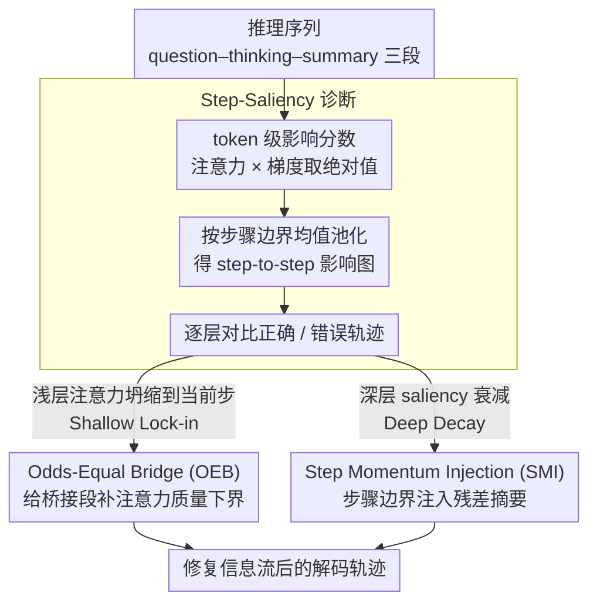

# Reasoning Fails Where Step Flow Breaks

**会议**: ACL 2026  
**arXiv**: [2604.06695](https://arxiv.org/abs/2604.06695)  
**代码**: [GitHub](https://github.com/XiaoyuXu-Vincent/step-saliency)  
**领域**: 可解释性  
**关键词**: 推理模型可解释性, 信息流分析, 测试时干预, 注意力机制, 思维链

## 一句话总结
提出 Step-Saliency 诊断工具发现大推理模型中两种深度相关的信息流失败模式（Shallow Lock-in 和 Deep Decay），并设计 StepFlow 测试时干预方法在不重训练的情况下修复信息传播、提升推理准确率。

## 研究背景与动机

**领域现状** 大推理模型（LRM）通过生成长思维链（CoT）在数学、科学和代码任务上取得了优异表现，但其行为仍然不稳定且难以解释。现有分析工具大多在 token 级别工作，面对长推理轨迹时信号密集嘈杂，难以总结步骤间的依赖关系。

**现有痛点** 当前的可解释性方法分为两类：注意力分析和梯度显著性分析。注意力权重不一定忠实反映预测驱动因素；梯度显著性虽然更贴近模型实际计算，但在长序列上噪声大、难以跨位置聚合。核心问题不是缺少信号，而是缺少与推理步骤对齐的可读单元。

**核心矛盾** 模型出错时，我们无法将最终错误归因到内部推理轨迹的哪一步出了问题——token 级别的 saliency map 太密集，无法直观地揭示步骤间的信息流断裂。

**本文目标** 设计一种步骤级别的诊断工具，能够追踪不同网络深度上步骤之间的影响关系，并基于诊断结果设计测试时干预来修复信息流。

**切入角度** 将 token 级别的 attention-gradient 影响分数通过均值池化聚合到步骤级别，形成紧凑的 step-to-step saliency map，然后逐层分析正确和错误推理轨迹的差异。

**核心 idea** 错误推理的根源在于信息流断裂——浅层过度关注当前步骤（Shallow Lock-in），深层逐渐丧失对思维段的注意力（Deep Decay）。通过在浅层和深层分别施加针对性干预，可以修复这些信息流缺陷。

## 方法详解

### 整体框架
Step-Saliency 是一个诊断工具，StepFlow 是基于诊断的干预方法。整体 pipeline 为：(1) 将推理序列分割为 question-thinking-summary 三段；(2) 计算 token 级 attention-gradient 影响分数并池化为 step-to-step map；(3) 逐层分析 saliency 模式，识别 Shallow Lock-in 和 Deep Decay；(4) 在解码时通过 OEB 和 SMI 两个组件修复信息流。

### 关键设计

**1. Step-Saliency 诊断：把 token 级 saliency 池化成步骤级影响图，让长推理链第一次有了可读的分析单元**

长推理轨迹上做归因，最大的障碍不是没信号，而是 token 级 saliency map 太密太吵，根本看不出步骤之间谁影响了谁。Step-Saliency 的做法是先在 token 级算「注意力 × 梯度」的影响分数——对每层每头取注意力权重与其梯度乘积的绝对值再平均：

$$I^{(\ell)}_{t\leftarrow k} = \frac{1}{H}\sum_h \left| A^{(\ell,h)}_{t,k} \cdot \frac{\partial \mathcal{L}_t}{\partial A^{(\ell,h)}_{t,k}}\right|$$

然后按推理步骤的边界对这张密集图做均值池化，得到一张紧凑的 step-to-step 影响矩阵。池化既抑制了 token 级噪声，又把跨步骤的依赖模式显式地铺出来，逐层一看就能对比正确轨迹和错误轨迹的差异——这正是后面发现 Shallow Lock-in 和 Deep Decay 两种失败模式的前提。

**2. Odds-Equal Bridge (OEB) — 浅层干预：不让浅层的注意力全部坍缩到当前这一步上**

诊断发现，浅层的错误轨迹几乎把所有注意力都压在当前步骤和它的邻居上，把问题本身和早期推理步骤全忘了——这就是 Shallow Lock-in。OEB 针对它做的是：把 key 分成当前段 $\mathcal{S}$、桥接段 $\mathcal{B}$（早期上下文）和其他 $\mathcal{O}$ 三块，给桥接段设一个注意力质量下界 $\tau_\mathcal{B} = \min\!\big(\sqrt{|\mathcal{B}|/(|\mathcal{B}|+|\mathcal{S}|)},\,\tau_{\max}\big)$，一旦桥接段实际拿到的注意力质量低于这个下界，就通过 KL 投影调整 logits 把份额补回去。这样既保证早期上下文不被浅层无视，又不至于粗暴地推翻原本的注意力分布。

**3. Step Momentum Injection (SMI) — 深层干预：在步骤边界塞一点上一步的残差摘要，接住正在衰减的信息流**

深层的失败模式是 Deep Decay——thinking 段的 saliency 快速衰减、summary 越来越只关注自己，导致从早期推理到结论的链路断掉。SMI 在相邻步骤 $\Gamma_i$ 与 $\Gamma_{i+1}$ 的边界上算一个步骤级动量向量 $\mathbf{m}_{\text{prev}} = \frac{1}{|\Gamma_i|}\sum_{k\in\Gamma_i}\mathbf{v}_k$，再把它注入到下一步第一个 token 的隐藏状态：$\mathbf{h}'_t = \mathbf{h}_t + \alpha\,\mathbf{m}_{\text{prev}}$。等于在每个步骤交接处留下一小份前一步的「惯性」，把早期推理的信息一路传到 summary，避免深层把它丢光。

### 损失函数 / 训练策略
StepFlow 是纯测试时干预，**不需要任何训练或反向传播**。它在单次解码过程中修改前向传播：OEB 作用于浅层的注意力 logits，SMI 作用于深层的残差流。每个模型只需选择一个 $\tau_{\max}$ 和 $\alpha$，在小验证集上调节。

## 实验关键数据

### 主实验

| 模型 + 方法 | AIME24 | AIME25 | MATH-500 | GPQA-D | LiveCodeBench |
|------------|--------|--------|----------|--------|---------------|
| R1-Distill-7B baseline | 54.0 | 39.2 | 92.8 | 49.1 | 37.6 |
| R1-Distill-7B + StepFlow | 62.5 | 43.8 | 93.8 | 57.6 | 47.1 |
| R1-Distill-32B baseline | 72.6 | 54.9 | 94.3 | 62.1 | 57.2 |
| R1-Distill-32B + StepFlow | 74.5 | **66.7** | 95.6 | 64.5 | 63.0 |
| GPT-OSS-20B medium baseline | 63.4 | 62.0 | 89.2 | 65.2 | 70.0 |
| GPT-OSS-20B medium + StepFlow | 66.0 | 69.2 | 90.5 | 70.3 | **79.5** |

### 消融实验

| 配置 | AIME25 | GPQA-D | LiveCodeBench | 说明 |
|------|--------|--------|---------------|------|
| Baseline | 62.0 | 65.2 | 70.0 | GPT-OSS-20B medium |
| + OEB only | 64.5 | 66.7 | 74.5 | 修复浅层 lock-in |
| + SMI only | 64.0 | 67.2 | 75.0 | 修复深层 decay |
| + OEB + SMI (StepFlow) | **69.2** | **70.3** | **79.5** | 两者互补效果最佳 |

### 关键发现
- StepFlow 在竞赛级数学问题上提升最大（R1-32B 在 AIME25 上 +11.8），因为这些问题需要跨多步传播信息
- 在 LiveCodeBench 上按难度分解：Easy +3.4, Medium +13.8, Hard +14.2，越难越有效
- 修复的错误类型中，算术进位传播（34%）和前提遗忘（38%）占 72%，概念错误很少被修复
- 在匹配计算量（~1.35x）下，StepFlow 增益是延长生成的 5.7 倍；达到 StepFlow 的准确率需要 8 路 self-consistency（8x 计算量）

## 亮点与洞察
- 将 token 级分析提升到 step 级是关键创新，使长推理轨迹的分析变得可行且直观
- 诊断-干预的范式非常优雅：先用 Step-Saliency 发现问题（Shallow Lock-in / Deep Decay），再用 OEB / SMI 精准修复
- 不需要重训练，纯推理时干预，适用于任何开源 LRM，实用性强
- 计算开销仅约 1.35x，远优于多路采样投票

## 局限与展望
- 浅层/深层的分界需要在小验证集上调节，缺少完全自动的层范围选择方法
- 干预设计空间未充分探索（如 head 级别的 steering 或 value-space 投影）
- Shallow Lock-in 和 Deep Decay 与最终错误之间的因果关系仍是启发性的，未被严格证明
- 仅对开源 LRM 有效，无法应用于黑盒 API 模型

## 相关工作与启发
- 与 Yan et al. 的注意力级别干预互补，后者在注意力层面保留 CoT 上下文
- 可以与 self-consistency 正交组合，StepFlow + SC(k=2) 在 ~2.7x 计算量下超越 SC(k=4) 在 4x 计算量的表现
- Step-Saliency 框架可以扩展到其他长序列生成任务（如长文档写作、多轮对话）的信息流分析

## 评分
- 新颖性: ⭐⭐⭐⭐⭐ 步骤级 saliency + 诊断驱动干预是全新范式
- 实验充分度: ⭐⭐⭐⭐⭐ 6个benchmark、5种backbone、详细消融和计算量归一化比较
- 写作质量: ⭐⭐⭐⭐⭐ 诊断→干预的逻辑链清晰，图表精心设计
- 价值: ⭐⭐⭐⭐⭐ 对理解和改进推理模型有直接实用价值，开箱即用

<!-- RELATED:START -->

## 相关论文

- [\[ACL 2026\] How Chain-of-Thought Works? Tracing Information Flow from Decoding, Projection, and Activation](how_chain-of-thought_works_tracing_information_flow_from_decoding_projection_and.md)
- [\[ACL 2026\] Step-GRPO: Internalizing Dynamic Early Exit for Efficient Reasoning](step-grpo_internalizing_dynamic_early_exit_for_efficient_reasoning.md)
- [\[ICML 2026\] The Deterministic Horizon: When Extended Reasoning Fails and Tool Delegation Becomes Necessary](../../ICML2026/llm_reasoning/the_deterministic_horizon_when_extended_reasoning_fails_and_tool_delegation_beco.md)
- [\[ACL 2026\] LLM Reasoning as Trajectories: Step-Specific Representation Geometry and Correctness Signals](llm_reasoning_as_trajectories_step-specific_representation_geometry_and_correctn.md)
- [\[ACL 2026\] DRP: Distilled Reasoning Pruning with Skill-aware Step Decomposition for Efficient Large Reasoning Models](drp_distilled_reasoning_pruning_with_skill-aware_step_decomposition_for_efficien.md)

<!-- RELATED:END -->
