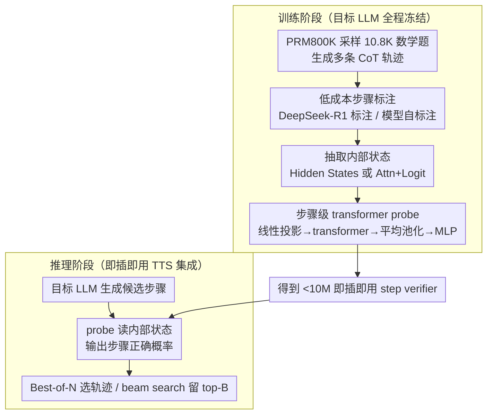

# ReProbe: Efficient Test-Time Scaling of Multi-Step Reasoning by Probing Internal States of Large Language Models

**会议**: ACL2026  
**arXiv**: [2511.06209](https://arxiv.org/abs/2511.06209)  
**代码**: https://reprobe.github.io/  
**领域**: LLM推理  
**关键词**: 测试时扩展、过程验证、内部状态探针、PRM、思维链

## 一句话总结
这篇论文提出 ReProbe，用少于 10M 参数的轻量 transformer probe 读取冻结 LLM 的隐藏状态、注意力和 logits 来判断每一步推理是否可信，在数学、规划和问答任务上接近或超过大 750-810 倍的 PRM，并能作为 Best-of-N 和 beam search 的高效 step verifier。

## 研究背景与动机
**领域现状**：Chain-of-Thought 和大型推理模型让 LLM 能生成长推理链，但长链条里任何一步错误都可能把最终答案带偏。测试时扩展通过采样多条候选推理、筛选更可靠的中间步骤或完整轨迹来提升准确率，常见形式包括 Best-of-N 和 beam search。

**现有痛点**：当前主流 step verifier 是 Process Reward Model。PRM 通常是 1.5B 到 8B 参数的独立 LLM，需要大量步骤级标注、Monte-Carlo rollouts 或昂贵的人类/LLM 判断；推理时还要额外跑一个大模型，显存和延迟都高。更重要的是，许多 PRM 在数学上训练得很强，但跨到规划、问答等 OOD 任务时泛化有限。

**核心矛盾**：推理时扩展需要一个可靠 scorer，但 scorer 越强通常越大、越贵、越领域化；简单不确定性指标很便宜，却不够准确。理想方案应该像 PRM 一样能判断过程质量，又像 uncertainty probe 一样轻量。

**本文目标**：作者希望验证一个假设：LLM 在生成推理步骤时，其内部状态已经编码了“这一步是否可信”的信号；只要用一个小 probe 把信号读出来，就可以替代或补充 PRM。

**切入角度**：过去 hallucination detection 研究表明，隐藏状态、注意力分布和 logits 中含有模型自知信号。ReProbe 把这种 introspection 思路从事实幻觉检测迁移到多步推理验证。

**核心 idea**：不用另一个大模型读文本来打分，而是让小型探针直接读目标 LLM 生成时已经产生的内部状态，并输出当前推理步骤正确的概率。

## 方法详解
ReProbe 是一个 plug-and-play step verifier。它不改变被监督的 LLM，也不生成新的推理文本，只在目标模型生成每个推理步骤时抽取内部特征，然后给这一步打一个 correctness score。这个分数可以像 PRM reward 一样用于 Best-of-N 轨迹选择，也可以在 beam search 中选择下一批 partial trajectories。

### 整体框架
训练阶段先从 PRM800K 的训练问题中采样 10.8K 个数学题，让目标 LLM 生成多条 CoT 轨迹，再由 DeepSeek-R1 或目标模型自身给每个步骤打正确/错误标签。然后冻结目标 LLM，抽取每个步骤对应的内部特征，训练 ReProbe 做二分类。推理阶段，目标 LLM 生成候选步骤；ReProbe 实时读取内部状态并输出 step score；TTS 策略根据分数保留最可信的步骤或完整轨迹。

### 关键设计

**1. 读内部状态而非评审外部文本：让验证信号来自模型生成时的“内部犹豫”**

PRM 的根本局限在于它只是另一个语言模型，看到的只有目标模型已经写出来的推理文本——文本表面平滑不代表模型当时真的有把握。ReProbe 换一个入口：直接读目标 LLM 在生成这一步时已经产生的内部信号。作者比较了两类特征，一类记为 Attn+Logit，包含所有层对前 5 个 token 的注意力权重以及 top-K 候选生成的 logits；另一类是所有层的 hidden states。每个 token 的特征都建立在当前问题、历史推理步骤和新生成步骤的完整上下文之上。

这样做能捕捉到文本里没有显式写出来的置信度：模型可能写出一句看似合理的话，但其注意力分布和隐藏表征已经暴露出它在多个延续之间摇摆。实验里 Hidden States 特征整体表现最好，正说明这种“表征级置信”比注意力/logits 更能反映步骤质量。

**2. 步骤级 transformer probe：把零散的 token 特征聚成一个步骤的对错判断**

一步推理是由多个 token 组合出来的，简单线性探针只看单个 token 的局部特征，读不出“这一步整体逻辑是否成立”。ReProbe 先用一个线性层把上面抽出的特征投影到统一维度，再经过若干层 transformer 建模步骤内 token 之间的依赖关系，然后对当前步骤的 token 做平均池化得到一个步骤向量，最后用两层 MLP 输出这一步正确的 logit。整个 probe 参数量不到 10M，却足以在“一步”这个范围内建模上下文组合结构，因此能比线性探针更准地分辨对错步骤。

**3. 低成本标注 + 即插即用 TTS 集成：把昂贵监督压进一个小模型，推理时不再多挂一个大 LLM**

PRM 式训练通常依赖大规模步骤级人工标注或 Monte-Carlo rollouts，很多任务又没有可自动检验的最终答案，过程标注成本极高。ReProbe 的训练标签可以由 DeepSeek-R1 给出，也可以由目标模型自标注（self-anno）——非 thinking 模式下提示模型让每个 CoT step 单独成行，native thinking 模式下则直接把每个句子当作一个推理步骤，因此不强依赖 prompt 格式工程。训练完成后它作为 plug-and-play verifier 接入测试时扩展：Best-of-N 时对完整轨迹的步骤分数做聚合来选轨迹，beam search 时在每一步用 ReProbe 分数保留 top-B 续写。由于昂贵的监督已经被压缩到一个 <10M 的探针里，推理阶段无需再额外跑一个大 PRM，显存和延迟都大幅下降。

### 损失函数 / 训练策略
ReProbe 使用标准二分类交叉熵训练，并用 class weighting 缓解正确/错误步骤类别不平衡。目标 LLM 全程冻结，只更新 probe 参数。主要实验在 Qwen3-8B 的非 thinking CoT 模式上进行，也扩展到 Qwen3-1.7B、Qwen3-32B 的 native thinking 模式和 Phi-4。训练数据来自 10.8K 个 PRM800K 问题，每题采样 3 条轨迹，约 32K 个 reasoning trajectory 样本；生成时使用 top-k 50、top-p 0.95、temperature 1.0。作者还提供 vLLM 管线来加速 hidden-state extraction 和训练。

## 实验关键数据

### 主实验
步骤级错误检测使用 PR-AUC。ReProbe 在 in-domain 数学上接近最强 PRM，在 OOD 规划和 QA 上更有优势；尤其 Hidden States + Self-anno 的总体 PR-AUC 达到 0.604，高于 Qwen2.5-Math-PRM-7B 的 0.565。

| 方法 | 参数/样本规模 | ID Avg PR-AUC↑ | OOD Avg PR-AUC↑ | Overall PR-AUC↑ | 结论 |
|------|---------------|----------------|-----------------|-----------------|------|
| Semantic Entropy | 无训练 | 0.182 | 0.409 | 0.324 | 不确定性信号有用但不够强 |
| Skywork-PRM-1.5B | 1.5B, samples unknown | 0.281 | 0.426 | 0.371 | 小 PRM 泛化有限 |
| Qwen2.5-Math-PRM-7B | 7B, 860K | 0.514 | 0.595 | 0.565 | 强数学 PRM，OOD 仍被 probe 追上 |
| ReProbe Attn+Logit Self-anno | <10M, 32K | 0.461 | 0.618 | 0.559 | 自监督即可接近强 PRM |
| ReProbe Hidden States Self-anno | <10M, 32K | 0.498 | 0.667 | 0.604 | 总体最佳，OOD 优势明显 |
| ReProbe Hidden States DeepSeek-anno | <10M, 32K | 0.488 | 0.639 | 0.582 | 外部标注也稳定有效 |

在测试时扩展上，ReProbe 可以直接替代 PRM 作为 scorer。Beam search 中，Hidden States + DeepSeek-anno 的 overall accuracy 为 76.6，高于两类 Qwen2.5-Math PRM。

| 方法 | MATH↑ | GSM8K↑ | ProofNet↑ | ID Avg↑ | OOD Avg↑ | Overall↑ |
|------|-------|--------|-----------|---------|----------|----------|
| Qwen2.5-Math-7B-PRM800K | 89.8 | 80.4 | 95.2 | 88.5 | 59.0 | 71.6 |
| Qwen2.5-Math-PRM-7B | 88.1 | 95.4 | 93.6 | 92.4 | 54.4 | 70.7 |
| ReProbe Attn+Logit Self-anno | 90.3 | 95.4 | 95.1 | 93.6 | 61.9 | 75.5 |
| ReProbe Hidden States Self-anno | 84.1 | 97.3 | 90.6 | 90.7 | 60.0 | 73.2 |
| ReProbe Hidden States DeepSeek-anno | 86.8 | 98.8 | 95.6 | 93.7 | 63.7 | 76.6 |

### 消融实验
论文分析了数据多样性、PRM 互补性和架构选择。更丰富的问题分布能显著提升 probe 的总体 PR-AUC；把 ReProbe 分数与 PRM 分数做简单 logistic regression 融合，还能进一步提高部分数学数据集表现。

| 消融/组合 | MATH PR-AUC↑ | GSM8K PR-AUC↑ | ProofNet PR-AUC↑ | 说明 |
|-----------|--------------|---------------|------------------|------|
| ReProbe Attn+Logit, homogeneous 6K | 0.308 | 0.549 | 0.205 | 训练问题相似，泛化受限 |
| ReProbe Attn+Logit, diverse 6K | 0.409 | 0.575 | 0.180 | 多样性提升总体表现，尤其 OOD |
| PRM1 (Qwen2.5-Math-7B-PRM800K) | 0.586 | 0.613 | 0.301 | 强文本过程奖励模型 |
| ReProbe + PRM1 | 0.613 | 0.674 | 0.318 | 内部置信信号与外部文本评审互补 |
| PRM2 (Qwen2.5-Math-7B) | 0.531 | 0.702 | 0.310 | 另一强 PRM |
| ReProbe + PRM2 | 0.573 | 0.710 | 0.327 | 融合后继续提升 |

### 关键发现
- ReProbe 的优势主要来自 OOD 泛化。PRM 在数学域很强，但 probe 直接读目标模型内部信号，较少过拟合数学文本分布。
- 自监督标注并不弱。Self-anno ReProbe 在多个平均指标上接近甚至超过 DeepSeek-anno，说明目标模型自身也能提供有用过程监督。
- ReProbe 不是只能替代 PRM，也能补充 PRM。融合实验表明两者关注的信息不同：PRM 更像外部审稿人，ReProbe 更像模型自己的置信度读数。
- 运行效率有实际意义。论文报告当前实现相对 state-of-the-art PRM 有 2.6× 到 25× 加速，且参数量小到可以作为每个目标模型的专属插件。

## 亮点与洞察
- 这篇论文最有启发的地方是把“过程奖励”从文本空间转到状态空间。推理质量不一定只由生成文本判断，生成过程中的隐藏表示本身就是监督信号。
- ReProbe 给 TTS 提供了更细粒度的成本控制。相比“多采样 + 大 PRM 打分”，它更适合资源受限但仍想做 reasoning search 的系统。
- Native thinking mode 的实验很重要：即使模型没有规整输出分步 CoT，把句子作为步骤也能训练 probe，说明方法不完全依赖 prompt 格式工程。
- 对工程部署而言，ReProbe 可以和 PRM 做 cascade：先用 probe 过滤大量候选，只有不确定样本再交给 PRM，从而保留质量并降低成本。

## 局限与展望
- ReProbe 是目标模型专属的。因为它读取内部状态，不同模型、不同层结构甚至微调后的模型都可能需要重新训练或适配。
- 性能仍随训练数据规模增长，StrategyQA 等任务曲线还没有饱和。未来需要更大、更跨域的问题集，而不只是 PRM800K 派生数据。
- DeepSeek-R1 作为评测/标注 judge 仍有 API 成本和非确定性。论文提供标注以保证复现，但从零复现实验数字会受 judge 漂移影响。
- 对极长推理链，PRM 和 ReProbe 都会轻微退化。如何在长上下文中稳定切分步骤、聚合历史错误，是后续 TTS 系统要继续解决的问题。
- 目前主要验证了 step correctness 和 final answer accuracy，尚未深入分析 probe 是否会偏好短步骤、保守步骤或某些表达风格。

## 相关工作与启发
- **vs PRM**: PRM 用另一个语言模型读推理文本并打过程分；ReProbe 用小模型读目标 LLM 的内部状态，成本低、OOD 泛化更好，但模型专属性更强。
- **vs unsupervised UQ**: MaxProb、entropy、perplexity 等无需训练却效果有限；ReProbe 保留轻量优势，同时通过监督学习提取更复杂的可信度模式。
- **vs self-consistency / majority voting**: 多数投票只在完整答案层面聚合，不能纠正中间错误；ReProbe 在 step level 介入搜索，更适合 beam search。
- **vs formal verification**: 形式化验证可靠但领域窄、依赖 autoformalization；ReProbe 更通用，能覆盖数学、规划和 QA，但不提供严格证明。

## 评分
- 新颖性: ⭐⭐⭐⭐⭐ 把内部状态 probing 系统化用于 reasoning step verification，和 PRM 路线形成清晰互补。
- 实验充分度: ⭐⭐⭐⭐⭐ 覆盖 step PR-AUC、Best-of-N、beam search、多模型、native thinking、效率和融合分析，实验很扎实。
- 写作质量: ⭐⭐⭐⭐ 结构清楚、表格信息密集；训练成本部分在主文和限制中略显复杂，需要读者仔细区分标注设置。
- 价值: ⭐⭐⭐⭐⭐ 对低成本测试时扩展和可部署推理系统非常有价值，尤其适合作为 PRM 的轻量替代或前置过滤器。

<!-- RELATED:START -->

## 相关论文

- [\[ACL 2026\] Efficient Test-Time Scaling via Temporal Reasoning Aggregation](efficient_test-time_scaling_via_temporal_reasoning_aggregation.md)
- [\[ICLR 2026\] Efficient Test-Time Scaling for Small Vision-Language Models](../../ICLR2026/llm_reasoning/efficient_test-time_scaling_for_small_vision-language_models.md)
- [\[ACL 2026\] Parallel Test-Time Scaling for Latent Reasoning Models](parallel_test-time_scaling_for_latent_reasoning_models.md)
- [\[CVPR 2026\] VisRef: Visual Refocusing while Thinking Improves Test-Time Scaling in Multi-Modal Large Reasoning Models](../../CVPR2026/llm_reasoning/visref_visual_refocusing_test_time_scaling.md)
- [\[ACL 2026\] Merlin's Whisper: Enabling Efficient Reasoning in Large Language Models via Black-box Persuasive Prompting](merlin39s_whisper_enabling_efficient_reasoning_in_large_language_models_via_blac.md)

<!-- RELATED:END -->
