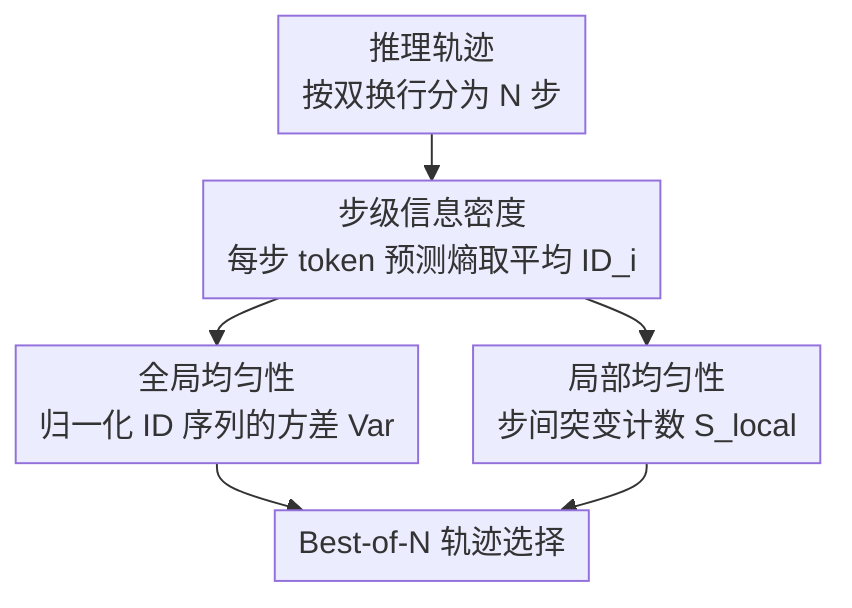

# Revisiting the Uniform Information Density Hypothesis in LLM Reasoning

**会议**: ACL 2026 Findings  
**arXiv**: [2510.06953](https://arxiv.org/abs/2510.06953)  
**代码**: [GitHub](https://github.com/talzoomanzoo/uid-reasoning)  
**领域**: LLM评测  
**关键词**: 信息密度均匀性, 推理质量评估, 熵分析, Best-of-N 选择, 思维链

## 一句话总结

本文将心理语言学中的信息密度均匀性（UID）假说引入 LLM 推理分析，提出基于熵的步级信息密度度量框架，发现高质量推理轨迹呈现"局部均匀 + 全局非均匀"的反直觉模式，并证明该模式在 Best-of-N 采样中显著优于传统置信度/熵基线。

## 研究背景与动机

**领域现状**：思维链（CoT）推理已成为提升 LLM 复杂任务表现的核心技术，但推理轨迹的质量评估主要依赖最终答案正确性或 token 级置信度等粗粒度信号，缺乏对推理"过程质量"的结构性刻画。

**现有痛点**：(1) 中间推理步骤经常出现逻辑不一致或不连贯的情况；(2) 现有内部信号方法（self-certainty、高置信度、低熵）将推理轨迹视为整体，无法捕捉步与步之间的信息流动结构；(3) 即使生成了很长的推理链，模型也可能无法在域外任务上泛化。

**核心矛盾**：我们无法仅通过最终输出判断 LLM 是否在"真正推理"还是仅在生成"表面连贯"的文本——需要一种从信息论角度刻画推理过程质量的框架。

**本文目标**：将 UID 假说从人类语言交流扩展到 LLM 推理场景，建立步级信息密度的量化框架，并验证其作为推理质量指标的有效性。

**切入角度**：UID 假说认为有效的人类交流需要信息均匀分布以减少认知负担。作者类比推理过程——每个推理步骤类似于交流中的语言单元，其熵变化反映了信息的"探索-收敛"结构。

**核心 idea**：高质量 LLM 推理并不遵循人类交流的全局均匀性，而是呈现出"局部平滑过渡（高局部均匀性）+ 全局结构化非均匀性（从高熵探索到低熵收敛）"的独特模式——这反映了推理与交流的根本目标差异。

## 方法详解

### 整体框架

给定一条推理轨迹 $\mathbf{z} = [z_1, \dots, z_N]$（按 `\n\n` 分割为 $N$ 个步骤），每个步骤 $z_i$ 包含 $M_i$ 个 token。作者首先计算每个 token 位置的预测分布熵 $H_t$，然后聚合为步级信息密度 $ID_i = \frac{1}{M_i}\sum_{t=1}^{M_i} H_t$。在此基础上，分别定义全局均匀性（方差）和局部均匀性（步间突变计数）两个互补度量，用于 Best-of-N 推理轨迹选择。

### 关键设计

**1. 步级信息密度（Step-level ID）：把推理轨迹从 token 序列抬升到“一步多少信息”的视角**

现有内部信号（self-certainty、置信度、对数概率）大多把整条轨迹当成一个整体打分，看不到步与步之间的信息流动。本文用预测分布的熵作为信息密度代理：对每个 token 位置算出预测熵 $H_t$，再把一步内所有 token 的熵取平均，得到该步的信息密度

$$ID_i = \frac{1}{M_i}\sum_{t=1}^{M_i} H_t.$$

熵低意味着模型自信，熵高意味着在多个可能延续之间犹豫。之所以用熵而非对数概率或置信度，是因为熵从信息论上同时编码了模型的确定性和这一步的推理难度——它量化的是编码这个预测分布需要多少比特。作者观察到，正确轨迹的 $ID$ 曲线呈“先探索后收敛”的下降趋势，而错误轨迹则是平坦的噪声。

**2. 全局均匀性（用方差衡量）：发现高质量推理反而要“全局不均匀”**

UID 假说原本说人类交流需要信息均匀分布以减轻听者认知负担，直觉上推理也该如此。本文却反过来：对归一化后的 $ID$ 向量计算方差 $\text{Var}(\tilde{\mathbf{u}})$，高方差表示信息集中在某些阶段（全局非均匀），低方差表示全局均匀。结果是高质量推理轨迹具有**高**全局方差。原因在于 LLM 推理是“无听众”的内部计算，存在从高熵探索到低熵收敛的清晰阶段转换，这种全局非均匀不是缺陷，而是问题求解自然阶段结构的体现——这正是推理与交流目标差异的直接证据。

**3. 局部均匀性（突变检测）：用“思路有没有断裂”来分辨好坏轨迹**

全局结构之外，作者还关心相邻步骤之间信息密度是否平滑过渡。计算步间变化 $\Delta_i = ID'_i - ID'_{i-1}$，设阈值 $T^{\pm} = \mu_\Delta \pm \tau \sigma_\Delta$（$\tau \in \{2, 3\}$），统计超过阈值的上行与下行突变总数 $S_{\text{local}}$，$S_{\text{local}}$ 越小代表局部越均匀。一次局部突变往往对应推理过程中的“思路断裂”或“突然混乱”，而这种断裂在正确与错误轨迹之间区分度很高，因此局部均匀性成了三个度量里最稳的质量信号。两个度量合起来，就刻画出“局部平滑 + 全局分段”这一高质量推理的独特指纹，可直接用于 Best-of-N 轨迹选择。

### 损失函数 / 训练策略

本文为分析性工作，不涉及模型训练。使用 DeepSeek-R1-Distill-Qwen-7B、DeepSeek-R1-Distill-Llama-8B 和 Qwen3-8B 作为推理模型，在 Best-of-5 采样设置下（temperature=0.6, top-p=0.95, top-k=20）评估 UID 指标作为选择准则的效果。

## 实验关键数据

### 主实验

**Best-of-5 选择准确率（DS-R1-Distill-Qwen-7B）**

| 方法 | AIME25 | BRUMO25 | HMMT25 | MinervaMath |
|------|--------|---------|--------|-------------|
| Mean Acc. | 0.40 | 0.54 | 0.24 | 0.30 |
| Self-Certainty | 0.48 | 0.52 | 0.28 | 0.30 |
| High Conf. | 0.48 | 0.52 | 0.27 | 0.30 |
| Low Entropy | 0.48 | 0.56 | 0.24 | 0.30 |
| **Loc. uni (ours)** | **0.53** | **0.56** | **0.30** | **0.31** |
| **Glob. non-uni (ours)** | **0.52** | **0.64** | 0.26 | 0.30 |

### 消融实验

**模型规模分析（Qwen3 系列，AIME2025）**

| 方法 | Qwen3-1.7B | Qwen3-4B | Qwen3-8B |
|------|-----------|----------|----------|
| Mean Acc. | 0.35 | 0.65 | 0.67 |
| Self-Certainty | 0.45 | 0.73 | 0.63 |
| Loc. uni | 0.41 | 0.69 | 0.69 |
| Glob. non-uni | 0.37 | 0.66 | 0.70 |

**采样规模分析（Qwen3-8B，AIME2025）**

| 方法 | Sample-3 | Sample-5 | Sample-10 |
|------|----------|----------|-----------|
| Loc. uni | 0.73 | 0.69 | 0.72 |
| Glob. non-uni | 0.70 | 0.70 | 0.70 |
| Self-Certainty | 0.70 | 0.63 | 0.62 |
| High Conf. | 0.63 | 0.60 | 0.57 |

### 关键发现

- 局部均匀性在所有模型和基准上一致优于传统基线，DS-R1-Qwen-7B 在 AIME25 上提升 +33%
- 全局非均匀性在更难的基准上表现最优（BRUMO25 达 0.64 vs Self-Certainty 的 0.52）
- 小模型更受益于局部平滑（1.7B 提升 17%），大模型更能利用全局非均匀性（8B 达最优 0.70）
- 当采样增多时（Sample-10），传统基线退化（High Conf. 从 0.63 降至 0.57），但 UID 指标保持稳定
- 在非数学推理任务（GPQA-D, LSAT-AR, LSAT-LR）上同样有效，LSAT-AR 上达到 +12.7% 相对提升
- 通信式 prompt 实验验证了推理与交流的目标差异：加入"向听众解释"的指令使模型趋向人类 UID 模式，但推理性能反而下降

## 亮点与洞察

- "推理不是交流"的洞察非常深刻——将 UID 的偏离解释为内部计算与外部沟通目标的差异，而非模型缺陷
- UID 指标具有 sample-efficient 的优势：不需要多数投票或外部验证器，仅从单条轨迹的内部信号即可评估质量
- 该框架可直接用于推理模型的 Best-of-N 选择策略，在计算成本可控的前提下显著提升准确率

## 局限与展望

- 分析主要集中在结构化推理数据集（数学、逻辑），对开放对话或交互场景的泛化性未验证
- 使用 token 级熵作为信息密度代理，但未提供为何出现这些 UID 模式的机制性解释
- 步骤分割基于 `\n\n` 启发式，虽然附录验证了鲁棒性，但更细粒度的分割策略值得探索
- 未与 ORM/PRM 等外部奖励模型进行对比

## 相关工作与启发

- **vs Self-Certainty (Kang et al., 2025)**: 后者使用响应级别的自信度信号，本文提出步级结构信号——在采样量增大时更稳定
- **vs ROSCOE (Golovneva et al., 2023)**: 后者需要外部评估模型打分，本文的 UID 指标完全基于生成模型自身的预测分布，无需额外模型

## 评分

- 新颖性: ⭐⭐⭐⭐⭐ 首次将 UID 假说引入 LLM 推理，发现反直觉的"局部均匀+全局非均匀"模式
- 实验充分度: ⭐⭐⭐⭐⭐ 7 个基准、3 个模型、多种采样规模和模型规模的全面分析
- 写作质量: ⭐⭐⭐⭐⭐ 从心理语言学到 LLM 推理的类比清晰，实验逻辑层层递进
- 价值: ⭐⭐⭐⭐ 为推理轨迹质量评估提供了新的理论视角和实用工具

<!-- RELATED:START -->

## 相关论文

- [\[ACL 2026\] Revisiting Entropy in Reinforcement Learning for Large Reasoning Models](revisiting_entropy_in_reinforcement_learning_for_large_reasoning_models.md)
- [\[ACL 2026\] Efficient Process Reward Modeling via Contrastive Mutual Information](efficient_process_reward_modeling_via_contrastive_mutual_information.md)
- [\[ACL 2026\] AIM-CoT: Active Information-driven Multimodal Chain-of-Thought for Vision-Language Reasoning](aim-cot_active_information-driven_multimodal_chain-of-thought_for_vision-languag.md)
- [\[CVPR 2026\] Revisiting the Necessity of Lengthy Chain-of-Thought in Vision-centric Reasoning Generalization](../../CVPR2026/llm_reasoning/revisiting_the_necessity_of_lengthy_chain-of-thought_in_vision-centric_reasoning.md)
- [\[ICML 2026\] An Information-Theoretic Criterion for Efficient Data Synthesis](../../ICML2026/llm_reasoning/an_information-theoretic_criterion_for_efficient_data_synthesis.md)

<!-- RELATED:END -->
