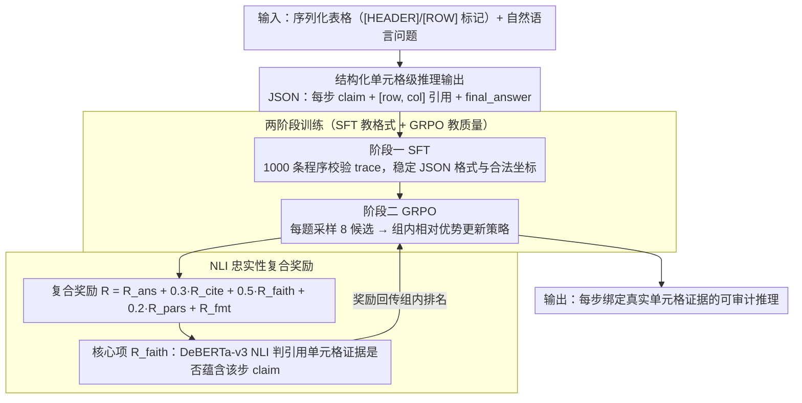

# RSAT: Structured Attribution Makes Small Language Models Faithful Table Reasoners

**会议**: ACL2026  
**arXiv**: [2605.00199](https://arxiv.org/abs/2605.00199)  
**代码**: https://github.com/JugalGajjar/RSAT  
**领域**: LLM推理 / 表格问答 / 可解释归因  
**关键词**: 表格推理, 单元格级引用, GRPO, 忠实性, 小语言模型

## 一句话总结
RSAT 用“结构化引用格式的 SFT + 以 NLI 忠实性为核心奖励的 GRPO”训练 1B-8B 小语言模型，让表格问答不只给答案，还能把每一步推理绑定到具体表格单元格，并把平均忠实性从 SFT 的 0.224 提升到 0.826。

## 研究背景与动机
**领域现状**：表格问答和表格事实验证已有 TAPAS、TAPEX、TaBERT、Binder、Chain-of-Table、TaPERA 等路线，主流目标是提升答案准确率或让模型能执行表格操作。近年的 LLM 方法也会生成 chain-of-thought，但通常只给出自然语言推理过程。

**现有痛点**：用户看到答案时，很难知道模型到底依据了哪些单元格。表格推理常用于金融、新闻、医学等需要审计的场景，只有“答案正确”并不足够；如果推理步骤不能和证据单元格对应，就无法判断模型是正确推理、偶然命中，还是事后编造解释。

**核心矛盾**：结构化格式很容易靠监督学习模仿，但“引用的单元格真的支持这一步推理”不是格式问题，而是语义忠实性问题。论文的实验证明，SFT 可以让格式成功率接近 99%，但平均忠实性仍只有约 22%。

**本文目标**：作者希望让小模型直接在生成推理时产生可审计的单元格引用，而不是先生成答案再事后补引用。具体要同时满足答案质量、JSON 格式、引用坐标合法、引用证据忠实和引用简洁。

**切入角度**：RSAT 把“引用忠实性”设计成训练目标。作者先用少量验证过的结构化 trace 教模型输出格式，再用 GRPO 在无 trace 的大规模表格 QA 数据上优化复合奖励，其中 NLI entailment 直接衡量 cited cells 是否支持 reasoning step。

**核心 idea**：把表格推理中的 attribution 从后处理任务改成生成时的强化学习目标，用可计算的忠实性奖励逼迫小模型把每一步推理落到真实单元格证据上。

## 方法详解
RSAT 的方法逻辑很清楚：先把输出空间固定成可验证的结构，再用奖励把这个结构变得可信。它并不追求重新设计表格编码器，而是把现有 instruction model 通过 LoRA 训练成“会引用表格证据的小推理器”。

### 整体框架
输入是一张序列化后的表格和自然语言问题。表格被展开成带有 `[HEADER]`、`[ROW 0]` 等标记的文本，使模型能把输出中的 `[row, col]` 坐标映射回原始单元格。输出是 JSON：一组 `reasoning_steps`，每一步包含自然语言 claim 和 `cited_cells` 坐标列表，最后给出 `final_answer`。

训练分两阶段。第一阶段是 SFT，用 1,000 条由 Claude Opus 4.5 生成并经过程序校验的结构化推理 trace 训练模型学会格式。第二阶段是 GRPO，模型对同一问题采样 8 个候选输出，用复合奖励打分，再用组内相对优势更新策略。评测覆盖 Qwen 2.5 Instruct 的 1.5B/3B/7B 和 Llama 3 Instruct 的 1B/3B/8B，数据来自 WTQ、FeTaQA、TabFact。

### 关键设计

**1. 结构化单元格级推理输出：把证据落到表格里最小的可审计单元**

表格推理出错时，根因往往是选错了行、选错了列、或把几个单元格的关系串错，可一旦答案对了，这些隐患就被掩盖。RSAT 在表格序列化时显式保留行列位置（`[HEADER]`、`[ROW 0]` 等标记），并要求输出中每个 reasoning step 都附上若干 `[row, col]` 坐标。于是 citation 不再是段落级或 passage 级，而是表格结构中最小的可审计单元——每个 claim 都能被人或程序追回到具体单元格，"答案正确但证据不对"也因此暴露出来。

**2. SFT 只教格式、GRPO 才教质量：把"会输出"和"输出可信"拆开优化**

如果把所有能力都寄托在少量人工或教师 trace 上，模型学到的多半只是表面模仿。RSAT 因此分两步：SFT 阶段用 1,000 条经程序校验（JSON 合法、坐标在界、步数合理）的结构化 trace，把格式稳定教会；GRPO 阶段则完全不依赖 trace，只用 gold answer 和奖励函数去评价模型自己采样出来的候选。这样拆开的依据来自一个很说明问题的现象——SFT 后格式成功率和引用合法性都已接近 99%，但平均忠实性只有 0.224，说明"能写出漂亮 JSON"和"引用真的支撑推理"是两种能力，后者靠监督模仿补不上来。

**3. 以 NLI 忠实性为核心的复合奖励：把"引用是否支撑 claim"变成可优化信号**

只奖励答案，模型会干脆忽略引用；只奖励合法坐标，模型会随机引用一些真实但无关的单元格。RSAT 的复合奖励同时约束答案、引用合法性、忠实性、简洁性和格式：

$$R=R_{ans}+0.3R_{cite}+0.5R_{faith}+0.2R_{pars}+R_{fmt}$$

其中权重最高、也最关键的是 $R_{faith}$——它把某一步引用的所有单元格值拼成一个 evidence string，再用 DeBERTa-v3-base 的 NLI 判断这段证据是否蕴含该步的自然语言 claim，从而把"忠实"量化成可回传的梯度信号；$R_{pars}$ 惩罚一次引用过多单元格（避免广撒网式引用），JSON 解析失败则触发硬格式惩罚。正是这个 NLI 项把表格证据、推理文本和 RL 目标接成了闭环，让小模型被迫把每一步推理落到真实证据上。

### 损失函数 / 训练策略
SFT 使用 LoRA 作用于 Q/K/V/O、gate、up、down 等线性层，训练 3 个 epoch，学习率约 $2\times 10^{-4}$。GRPO 在合并 SFT 权重后挂新 LoRA，1 个 epoch 训练 500 个样本，每个问题生成 $G=8$ 个候选，学习率约 $5\times 10^{-5}$，温度 0.9。作者强调 GRPO 比 PPO 省掉 critic，更适合单卡 H100 训练；六个主模型和消融总计约 36.8 GPU-hours。

## 实验关键数据

### 主实验
RSAT 在六个模型上都超过 zero-shot、SFT-only 和 post-hoc baseline。最重要的现象是：SFT 几乎解决格式，但忠实性仍低；GRPO 把忠实性大幅拉升，同时没有牺牲答案 F1。

| 模型 | 方法 | Answer F1 | 引用合法性 | 忠实性 | 简洁性 | 格式成功率 |
|------|------|-----------|------------|--------|--------|------------|
| Qwen 1.5B | SFT | 0.371 | 0.995 | 0.149 | 0.918 | 0.998 |
| Qwen 1.5B | RSAT | 0.524 | 0.996 | 0.847 | 0.990 | 0.998 |
| Qwen 3B | SFT | 0.531 | 0.996 | 0.213 | 0.848 | 0.998 |
| Qwen 3B | RSAT | 0.592 | 0.999 | 0.946 | 0.996 | 1.000 |
| Qwen 7B | SFT | 0.576 | 1.000 | 0.234 | 0.888 | 1.000 |
| Qwen 7B | RSAT | 0.619 | 0.992 | 0.977 | 0.992 | 0.992 |
| Llama 8B | SFT | 0.555 | 0.996 | 0.288 | 0.830 | 0.998 |
| Llama 8B | RSAT | 0.647 | 1.000 | 0.972 | 1.000 | 1.000 |

训练阶段贡献也很有说服力。SFT 从 zero-shot 带来平均 +0.61 格式成功率、+0.64 引用合法性、+0.34 F1，但只带来 +0.19 忠实性；从 SFT 到 RSAT，格式几乎不变，忠实性再提升 +0.60，F1 也提升 +0.09。

### 消融实验

| 配置 | F1 | 忠实性 | 简洁性 | 说明 |
|------|----|--------|--------|------|
| Qwen 7B full | 0.619 | 0.977 | 0.992 | 完整 RSAT |
| Qwen 7B 去掉忠实性奖励 | 0.635 | 0.117 | 1.000 | 答案略升，但证据 grounding 崩溃 |
| Qwen 7B 去掉简洁性奖励 | 0.612 | 0.952 | 0.604 | 倾向过度引用 5-6 个单元格 |
| Qwen 7B 去掉引用合法性奖励 | 0.605 | 0.934 | 0.993 | 影响较小，因为 SFT 已学到坐标合法性 |
| Llama 8B full | 0.647 | 0.972 | 1.000 | 完整 RSAT |
| Llama 8B 去掉忠实性奖励 | 0.638 | 0.031 | 0.996 | 忠实性从接近满分跌到几乎无效 |

### 关键发现
- Post-hoc attribution 在小模型上几乎不可用，平均格式成功率只有 12.7%，Qwen 3B 甚至只有 0.4%。这说明“先自由推理再补坐标”对工作记忆和表格回看能力要求太高。
- Qwen 在小规模下明显优于 Llama：约 3B 时 Qwen 已达到 0.946 忠实性，而 Llama 3B 为 0.735；到 7B/8B 时二者接近。
- 忠实性奖励是唯一不可替代的信号。没有它，模型仍能输出漂亮 JSON 和合法坐标，但这些引用不再真正支撑推理。

## 亮点与洞察
- 这篇论文把 attribution 从“解释生成结果”转成“生成过程中的训练目标”，思路很干净。它提醒我们，格式约束和证据忠实性是两种不同能力，不能用格式成功率替代 grounding 质量。
- 用 NLI 作为 step-level reward 很实用。虽然存在 proxy bias，但它让表格证据、推理文本和 RL 目标之间建立了可计算闭环，适合小模型训练。
- Post-hoc baseline 的失败是一个重要负结果。很多可解释性系统默认“答案后补引用”可行，但 RSAT 表明在小模型和结构化表格场景中，引用必须内生到生成过程。
- 这个范式可迁移到知识图谱、代码执行结果、工具调用日志等结构化证据场景：先定义可审计输出结构，再用任务特定 reward 优化输出质量。

## 局限与展望
- 最大局限是训练 reward 和主要评价指标都依赖同一个 DeBERTa NLI scorer，存在 train-eval circularity。模型可能学会迎合该 scorer 的语言偏好，而不一定完全对应人类对忠实性的判断。
- 评测只覆盖 WTQ、FeTaQA、TabFact，尚未验证金融报表、临床表格、科学数据表等更复杂 schema 上的泛化能力。
- EM 只有 0.000-0.018，说明答案表述和 gold string 的匹配仍不稳定。论文主要依赖 F1，但这会影响与传统 table QA 系统的直接比较。
- 简洁性奖励让部分模型输出明显变短，甚至可能过度压缩推理步骤。未来需要研究“足够简洁”和“足够解释”的平衡。
- 人工评测是必要下一步，尤其要验证 NLI 认为忠实的引用是否真的能被人类审计者接受。

## 相关工作与启发
- **vs TAPAS / TAPEX / TaBERT**: 这些方法关注表格理解和答案准确率，RSAT 关注答案背后的 step-level evidence。它不是替代 table encoder，而是补上可审计输出层。
- **vs Chain-of-Table / TaPERA**: 后者强调通过表格变换或程序分解提升推理，RSAT 强调每一步推理都要引用原始单元格，解释粒度更细。
- **vs Self-RAG / ALCE / RARR**: 这些文本归因方法通常处理 passage-level evidence，RSAT 把归因扩展到 cell-level structured evidence，并通过 RL 直接训练小模型。
- **vs post-hoc attribution**: post-hoc 要求模型在第二遍把自由文本映射回表格坐标，RSAT 则在第一遍生成时同步产生引用，因此更适合小模型。

## 评分
- 新颖性: ⭐⭐⭐⭐☆ 把 GRPO 和单元格级忠实归因结合得很自然，核心不是全新算法，而是目标设计很准。
- 实验充分度: ⭐⭐⭐⭐☆ 六个模型、三个数据源、post-hoc 对照和 reward 消融都扎实，但缺少人工忠实性评测和跨领域表格验证。
- 写作质量: ⭐⭐⭐⭐⭐ 问题定义、阶段贡献和消融结论都很清楚，负结果也解释充分。
- 价值: ⭐⭐⭐⭐⭐ 对需要可审计表格推理的小模型部署很有启发，尤其适合高风险领域的 grounded reasoning 设计。

<!-- RELATED:START -->

## 相关论文

- [\[AAAI 2026\] SAPO: Self-Adaptive Process Optimization Makes Small Reasoners Stronger](../../AAAI2026/llm_reasoning/sapo_self-adaptive_process_optimization_makes_small_reasoners_stronger.md)
- [\[ICML 2026\] DenseSteer: Steering Small Language Models towards Dense Math Reasoning](../../ICML2026/llm_reasoning/densesteer_steering_small_language_models_towards_dense_math_reasoning.md)
- [\[ACL 2026\] LegalDrill: Diagnosis-Driven Synthesis for Legal Reasoning in Small Language Models](legaldrill_diagnosis-driven_synthesis_for_legal_reasoning_in_small_language_mode.md)
- [\[AAAI 2026\] Small Language Models for Efficient Agentic Tool Calling: Outperforming Large Models with Targeted Fine-tuning](../../AAAI2026/llm_reasoning/small_language_models_for_efficient_agentic_tool_calling_outperforming_large_mod.md)
- [\[ACL 2026\] Large Reasoning Models Are (Not Yet) Multilingual Latent Reasoners](large_reasoning_models_are_not_yet_multilingual_latent_reasoners.md)

<!-- RELATED:END -->
