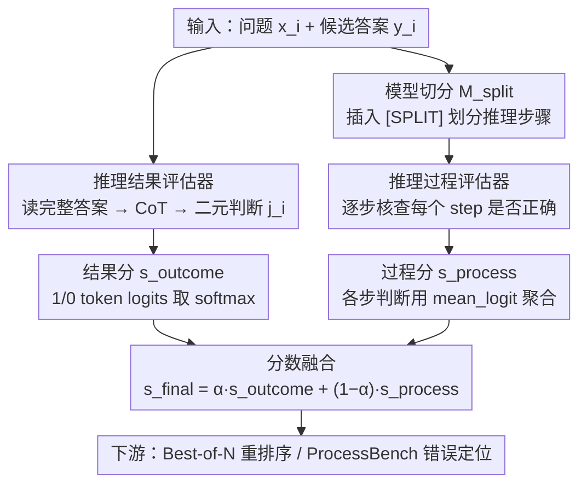

# Scaling Evaluation-Time Compute with Reasoning Models as Evaluators

**会议**: ACL2026 Findings  
**arXiv**: [2503.19877](https://arxiv.org/abs/2503.19877)  
**代码**: 无（cache 未提供）  
**领域**: LLM推理 / LLM评估 / Test-time Scaling  
**关键词**: evaluation-time compute, reasoning evaluator, process evaluation, outcome evaluation, Best-of-N

## 一句话总结
这篇论文把 test-time scaling 从“生成答案”扩展到“评估答案”，发现让 reasoning model 在评估时生成更多推理 token、逐步检查过程并结合 outcome/process 分数，可以在 ProcessBench 和 Best-of-N 重排序中超过训练好的 PRM/ORM。

## 研究背景与动机
**领域现状**：LLM 的推理能力已经明显受益于 test-time compute，例如让模型生成更长 CoT、进行自我验证或多次采样。与此同时，模型评估器也变得越来越重要，因为 evaluator 可以判断答案是否正确、找出推理链中的错误，并在 Best-of-N 或搜索式推理中帮助 generator 选择更好的输出。

**现有痛点**：主流 evaluator 多是直接预测 reward / score 的 ORM 或 PRM，它们通常需要专门训练，且在分布外任务上容易 reward over-optimization。生成式 evaluator 虽然能输出 CoT，但许多 fine-tuned evaluator 的 CoT 较短，缺少 reasoning model 那种自检、回溯和 edge-case 分析能力。

**核心矛盾**：如果生成模型能通过“多想一会儿”变强，那么评估模型是否也能通过“多评一会儿”变强？已有工作常把计算预算花在采样更多候选答案上，但没有系统比较“多生成候选”和“更认真评估候选”之间的取舍。

**本文目标**：作者研究 evaluation-time scaling：用 off-the-shelf reasoning model 作为 evaluator，强制它在 outcome-level 和 process-level 两个粒度上生成推理，再看评估质量是否随 reasoning token 增加而单调变好，以及这种更强评估能否反过来提升 generator 的问题解决表现。

**切入角度**：论文把 reasoning evaluator 分成 outcome evaluator 和 process evaluator。前者判断完整回答是否正确，后者逐步判断每个推理段落是否正确，再将过程分数聚合成整体分数。

**核心 idea**：把推理模型的问题解决策略迁移到评估过程，让 evaluator 通过逐步检查、self-consistency 和 outcome/process 融合来消耗更多 evaluation-time compute。

## 方法详解
方法并不训练新模型，而是构造一套 inference-time evaluation recipe。给定问题 $x_i$ 和候选回答 $y_i$，reasoning evaluator 会先生成 CoT，再输出二元 judgment；分数来自 “1/0” token 的 logits。过程评估会把回答切成多个 step，逐 step 评估并聚合。

### 整体框架
整体 pipeline 分两种用途。第一种是 evaluator 本身的能力测试：在 ProcessBench 中，模型需要找出一个解答中第一个错误段落。第二种是提升 generator：先让 generator 为每道题采样多个候选答案，再让 evaluator 给候选打分，选择最高分答案作为 Best-of-N 输出。论文在固定近似计算预算下比较 direct evaluator 的 Best-of-64 和 reasoning evaluator 的 Best-of-8。具体到打分内部，同一个候选回答会同时走结果评估与过程评估两条路，最后把两路分数融合成最终分。

### 关键设计

**1. Reasoning Outcome Evaluator：让模型读完整答案、先想再判，并从 token logits 里读出置信分**

直接预测 reward 的 ORM 视野完整，却把整个判断压成一个标量，没有给"多想一会儿"留空间。Outcome evaluator 改成 prompt 一个 reasoning model 读入 $(x_i,y_i)$，先生成一段 CoT $c_i$ 再给二元 judgment $j_i$（"1" 表示正确、"0" 表示错误）。分数不取硬判断，而是从这两个 token 的 logits 做 softmax：

$$s_i = \frac{e^{\ell(j_i=1)}}{e^{\ell(j_i=0)} + e^{\ell(j_i=1)}}$$

这样既保留了 outcome 视角"看最终答案是否合理"的整体性，又能用连续分数支持后续 Best-of-N 排序。它的短板是视野太宏观，容易放过中间步骤里的细粒度错误。

**2. Reasoning Process Evaluator：把一次性评判拆成逐步核查，自然吃掉更多 evaluation-time compute**

一条 CoT 想覆盖整段推理的所有步骤，很容易漏错。Process evaluator 转而逐步检查：评估第 $k$ 个 step 时，模型只看到问题和前 $k$ 个步骤，专门为 $y_{ik}$ 生成一段核查 CoT 和判断，再把所有 step 的判断经聚合函数转成整体 score。论文刻意偏好这种 multi-step process evaluation，而不是一次性吐出所有 step 的判断——因为逐步核查既迫使模型对每个局部推理认真复核，又让 evaluation-time compute 随步数自然增长，正好把 reasoning model 的自检、回溯能力用在刀刃上。

**3. Model-based Splitting 与 Outcome/Process 融合：让过程评估扛得住不规整输出，并把两种视角的互补信号合起来**

逐步评估的前提是回答能被切成清晰的 step，可现实里很多回答没有规整换行、甚至夹着代码。论文用一个切分模型 $M_{split}$ 在这种情况下插入 `[SPLIT]` 标记来划分步骤；在聚合过程分数时，发现 mean_logit 比常用的 min 更稳。最终把两路分数线性插值：

$$s_{final}=\alpha\, s_{outcome}+(1-\alpha)\, s_{process}$$

主实验取 $\alpha=0.5$。这么做是因为 process evaluator 精度高但召回低（判对了就很可信、却容易漏报），outcome evaluator 更整体却偏粗糙，插值正好让两者互补、削掉单一视角的偏差。

### 损失函数 / 训练策略
本文没有提出新的训练损失，核心是推理时策略。ProcessBench 中用 F1 衡量是否准确预测第一个错误段落；Best-of-N 中，LeetCode 用 pass@1，其余 6 个 benchmark 用 accuracy。为了公平计算预算，direct ORM/PRM 使用 Best-of-64，reasoning evaluator 因单次评估更贵而使用 Best-of-8；候选来自 Eurus-2-SFT、Llama3.1-70B-Instruct、Qwen2.5-7B-Instruct，在 7 个 benchmark 上共生成 4,680 个实例和 299,520 个 responses。

## 实验关键数据

### 主实验
ProcessBench 上，multi-step process evaluation 和 self-consistency 都能提高评估器 F1。尤其是非专门训练的 32B reasoning model 可以超过 72B PRM。

| Evaluator | 设置 | Avg. F1 | 关键对比 |
|-----------|------|---------|----------|
| Qwen2.5-Math-PRM-7B | Direct PRM | 73.5 | 训练好的 7B PRM |
| Qwen2.5-Math-PRM-72B | Direct PRM | 78.3 | 训练好的 72B PRM |
| DeepSeek-R1-Distill-Qwen-32B | Single-step reasoning | 75.5 | 单条 CoT 不足以超过 72B PRM |
| DeepSeek-R1-Distill-Qwen-32B | Multi-step process | 78.6 | 略高于 72B PRM |
| QwQ-32B | Multi-step process | 79.3 | 高于 72B PRM |
| DeepSeek-R1-Distill-Qwen-32B | Multi-step + self-consistency | 82.8 | 明显超过旧 SOTA |
| QwQ-32B | Multi-step + self-consistency | 82.0 | 同样超过 72B PRM |

### 消融实验
Best-of-N 中，reasoning evaluator 在只看 8 个候选时，已经接近或超过 direct evaluator 看 64 个候选的效果。表中数值是 7 个 benchmark 与 3 个 generator 的平均分。

| Evaluator | N=1 | N=2 | N=4 | N=8 | N=64 / 说明 |
|-----------|-----|-----|-----|-----|-------------|
| Skywork-Reward-Gemma-2-27B-v0.2 | 38.2 | 41.8 | 43.4 | 44.8 | N=64 为 45.4 |
| Qwen2.5-Math-PRM-72B | 38.2 | 42.9 | 45.4 | 48.2 | N=64 为 50.6 |
| DeepSeek-R1-Distill-Qwen-32B outcome | 38.2 | 43.9 | 47.7 | 51.1 | reasoning evaluator 只报到 N=8 |
| DeepSeek-R1-Distill-Qwen-32B process | 38.2 | 43.6 | 46.9 | 50.3 | process 单独已接近 72B PRM 的 N=64 |
| DeepSeek-R1-Distill-Qwen-32B process + outcome | 38.2 | 44.4 | 48.5 | 52.0 | 超过 Qwen2.5-Math-PRM-72B 的 N=64 |

### 关键发现
- Multi-step process evaluation 比 self-consistency 更有效：例如 QwQ-32B multi-step 为 79.3，而 self-consistency 为 76.8；DeepSeek-R1-Distill-Qwen-32B multi-step 为 78.6，高于 self-consistency 的 77.8。
- 将 multi-step 与 self-consistency 结合还能继续涨分：DeepSeek-R1-Distill-Qwen-7B 从 single-step 54.5 到 multi-step + self-consistency 73.7。
- 论文报告 reasoning evaluator using Best-of-8 在固定预算下比 direct evaluator using Best-of-64 高 4.30 到 6.63 个百分点。
- 过程评估更保守：论文分析中 reasoning process evaluator precision 更高、recall 更低；当它判断所有步骤正确时，最终答案很可能正确，false positive rates 为 3.8% 和 3.5%。

## 亮点与洞察
- 这篇论文的核心洞察很简洁：评估也是一种推理任务，因此也应享受 test-time scaling。以前大家常把推理预算花在“多生成答案”，这里证明“更认真地评估较少答案”可能更划算。
- Multi-step process evaluation 的收益不是因为模型更大，而是因为把任务拆成了多个局部核查点，让 reasoning model 的自检和回溯能力有机会发挥。
- Outcome 与 process 的互补很重要。Outcome 看最终答案，process 看局部推理；二者插值可以减少单一评估视角的偏差。
- 对代码任务的发现有启发：传统 PRM 多在数学过程上训练，遇到代码输出时切分和 reward 泛化都差；reasoning evaluator 可以通过读代码逻辑和边界条件来补上这部分能力。

## 局限与展望
- Evaluator implementation 的主测试集中在 ProcessBench，虽然标签质量高，但仍主要覆盖数学推理链错误定位。
- Best-of-N 主实验重点是 math 和 code，因为这些任务容易自动验证，也符合 reasoning model 的强项；创意写作、科学写作等不可验证任务尚未系统评估。
- 作者没有测试一些更新或更强的 closed-source / large reasoning model，原因包括模型太新、70B 级推理 evaluator 硬件成本高，以及 OpenAI o1、Gemini 2.5、Claude 3 等 API 预算有限。
- 论文使用 reasoning evaluator 时会增加每个候选的评估成本。真实系统中需要根据延迟、费用和任务价值决定是否使用 process + outcome 的完整流程。

## 相关工作与启发
- **vs ORM / PRM**: ORM/PRM 直接输出 score，成本低但需要训练且易过优化；reasoning evaluator 不训练新 reward head，而是用推理时间换泛化和鲁棒评估。
- **vs Self-Consistency**: Self-consistency 多次问同一个全局判断，multi-step process evaluation 则把回答拆开逐段检查。实验显示在相近预算下，后者更有效。
- **vs Best-of-N 采样扩展**: 传统 test-time scaling 倾向生成更多候选；本文说明在候选数较少时投入更强评估，有时比盲目把 N 加大更有效。
- **启发**: 对 agent planning、代码生成、数学竞赛和科学推理系统，可以把 verifier 从轻量打分器升级为“带预算的推理审稿人”，并按任务风险动态决定评估深度。

## 评分
- 新颖性: ⭐⭐⭐⭐☆ 概念不复杂但切中 test-time scaling 的新维度，evaluation-time compute 的定位清楚。
- 实验充分度: ⭐⭐⭐⭐☆ ProcessBench、Best-of-N、不同模型族和消融较充分，但非数学/代码任务仍需扩展。
- 写作质量: ⭐⭐⭐⭐☆ 方法公式清楚，实验发现直接支撑主张，附录结果较多。
- 价值: ⭐⭐⭐⭐⭐ 对 verifier、reward model、Best-of-N 和推理系统预算分配都有直接参考价值。

<!-- RELATED:START -->

## 相关论文

- [\[ACL 2026\] Scaling Test-Time Compute to Achieve IOI Gold Medal with Open-Weight Models](scaling_test-time_compute_to_achieve_ioi_gold_medal_with_open-weight_models.md)
- [\[NeurIPS 2025\] Provable Scaling Laws for the Test-Time Compute of Large Language Models](../../NeurIPS2025/llm_reasoning/provable_scaling_laws_for_the_testtime_compute_of_large_lang.md)
- [\[ICML 2025\] Evaluating Judges as Evaluators: The JETTS Benchmark of LLM-as-Judges as Test-Time Scaling Evaluators](../../ICML2025/llm_reasoning/evaluating_judges_as_evaluators_the_jetts_benchmark_of_llm-as-judges_as_test-tim.md)
- [\[ACL 2026\] Parallel Test-Time Scaling for Latent Reasoning Models](parallel_test-time_scaling_for_latent_reasoning_models.md)
- [\[NeurIPS 2025\] Towards Thinking-Optimal Scaling of Test-Time Compute for LLM Reasoning](../../NeurIPS2025/llm_reasoning/towards_thinking-optimal_scaling_of_test-time_compute_for_llm_reasoning.md)

<!-- RELATED:END -->
