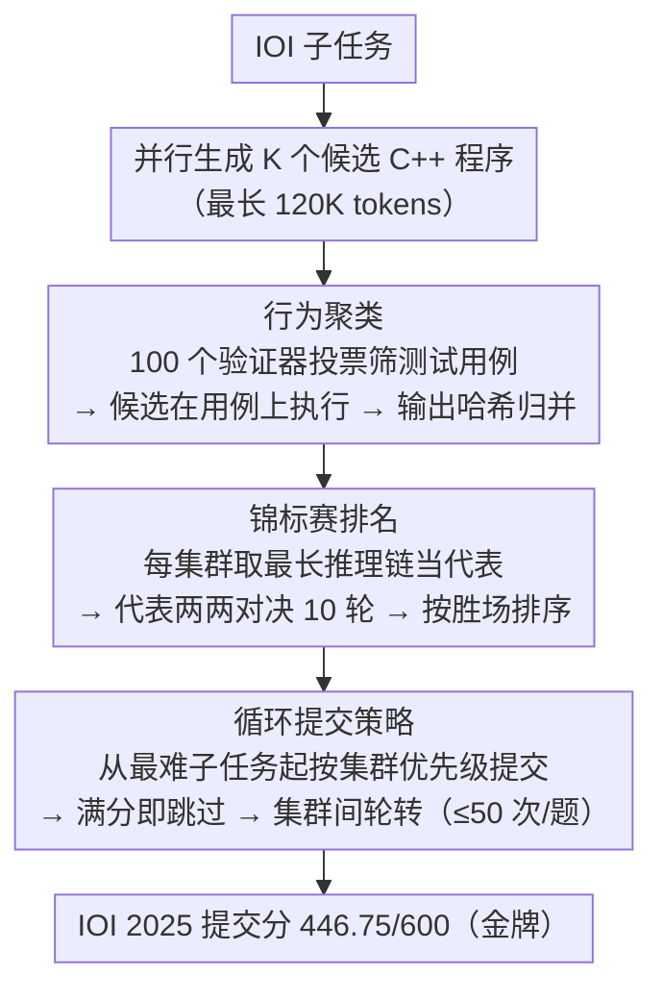

# Scaling Test-Time Compute to Achieve IOI Gold Medal with Open-Weight Models

**会议**: ACL 2026  
**arXiv**: [2510.14232](https://arxiv.org/abs/2510.14232)  
**代码**: [NVIDIA-NeMo/Skills](https://github.com/NVIDIA-NeMo/Skills/tree/main/recipes)  
**领域**: LLM推理  
**关键词**: 测试时计算, 竞赛编程, IOI, 行为聚类, 开源模型

## 一句话总结

提出 GenCluster，一个可扩展的测试时计算框架，通过大规模并行生成→行为聚类→锦标赛排名→循环提交策略，首次使开源模型 gpt-oss-120b 在 IOI 2025 上达到金牌水平（446.75/600 分）。

## 研究背景与动机

**领域现状**：竞赛编程已成为评估 LLM 推理和问题解决能力的严格基准。国际信息学奥林匹克 (IOI) 是最具声望的算法编程竞赛之一，传统基准如 HumanEval 和 MBPP 已接近饱和，研究重心转向 LiveCodeBench、Codeforces 等更具挑战性的基准。

**现有痛点**：OpenAI 声称用 o1-ioi 和 o3 在 IOI 2024/2025 上取得金牌，但所用方法和模型均未公开。AlphaCode 2 虽然公开了部分方法论，但也依赖闭源模型。开源模型（如 DeepSeek-R1-0528、Qwen3-235B）在 LiveCodeBench 和 Codeforces 上竞争力增强，但在 IOI 级难度上仍明显落后。

**核心矛盾**：IOI 每个问题最多允许 50 次提交——如何从成千上万个候选解中高效选出最优解是关键挑战。现有方法要么不公开（OpenAI），要么未在 IOI 级难度下验证。

**本文目标**：设计一个可扩展、可复现、透明的测试时计算方法，使开源模型在 IOI 严格提交限制下达到金牌水平。

**切入角度**：IOI 问题本质是"验证预算有限"的推理任务——不同于数学问题可以多数投票，竞赛编程正确率极低时多数投票无效，需要更精细的解选择策略。

**核心 idea**：生成大量候选解→基于行为聚类分组→用 LLM 锦标赛排名集群→循环提交最大化得分。

## 方法详解

### 整体框架

GenCluster 包含四个阶段：(1) 对每个子任务并行生成 K 个候选 C++ 程序；(2) 基于行为相似性聚类——生成测试输入并根据输出哈希分组；(3) 用 LLM 作为裁判的锦标赛对集群代表进行排名；(4) 按排名循环提交，遵守每题最多 50 次提交的 IOI 规则。其中第 (1) 步是标准的大规模采样脚手架，真正的三个核心设计是后三步。

### 关键设计

**1. 行为聚类（Behavioral Clustering）：用"跑出来的输出"而不是"代码长什么样"来归并候选**

上万个候选解直接两两比较根本排不过来，而按代码文本聚类又会把功能等价、写法不同的实现拆散。GenCluster 改成按行为归并：先让 LLM 生成 100 个测试输入生成器和 100 个验证器，用验证器投票筛掉非法输入（$\ge 75\%$ 验证器通过才保留），凑出 100 个有效测试用例；再把所有候选解都在这批用例上执行，输出完全一致的归入同一集群（用哈希加速比较），整组空输出的集群直接丢弃。这样一来，排名对象从上万个解收缩成少数几十个行为各异的集群，且每个集群内部是真正功能等价的解。

**2. 锦标赛排名（Tournament Ranking）：在正确解极稀疏时，用两两对决代替打分或投票**

IOI 难度下正确解占比极低，多数投票会被大量"看起来合理但都错"的解淹没，直接给每个解打分又不稳定。GenCluster 给每个集群选出推理链最长的解当代表，让它与随机抽到的其他集群代表做 $G_n=10$ 轮两两比较，每轮由 LLM 裁判选出胜者（展示顺序随机化以缓解近因偏差），最后按累计胜场给集群排名。相对打分，这种对决式比较只要求模型做局部的"谁更好"判断，比让它对一个解的绝对质量估值更稳。

**3. 循环提交策略（Round-Robin Submission）：在 50 次提交上限内把"碰到正确解"的概率铺到最大**

IOI 每题最多 50 次提交，而评分取每个子任务所有提交里的最高分，所以提交顺序本身就是一个需要优化的问题。GenCluster 从最难的子任务开始，按集群排名顺序提交、集群内再按推理长度排序选解；某子任务一旦拿到满分就立即跳过、转下一个子任务，并在各集群之间循环轮转。这种轮转保证有限的提交次数尽量覆盖不同行为模式的解，而不是把预算耗在同一类（可能整类都错的）实现上。

### 一个完整示例：一道 IOI 子任务怎么从 5000 个解收敛到一次正确提交

以 K=5000、gpt-oss-120b 为例走一遍：模型先对某子任务并行生成 5000 个候选 C++ 程序；接着用 100 个经验证器投票通过的测试用例跑这 5000 个解，按输出哈希归并成（比如）几十个行为集群，空输出集群被整组剔除；每个集群推出推理链最长的解当代表，代表之间做 10 轮随机配对的 LLM 裁判对决，按胜场把集群排成一条优先级队列；最后进入循环提交——从最难子任务起、按集群优先级依次提交，一旦某子任务满分就跳到下一个。整套流程让 gpt-oss-120b 在 IOI 2025 拿到 446.75/600，越过约 400 分的金牌线。

### 损失函数 / 训练策略

本方法无需训练，纯推理时计算。所有候选解使用 C++ 生成，最大生成长度 120K tokens（gpt-oss-120b）。

## 实验关键数据

### 主实验

| 模型 | K=50 | K=1000 | K=5000 | 趋势 |
|------|------|--------|--------|------|
| gpt-oss-120b | ~332 | ~400 | **446.75** | 稳定增长 |
| gpt-oss-20b | ~250 | ~300 | ~330 | 增长较慢 |
| DeepSeek-R1-0528 | ~280 | ~310 | ~340 | 早期较强但饱和 |
| Qwen3-235B-A22B | ~290 | ~330 | ~350 | 48K token后饱和 |

IOI 2025 金牌线：~400 分，满分 600 分。GenCluster + gpt-oss-120b (K=5000) 提交分 446.75，达到金牌。

### 消融实验 (K=5000, gpt-oss-120b)

| 方法 | 使用聚类 | 分数 | 说明 |
|------|---------|------|------|
| Random | 否 | 300.10 | 随机选解 |
| Longest | 否 | 277.36 | 选最长推理链 |
| Cluster-Size | 是 | 299.87 | 按集群大小排 |
| Cluster-Majority | 是 | 314.22 | 多数投票 |
| GenCluster (Random-Rep) | 是 | 406.49 | 随机代表+锦标赛 |
| GenCluster (Score-Based) | 是 | 441.11 | 平均分排名 |
| **GenCluster** | **是** | **446.75** | **最长代表+胜场排名** |

### 关键发现

- gpt-oss-120b 是唯一能在 5000 次生成内达到金牌水平的开源模型，且随生成量增加持续提升
- 简单的多数投票（314.22）和集群大小排名（299.87）在 IOI 难度下效果接近随机，因为正确解比例极低
- 锦标赛排名比直接打分略优（446.75 vs 441.11），选最长推理链作代表优于随机（446.75 vs 406.49）
- 测试用例数从 10 增到 100 时聚类纯度（F1）显著提升，但集群数也增加，使选择更困难
- 推理链长度与正确率正相关，gpt-oss 模型在困难问题上生成更长推理链
- 总计算量：生成 5000 个候选解约需 73 亿 token，锦标赛排名再需 73 亿 token

## 亮点与洞察

- **首次开源模型 IOI 金牌**：完全透明可复现的方法论，与 OpenAI 未公开方法形成对比，为开源社区提供了追赶的基线
- **锦标赛排名设计精巧**：在正确解占比极低的困难问题上，传统多数投票失效，两两比较的锦标赛机制更能利用 LLM 的判断能力
- **行为聚类+验证器投票**：生成测试输入的生成器-验证器流程简洁有效，75% 投票阈值平衡了覆盖率和质量
- **推理长度作为正确率代理**：在集群内选最长推理链作为代表的简单启发式比随机选择显著提升，可迁移到其他推理任务

## 局限与展望

- 计算量极大（~146 亿 token/次评估），在资源受限环境下不可行
- 排名质量仍有提升空间——39 个子任务中只有 35 个的最佳解出现在 Top-50 集群
- 仅在 IOI 2025 上验证，泛化到其他竞赛（ICPC、Codeforces）待测试
- 未公开 gpt-oss-120b 的训练细节，方法的可复现性部分依赖于特定模型

## 相关工作与启发

- **vs AlphaCode/AlphaCode 2**: 同样采用大规模生成+聚类，但 AlphaCode 未解决提交预算受限下的排名问题，且使用闭源模型
- **vs OpenAI o1-ioi**: OpenAI 用 1K 解+简单选择达到金牌（o3），但方法完全未公开；GenCluster 用 5K 解+锦标赛达到金牌，完全透明
- **vs Best-of-N**: 简单的 Best-of-N 需要可靠验证器，IOI 无法简单验证；GenCluster 用行为聚类+锦标赛替代验证器

## 评分

- 新颖性: ⭐⭐⭐⭐ 锦标赛排名和循环提交策略有创新，但核心框架（生成+聚类+选择）延续 AlphaCode 思路
- 实验充分度: ⭐⭐⭐⭐⭐ 系统的 scaling 分析、多模型对比、详尽的消融实验
- 写作质量: ⭐⭐⭐⭐ 方法描述清晰，实验充分，但部分依赖未公开的 gpt-oss 模型
- 价值: ⭐⭐⭐⭐⭐ 首个开源模型 IOI 金牌的里程碑工作，方法完全可复现

<!-- RELATED:START -->

## 相关论文

- [\[ACL 2026\] Scaling Evaluation-Time Compute with Reasoning Models as Evaluators](scaling_evaluation-time_compute_with_reasoning_models_as_evaluators.md)
- [\[NeurIPS 2025\] Provable Scaling Laws for the Test-Time Compute of Large Language Models](../../NeurIPS2025/llm_reasoning/provable_scaling_laws_for_the_testtime_compute_of_large_lang.md)
- [\[ICML 2026\] Diversity Matters: Revisiting Test-Time Compute in Vision-Language Models](../../ICML2026/llm_reasoning/diversity_matters_revisiting_test-time_compute_in_vision-language_models.md)
- [\[ACL 2026\] Parallel Test-Time Scaling for Latent Reasoning Models](parallel_test-time_scaling_for_latent_reasoning_models.md)
- [\[NeurIPS 2025\] Towards Thinking-Optimal Scaling of Test-Time Compute for LLM Reasoning](../../NeurIPS2025/llm_reasoning/towards_thinking-optimal_scaling_of_test-time_compute_for_llm_reasoning.md)

<!-- RELATED:END -->
