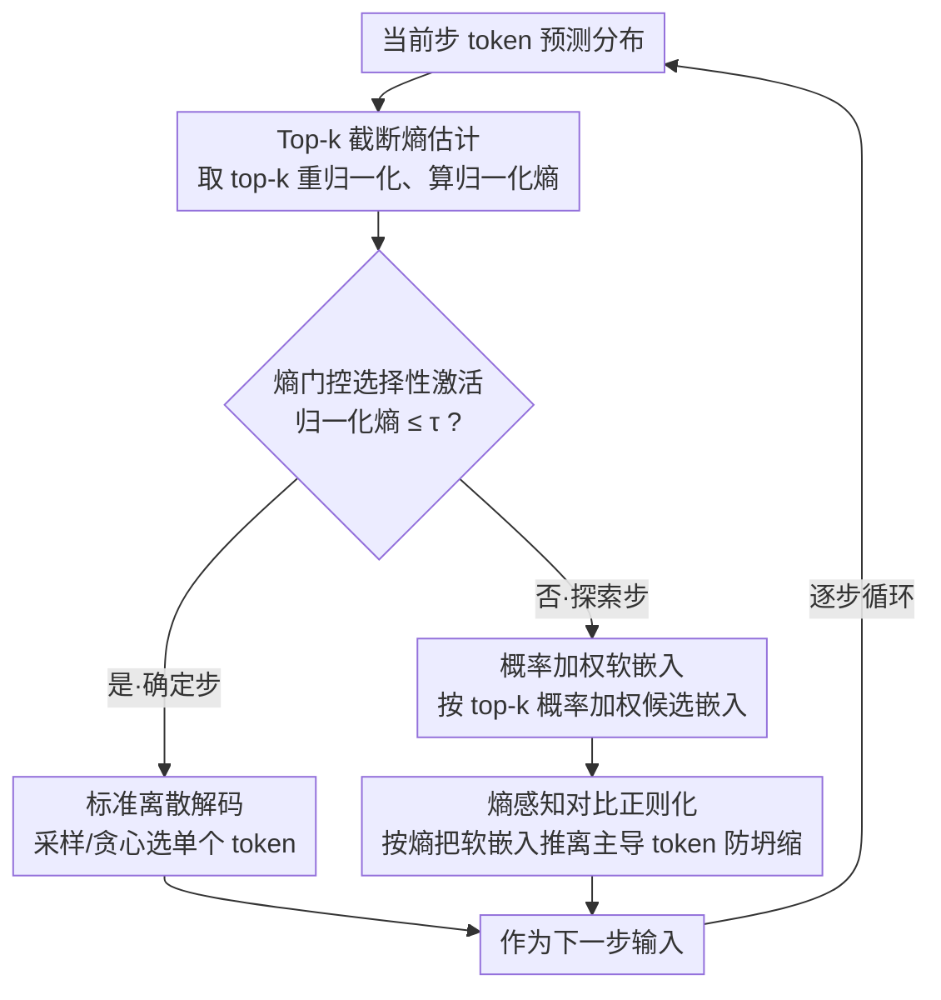

# SeLaR: Selective Latent Reasoning in Large Language Models

**会议**: ACL 2026  
**arXiv**: [2604.08299](https://arxiv.org/abs/2604.08299)  
**代码**: [GitHub](https://github.com/Parker-rfu/SeLaReasoning)  
**领域**: 模型压缩  
**关键词**: 潜在推理, 熵门控, 软嵌入, 对比正则化, 无训练推理增强

## 一句话总结

本文提出 SeLaR，一种轻量级无训练框架，通过熵门控机制仅在模型不确定的"探索步"激活软嵌入潜在推理、在高置信的"确定步"保持离散解码，并引入熵感知对比正则化防止软嵌入向主导 token 坍缩，在五个推理基准上一致超越标准 CoT 和 SOTA 无训练方法。

## 研究背景与动机

**领域现状**：思维链（CoT）已成为 LLM 多步推理的主流范式，通过显式生成中间推理步骤提升复杂任务表现。近期的潜在推理方法尝试用软嵌入或隐状态替代离散 token 采样，以在单次前向传播中隐式探索多条推理路径。

**现有痛点**：(1) 标准 CoT 在每步必须承诺单个离散 token，丢弃了关于替代推理路径的分布信息；(2) 训练型潜在推理方法（如 Coconut）因隐状态与嵌入空间的域差异导致灾难性遗忘；(3) 无训练型方法（如 Soft Thinking）全局激活软嵌入，在模型已经高置信的步骤引入不必要的扰动，破坏推理稳定性。

**核心矛盾**：CoT 解码过程中模型的熵分布呈现清晰的长尾结构——大多数步骤是低熵的确定步，只有少量步骤是高熵的探索步。全局激活忽略了这种长尾结构，在确定步引入扰动而在探索步又因软嵌入向主导 token 坍缩而失去多路径探索能力。

**本文目标**：解决两个问题——何时激活潜在推理（选择性激活）以及如何维持有效探索（防止坍缩）。

**切入角度**：利用 token 级预测分布的熵作为置信度信号，将解码步骤分为确定步和探索步，只在关键探索步启用潜在推理。

**核心 idea**：熵门控选择性激活 + 熵感知对比正则化——前者决定"何时"用潜在推理，后者解决"如何"在激活后维持多路径探索。

## 方法详解

### 整体框架

SeLaR 在解码的每一步：(1) 计算 top-k token 的归一化熵 $\bar{H}_t$；(2) 若 $\bar{H}_t \leq \tau$（确定步），使用标准离散解码；(3) 若 $\bar{H}_t > \tau$（探索步），构建 top-k 候选的概率加权软嵌入并应用对比正则化，将正则化后的软嵌入作为下一步输入。整个过程无需训练，即插即用。

### 关键设计

**1. Top-k 截断熵估计：用最相关的少数候选来度量不确定度**

门控分流与对比正则化都依赖一个干净的置信度信号，而在全词表上算熵既费算力，又会被长尾低概率 token 的噪声污染。SeLaR 只在 top-k 候选上估计熵：先把这 k 个 token 的概率重新归一化为 $\hat{p}_t(v)$，再代入截断熵 $H_t = -\sum_{v \in \mathcal{V}_k} \hat{p}_t(v) \log \hat{p}_t(v)$，并归一化为 $\bar{H}_t = H_t / \log k$。这样测的是"模型在最可能的几个候选之间到底有多犹豫"，恰好是决策相关的那部分不确定性，把无关的长尾噪声挡在外面，从而让后续门控阈值 $\tau$ 的判定既高效又稳定。

**2. 熵门控选择性激活：只在模型"拿不准"的步骤才动用潜在推理**

旧方法（如 Soft Thinking）全局激活软嵌入，问题在于 CoT 解码的熵分布是长尾的——绝大多数步骤模型已经高置信，在这些确定步注入软嵌入只会引入无谓扰动。SeLaR 拿上一步算出的归一化熵 $\bar{H}_t$ 来分流：当 $\bar{H}_t \leq \tau$ 判为确定步、走标准的采样或贪心离散解码，当 $\bar{H}_t > \tau$ 判为探索步、改用概率加权软嵌入 $e_t = \sum_{v \in \mathcal{V}_k} \hat{p}_t(v) \cdot e_v$ 作为下一步输入。阈值 $\tau$ 落在熵分布的低密度过渡带，在 $[0.3, 0.7]$ 区间内表现稳定。把激活范围收窄到少数关键探索步是有效的关键——消融里去掉这层选择、改为全局激活，平均准确率直接掉 5.19%。

**3. 熵感知对比正则化：让被激活的软嵌入别滑回贪心解码**

软嵌入一旦在探索步激活，会迅速被概率最高的主导 token 拉过去，退化成普通贪心解码，多路径探索的意义就没了。SeLaR 用一个跟熵挂钩的推离项来对抗这种坍缩：先算软嵌入与主导 token 嵌入的差向量 $\Delta_t = e_t - e_{v_t^*}$，归一化方向后按当前熵加权把嵌入推离主导方向：

$$\tilde{e}_t = e_t + \bar{H}_t \cdot \hat{\Delta}_t \cdot \|\Delta_t\|$$

熵越高、推离力度越大；当模型逐渐变得自信、熵下降，推离自然减弱并归于平静，不会在该收敛的地方继续乱推。logit lens 分析印证了它的作用：不加正则时深层的 top-1 overlap 一家独大，加上之后 top-1 与 top-2 的 overlap 维持在可比水平，说明多条推理轨迹是真的同时存活着——消融里它是贡献最大的组件，去掉后平均掉 7.82%。

### 损失函数 / 训练策略

SeLaR 完全无训练。使用 Qwen3-1.7B/8B/32B 和 DeepSeek-R1-Distill-Llama-8B 评估。解码设置：temperature=0.6, top-p=0.95, top-k=20, min-p=0.0。

## 实验关键数据

### 主实验

**五个推理基准上的准确率对比（Qwen3-8B）**

| 方法 | GSM8K | MATH500 | GPQA | AIME24 | AIME25 | Avg |
|------|-------|---------|------|--------|--------|-----|
| CoT (Sampling) | 95.45 | 98.00 | 61.62 | 76.67 | 66.67 | 79.68 |
| Soft Thinking | 94.92 | 95.80 | 57.58 | 70.00 | 66.67 | 76.99 |
| SwiR | 95.68 | 97.00 | 62.63 | 60.00 | 66.67 | 76.40 |
| **SeLaR** | **95.83** | **97.00** | **61.62** | **83.33** | **80.00** | **83.56** |

### 消融实验

**组件消融（Qwen3-8B）**

| 配置 | Avg | 说明 |
|------|-----|------|
| Full SeLaR | 83.56 | 完整模型 |
| w/o 选择性激活 | 78.37 | 全局激活掉 5.19% |
| w/o 对比正则化 | 75.74 | 无防坍缩掉 7.82% |

### 关键发现

- SeLaR 在所有模型规模上一致超越 CoT，Qwen3-8B 上平均提升 +3.88%，且是唯一在所有模型上一致超越的方法
- 在最难的 AIME 基准上提升最显著：AIME24 +6.66%、AIME25 +13.33%（Qwen3-8B）
- 对比正则化贡献最大（去掉后掉 7.82%），尤其在 AIME24/25 上从 83.33/80.00 降至 70.00/60.00
- 计算效率：SeLaR 在 AIME24 上 TPCA 比 CoT 减少 19.2%，而 SwiR 反而增加 33.2%
- Logit lens 分析证实：对比正则化使 top-1 和 top-2 的 overlap 保持可比，维持了真正的多路径探索

## 亮点与洞察

- 长尾熵分布的观察是全文的基石——大多数步骤模型已经很确定，潜在推理只在少数关键步骤有价值
- 对比正则化的设计优雅：用熵本身作为推离强度的权重，在探索步强力推离、在接近确定步时自然消退
- Logit lens 分析提供了机制性证据，而非仅依赖消融实验——直接可视化了多轨迹共存与否

## 局限与展望

- 阈值 $\tau$ 虽然在 $[0.3, 0.7]$ 范围内稳定，但仍是数据集特定的超参数，未实现完全自适应
- 在知识密集型任务（GPQA）上效果有限，因为领域知识召回比多步推理更关键
- 仅在推理型 LLM 上评估，未验证在通用指令遵循或代码生成任务上的效果
- 对比正则化的方向选择（仅推离 top-1）可能不够——top-2、top-3 也可能是需要推离的坍缩方向

## 相关工作与启发

- **vs Soft Thinking (Zhang et al., 2025)**: 后者全局激活软嵌入，SeLaR 选择性激活——去掉选择性后掉 5.19% 验证了全局激活的危害
- **vs SwiR (Shi et al., 2025)**: 后者基于相邻步熵变化触发切换，易受伪触发影响需窗口平滑；SeLaR 直接用绝对熵阈值，更简洁稳定
- **vs Coconut (Hao et al., 2025)**: 后者需微调传播隐状态，存在灾难性遗忘；SeLaR 完全无训练

## 评分

- 新颖性: ⭐⭐⭐⭐ 选择性激活 + 对比正则化的组合新颖且动机清晰
- 实验充分度: ⭐⭐⭐⭐⭐ 5 基准 × 4 模型 × 详细消融 + logit lens 机制分析
- 写作质量: ⭐⭐⭐⭐ 从观察到方法到分析的逻辑链条完整
- 价值: ⭐⭐⭐⭐ 无训练即插即用，实用价值高

<!-- RELATED:START -->

## 相关论文

- [\[ACL 2026\] Large Reasoning Models Are (Not Yet) Multilingual Latent Reasoners](large_reasoning_models_are_not_yet_multilingual_latent_reasoners.md)
- [\[ACL 2026\] Foresight Optimization for Strategic Reasoning in Large Language Models](foresight_optimization_for_strategic_reasoning_in_large_language_models.md)
- [\[CVPR 2026\] ReLaX: Reasoning with Latent Exploration for Large Reasoning Models](../../CVPR2026/llm_reasoning/relax_reasoning_with_latent_exploration_for_large_reasoning_models.md)
- [\[ACL 2026\] Parallel Test-Time Scaling for Latent Reasoning Models](parallel_test-time_scaling_for_latent_reasoning_models.md)
- [\[ICML 2026\] Reasoning Structure of Large Language Models](../../ICML2026/llm_reasoning/reasoning_structure_of_large_language_models.md)

<!-- RELATED:END -->
