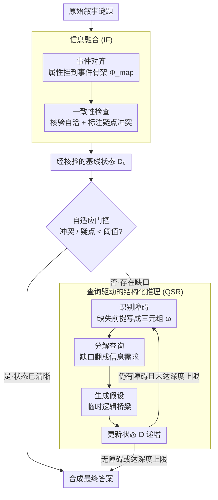

# Self-Awareness before Action: Mitigating Logical Inertia via Proactive Cognitive Awareness

**会议**: ACL 2026  
**arXiv**: [2604.20413](https://arxiv.org/abs/2604.20413)  
**代码**: 无  
**领域**: LLM评测  
**关键词**: 自我感知推理, 非交互叙事推理, 结构化状态管理, 信息融合, 逻辑惰性

## 一句话总结
本文提出 SABA 推理框架，通过"先感知再行动"的范式，在做出最终决策前显式构建和审计知识状态——利用信息融合 (IF) 将叙事整合为可验证的基线状态，再通过查询驱动的结构化推理 (QSR) 递归识别和解决缺失前提——在侦探推理和通用推理基准上均取得最佳表现。

## 研究背景与动机

**领域现状**：大语言模型在多步推理和叙事理解上已展示出强大能力。在交互式场景（如社交游戏）中，代理可以通过对话获取新信息并修正信念。但在非交互式谜题场景中，叙事是固定的，模型必须仅从包含隐含线索、缺失链接和干扰信息的长文本中重建隐藏的真相。

**现有痛点**：现有推理范式在非交互式长叙事推理中存在系统性缺陷：（1）Chain-of-Thought 倾向于提交早期假设然后扩展它，即使初始前提很弱（逻辑惰性）；（2）分解方法（如 Least-to-Most）引入中间步骤但在叙事长且证据分散时失去全局连贯性；（3）精炼方法（如 Self-Refine）在产出答案后修订，但往往是为同一个早期错误辩护而非触发全面重评估（确认偏差）。

**核心矛盾**：一旦模型在不完整前提下形成早期假设，这个错误就会在整个推理过程中传播，导致不稳定的结论。根本原因是模型在行动（给出答案）之前缺乏对自身知识或推理状态是否完整的感知。现有方法是"先回答再修正"，而非"先检查完整性再回答"。

**本文目标**：设计一个推理框架，将焦点从"直接预测"转移到"状态评估"——在做出任何决策之前，显式审计当前理解是否完整和一致。

**切入角度**：将推理重新定义为渐进式状态构建过程，而非单步推断。模型应该像系统审计员一样，先检查自身知识状态，识别缺失前提（障碍），然后通过假设生成和状态更新逐步填充，直到构建出足以支撑最终结论的推理基础。

**核心 idea**：通过递归控制循环交替进行"结构化状态构建"和"障碍驱动推理"——先整合叙事为可验证基线，再将缺失/不明确的前提转化为显式障碍和查询，递归解决直到逻辑闭合。

## 方法详解

### 整体框架
SABA 由两个阶段组成：阶段 1 是信息融合 (IF)，将原始叙事转化为结构化且经过验证的基线状态；阶段 2 是查询驱动的结构化推理 (QSR)，递归地识别推理障碍、分解为查询、生成假设并更新状态，直到无障碍剩余或达到最大深度。两个阶段之间有自适应门控机制：如果基线状态的冲突和疑点指标低于阈值，则跳过迭代循环直接合成答案。

### 关键设计

**1. 信息融合 (IF)：先把散落的弱线索关联成一份"经过核验的基线状态"**

长叙事谜题里的关键证据往往零散分布在几千字中，模型读到后面忘了前面，触发"中间丢失"效应。IF 在正式推理前先做一遍证据预整合，分两步走。第一步**事件对齐**：把叙事拆成核心事件骨架 $S = \{s_1, ..., s_m\}$ 和异质属性集 $A = \{a_1, ..., a_p\}$（动作、物体状态、位置、证据描述等），再用对齐映射 $\Phi_{\text{map}}: A \to 2^S$ 把每条属性挂到一个或多个骨干事件上，让原本隐含的关联变成显式可检索的结构。第二步**一致性检查**：对每个对齐单元算一个验证注释 $b_i = \psi_{\text{vfy}}(d_i, D_{\text{aligned}} \setminus d_i)$，逐项核对时间、实体状态、因果是否自洽，并把潜在冲突和不确定处标注出来。

值得注意的是一致性检查并不丢弃可疑信息，而是把它标成"待处理的不确定性"留在状态里——这让后面 QSR 能显式地接手这些疑点，而不是让它们悄悄丢失。消融显示这步分量很重：去掉 IF 后 DP-Complex 的 SA 掉 12.0%、CCR 掉 15.1%。

**2. 查询驱动的结构化推理 (QSR)：把"缺什么前提"显式挖出来，递归补齐再下结论**

CoT 的逻辑惰性在于一旦在不完整前提下形成早期假设，就会一路扩展、不回头复查。QSR 反其道而行，把推理重写成一个"检测缺口→填补缺口"的递归循环。每一轮先**识别障碍** $\Omega_t = \mathcal{M}(p_{\text{aware}} \mid D_t, T)$，每个障碍写成三元组 $\omega = (\tau(\omega), \text{dim}(\omega), \text{req}(\omega))$，精确说清它是什么类型、卡在哪个维度、缺什么需求——缺失前提由此成为一等公民，而不是模糊的"感觉哪里不对"。接着**分解查询** $Q_{i,t} = \mathcal{M}(p_{\text{dec}} \mid \omega_i, D_t)$，把抽象的推理缺口翻成具体信息需求；再**生成假设** $h = \mathcal{M}(p_{\text{hypo}} \mid q, D_t)$ 作为临时逻辑桥梁去填补它。每轮结束做状态更新 $D_{t+1} = D_t \cup Q_t \cup H_t$，递归继续直到 $\Omega_t = \emptyset$（无障碍剩余）或触及最大深度。这种"先暴露缺口再填补"的流程，把过早承诺替换成了可追踪、可审计的渐进构建——障碍识别也是全框架最关键的一环，消融里去掉它 SA 暴跌 22.2%。

**3. 自适应门控：简单题别空转递归**

不是每道题都值得跑一遍完整的 QSR 递归，对显然清晰的叙事强行递归只是浪费推理预算。门控在 IF 产出基线状态后先量一下"水有多浑"：评估逻辑冲突 $\mathbb{C}$ 与疑点 $\mathbb{D}$ 的密度，若两者都低于预设阈值 $x$、$y$，就跳过 QSR 迭代直接合成答案；只有当状态确实存在足够冲突或疑点时才进入递归循环。正是这步定向分配让 SABA 在拿到最高精度的同时，推理成本只有 GoT 的约四分之一。

### 损失函数 / 训练策略
SABA 是纯提示框架，无需训练。使用 DeepSeek-V3 和 Gemini-1.5-Flash 作为骨干模型，解码温度设为 0.0 以提高可重复性。语义相似度使用 all-MiniLM-L6-v2。

## 实验关键数据

### 主实验 (DeepSeek-V3)

| 方法 | DP-Complex SA | DP-Complex CCR | StrategyQA | BBH | 推理成本 T |
|------|------|------|------|------|------|
| Direct | 40.7±0.9 | 58.7±1.0 | 82.0±0.4 | 78.7±0.5 | 1.0 |
| CoT | 45.4±1.1 | 61.9±1.2 | 87.6±0.5 | 86.0±0.6 | 2.5 |
| GoT | 69.8±1.6 | 77.3±1.7 | 91.7±0.8 | 90.7±0.9 | 35.7 |
| SABA | **79.3±1.2** | **83.3±0.6** | **94.4±0.4** | **93.2±0.5** | 9.2 |

### 消融实验 (DeepSeek-V3, DP-Complex)

| 配置 | SA | CCR | StrategyQA | 说明 |
|------|------|------|------|------|
| SABA (Full) | 79.3±1.2 | 83.3±0.6 | 94.4±0.4 | 完整模型 |
| w/o IF | 69.8±1.1 | 70.7±0.9 | 82.2±0.6 | 去掉信息融合后 SA 掉 12.0% |
| Self-assess-only | 65.8±1.3 | 65.9±1.1 | 79.1±0.8 | 仅保留缺口感知 |
| w/o Awareness | 61.7±1.5 | 62.2±1.2 | 76.7±0.9 | 去掉障碍识别后 SA 掉 22.2% |

### 关键发现
- SABA 在最难的 DP-Complex 上将 SA 从最强基线 GoT 的 69.8 提升到 79.3（+9.5 点），同时推理成本仅为 GoT 的 25.8%（9.2 vs 35.7）
- **障碍识别是最关键组件**：去掉后 SA 掉幅最大（22.2%），说明显式诊断缺失前提对防止过早承诺至关重要
- 信息融合的贡献也很显著（去掉后 SA 掉 12.0%，CCR 掉 15.1%），说明将分散线索预整合为接地的中间状态对后续推理有帮助
- 推理效率优势明显：SABA 的推理成本（9.2）比 SC（12.0）低 23.3%，比 GoT（35.7）低 74.2%，得益于自适应门控和定向计算分配
- 跨模型泛化：在 Llama-3.1-70B 上也保持稳定表现，证明框架不依赖特定骨干

## 亮点与洞察
- **"先感知再行动"的范式转换**非常有洞察力：将推理从"回答→修正"转为"审计→构建→回答"，从根本上解决了确认偏差问题。这个理念可以迁移到任何需要在不完整信息下推理的场景
- **障碍的形式化表示** $\omega = (\tau, \text{dim}, \text{req})$ 使缺失前提成为一等公民——不只是"觉得哪里不对"，而是精确地说出"缺什么、在哪个维度、需要什么"。这种显式性支持后续的系统化处理
- 推理轨迹的**完全可追踪性**（每步记录障碍、查询、假设、状态变化）使得推理过程可审计，这在可解释 AI 中非常有价值
- 自适应门控是务实的工程决策——避免了"所有任务都需要复杂推理"的过度计算

## 局限与展望
- SABA 依赖骨干模型的自评估能力，对于较小模型可能障碍检测质量受限
- 递归过程引入较高延迟，可能影响实时应用
- IF 模块的结构化输入处理依赖于模型的指令遵循能力，全端到端的线索提取仍是开放问题
- 仅在侦探推理和通用 QA 上评估，未在代码生成、数学等其他推理类型上验证
- 固定深度上限 $t_{\max}$ 和门控阈值需要手动设置

## 相关工作与启发
- **vs CoT**: CoT 是线性推理链，倾向于提交早期假设并扩展。SABA 在推理前显式检查完整性，避免了错误传播
- **vs Self-Refine/Reflexion**: 这些方法是"先答后改"，容易陷入确认偏差。SABA 将修正目标从候选答案转移到底层知识状态，在承诺前强制审计完整性和一致性
- **vs GoT (Graph-of-Thought)**: GoT 外化推理轨迹但操作非结构化文本，缺乏对缺失/不一致信息的显式表示。SABA 形式化推理为迭代的结构化状态构建和验证
- **启发**：状态优先（state-first）的推理理念可能对 RAG 系统有价值——先构建和验证检索到的知识状态，再基于此推理

## 评分
- 新颖性: ⭐⭐⭐⭐ "先感知再行动"的理念新颖，但具体技术（IF + QSR）的创新度中等
- 实验充分度: ⭐⭐⭐⭐ 多基准、消融、跨模型验证充分，但侦探推理数据集仅31例
- 写作质量: ⭐⭐⭐⭐ 形式化定义清晰，可视化好，但部分公式符号过于繁重

<!-- RELATED:START -->

## 相关论文

- [\[ICLR 2026\] The Reasoning Trap — Logical Reasoning as a Mechanistic Pathway to Situational Awareness](../../ICLR2026/llm_reasoning/the_reasoning_trap_--_logical_reasoning_as_a_mechanistic_pathway_to_situational_.md)
- [\[ICML 2026\] Verifying Meta-Awareness via Predictive Rewards in Reasoning Models](../../ICML2026/llm_reasoning/verifying_meta-awareness_via_predictive_rewards_in_reasoning_models.md)
- [\[ACL 2026\] Logical Phase Transitions: Understanding Collapse in LLM Logical Reasoning](logical_phase_transitions_understanding_collapse_in_llm_logical_reasoning.md)
- [\[ICLR 2026\] Conflict-Aware Fusion: Resolving Logic Inertia in Large Language Models via Structured Cognitive Priors](../../ICLR2026/llm_reasoning/conflict-aware_fusion_resolving_logic_inertia_in_large_language_models_via_struc.md)
- [\[ICML 2026\] Hidden Error Awareness in Chain-of-Thought Reasoning: The Signal Is Diagnostic, Not Causal](../../ICML2026/llm_reasoning/hidden_error_awareness_in_chain-of-thought_reasoning_the_signal_is_diagnostic_no.md)

<!-- RELATED:END -->
