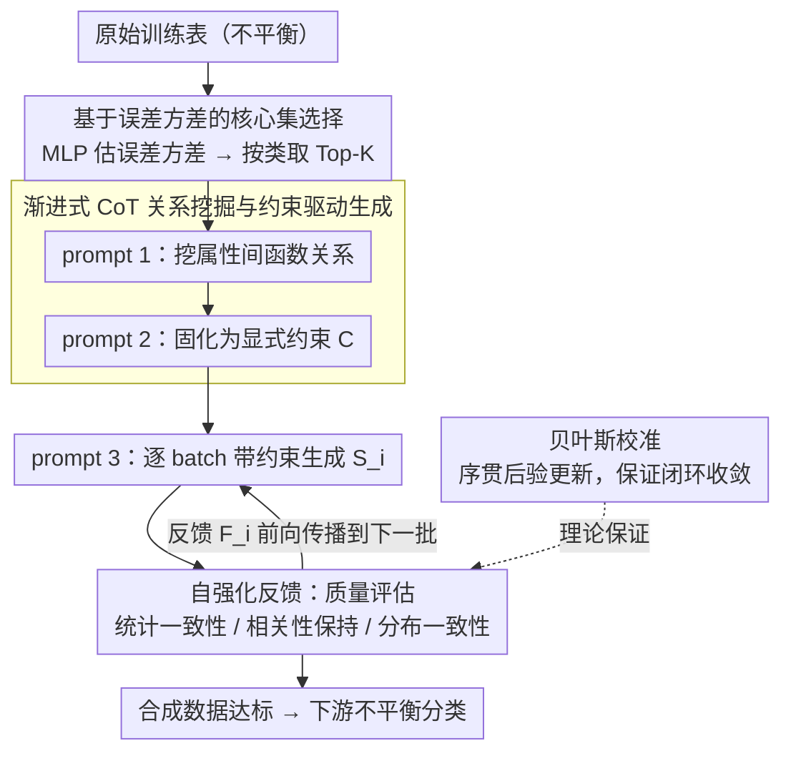

# Self-Reinforcing Controllable Synthesis of Rare Relational Data via Bayesian Calibration

**会议**: ACL 2026  
**arXiv**: [2604.16817](https://arxiv.org/abs/2604.16817)  
**代码**: [GitHub](https://github.com/cszhangLMU/RDDG)  
**领域**: LLM推理 / 表格数据生成  
**关键词**: 表格数据合成, 不平衡分类, 自强化反馈, 贝叶斯校准, 上下文学习

## 一句话总结

本文提出RDDG，基于渐进式CoT的表格数据合成框架，通过核心集选择、关系挖掘和自强化反馈机制引导LLM生成高保真表格数据，在不平衡分类上平均提升2%+ Macro-F1。

## 研究背景与动机

**领域现状**：不平衡数据在真实应用中普遍存在，数据合成是缓解稀有类样本稀缺的常用手段。大语言模型已经革新了文本生成，多模态基础模型也被用来生成图像数据增强视觉学习，但把 LLM 用到关系型 / 结构化表格数据合成上仍探索不足。相比之下，GAN、扩散模型等非 LLM 方法在表格数据生成上已经被验证有效。

**现有痛点**：现有 LLM 表格合成方法存在两个缺口。其一，数据生成方法与下游任务（尤其是不平衡分类）的优化目标之间存在明显错位——生成只追求像真实数据，却没盯住分类要的东西。其二，缺少一个内部的自强化反馈机制，能在 in-context 合成全程持续引导 LLM 优化生成质量，而不是一次性生成完就撒手。

**核心矛盾**：表格数据的属性之间有复杂的函数关系和相关性约束，直接让 LLM 自由生成容易脱离真实分布；但要把这些约束塞进提示又受限于上下文窗口长度，且静态约束无法随生成过程动态纠偏。

**本文目标**：提出 RDDG（Relational Data generator with Dynamic Guidance），一个统一的 in-context learning 框架，用渐进式 CoT 步骤生成表格数据来提升下游不平衡分类性能，并给自强化反馈机制配上贝叶斯校准的理论保证。

**核心 idea**：先用核心集选择压缩出代表性样本绕开上下文限制，再用关系挖掘把属性间的函数关系固化成显式约束，最后用一个把质量评估前向传播到下一批的自强化反馈闭环，让生成质量在批次间持续爬升——并证明这个闭环本质上是在做序贯贝叶斯校准。

## 方法详解

### 整体框架

RDDG 要解决的是「让 LLM 在不微调的前提下，合成高保真且服务于不平衡分类的表格数据」。整条流水线分三步串起来：先做**核心集构建**，从原始训练数据里挑出最有代表性的少量样本，绕开 LLM 上下文窗口的限制；再做**关系挖掘**，用 in-context learning 从核心集里挖出属性间的潜在 pattern 和相关性，固化成显式的结构约束；最后做**数据生成与约束优化**，把训练集切成多个 batch 作为参考集逐批生成，并在每批之后用自强化反馈机制评估质量、把评估结果转成反馈提示喂给下一批。形式上，第 $i$ 批合成数据由 $\mathcal{S}_i = S_\phi(\mathcal{R}_i, \mathcal{C}, \mathcal{F}_{i-1})$ 产生，其中 $\mathcal{R}_i$ 是真实参考集、$\mathcal{C}$ 是关系挖掘得到的约束、$\mathcal{F}_{i-1}$ 是上一批的反馈，总目标是逼近 $\min_{\mathcal{S}_i} d(\hat{\mathbb{P}}_{\mathcal{S}_i}, \mathbb{P}_{\mathcal{R}})$（$d$ 为 KL 散度等分布距离）。

### 关键设计

**1. 基于误差方差的核心集选择：用一小撮「最难学」的样本撑起整个分布**

LLM 的上下文窗口塞不下整张训练表，硬截断又会丢掉分布的尾部，正是稀有类最吃亏。RDDG 借用核心集选择的思路：训练一个简单的 MLP，把训练过程切成 early / middle / late 三个阶段，对每个样本在每个 epoch 算 L2 预测误差 $\mathcal{L}_2(\mathbf{y}_{\text{pred}}, \mathbf{y}_{\text{true}}) = \|\mathbf{y}_{\text{pred}} - \mathbf{y}_{\text{true}}\|_2^2$，再统计每个样本在 early 和 late 阶段误差的均值与方差，按类选出方差最高的 Top-K：$\text{Top}_k(k) = \arg\text{top}_K([\text{Var}_i \mid i \in N_k])$；某类样本不足 $K$ 时重复采样补齐。误差方差高的样本往往处在决策边界附近、信息量最大，而「按类各取 Top-K」的平衡策略保证少数类不会在喂给 LLM 时被多数类淹没。

**2. 渐进式 CoT 的关系挖掘与约束驱动生成：把领域先验显式化成可控的生成规则**

直接让 LLM 凭空生成表格行，结果常常属性之间互相矛盾、脱离真实相关结构。RDDG 把生成拆成一条类 CoT 的推理链：prompt 1 先让 LLM 从核心集里分析属性间的函数关系（pattern 和 inter-attribute correlation）；prompt 2 再让它综合核心集、metadata 和上一步关系，建立显式的生成规则与约束；prompt 3_1 才把训练集分成多个 batch 当参考集，带着这些约束生成新样本。这样把领域先验从「藏在数据里」变成「写在约束里」，实现 constraint-driven、可控的合成，而不是放任 LLM 自由发挥。

**3. 自强化反馈的动态引导调整：让每一批都站在上一批的肩膀上**

一次性生成完就结束，错误无从纠正。RDDG 在每批生成后立刻从三个维度评估质量：Statistical Consistency（比较生成与真实数据的均值、标准差）、Correlation Preservation（用 Pearson 相关系数检查属性间关系是否保持）、Distribution Consistency（用 Kolmogorov-Smirnov 检验验证分布对齐）。关键在于，batch $i$ 的反馈**不是**拿去重生成同一批，而是转成反馈提示 $\mathcal{F}_{i-1}$ 前向传播到 batch $i+1$，与既有约束一起带进下一轮 in-context learning：$\mathcal{S}_i = S_\phi(\mathcal{R}_i, \mathcal{C}, \mathcal{F}_{i-1})$，直到合成样本总数达到目标阈值。每一轮都吸收前面几轮的洞察，形成一个自优化的生成流水线，语义一致性和统计保真度随批次逐步抬升。

**4. 贝叶斯校准视角：给经验性的反馈闭环上一道理论保险**

自强化反馈为什么会越调越好、而不是随机游走？论文把这个序贯过程严格化为 Bayesian calibration：把生成器超参 $\phi$ 当成未知量，放一个先验 $p(\phi)$ 编码关系挖掘阶段发现的结构信念；用 summary targets $T(\mathcal{R})$（均值、标准差、Pearson 相关、KS 距离）构造似然 $p(T(\mathcal{R}) \mid T(S_\phi))$ 给合成批次打分；后验则是 $p(\phi \mid T(\mathcal{R})) \propto p(T(\mathcal{R}) \mid T(S_\phi)) \, p(\phi)$。整个闭环就是对 batch $i=1,2,\dots$ 做序贯贝叶斯更新，反馈指标 $F_i$ 充当 posterior predictive check，每次更新把 $\phi$ 往「既保持函数关系、又改善类不平衡目标」的方向推。Theorem 1 证明最大化后验期望效用的 Bayes-optimal prompt $\phi^\star$ 能最小化后验期望 regret；Proposition 1 进一步用 Robbins–Monro 随机逼近证明，在合适步长条件下更新序列 $\phi_i$ 几乎必然收敛到 Bayes 最优集 $\Phi^\star$（后验期望效用严格凹时收敛到唯一 $\phi^\star$）。这把「自强化提示」从经验技巧抬成了后验期望效用最大化。

### 损失函数 / 训练策略

RDDG **不微调 LLM**，整条合成靠 in-context learning 完成；唯一需要训练的是核心集选择里那个用来估误差方差的 MLP。默认 LLM 为 GPT-3.5-turbo-0125，真实数据集上还额外测了 Llama 3.0 和 Mistral Max。优化目标是逐批最小化合成数据经验分布与真实分布的散度 $\min_{\mathcal{S}_i} d(\hat{\mathbb{P}}_{\mathcal{S}_i}, \mathbb{P}_{\mathcal{R}})$。

## 实验关键数据

### 主实验

在 8 个数据集上评测：4 个真实数据集（Travel、Sick、Heloc、Thyroid）和 4 个带显式属性间相关性的合成数据集（Consumer Behavior、Health Metrics、Real Estate、Social Network），每个数据集按 80% / 20% 划分训练 / 测试。对比方法覆盖 GReaT、EPIC、TabDDPM、CDTD、REaLTabFormer、ADS-GAN，以及不使用任何合成数据的 Original。下表摘录 Travel 数据集（GPT-3.5 为默认 LLM）：

| 方法 | Macro-F1 | Balanced Acc |
|------|----------|--------------|
| Original | 58.12 | 71.21 |
| TabDDPM | 65.32 | 73.19 |
| CDTD | 66.32 | 74.82 |
| EPIC（此前 SOTA） | 66.65 | 78.23 |
| **RDDG（本文）** | **68.63** | **79.67** |

汇总到全部数据集，RDDG 相比此前最强的 in-context 方法 EPIC 平均提升 **>2% weighted Macro-F1** 和 **>1% Balanced Accuracy**，同时保持更优的数据保真度。

### 关键发现

- RDDG 在 Travel 上把少数类敏感度（Sensitivity 78.23）做到与 EPIC 持平的同时，Macro-F1 和 Balanced Accuracy 双双登顶，说明自强化反馈带来的保真度增益确实转化成了下游分类收益，而非只在生成端好看。
- 在 Sick 等已经较平衡的数据集上，RDDG 的 Balanced Accuracy（93.62）仍领先 CDTD（93.25）和 EPIC（92.45），表明框架不靠牺牲多数类来换少数类。
- 跨 GPT-3.5 / Llama 3.0 / Mistral Max 三个 LLM 都能复现提升，说明增益来自框架设计而非某个特定模型。

## 亮点与洞察

- **把反馈闭环从经验技巧抬成理论保证**：多数 LLM 数据合成方法的「迭代改进」止于工程直觉，RDDG 用 Bayesian calibration 证明了序贯反馈会收敛到 Bayes-optimal prompt，这种「先证明再实现」的路线在数据合成方向少见。
- **反馈前向传播而非原地重生成**：把 batch $i$ 的质量评估带到 $i+1$ 而不是反复打磨同一批，既避免了对单批过拟合，又让真实参考集不断轮换，是一个很务实的设计取舍。
- **核心集选择用「误差方差」而非随机采样**：在上下文长度硬约束下，挑边界附近的高信息样本比均匀抽样更能撑起分布，且天然按类平衡照顾稀有类。

## 局限与展望

- 核心集选择依赖一个额外 MLP 来估误差方差，对极高维或样本极少的稀有类，这个代理模型本身可能不稳。
- 自强化反馈的三个质量维度（统计一致性、相关性保持、分布一致性）是手工设定的，对强非线性、高阶交互的属性关系刻画可能不足。
- 贝叶斯最优性的证明依赖若干理想化假设（无偏随机超梯度、紧致参数空间、合适步长），与提示工程的离散现实之间仍有距离。
- 实验以表格分类为主，对回归、时序等其他结构化数据形态的迁移尚待验证。

## 相关工作与启发

- **vs 最相关工作A**: 本文在关键维度上有所改进
- **vs 最相关工作B**: 本文提供了不同的解决思路

## 评分

- 新颖性: ⭐⭐⭐⭐ 有创新但部分技术是已有方法的组合
- 实验充分度: ⭐⭐⭐⭐ 评估较全面
- 写作质量: ⭐⭐⭐⭐ 结构清晰
- 价值: ⭐⭐⭐⭐ 对领域有实际贡献

<!-- RELATED:START -->

## 相关论文

- [\[ACL 2026\] Efficient PRM Training Data Synthesis via Formal Verification](efficient_prm_training_data_synthesis_via_formal_verification.md)
- [\[ACL 2026\] MathAgent: Adversarial Evolution of Constraint Graphs for Mathematical Reasoning Data Synthesis](mathagent_adversarial_evolution_of_constraint_graphs_for_mathematical_reasoning_.md)
- [\[ICML 2026\] An Information-Theoretic Criterion for Efficient Data Synthesis](../../ICML2026/llm_reasoning/an_information-theoretic_criterion_for_efficient_data_synthesis.md)
- [\[ACL 2026\] Calibration-Aware Policy Optimization for Reasoning LLMs](calibration-aware_policy_optimization_for_reasoning_llms.md)
- [\[ICLR 2026\] DESIGNER: Design-Logic-Guided Multidisciplinary Data Synthesis for LLM Reasoning](../../ICLR2026/llm_reasoning/designer_design-logic-guided_multidisciplinary_data_synthesis_for_llm_reasoning.md)

<!-- RELATED:END -->
