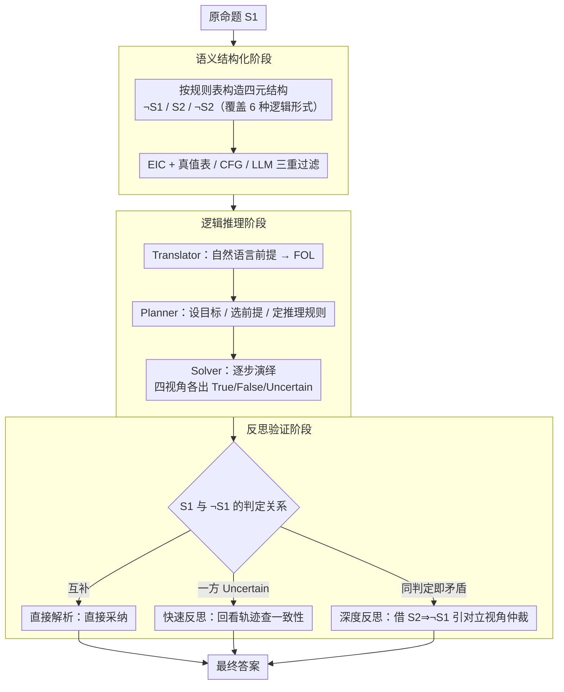

# Semantic-Aware Logical Reasoning via a Semiotic Framework

**会议**: ACL 2026  
**arXiv**: [2509.24765](https://arxiv.org/abs/2509.24765)  
**代码**: [GitHub](https://github.com/AI4SS/Logic-Agent)  
**领域**: LLM Reasoning / Logical Reasoning  
**关键词**: 符号推理, 格雷马斯符号方阵, 逻辑推理, 语义复杂性, 多视角推理

## 一句话总结

提出 LogicAgent，一个基于格雷马斯符号方阵(Semiotic Square)的逻辑推理框架，通过多视角语义分析和反思验证，在语义复杂和逻辑复杂双重挑战下实现 SOTA 逻辑推理性能。

## 研究背景与动机

**领域现状**：LLM 的逻辑推理能力是其核心能力之一。现有方法主要分为三类：线性推理(CoT)、聚合推理(ToT/CR 等多轨迹聚合)、符号推理(Logic-LM 等结合 FOL 求解器)。这些方法在逻辑结构清晰的基准上表现良好。

**现有痛点**：现有方法几乎都聚焦于**逻辑复杂性**（推理深度、步骤数），而忽视了**语义复杂性**（抽象命题、歧义上下文、对立立场）。在现实推理中，语义的模糊和抽象往往与逻辑复杂性交织在一起——比如"正义是否总是有利的？"这种哲学命题，不仅需要深层推理，还涉及对抽象概念的多角度解读。

**核心矛盾**：现有基准（ProntoQA、ProofWriter 等）大多基于模板生成，命题清晰无歧义，无法检验模型在语义复杂场景下的推理鲁棒性。在真实世界中，语义复杂性和逻辑复杂性的耦合才是推理的真正难点。

**本文目标**：构建一个同时应对语义复杂性和逻辑复杂性的推理框架，并提供一个能评估这种耦合挑战的基准。

**核心idea**：借鉴结构主义语义学中的格雷马斯符号方阵——将命题扩展为四元结构（原命题 $S_1$、矛盾 $\lnot S_1$、对立 $S_2$、对立的矛盾 $\lnot S_2$），从多视角进行推理和交叉验证，从而在语义歧义下增强推理鲁棒性。

## 方法详解

### 整体框架

LogicAgent 要解决的是「语义复杂性和逻辑复杂性交织时，单视角推理容易锁死在一种解释上」的问题。它把一个命题先摊开成格雷马斯符号方阵的四元结构，再让每个视角各自走一遍形式化演绎，最后用方阵自带的结构关系做交叉仲裁。整条流水线分三阶段：**语义结构化**把命题 $S_1$ 扩展成 $\lnot S_1$、$S_2$、$\lnot S_2$ 四个关联命题并验证 FOL 一致性；**逻辑推理**把前提翻成 FOL、规划路径、逐步演绎出每个视角的判定；**反思验证**用三层递进机制比对各视角结论，输出一致的最终答案。

### 关键设计

**1. 语义结构化阶段：把单命题摊成四元语义空间，逼出潜在歧义**

自然语言命题常隐含多种解释，过早锁定一种就会漏掉对立立场——比如"正义是否总是有利的"，肯定和否定都各有道理。这一阶段给定原命题 $S_1$，按统一规则表构造它的矛盾命题 $\lnot S_1$（严格否定）、对立命题 $S_2$（不能同真但可同假）以及对立的矛盾 $\lnot S_2$；规则表用 6 条规则覆盖全称、存在、蕴含、合取、析取、双条件六种逻辑形式。为了避免对立关系在空域上出现"空真"漏洞，引入存在性导入检查（EIC）保证对立的逻辑正确性。所有候选命题再经过真值表验证、CFG 语法检查、LLM 语义验证三重过滤，确保四元结构既语法合法又语义贴题。这样后续推理就在一个结构化的多视角空间上展开，而不是只盯着原命题这一面。

**2. 逻辑推理阶段：对方阵里的每个命题做形式化符号演绎**

纯 LLM 推理不可靠，容易跳步或自相矛盾，所以这一阶段把推理交给三个分工明确的功能单元。Translator 把自然语言前提转成 FOL，用统一映射规范处理（实体映成一元谓词、动作映成二元谓词、评价性质映成谓词）；Planner 构建推理蓝图，设定目标、挑选相关前提、识别要用的推理规则（如 Modus Ponens / Modus Tollens 等）；Solver 按蓝图逐步演绎，输出透明的推理轨迹和 True / False / Uncertain 三值判定。LLM 的语言理解负责把模糊的自然语言落到符号上，符号逻辑的严格演绎负责保证每一步可追溯，两者互补弥补了端到端 LLM 的不可靠。

**3. 反思验证阶段：用方阵的结构关系交叉仲裁，专治不一致**

四个视角各自给出判定后，怎么合成一个可靠结论？这一阶段设计了三层递进机制，精确匹配不同的不一致模式。当 $S_1$ 和 $\lnot S_1$ 给出互补判定（一真一假）时走**直接解析**，直接采纳；当其中一方为 Uncertain 时走**快速反思**，让 LLM 回看推理轨迹检查内部一致性；当 $S_1$ 和 $\lnot S_1$ 竟然给出相同判定（即出现矛盾）时走**深度反思**，利用方阵的蕴含关系 $S_1 \Rightarrow \lnot S_2$ 和 $S_2 \Rightarrow \lnot S_1$，把 $S_2$ 和 $\lnot S_2$ 的推理结果引进来做仲裁。符号方阵的矛盾、对立、蕴含三种结构关系本身就构成一张天然的交叉验证网，能在推理出错时把矛盾暴露出来并修正。

### 一个例子：判定"正义是否总是有利的"

以哲学命题 $S_1$="正义总是有利的"为例。语义结构化阶段把它摊成四元结构：矛盾命题 $\lnot S_1$="并非正义总是有利"、对立命题 $S_2$="正义总是不利"、以及 $\lnot S_2$，并通过 EIC 和三重过滤确认这组命题在 FOL 下合法。逻辑推理阶段让 Translator / Planner / Solver 分别对四个命题独立演绎，各得一个三值判定。到反思验证阶段，如果 $S_1$ 判 True 而 $\lnot S_1$ 判 False，互补即直接解析采纳 True；但若两者都判 True（矛盾），就触发深度反思，借 $S_2 \Rightarrow \lnot S_1$ 把对立命题的判定拉进来仲裁，最终给出在多视角下自洽的结论。整个过程让模型不会因为只盯着原命题一面而被语义歧义带偏。

### 损失函数 / 训练策略

LogicAgent 是一个无需训练的推理框架，基于现有 LLM (Qwen2.5-32B, GPT-4o) 通过提示工程实现。CFG 语法检查使用 nltk 库，解码温度设为 0。

## 实验关键数据

### 主实验

| 基准 | LogicAgent | 最佳基线 | 提升 |
|------|-----------|---------|------|
| RepublicQA (Qwen2.5) | 82.50 | 76.00 (SymbCoT) | +6.50 |
| RepublicQA (GPT-4o) | 87.00 | 82.50 (Aristotle) | +4.50 |
| ProntoQA | 97.80 | 95.20 (SymbCoT) | +2.60 |
| ProofWriter | 71.95 | 64.67 (SymbCoT) | +7.28 |
| FOLIO | 79.90 | 72.54 (ToT) | +7.97 |
| ProverQA | 68.60 | 62.40 (Logic-LM) | +6.20 |
| **平均** | **79.56** | - | **+7.05** |

### 消融实验

| 配置 | Avg | 说明 |
|------|-----|------|
| Full LogicAgent | 76.36 | 完整模型 |
| w/o Square (去掉符号方阵) | 67.58 | 下降最大，多视角推理至关重要 |
| w/o Plan (去掉推理规划) | 69.70 | 规划对复杂推理有显著帮助 |
| w/o Reflect (去掉反思) | - | 反思验证进一步提升可靠性 |

### 关键发现
- RepublicQA 的语义复杂度指标全面超越现有基准（FKGL=11.94 达大学水平，对立构造率 0.70 远超其他基准的 0-0.30）
- Logic-LM 在 RepublicQA 上表现接近 naive baseline，说明纯符号增强在语义歧义下失效
- 符号方阵的贡献最大（去除后平均下降约 8.8 点），验证了多视角推理的核心价值
- LogicAgent 在简单基准(ProntoQA)和复杂基准(ProverQA)上均一致提升，泛化性良好

## 亮点与洞察
- **语言学理论与 AI 推理的跨学科融合**：将格雷马斯符号方阵从结构主义语义学迁移到计算逻辑推理中，既有理论深度又有实践效果
- **语义复杂性的首次系统化**：定义了多维度的语义复杂性指标并构建了专用基准，填补了重要空白
- **三层反思机制的递进设计**：从直接解析到快速反思再到深度反思，精确匹配不同的不一致性模式
- **存在性导入检查(EIC)的严谨性**：确保对立关系在 FOL 框架下的逻辑正确性，避免空域上的逻辑漏洞

## 局限与展望
- RepublicQA 聚焦于哲学/伦理领域，对科学和常识推理的覆盖有限
- 框架依赖 LLM 正确执行 FOL 翻译和符号方阵构造，弱模型可能生成低质量中间结果
- 深度反思引入了额外的推理开销（需要对 $S_2$ 和 $\lnot S_2$ 进行完整推理）
- 三值逻辑(True/False/Uncertain)的设定可能不够灵活，未来可探索概率化推理
- 未来可将符号方阵与推理时计算(test-time compute)结合

## 相关工作与启发
- **vs SymbCoT**：SymbCoT 结合 CoT 和符号推理但缺乏多视角验证，LogicAgent 通过符号方阵的交叉验证显著提升
- **vs Logic-LM**：Logic-LM 直接调用 FOL 求解器，在语义歧义下效果受限；LogicAgent 先通过语义结构化处理歧义
- **vs Aristotle**：Aristotle 结合聚合和符号推理，但不具备系统的反思机制；LogicAgent 的三层反思在矛盾检测上更有效

## 评分
- 新颖性: ⭐⭐⭐⭐⭐ 格雷马斯符号方阵在 AI 推理中的应用具有高度原创性，RepublicQA 基准也是独特贡献
- 实验充分度: ⭐⭐⭐⭐ 5个基准、多基线、含消融分析，但模型覆盖(仅2个LLM)略少
- 写作质量: ⭐⭐⭐⭐ 理论推导严谨，定义和定理表述清晰，但符号较多导致阅读门槛偏高
- 价值: ⭐⭐⭐⭐ 为逻辑推理引入了语义复杂性维度，框架和基准均有独立贡献

<!-- RELATED:START -->

## 相关论文

- [\[ACL 2026\] Logical Phase Transitions: Understanding Collapse in LLM Logical Reasoning](logical_phase_transitions_understanding_collapse_in_llm_logical_reasoning.md)
- [\[ACL 2025\] Aristotle: Mastering Logical Reasoning with A Logic-Complete Decompose-Search-Resolve Framework](../../ACL2025/llm_reasoning/aristotle_logical_reasoning.md)
- [\[ACL 2026\] Discovering a Shared Logical Subspace: Steering LLM Logical Reasoning via Alignment of Natural-Language and Symbolic Views](discovering_a_shared_logical_subspace_steering_llm_logical_reasoning_via_alignme.md)
- [\[ACL 2026\] Calibration-Aware Policy Optimization for Reasoning LLMs](calibration-aware_policy_optimization_for_reasoning_llms.md)
- [\[ICLR 2026\] ActivationReasoning: Logical Reasoning in Latent Activation Spaces](../../ICLR2026/llm_reasoning/activationreasoning_logical_reasoning_in_latent_activation_spaces.md)

<!-- RELATED:END -->
