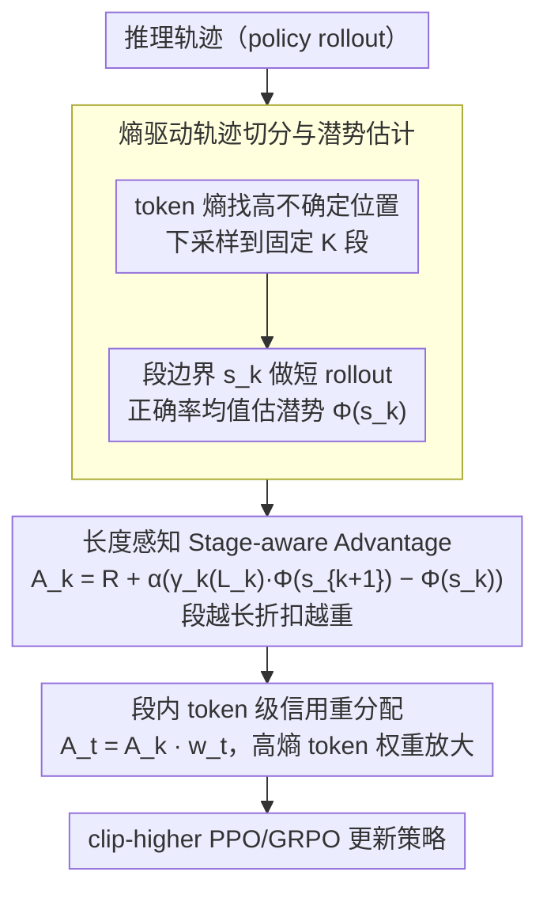

# SHAPE: Stage-aware Hierarchical Advantage via Potential Estimation for LLM Reasoning

**会议**: ACL2026  
**arXiv**: [2604.06636](https://arxiv.org/abs/2604.06636)  
**代码**: 未公开  
**领域**: LLM评估 / LLM推理  
**关键词**: 过程监督、潜势估计、信用分配、数学推理、token效率

## 一句话总结
SHAPE 把 LLM 推理看成在“可解性潜势”状态空间中的轨迹，用长度感知的阶段级优势和熵驱动的 token 级重分配同时提升数学推理准确率并减少约 30% 生成 token。

## 研究背景与动机
**领域现状**：数学推理类 LLM 后训练主要依赖 RLVR，典型算法如 GRPO 只根据最终答案正确性给奖励。由于 outcome reward 稀疏，模型可能在训练中出现探索低效、过度思考、长链条重复或靠碰运气取得正确答案的问题。

**现有痛点**：过程监督能提供更密集反馈，但学习式 PRM 需要额外标注或模型训练，也容易被 reward hacking。MRT 等 rule-based process reward 用 rollout 估计中间状态的可解性，避免训练奖励模型，但仍有三个问题：不显式奖励局部潜势提升，可能鼓励先把推理带坏再“救回来”；缺少长度惩罚，无法区分简洁突破和冗长绕路；把同一个段级优势广播给所有 token，无法突出关键决策点。

**核心矛盾**：好的推理链既要逐步接近答案，又要在困难阶段实现真正突破，还要避免无意义长推理。现有 reward 要么只看最终对错，要么只看粗粒度过程，难以同时刻画进步、阶段难度和效率。

**本文目标**：作者希望设计一种无需训练额外 PRM、可以嵌入 RL 后训练的分层信用分配机制，让模型更愿意在低潜势状态中做有效突破，并对高潜势状态下的冗余 token 施加压力。

**切入角度**：论文用 Reasoning Potential $\Phi$ 表示某个中间推理状态继续完成题目的经验可解性。低 $\Phi$ 表示路径仍混乱，高 $\Phi$ 表示接近答案。关键不是只奖励最终成功，而是奖励从 $\Phi(s_k)$ 到 $\Phi(s_{k+1})$ 的有效上升。

**核心 idea**：把 Potential-Based Reward Shaping 改造成长度感知的段级优势函数，并在段内用 token 熵做局部信用重分配，让 reward 同时具备阶段意识、进步约束和效率偏好。

## 方法详解

### 整体框架
SHAPE 的 pipeline 有三步。第一步，将模型生成的推理轨迹切分成若干语义段，并在每个段边界估计当前状态的可解性潜势。第二步，在相邻段之间计算 stage-aware segment-level advantage，用动态折扣因子同时奖励潜势提升和惩罚冗长段落。第三步，在每个段内部依据 token 熵重新分配优势，让高不确定性、可能代表关键推理转折的 token 获得更强监督。

与 MRT 相比，SHAPE 的核心差异是它显式比较相邻状态 $\Phi(s_k)$ 和 $\Phi(s_{k+1})$。如果某段让潜势下降，就会被惩罚；如果某段只是很长但提升很小，也会被折扣项压低优势。这使 reward 更难被“绕远路再恢复”的策略利用。

### 关键设计
**1. 熵驱动的轨迹切分与潜势估计：把推理链切在逻辑转折点，而不是格式边界**

如果用换行等刚性分隔符切段，常常切到格式边界而非逻辑边界，导致每段的潜势估计噪声更大。SHAPE 借鉴 SPO 的 adaptive cutpoint partition，但不用低概率 token，而是用 token-level entropy 去找高不确定性位置：熵超过阈值的位置作为候选切分点，再下采样到固定段数 $K$。在每个边界状态 $s_k$，模型执行若干短 rollout，以正确率均值估计可解性潜势 $\Phi(s_k)$；为控制成本，使用 vLLM prefix caching 和较短的 rollout 长度。这样切出来的段更贴近模型真正"拿不准、要做关键选择"的位置，因为数学推理的关键转折往往就发生在模型不确定的地方。

**2. 长度感知的 Stage-aware Advantage：在同一个公式里同时奖励进步、惩罚啰嗦**

MRT 这类 rule-based process reward 有三个毛病：不显式奖励局部潜势提升（可能鼓励先把推理带坏再"救回来"）、缺长度惩罚（分不清简洁突破和冗长绕路）、把段级优势一股脑广播给所有 token。SHAPE 用段级优势 $A_k=R_{outcome}+\alpha(\gamma_k(L_k)\Phi(s_{k+1})-\Phi(s_k))$ 来纠正，其中折扣因子 $\gamma_k(L_k)$ 随段长 $L_k$ 线性下降、最低为 $\gamma_{min}$。把 shaping 项近似展开后，它等于潜势增益 $\Delta_k$ 减去一个 reasoning tax $(1-\gamma_k)\Phi(s_k)$：段越长 tax 越大，当前潜势越高、继续啰嗦的成本越高。这恰好编码了两个直觉——低潜势状态里的突破更难、更有价值，应被鼓励；高潜势状态里的冗余细化往往是 overthinking，应被压制。比起粗暴惩罚长答案，这种与潜势耦合的 tax 更稳，因为必要的长推理仍能靠足够的潜势增益抵消掉惩罚。

**3. 段内 token 级信用重分配：别把一段里所有 token 当成同等重要**

段级优势把整段 token 一视同仁，但真正改变推理方向的往往只是其中几个高不确定性的 token。SHAPE 在每个段内部对 token 熵做 z-score 标准化，得到局部重要性权重 $w_t=clip(1+\beta\tilde{H}(x_t),\delta_{min},\delta_{max})$，最终 token 级优势为 $A_t=A_k\cdot w_t$：平均熵的 token 近似保留原段级优势，高熵 token 获得放大。用段级 reward 当稳定锚点、再在段内局部重分配，比直接对全局 outcome reward 做 token shaping 方差更低，既突出了关键决策点又不至于让信号抖得太厉害。

### 损失函数 / 训练策略
实验基于 VeRL 框架实现，采用 clip-higher PPO/GRPO 变体，$\epsilon_{high}=0.28$、$\epsilon_{low}=0.2$，KL 系数为 0。全局 batch size 为 128，mini-batch size 为 32，学习率 $1\times10^{-6}$，训练 360 steps。1.5B 模型最大响应长度 8,192 tokens、段数 $K=8$；Qwen3-4B 最大响应长度 16,384 tokens、段数 $K=16$。默认过程奖励系数 $\alpha=0.3$，折扣下界 $\gamma_{min}=0.9$。

## 实验关键数据

### 主实验
实验在 DeepSeek-R1-Distill-Qwen-1.5B、DeepScaleR-1.5B-Preview 和 Qwen3-4B 三个 backbone 上进行，训练数据为 rStar2A，评测覆盖 AIME 2024/2025、AMC 2023、MATH500 和 MinervaMATH。下表汇总五个数据集平均准确率与平均生成 token 数。

| Backbone | 方法 | Overall Acc | Avg Tokens | 相对 GRPO 变化 |
|----------|------|-------------|------------|----------------|
| DS-R1-Distill-Qwen-1.5B | GRPO | 52.1 | 6111 | 基线 |
| DS-R1-Distill-Qwen-1.5B | MRT | 51.9 | 4632 | token 减少但准确率略降 |
| DS-R1-Distill-Qwen-1.5B | SHAPE | 54.7 | 4165 | +2.6 Acc，-31.8% tokens |
| DeepScaleR-1.5B | GRPO | 55.6 | 5416 | 基线 |
| DeepScaleR-1.5B | MRT | 57.1 | 4238 | 有提升 |
| DeepScaleR-1.5B | SHAPE | 59.4 | 3765 | +3.8 Acc，-30.5% tokens |
| Qwen3-4B | GRPO | 74.4 | 9650 | 基线 |
| Qwen3-4B | MRT | 74.2 | 8295 | token 减少但准确率略降 |
| Qwen3-4B | SHAPE | 77.5 | 7404 | +3.1 Acc，-23.3% tokens |

SHAPE 在三个 backbone 上都建立了更好的 accuracy-token Pareto frontier。作者概括为平均准确率提升约 3%，同时生成 token 降低约 30%。

### 消融实验
下表摘录 DeepSeek-R1-Distill-Qwen-1.5B 上 AIME 2024/2025 的核心消融。

| 配置 | AIME24 Acc | AIME24 Tokens | AIME25 Acc | AIME25 Tokens | 说明 |
|------|------------|---------------|------------|---------------|------|
| GRPO | 34.7 | 8772 | 27.5 | 8109 | outcome-only RL |
| SHAPE | 37.1 | 6164 | 31.8 | 5425 | 完整方法 |
| w/o EBS | 36.8 | 6380 | 31.6 | 5590 | 去掉熵切分，逻辑边界更粗糙 |
| w/o TCR | 36.2 | 6080 | 29.8 | 5250 | 去掉 token 重分配，准确率下降更明显 |
| Fixed $\gamma_k=0.9$ | 36.5 | 6955 | 32.5 | 6610 | 静态折扣难以控长度 |
| $\gamma_{min}=0.95$ | 37.6 | 6340 | 30.7 | 5769 | 惩罚偏弱，token 增多 |
| $\gamma_{min}=0.8$ | 36.3 | 5720 | 30.9 | 5010 | 更短但准确率下降 |
| $\gamma_{min}=0.7$ | 30.8 | 4580 | 26.2 | 3920 | 惩罚过强导致推理过早截断 |

| OOD Benchmark | Backbone | GRPO | MRT | SHAPE | 结论 |
|---------------|----------|------|-----|-------|------|
| GPQA Diamond | DS-Qwen-1.5B | 36.6 | 35.9 | 38.4 | 数学训练没有损害科学问答 |
| LiveCodeBench | DS-Qwen-1.5B | 19.1 | 18.4 | 22.3 | 对代码也有正迁移 |
| GPQA Diamond | Qwen3-4B | 52.8 | 52.5 | 54.4 | 4B 上仍提升 |
| LiveCodeBench | Qwen3-4B | 54.4 | 54.1 | 56.7 | 推理效率偏置可迁移 |

### 关键发现
- 潜势增益在低潜势状态中更有价值。论文的回归分析显示 Low Start 组斜率约 0.65，高于 High Start 组约 0.55，说明从糟糕状态中救回路径对最终成功的边际收益更高。
- SHAPE 改变了模型的学习重点。Low Start 状态贡献的潜势增益占比从 MRT 的 40.6% 提高到 44.4%，高潜势状态的轻松收益被压低。
- MRT 的潜势下降率在训练后期有波动和尖峰，支持作者关于 sandbagging risk 的担忧；SHAPE 的下降率更稳定，说明相邻状态差分约束确实抑制了倒退步骤。
- 段数存在成本-收益平衡。$K=8$ 时精度收益基本饱和，训练开销约为 $K=1$ 的 1.17 倍，但换来长期推理时约 30% 的 token 节省。

## 亮点与洞察
- SHAPE 把“少想一点”和“想得更对”放进了同一个 reward 公式，而不是单独加长度惩罚。这比粗暴惩罚长答案更稳，因为正确但必要的长推理仍可以通过足够潜势增益抵消 tax。
- 论文对 MRT 的批判很有启发：如果只奖励从低潜势状态恢复，模型可能学会制造低潜势状态。这个问题在过程奖励设计中很容易被忽略。
- token 熵在这里承担了两个角色：既用于找段边界，也用于段内信用分配。它不是任务标签，却能提示“模型在哪些位置做了关键选择”。
- 从部署角度看，训练时多花 rollout 成本换取推理时持续减少 token，是一个很实际的成本转移思路。

## 局限与展望
- 当前实验主要限于数学推理，因为数学题有明确对错，潜势 $\Phi$ 可以用短 rollout 正确率估计。开放式写作、对话或代码设计等任务的中间状态质量更难定义。
- 潜势估计仍需要额外 rollout，虽然使用 prefix caching 控制成本，但训练阶段开销不可忽略。
- 动态折扣和段数包含手工超参，不同模型规模和任务可能需要重新调节。
- 论文主要评估生成 token 数和准确率，没有深入分析答案可读性、证明严谨性或错误类型变化。

## 相关工作与启发
- **vs GRPO**: GRPO 只看最终答案正确性，资源开销低但奖励稀疏；SHAPE 在 GRPO 式训练上加入过程潜势，使学习信号更密。
- **vs MRT**: MRT 用当前潜势和最终结果构造进步奖励，SHAPE 改为相邻潜势差分和长度折扣，减少绕路和倒退的激励。
- **vs PRM**: PRM 需要人工或模型标注过程分数，SHAPE 用 rule-based rollout 估计潜势，不训练额外奖励模型。
- **vs 长度惩罚方法**: 普通长度惩罚容易误伤必要推理，SHAPE 的 tax 与当前潜势和段长耦合，更像“高确定性状态下的冗余惩罚”。

## 评分
- 新颖性: ⭐⭐⭐⭐⭐ 用长度感知 PBRS 统一阶段意识和 token 效率，公式设计很漂亮。
- 实验充分度: ⭐⭐⭐⭐ 三个 backbone、五个数学基准和 OOD 评测都不错，但开放任务验证不足。
- 写作质量: ⭐⭐⭐⭐ 动机、理论和分析完整，部分符号推导对非 RL 读者门槛较高。
- 价值: ⭐⭐⭐⭐⭐ 对推理模型后训练、过程奖励和降低推理成本都有直接价值。

<!-- RELATED:START -->

## 相关论文

- [\[NeurIPS 2025\] KTAE: A Model-Free Algorithm to Key-Tokens Advantage Estimation in Mathematical Reasoning](../../NeurIPS2025/llm_reasoning/ktae_a_model-free_algorithm_to_key-tokens_advantage_estimation_in_mathematical_r.md)
- [\[ACL 2026\] Stabilizing Efficient Reasoning with Step-Level Advantage Selection](stabilizing_efficient_reasoning_with_step-level_advantage_selection.md)
- [\[ACL 2026\] Reliability-Aware Adaptive Self-Consistency for Efficient Sampling in LLM Reasoning](reliability-aware_adaptive_self-consistency_for_efficient_sampling_in_llm_reason.md)
- [\[ACL 2026\] Budget-Aware Anytime Reasoning with LLM-Synthesized Preference Data](budget-aware_anytime_reasoning_with_llm-synthesized_preference_data.md)
- [\[ICML 2026\] Beyond Two-Stage Training: Cooperative SFT and RL for LLM Reasoning](../../ICML2026/llm_reasoning/beyond_two-stage_training_cooperative_sft_and_rl_for_llm_reasoning.md)

<!-- RELATED:END -->
