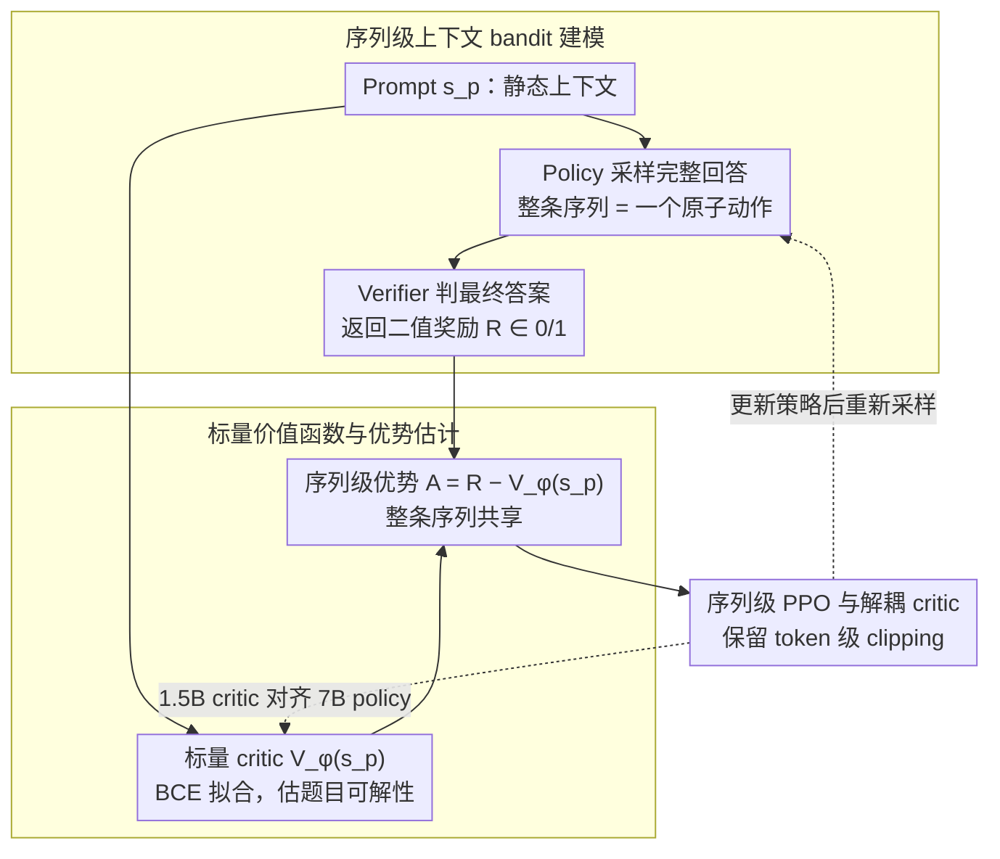

# SPPO: Sequence-Level PPO for Long-Horizon Reasoning Tasks

**会议**: ACL 2026  
**arXiv**: [2604.08865](https://arxiv.org/abs/2604.08865)  
**代码**: https://github.com/sustech-nlp/SPPO  
**领域**: LLM推理 / 强化学习 / RLVR  
**关键词**: Sequence-Level PPO、长链推理、RLVR、标量价值函数、上下文 bandit

## 一句话总结
SPPO 把长链 CoT 推理中的 RLVR 从 token-level MDP 重写为 sequence-level contextual bandit，用只看 prompt 的标量 critic 估计题目可解性，从而用单样本 PPO 获得接近或超过 GRPO 的稳定性与性能，同时带来约 5.9 倍训练加速和更低显存占用。

## 研究背景与动机
**领域现状**：数学推理、代码推理和可验证问答等任务常用 RLVR 来强化大模型，奖励通常是最终答案是否正确。标准 PPO 使用 token-level critic 和 GAE，把最终奖励沿着长 CoT 逐 token 传播；GRPO 则去掉 critic，通过同一 prompt 下多个采样结果的相对表现估计 baseline。

**现有痛点**：标准 PPO 在长链稀疏奖励中不稳定，critic 往往只在序列尾部看到答案线索，导致优势信号在真正需要优化的推理过程里消失或错位。GRPO 虽然绕开 token-level critic，但需要每个 prompt 采样多个回答来估计 group baseline，训练吞吐受限。

**核心矛盾**：长链推理的奖励是“整条推理是否成功”，但 token-level PPO 强行把它拆成每个时间步的信用分配；而 group-based 方法把序列当整体看待，却用高成本多采样换稳定性。

**本文目标**：作者希望保留 PPO 的单样本效率，同时获得 GRPO 那种“按整条回答更新”的稳定性，尤其面向 AIME、AMC、MATH500、Minerva Math 这类可验证数学推理任务。

**切入角度**：论文重新解释 GRPO 的成功原因：关键不在于“无 critic”，而在于它隐式地把推理过程当成 sequence-level contextual bandit，即 prompt 是上下文，整条回答是一个动作，最终 reward 是动作回报。

**核心 idea**：显式采用 sequence-level bandit 视角，用标量 value model 估计 prompt 的成功概率，再把 $A=R-V_\phi(s_p)$ 作为整条回答共享的优势信号送回 PPO。

## 方法详解
SPPO 的核心不是改一个 loss 名字，而是改变价值函数的语义。标准 PPO 的 critic 试图回答“当前生成到第 t 个 token 时未来还能拿多少回报”，而 SPPO 的 critic 只回答“面对这个 prompt，当前策略大概有多大概率做对”。这个问题更接近题目难度估计，也比逐 token 推理状态估值简单得多。

### 整体框架
给定 prompt $s_p$，policy 采样完整回答序列 $a_{seq}=(y_1,\dots,y_T)$，外部 verifier 返回二值奖励 $R\in\{0,1\}$。value model $V_\phi(s_p)$ 输出 prompt 级成功概率，SPPO 用 $R-V_\phi(s_p)$ 构造序列级 advantage，并在 PPO 的 clipped objective 中把同一个 advantage 分配给该序列的所有 token。

### 关键设计

**1. 从 token-level MDP 到 sequence-level contextual bandit：把 horizon 压成 1，让建模粒度对齐奖励粒度**

长 CoT 真正的痛点在于奖励太稀疏——verifier 只在序列末尾给一个 0/1，而 token-level PPO 却硬要把这个终端信号沿着几千个 token 往回摊，结果中间推理步骤拿到的 advantage 充满时间信用分配噪声。SPPO 的做法是干脆放弃逐步建模：把 prompt $s_p$ 看成静态 context，把整条回答 $a_{seq}=(y_1,\dots,y_T)$ 看成一个 atomic action，奖励 $R$ 只评价这个动作整体对不对。这样 horizon 在概念上被压缩为 1，问题从马尔可夫决策过程退化成 contextual bandit。之所以这样有效，是因为数学 verifier 本来就只判最终答案，建模粒度与真实奖励粒度一致后，就不会再有“强行给中间 token 估值”引入的位置偏差。

**2. 标量 value function 与优势估计：用一个只看 prompt 的 critic 估题目可解性，替掉多采样 baseline**

既然动作是整条序列，baseline 也就只需要对 prompt 估一个标量。SPPO 的 value model $V_\phi(s_p)$ 用 BCE 拟合二值结果，目标为 $L_V=-E[R\log V_\phi(s_p)+(1-R)\log(1-V_\phi(s_p))]$，输出可理解为“当前策略面对这个 prompt 大概有多大概率做对”，也就是题目可解性。policy 端的优势直接取 $A(s_p,a)=R-V_\phi(s_p)$：罕见地做对一道难题会得到强正优势，本该会做却失败的简单题会得到强负优势。这正好替掉了 GRPO 必须对每个 prompt 采样 N 个回答才能估出 group baseline 的高成本路径——一个可校准的 scalar critic 就近似了同样的“题目难度”信息。

**3. 序列级 PPO 与解耦 critic：保留 PPO 的 clipping 机制，但 advantage 整条序列共享，且 critic 可以更小**

建模换了，工程实现却尽量不动：clipped probability ratio 仍按 token 计算，PPO 成熟的裁剪稳定性原封保留，唯一区别是 advantage 不再随 token 变化，而是把同一个 $A(s_p,a)$ 分配给该序列的所有 token。这就避免了 token-level GAE 在稀疏奖励下典型的 tail effect（信号只在尾部清晰、越往前越模糊）。更进一步，作者验证了用 1.5B critic 去对齐 7B policy 的解耦配置依然成立——因为 critic 的任务只是“估题目难度”，本就比“生成推理链”简单，于是 actor 和 critic 不必同规模，显存压力随之下降。

### 损失函数 / 训练策略
实验使用 DeepSeek-R1-Distill-Qwen-1.5B 和 7B，分别在 DeepScaleR 与 DAPO-17K 上微调。奖励为 boxed answer 是否正确，正确为 1，错误为 0。actor 学习率为 1e-6，critic 学习率为 5e-6，PPO 中设 $\gamma=1,\lambda=1$ 以匹配稀疏终端奖励。1.5B 实验使用 4×A100，7B 实验使用 4×H100。

## 实验关键数据

### 主实验

| 模型规模 | 方法 | AIME24 | AIME25 | AMC23 | MATH500 | Minerva | Avg |
|--------|------|------|------|------|------|------|------|
| 1.5B | Base | 27.50 | 21.67 | 71.56 | 83.73 | 20.35 | 44.96 |
| 1.5B | PPO | 27.50 | 20.83 | 70.63 | 81.38 | 19.89 | 44.06 |
| 1.5B | GRPO N=8 | 30.00 | 26.25 | 73.13 | 83.88 | 22.15 | 47.08 |
| 1.5B | SPPO | 34.17 | 25.83 | 74.38 | 83.78 | 22.15 | 48.06 |
| 7B | PPO | 45.20 | 35.42 | 85.31 | 88.48 | 27.80 | 56.44 |
| 7B | GRPO N=8 | 47.08 | 35.00 | 86.25 | 90.15 | 28.74 | 57.44 |
| 7B | SPPO | 50.83 | 35.00 | 86.25 | 90.13 | 28.35 | 58.11 |
| 7B | SPPO + 1.5B critic | 52.29 | 34.58 | 87.19 | 89.88 | 28.86 | 58.56 |

### 消融实验

| 分析项 | 关键指标 | 说明 |
|------|------|------|
| PPO + BCE | 500 steps 前后出现性能坍塌 | 仅把 BCE loss 加到 token-level PPO 不能复现 SPPO，说明收益来自序列级 bandit 形式 |
| 训练效率 | 7B 模型约 22 小时达到均分约 58 | 单样本更新比 GRPO / RLOO 的多采样 baseline 更快收敛 |
| value calibration | Pearson 0.642，Spearman 0.664 | prompt-level critic 能区分题目难度，虽预测偏保守但可作为有效 baseline |
| 显存效率 | 解耦 critic 降低约 12.8% 显存 | 1.5B critic 对齐 7B policy 仍取得最高平均分 |

### 关键发现
- SPPO 在 1.5B 和 7B 两个规模都优于 GRPO 平均分，但只需要单样本更新，说明“序列级 advantage”是比“多采样归一化”更本质的稳定来源。
- 小 critic 不仅没有拖累 7B policy，反而得到最高 Avg 58.56，支持作者的假设：prompt solvability estimation 比 generative reasoning 更简单。
- 在 Precision CartPole、MountainCar、Hopper、LunarLander、Pendulum 等稀疏二值控制任务中，SPPO 也比标准 PPO 更稳，说明结论不只是 verl 工程优化导致。

## 亮点与洞察
- 这篇论文最有价值的地方是对 GRPO 的重新解释：GRPO 的成功不一定来自“没有 critic”，而可能来自“把回答当整体动作”。这个视角能把 PPO 和 GRPO 的优缺点连接起来。
- SPPO 没有完全抛弃 PPO，而是把 advantage 粒度改到 sequence level，工程上更容易嵌入现有 RLHF/RLVR 框架。
- 小 critic 结果很有启发：LLM RL 不一定需要 actor 和 critic 同规模，若 critic 的任务是估计题目难度，可以用更小模型承担，降低训练门槛。

## 局限与展望
- SPPO 依赖可验证结果来训练 value model，因此天然适合数学、代码、规则任务；开放式写作、对话质量和偏好对齐缺少客观 verifier，迁移并不直接。
- 序列级 advantage 会把整条成功推理链都强化、整条失败推理链都惩罚，仍无法区分同一序列内部哪些步骤真正贡献了正确答案。
- value model 的校准质量很关键。论文显示相关性不错但预测分布偏保守，未来可研究更强校准或不确定性估计。
- 实验主要在 DeepSeek-R1-Distill-Qwen 系列和数学推理任务上，更多模型家族、代码任务和多轮 agent 任务还需要验证。

## 相关工作与启发
- **vs 标准 PPO**: 标准 PPO 用 token-level value 和 GAE 做长程信用分配，SPPO 用 prompt-level scalar value 避免 tail effect，稳定性更好。
- **vs GRPO**: GRPO 通过 N=8 多采样构造 group baseline，SPPO 用 learned critic 取代多采样 baseline，吞吐更高。
- **vs ReMax / RLOO**: 这些序列级 REINFORCE 变体也关注整条序列奖励，但 SPPO 保留 PPO clipping，并用 value baseline 降低方差。
- **vs DAPO / Dr.GRPO**: 这些方法多从 group-relative 的采样和梯度动态修补入手，SPPO 关注更底层的建模粒度：把推理环境重写成 sequence-level bandit。

## 评分
- 新颖性: ⭐⭐⭐⭐☆ 不是简单调参，而是提出对 RLVR 信用分配粒度的清晰重构。
- 实验充分度: ⭐⭐⭐⭐☆ 数学 benchmark、效率、value 校准和控制任务都覆盖到；开放式任务仍缺实验。
- 写作质量: ⭐⭐⭐⭐☆ 问题定义、直觉和实证链条清楚，公式与图示能互相支撑。
- 价值: ⭐⭐⭐⭐⭐ 对想降低 RLVR 训练成本的推理模型团队很有实用价值。

<!-- RELATED:START -->

## 相关论文

- [\[ACL 2026\] FS-Researcher: Test-Time Scaling for Long-Horizon Research Tasks with File-System-Based Agents](fs-researcher_test-time_scaling_for_long-horizon_research_tasks_with_file-system.md)
- [\[ICLR 2026\] Segment-Level Attribution for Selective Learning of Long Reasoning Traces](../../ICLR2026/llm_reasoning/segment-level_attribution_for_selective_learning_of_long_reasoning_traces.md)
- [\[ACL 2026\] Evo-Attacker: Memory-Augmented Reinforcement Learning for Long-Horizon Tool Attacks on LLM-MAS](evo-attacker_memory-augmented_reinforcement_learning_for_long-horizon_tool_attac.md)
- [\[ICLR 2026\] The Illusion of Diminishing Returns: Measuring Long Horizon Execution in LLMs](../../ICLR2026/llm_reasoning/the_illusion_of_diminishing_returns_measuring_long_horizon_execution_in_llms.md)
- [\[ICML 2026\] ToolMATH: A Math Tool Benchmark for Realistic Long-Horizon Multi-Tool Reasoning](../../ICML2026/llm_reasoning/toolmath_a_math_tool_benchmark_for_realistic_long-horizon_multi-tool_reasoning.md)

<!-- RELATED:END -->
