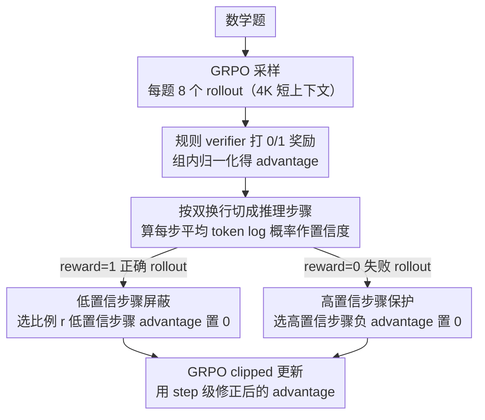

# Stabilizing Efficient Reasoning with Step-Level Advantage Selection

**会议**: ACL2026 Findings  
**arXiv**: [2604.24003](https://arxiv.org/abs/2604.24003)  
**代码**: https://github.com/HanNight/SAS  
**领域**: 模型压缩 / LLM高效推理  
**关键词**: 推理压缩、GRPO、信用分配、短上下文训练、step-level advantage

## 一句话总结
这篇论文发现短上下文 GRPO 本身就会强烈压缩推理长度，但会因截断样本的错误信用分配导致训练不稳；作者提出 Step-level Advantage Selection，在推理步骤粒度选择性置零 advantage，在保持甚至提升 Pass@1 的同时显著减少推理 token。

## 研究背景与动机
**领域现状**：长链式推理和 test-time scaling 让 LLM 在数学、逻辑与代码任务上表现更强，但代价是推理轨迹越来越长，推理延迟和成本明显升高。近期高效推理方法通常在强化学习后训练阶段加入长度惩罚、token budget 或剪枝机制，希望让模型少说但不丢答案。

**现有痛点**：很多长度控制方法同时使用了一个容易被忽略的训练条件：它们把原本在 16K 到 24K 长上下文下训练的推理模型，放到 4K 短上下文里后训练。因此输出变短到底来自显式长度奖励，还是短上下文约束本身，过去并没有被清楚拆开。

**核心矛盾**：短上下文确实能压缩推理，但会把一些本来逻辑正确、只是末尾答案被截断的 rollout 判成失败。在标准 GRPO 中，失败 rollout 的所有 token 都收到负 advantage，正确 rollout 的所有 token 都收到正 advantage，这会同时惩罚有用中间推理、强化正确答案中的冗余步骤。

**本文目标**：作者想保留短上下文带来的压缩信号，同时修正 rollout 级信用分配过粗的问题。更具体地说，方法需要识别哪些推理步骤可靠、哪些步骤噪声较大，并让策略更新只来自更可信的步骤。

**切入角度**：论文把推理轨迹看作由离散 reasoning steps 组成，而不是一个不可拆的字符串。模型自身 token log probability 可以作为步骤置信度的近似，避免引入额外 process reward model。

**核心 idea**：不用显式长度奖励，而是在步骤粒度对 advantage 做选择性置零，让正确 rollout 中低置信步骤不被强化、失败 rollout 中高置信步骤不被惩罚。

## 方法详解

### 整体框架
SAS 的训练仍然建立在 GRPO 上：对每个数学题采样多个 rollout，通过规则 verifier 得到 0/1 奖励，再用组内归一化得到 advantage。不同之处在于，SAS 不把同一个 rollout advantage 原封不动赋给所有 token，而是先把输出按双换行切成推理步骤，再根据每个步骤的平均 token log probability 排序，最后把一部分步骤的 advantage 改成 0。

这个“置零”操作在正确和失败 rollout 中含义不同。对于正确 rollout，原始 advantage 为正，置零意味着降低低置信步骤的强化强度；对于失败 rollout，原始 advantage 为负，置零意味着保护高置信步骤免受错误惩罚。方法不改变模型结构、不改变采样过程，也不需要额外奖励模型，只在训练时做轻量后处理。

### 关键设计

**1. 短上下文压缩效应的解耦实验：先证明 4K 后训练本身就是强压缩信号**

很多高效推理方法把输出变短归功于自己加的长度奖励，却悄悄地一并把原本 16K–24K 训练的模型换到了 4K 短上下文，二者的贡献从未被拆开。作者为此做了一个干净的对照实验：从 DeepScaleR-1.5B-Preview 出发，只用普通 GRPO 加任务正确性奖励，在 4K 最大上下文下训练，不加任何长度惩罚。结果输出长度在训练早期就快速下降，甚至接近或短于 LAPO、ThinkPrune 等专门的高效推理方法。这个观察是后面所有设计的前提：不先解耦上下文长度，就无法判断现有方法的收益到底是长度奖励还是训练上下文变化；它也解释了为何简单短上下文训练“看起来有效”，却伴随后期准确率波动和熵坍塌。

**2. 正确 rollout 中的低置信步骤屏蔽：别把“答对了”错当成“每步都值得学”**

短上下文压缩了长度，但 rollout 级的正反馈会把正确答案里的自我怀疑、重复检查、无关绕路也一起固化，反而加重过度推理。SAS 的做法是对 reward=1 的 rollout 先按双换行切成推理步骤，计算每一步的平均 token log probability 作为置信度，选出比例 $r$ 的低置信步骤，把这些步骤里所有 token 的 advantage 置 0，其余步骤保留正 advantage。之所以用模型自身的 log probability 做置信度，是因为它不需要额外训练一个 process reward model，又在实验中与外部 PRM 高度相关；置 0 而不是赋负值，意味着只是“不再强化这些低质量步骤”，而不是反过来惩罚它们。

**3. 失败 rollout 中的高置信步骤保护：抢救被截断误杀的正确推理**

短上下文的另一面是，作者发现把 8K 正确 rollout 截成 4K 后，约 29% 会因为缺少最终答案或收尾步骤而被 verifier 判为失败，其中很多中间推理其实是对的。如果按标准 GRPO 给全轨迹负信号，这些正确中间步骤会被误惩，训练随之不稳。SAS 的对策与设计 2 对称：对 reward=0 的 rollout 同样算步骤置信度，但这次选高置信步骤并把它们的负 advantage 改为 0，只让低置信或明显错误的步骤保留负信号。这样就把“截断造成的假失败”与“真正错误的推理”在信用分配上区分开。正是这种利用 GRPO advantage 符号结构的设计让置 0 操作在正负 rollout 中产生了不同语义：对正样本是去噪，对负样本是保护。

### 损失函数 / 训练策略
训练目标仍是 PPO-style 的 GRPO clipped surrogate，只是使用 SAS 修改后的 token-level advantage。主实验使用 DeepScaleR-Preview-Dataset 的约 40K 数学题，基础模型为 DeepScaleR-1.5B-Preview，训练上下文固定为 4K，学习率为 1e-6，batch size 为 128，每个 prompt 采样 8 个 rollout，训练 500 steps。SAS 的默认选择比例 $r=0.3$，用 AIME24 验证集按 Accuracy-Efficiency Score 选 checkpoint。

## 实验关键数据

### 主实验
数学推理主结果显示，SAS 同时提升准确率和压缩输出长度，优于显式长度奖励或剪枝类基线。

| 方法 | 平均 Pass@1 | 平均输出 token | AES | 观察 |
|------|-------------|----------------|-----|------|
| DeepScaleR | 52.37 | 5118 | 0.00 | 长上下文基础模型，输出较长 |
| GRPO-4K | 53.61 | 3775 | 0.33 | 短上下文本身明显压缩，但训练稳定性不足 |
| L1-Max | 51.97 | 2071 | 0.33 | 压缩最激进，准确率损失明显 |
| LAPO-I | 53.68 | 4001 | 0.30 | 更偏保准确率，压缩幅度有限 |
| ThinkPrune-4k | 53.66 | 3878 | 0.33 | 剪枝有效，但整体 trade-off 不如 SAS |
| SAS | 54.54 | 3407 | 0.46 | 准确率最高，长度比强基线更短 |

跨数学数据集看，SAS 在 AIME2024、MATH、AMC、OlympiadBench 上均保持或超过 GRPO-4K，并把平均输出从 DeepScaleR 的 5118 token 降到 3407 token。

| 数据集 | DeepScaleR Pass@1 / token | GRPO-4K Pass@1 / token | SAS Pass@1 / token |
|--------|----------------------------|--------------------------|--------------------|
| AIME2024 | 33.75 / 6755 | 38.75 / 5282 | 39.79 / 4876 |
| AIME2025 | 26.88 / 6444 | 25.42 / 4812 | 26.67 / 4295 |
| MATH | 86.36 / 2809 | 85.09 / 1976 | 86.58 / 1768 |
| AMC | 67.62 / 4761 | 70.18 / 3636 | 71.46 / 3090 |
| OlympiadBench | 47.23 / 4824 | 47.62 / 3651 | 48.19 / 3008 |

泛化实验同样支持方法结论：在 GPQA-Diamond、LSAT、MMLU 上，SAS 的平均 Pass@1 达到 38.30，输出长度 2729 token；相比 DeepScaleR 的 37.44 / 4416，准确率更高且更短。

| 方法 | GPQA-Diamond | LSAT | MMLU | 平均 Pass@1 | 平均 token | AES |
|------|--------------|------|------|-------------|------------|-----|
| DeepScaleR | 35.70 | 28.64 | 47.99 | 37.44 | 4416 | 0.00 |
| GRPO-4K | 32.48 | 28.45 | 48.73 | 36.55 | 2496 | 0.32 |
| L1-Max | 36.05 | 26.66 | 48.94 | 37.22 | 2242 | 0.46 |
| LAPO-I | 36.17 | 28.42 | 48.71 | 37.77 | 3331 | 0.27 |
| ThinkPrune-4k | 35.83 | 28.13 | 48.91 | 37.62 | 3127 | 0.31 |
| SAS | 37.18 | 28.32 | 49.39 | 38.30 | 2729 | 0.45 |

### 消融实验
消融表明，收益不是来自简单稀疏化 advantage，而是来自“按置信度、按步骤、同时处理正确和失败 rollout”。

| 配置 | 平均 Pass@1 | 平均 token | AES | 说明 |
|------|-------------|------------|-----|------|
| SAS full | 54.54 | 3407 | 0.46 | 完整方法 |
| Only Correct | 53.90 | 接近 full | 0.43 | 不保护失败 rollout 中的高置信步骤，稳定性下降 |
| Random Steps | 未给出完整均值 | 更长 | 0.38 | 随机选步骤明显弱于置信度排序 |
| Token Level | 低于 full | 更长 | 0.39 | token 粒度不如语义步骤粒度稳定 |
| selection ratio 0.1 | 53.52 | 3259 | 0.43 | 压缩强，准确率略低于 0.3 |
| selection ratio 0.3 | 54.54 | 3407 | 0.46 | 最佳默认配置 |
| selection ratio 0.9 | 53.06 | 3482 | 0.36 | 仍优于基础模型，说明方法对比例较鲁棒 |

### 关键发现
- 短上下文后训练本身就是强 compression signal，不能把输出变短完全归因于显式长度奖励。
- 截断导致的 verifier failure 是训练噪声的重要来源；约 29% 原本正确的 8K 输出截断到 4K 后会被判失败。
- 步骤级置信度与外部 Qwen2.5-Math-PRM-7B 的排序相关性 nDCG@k 达到 0.9022，说明模型自身 log probability 足以作为低成本步骤质量代理。
- SAS 每步训练时间从 GRPO 的 279.08 秒增加到 327.15 秒，约 17% 开销，但不增加额外 forward、rollout 或模型内存。

## 亮点与洞察
- 论文最有价值的地方不是又设计了一个长度惩罚，而是指出“短上下文训练”这个隐藏变量本身已经会压缩推理。这个发现会改变我们解读高效推理论文实验收益的方式。
- SAS 的置零操作很简洁，但在正负 rollout 中产生了不同语义：对正样本是去噪，对负样本是保护。这种利用 GRPO advantage 符号结构的设计很巧。
- 用步骤平均 log probability 做置信度，避免了 PRM 的额外训练与 reward hacking 风险，也让方法更容易嵌入现有 RL pipeline。
- 这个思路可迁移到代码生成、工具调用、长文规划等任务：只要输出可以切成语义步骤，就可以把 rollout 级反馈拆成 step-level credit assignment。

## 局限与展望
- 实验主要围绕单一 1.5B 基础模型，尚不清楚在更大模型、不同 RL 配方、不同预训练来源上是否同样稳定。
- 所有主实验固定在 4K 短上下文后训练；上下文长度从 2K 到 16K 变化时，截断比例和 SAS 最优选择比例可能会变。
- 步骤切分依赖双换行，这与 DeepScaleR/Qwen 系训练数据格式一致，但未必适用于所有模型家族或所有输出风格。
- 置信度来自当前策略自身，虽然和 PRM 排序高度相关，但在模型校准差或分布外任务中可能低估少见但正确的推理步骤。
- 未来可以把 SAS 与自适应上下文、动态 step segmentation、任务级 verifier 置信度结合，进一步减少固定超参依赖。

## 相关工作与启发
- **vs L1 / LCPO**: L1 类方法显式惩罚长度，压缩很强但容易牺牲正确率；SAS 不直接奖励短输出，而是修正短上下文下的信用分配。
- **vs LAPO**: LAPO 建模成功解的长度分布来控制推理长度；SAS 关注单条轨迹内部哪些步骤应该参与更新，两者可以互补。
- **vs ThinkPrune**: ThinkPrune 通过逐步 token 限制剪掉冗余推理；SAS 在训练信号层面减少冗余步骤被强化，机制更轻。
- **vs entropy/confidence RL**: 相关方法直接用熵或置信度改奖励；SAS 不改 reward，只用置信度决定 advantage 是否参与更新，因此更像信用分配校正。
- **启发**: 高效推理不一定要把“短”写进奖励函数。更根本的问题可能是长输出中哪些步骤值得学习，哪些步骤只是 verifier 和上下文限制造成的噪声。

## 评分
- 新颖性: ⭐⭐⭐⭐☆ 从短上下文隐藏变量和 step-level credit assignment 切入，比常规长度奖励更有洞察。
- 实验充分度: ⭐⭐⭐⭐☆ 数学、通用推理、消融、比例敏感性和置信度验证都较完整，但模型规模覆盖有限。
- 写作质量: ⭐⭐⭐⭐☆ 动机链清楚，表格和分析能支撑主张，部分公式排版在缓存文本中略显拥挤。
- 价值: ⭐⭐⭐⭐⭐ 对 RL 高效推理和长 CoT 压缩都有直接实践价值，也提醒后续工作控制短上下文变量。

<!-- RELATED:START -->

## 相关论文

- [\[ACL 2026\] On the Step Length Confounding in LLM Reasoning Data Selection](on_the_step_length_confounding_in_llm_reasoning_data_selection.md)
- [\[ACL 2026\] Step-GRPO: Internalizing Dynamic Early Exit for Efficient Reasoning](step-grpo_internalizing_dynamic_early_exit_for_efficient_reasoning.md)
- [\[ICLR 2026\] Stabilizing Policy Gradients for Sample-Efficient Reinforcement Learning in LLM Reasoning](../../ICLR2026/llm_reasoning/stabilizing_policy_gradients_for_sample-efficient_reinforcement_learning_in_llm_.md)
- [\[ACL 2026\] SHAPE: Stage-aware Hierarchical Advantage via Potential Estimation for LLM Reasoning](shape_stage-aware_hierarchical_advantage_via_potential_estimation_for_llm_reason.md)
- [\[ACL 2026\] Process Reward Models Meet Planning: Generating Precise and Scalable Datasets for Step-Level Rewards](process_reward_models_meet_planning_generating_precise_and_scalable_datasets_for.md)

<!-- RELATED:END -->
