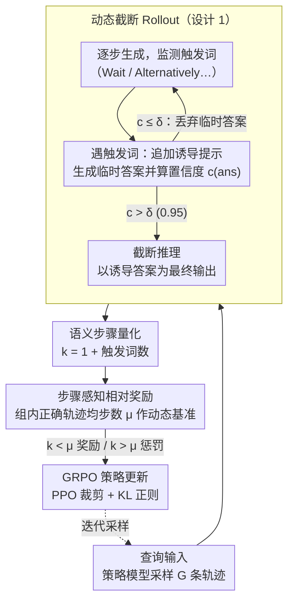

# Step-GRPO: Internalizing Dynamic Early Exit for Efficient Reasoning

**会议**: ACL 2026  
**arXiv**: [2604.16890](https://arxiv.org/abs/2604.16890)  
**代码**: 无  
**领域**: LLM推理效率 / 强化学习  
**关键词**: 高效推理, GRPO, 语义步骤, 动态截断, 过度思考

## 一句话总结

提出 Step-GRPO，将动态早退能力内化到模型中——通过语义步骤而非原始 token 来度量推理复杂度，用动态截断 Rollout 暴露简短正确轨迹，配合步骤感知相对奖励引导模型学习在适当时机停止推理，在 Qwen3-8B 上减少32%的 token 消耗且无准确率下降。

## 研究背景与动机

**领域现状**：大型推理模型（如 DeepSeek-R1、Qwen3）通过长链思维链解决复杂问题，但存在严重的"过度思考"现象——模型在已找到正确答案后仍生成不必要的验证步骤或循环解释。

**现有痛点**：（1）训练时长度惩罚方法（如 GRPO+LP）存在"语法盲区"——基于 token 计数无法区分冗余和必要推理，会逼迫模型砍掉关键验证步骤导致能力崩溃；（2）SFT 蒸馏方法（如 DEER+SFT）依赖昂贵的拒绝采样构建简洁样本，且泛化性差——模型表面模仿简洁风格但未学会底层决策策略；（3）推理时早退方法增加系统开销。

**核心矛盾**：需要在训练阶段让模型学会"何时停止推理"，但基于 token 的惩罚无法感知语义，基于 SFT 的方法缺乏探索。

**本文目标**：在 GRPO 训练框架中内化动态早退能力，使模型自主学习最小充分推理路径，零推理开销。

**切入角度**：将优化目标从 token 粒度提升到语义步骤粒度——利用语言标记（如"Wait"、"Alternatively"）作为推理步骤的边界，基于步骤（而非 token）来度量和惩罚推理冗余。

**核心 idea**：（1）动态截断 Rollout——在训练采样时，每遇到步骤边界就诱导答案并评估置信度，高置信时截断生成；（2）步骤感知相对奖励——用组内正确回答的平均步骤数作为动态基准，步骤数低于基准获得奖励，高于则受惩罚。

## 方法详解

### 整体框架

Step-GRPO 在 GRPO 框架上引入三个组件：（1）动态截断 Rollout——在探索阶段混合自然轨迹和截断轨迹；（2）语义步骤量化——用触发词计数替代 token 计数来度量推理复杂度；（3）步骤感知相对奖励——基于组内正确回答的动态基准分配效率奖励/惩罚。

### 关键设计

**1. 动态截断 Rollout：把推理时的早退决策搬到训练采样里，让模型看到“提前停也是对的”**

标准 GRPO 采样出来的轨迹全是完整长度的，模型根本没机会看到“提前停止也能得到正确答案”这种样本，于是永远学不会早退。Step-GRPO 在生成过程中持续监测触发词（“Wait”、“Alternatively”等），每检测到一个就暂停标准生成，追加一个答案诱导提示（“</think> 最终答案是”），让模型先生成一个临时答案并算出置信度（答案 token 的平均对数概率）。若置信度 $c(ans) > \delta$（阈值 0.95），就截断推理、以诱导答案作为最终输出；否则丢弃临时答案继续生成。这样探索阶段就混合了自然轨迹和“提前停且答对”的截断轨迹，把推理时早退策略的决策过程模拟到了训练中。

**2. 语义步骤量化：用逻辑段数而不是 token 数来度量推理冗余**

基于 token 的惩罚是个“语法盲区”——它分不清一个必要的长验证步骤和两个冗余的短步骤，会逼着模型砍掉关键验证导致能力崩溃。Step-GRPO 改用语义步骤数 $k_i = 1 + N_{\text{trig}}(o_i)$ 度量复杂度，其中 $N_{\text{trig}}$ 是触发词出现次数，加 1 计入含答案的最后一段。这种量化对措辞是否冗长不敏感，只关心推理被切成了几个逻辑段，因此能更准确地反映推理的逻辑复杂度，而不会把“话多”误判为“步骤多”。

**3. 步骤感知相对奖励：用组内动态基准让效率惩励随题目难度自适应**

静态长度惩罚不考虑题目难度：简单题 1 步足够，复杂题 10 步也不算多，一刀切反而伤害难题。Step-GRPO 对每组采样先算出正确回答的平均步骤数 $\mu$ 作为动态基准，总奖励为

$$R_i = \alpha \cdot R_{\text{acc}}^{(i)} \cdot \left[1 - \beta \cdot \tanh\left(\frac{k_i - \mu}{\mu}\right)\right] + (1-\alpha) \cdot R_{\text{form}}^{(i)}$$

当 $k_i < \mu$ 时 tanh 项为负、奖励增加（效率奖励），当 $k_i > \mu$ 时 tanh 项为正、奖励减少（冗余惩罚），tanh 还把效率激励限制在 $(-\beta, \beta)$ 防止极端值。因为基准是组内正确回答动态算出来的，同一组里简单题的基准步数自然更低、难题更高，于是避开了静态惩罚那种不分难易的一刀切。

### 损失函数 / 训练策略

标准 GRPO 策略梯度目标 + PPO 裁剪 + KL 正则化。超参数：$\alpha=0.1$，$\beta=0.5$，$G=5$，$\delta=0.95$，学习率 $1 \times 10^{-6}$。训练数据：DAPO-Math-17k。在 Qwen3-1.7B/4B/8B 上评估。

## 实验关键数据

### 主实验

| 方法 | Qwen3-8B 平均准确率 | 压缩率 |
|------|-------------------|--------|
| Vanilla | 79.9% | 100% |
| GRPO | 80.9% | 89.7% |
| GRPO+LP | 78.4% | 53.2% |
| GRPO-λ | 79.9% | 62.9% |
| DEER+SFT | 72.6% | 78.9% |
| Step-GRPO | **82.1%** | **68.0%** |

### 消融实验

| 配置 | 准确率 | 压缩率 | 说明 |
|------|--------|--------|------|
| GRPO (无效率) | 80.9% | 89.7% | 无长度控制 |
| GRPO+LP | 78.4% | 53.2% | token级惩罚，能力崩溃 |
| Step-GRPO (完整) | 82.1% | 68.0% | 语义步骤级，最优权衡 |
| DEER+SFT | 72.6% | 78.9% | SFT方式，泛化差 |

### 关键发现

- Step-GRPO 在减少32% token 的同时准确率反而提升2.2%（82.1% vs 79.9%），因为消除了冗余推理中的潜在错误
- GRPO+LP 虽然压缩率高（53.2%）但准确率大幅下降（78.4%），证实了 token 级惩罚的"语法盲区"问题
- DEER+SFT 的准确率最差（72.6%），证明了 SFT 方式在高效推理上的泛化不足
- 在 AIME 2025 等最难基准上，Step-GRPO 准确率显著超越其他效率方法（73.3% vs 60-66.7%）

## 亮点与洞察

- **"从 token 到语义步骤"的粒度提升解决了核心问题**：语法盲区是所有基于 token 惩罚方法的致命缺陷，Step-GRPO 通过语义步骤量化完美回避了这一问题
- **动态截断 Rollout 将推理时能力内化为训练时策略**：模型在训练中就学会了"足够自信时停止"，推理时零开销
- **组内动态基准自适应问题难度**：同一组中简单问题的基准步骤数自然更低，避免了一刀切的惩罚

## 局限与展望

- 触发词集合的选择需要手动指定，不同模型/任务可能需要不同的触发词
- 截断 Rollout 的置信度评估增加了训练时的前向传播成本
- 仅在数学推理任务上验证，代码/逻辑推理的效果未知
- 语义步骤的定义依赖触发词，若模型生成风格变化可能不适用

## 相关工作与启发

- **vs GRPO+LP/SOP（token级惩罚）**: 这些方法基于 token 计数，无法区分冗余和必要推理。Step-GRPO 基于语义步骤，保持推理完整性
- **vs DEER+SFT（蒸馏方法）**: SFT 表面模仿简洁风格但不学底层策略。Step-GRPO 通过 RL 探索学习真正的决策能力

## 评分

- 新颖性: ⭐⭐⭐⭐ 语义步骤量化和截断 Rollout 的设计巧妙，但整体框架是 GRPO 的增量改进
- 实验充分度: ⭐⭐⭐⭐⭐ 三个模型规模+六个基准+七种基线，极为充分
- 写作质量: ⭐⭐⭐⭐ 问题分析清晰，方法描述系统，图表辅助理解好

<!-- RELATED:START -->

## 相关论文

- [\[ACL 2026\] When Is Thinking Enough? Early Exit via Sufficiency Assessment for Efficient Reasoning](when_is_thinking_enough_early_exit_via_sufficiency_assessment_for_efficient_reas.md)
- [\[ACL 2026\] Reinforced Efficient Reasoning via Semantically Diverse Exploration](reinforced_efficient_reasoning_via_semantically_diverse_exploration.md)
- [\[ACL 2026\] DRP: Distilled Reasoning Pruning with Skill-aware Step Decomposition for Efficient Large Reasoning Models](drp_distilled_reasoning_pruning_with_skill-aware_step_decomposition_for_efficien.md)
- [\[ACL 2026\] Stabilizing Efficient Reasoning with Step-Level Advantage Selection](stabilizing_efficient_reasoning_with_step-level_advantage_selection.md)
- [\[ACL 2026\] ETR: Entropy Trend Reward for Efficient Chain-of-Thought Reasoning](etr_entropy_trend_reward_for_efficient_chain-of-thought_reasoning.md)

<!-- RELATED:END -->
