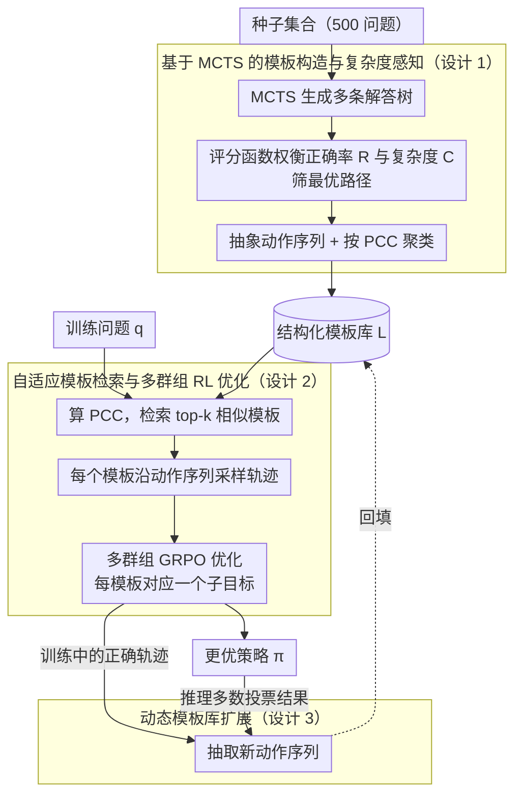

# TemplateRL: Structured Template-Guided Reinforcement Learning for LLM Reasoning

**会议**: ACL 2026  
**arXiv**: [2505.15692](https://arxiv.org/abs/2505.15692)  
**代码**: https://github.com/THU-KEG/TemplateRL  
**领域**: LLM 推理 / 强化学习  
**关键词**: 强化学习、模板引导、推理路径、LLM 优化、GRPO

## 一句话总结

TemplateRL 通过从小规模种子集合用 MCTS 抽象出结构化推理模板，在强化学习训练中引入这些模板作为显式指导，显著提升 LLM 多步推理效率和稳定性，在 AIME 上相比 GRPO 提升 99%。

## 研究背景与动机

**LLM 推理能力的瓶颈**：近年来强化学习被证明是增强 LLM 推理能力的有效范式（如 o1、DeepSeek-R1），但现有方法如 GRPO 主要依赖无结构的自采样（unstructured self-sampling），即让模型盲目探索，从标量奖励信号学习。这导致三个关键问题：(1) 采样效率低 —— 高质量轨迹命中率低，弱模型上训练易崩溃；(2) 难以学习可迁移的高层策略 —— 模型倾向于记忆表面步骤而非提炼通用的分治、分步等思维模式；(3) 缺乏可解释性 —— 推理过程没有明确的策略结构，难以诊断和干预。

**人类推理的启示**：认知心理学研究（Kahneman 2011）表明，人类解决复杂问题时不是从零开始，而是应用从相似问题归纳出的"通用指南"（templates）。这类高层模板能帮助人类快速适应新问题。

**核心观察与设计动机**：对多步推理任务，模型生成单个正确步骤的概率远高于一次性完成整个推理链。因此可以构建一个显式的模板库（template library），在 RL 训练时自适应地检索相关模板，引导策略生成围绕这些模板展开的轨迹。这样既能提供结构化的策略指导，又能让模型学到通用的推理思路。

**本文核心 idea**：用人类启发的模板库代替无结构探索，将 RL 学习过程分解为多个模板引导的子目标优化，提升采样质量、模型稳定性和推理可解释性。

## 方法详解

### 整体框架

TemplateRL 分三个阶段：

**第一阶段 —— 模板库构造**：在小规模种子集合（500 个问题）上用 MCTS 生成多条解答路径，对每个问题筛选最优路径（权衡正确率和复杂度），抽象出动作序列作为模板，按问题复杂度特征聚类，最终得到结构化模板库。

**第二阶段 —— 模板引导训练**：对每个训练问题，计算其复杂度并与模板库中的模板匹配，选出最相似的 $k$ 个模板。对于每个模板，模型按该模板的动作序列逐步生成推理轨迹。将这 $k$ 个模板的采样结果聚合，进行多群组的 GRPO 优化，每个模板对应一个优化子目标，这样把单一的标量奖励学习分解为结构化的模式学习。

**第三阶段 —— 可选的动态扩展**：在训练或推理过程中，如果发现新的正确推理路径，自动提取其动作序列并加入模板库，持续丰富库的覆盖范围。

### 关键设计

**1. 基于 MCTS 的模板构造与复杂度感知：从少量高质量示例里把"怎么解"抽象成可复用的动作序列**

无结构自采样的根子在于模型从零盲探，高质量轨迹命中率低、又只记表面步骤。TemplateRL 的对策是先在 500 个种子问题上用 MCTS 构建多条解答树，每条边代表一个"动作"（如"提出子问题""推导下一步"）。对树中的每条路径，用评分函数 $\text{Score}(\mathbf{s}_i, \mathbf{t}_{i,j}) = b \cdot R(\mathbf{t}_{i,j}|\mathbf{s}_i) - (1-b) \cdot C(\mathbf{t}_{i,j})$ 在正确性 $R$ 和复杂度 $C$ 之间权衡，筛出最优路径，再把它的动作序列抽象成模板。

这些模板按"问题条件复杂度"（PCC，即问题中前置条件的数量）聚类，构成模板库 $\mathcal{L} = \{\hat{T}_1, \ldots, \hat{T}_{|\mathcal{L}|}\}$，每个模板记录自己的动作序列和对应问题的平均 PCC。PCC 在这里是问题难度的代理指标：按它分组以后，检索时就能快速匹配到与新问题难度相称的模板，避免拿简单题的套路去硬套复杂题，或者反过来。

**2. 自适应模板检索与多群组 RL 优化：把单一标量奖励学习拆成多个模板子目标**

到了训练阶段，对每个问题 $\mathbf{q}$ 先算它的 PCC，再用 $d(\mathbf{q}, \hat{T}_j) = |{\rm PCC}(\mathbf{q}) - {\rm PCC}_{T_j}|$ 度量它与各模板的距离，取最近的 top-$k$ 个。每个模板 $T_i$ 沿其动作序列采样 $G_i$ 条轨迹，所有群组的轨迹合并进 GRPO 损失：

$$\tilde{\mathcal{J}}_{\text{GRPO}}(\pi_\theta) = \frac{1}{\sum_i G_i} \sum_i \sum_j \sum_t \min[\rho_{i,j,t} A_{i,t}, \hat{\rho}_{i,j,t} A_{i,t}]$$

其中 $\rho$ 是概率比、$A$ 是优势估计。这等价于给每个模板定义一个子目标 $\mathcal{J}_i(\pi_\theta)$，整体目标变成它们的加权平均。这么拆的好处有两层：一是不同模板各自对应一种策略模式，模型不会被单一奖励信号淹没掉策略多样性；二是论文给出两条理论支撑——Prop 3.1 说多群组分组能提高"至少拿到一条正向轨迹"的概率，Prop 3.2 说相似问题间的模板迁移能进一步抬高成功率。

**3. 动态模板库扩展：让模板库边训练边推理边长大，不困在初始静态库里**

初始库再好也覆盖不全，所以 TemplateRL 让它持续演进。训练时，对每条正确轨迹用关键词抽取或轻量模型解析出动作序列 $T' = (a_1', \ldots, a_d')$ 加入库中；推理时，对每个测试样本用 5 个模板生成多条路径、多数投票定答案，再从投票结果里提取新模板入库，接着处理下一个样本。这样就形成一个持续学习的闭环，模型能在特定领域逐步攒下推理技巧，对医学推理这类需要不断迭代更新的场景尤其有用。

## 实验关键数据

### 主实验

| 方法 | MATH500 ↑ | AIME24 ↑ | AMC ↑ | Minerva ↑ | Olympiad ↑ | 平均 ↑ |
|------|----------|---------|-------|-----------|-----------|--------|
| Qwen2.5-Math-7B-Base | 50.8 | 13.3 | 42.5 | 12.1 | 17.2 | 27.2 |
| SimpleRL-Zero | 74.6 | 26.7 | 60.0 | 27.6 | 35.8 | 44.9 |
| Oat-Zero | 79.6 | 30.0 | 60.0 | 34.2 | 39.9 | 48.7 |
| **GRPO（对标）** | **76.2** | **16.7** | **55.0** | **32.7** | **38.1** | **43.8** |
| **TemplateRL（本文）** | **83.4** | **33.3** | **77.5** | **38.2** | **46.2** | **55.8** |
| **相对提升** | **+9.4%** | **+99.4%** | **+40.9%** | **+16.8%** | **+21.2%** | **+27.4%** |

TemplateRL 在所有基准上均超越 GRPO 基线，其中 AIME24 提升最为显著（+99.4%），说明模板引导对复杂推理问题帮助最大。

### 消融与分析

| 实验 | 结论 |
|------|------|
| 训练稳定性 (Llama-3.2-3B) | GRPO 100 步后奖励崩溃至 0，TemplateRL 始终 > 0.25 |
| 跨域泛化 (BALROG/GPQA-D/MMLU-Pro) | 比 GRPO 平均提升 6%+ |
| 多模态扩展 (Qwen2.5-VL) | MathVision/MathVerse/MMMU/BLINK 平均 +8.4% |
| 动态模板扩展 (训练) | AIME24 从 33.3% 提至 36.7% (+10.2%) |
| 动态模板扩展 (推理) | GPQA-D 从 37.9% 提至 40.4% (+6.6%) |
| 模板群组数 $\|g\|$ | $\|g\|=2$ 为最优平衡 |

## 亮点与洞察

- **人类启发的设计，理论有支撑**：从认知心理学出发，用模板代替无结构探索，这是自然的想法。更重要的是论文给出了两个理论命题（Prop 3.1、3.2），分别证明了多群组能提高正样本概率、相似问题的模板迁移能提升成功率。
- **实验设计全面且结果强劲**：不仅在数学竞赛题上验证（AIME +99%），还在多尺度模型（1.5B–8B）、多架构（Qwen/Llama）、多模态上验证；跨域泛化实验（BALROG、GPQA-D）也证明不是过拟合到数学领域。
- **动态扩展机制增强了实用性**：不像很多 RL 工作固定了策略，TemplateRL 支持在线更新模板库，对需要持续适应的场景（医学推理、科学发现）很有价值。

## 局限与展望

**当前局限**：

- 模板库初始化依赖于 MCTS 探索和手工的动作空间定义。对不同任务是否需要重新定义动作空间还不清楚。
- 实验主要集中在数学和逻辑推理。在其他长链推理任务（如代码生成、科学实验设计）上的表现有待验证。
- 论文声称提升了可解释性，但没有定量的可解释性评估。

**改进思路**：

- 自动发现动作空间：不用手工定义，能否从正确轨迹中自动学到任务通用的"动作"概念？
- 更广泛的应用探索：扩展到代码合成、科学推理、对话生成等领域。
- 模板的可解释性分析：定量衡量学到的模板的抽象程度、覆盖范围。

## 相关工作与启发

- **vs GRPO/强化学习基线**：这些方法在算法层面做改进（如处理长度偏差、KL 约束），都基于无结构自采样。TemplateRL 通过引入显式结构打破了这个瓶颈，是从架构层面的创新。
- **vs 推理时模板方法**（RAG、分解）：之前的工作在推理时用模板，但没有把模板融入到 RL 训练本身。TemplateRL 的新颖之处在于训练-推理统一的模板引导机制。
- **启发**：这篇工作证明了"人类启发的结构 + RL 优化"这个组合的威力。后续可以考虑类似的思路应用到其他需要"高层策略"的任务（如规划、多智能体协作）。

## 评分

- **新颖性**: ⭐⭐⭐⭐⭐ 将结构化模板引入 RL 训练是新角度，且理论支撑清晰，人类启发的设计思路自然巧妙。
- **实验充分度**: ⭐⭐⭐⭐⭐ 涵盖多模型尺度、多架构、多域、多模态，消融全面，稳定性验证充分。
- **写作质量**: ⭐⭐⭐⭐ 总体清晰，理论部分标记清楚，不过对动作空间定义的讨论可更深入。
- **价值**: ⭐⭐⭐⭐⭐ GRPO 是当前主流强化学习方法，改进 99% 不是小幅提升；稳定性改善对弱模型很实用；跨域泛化证明了方法的普适性。

<!-- RELATED:START -->

## 相关论文

- [\[ACL 2026\] Revisiting Entropy in Reinforcement Learning for Large Reasoning Models](revisiting_entropy_in_reinforcement_learning_for_large_reasoning_models.md)
- [\[NeurIPS 2025\] SRPO: Enhancing Multimodal LLM Reasoning via Reflection-Aware Reinforcement Learning](../../NeurIPS2025/llm_reasoning/srpo_enhancing_multimodal_llm_reasoning_via_reflection-aware_reinforcement_learn.md)
- [\[NeurIPS 2025\] ExPO: Unlocking Hard Reasoning with Self-Explanation-Guided Reinforcement Learning](../../NeurIPS2025/llm_reasoning/expo_unlocking_hard_reasoning_with_self-explanation-guided_reinforcement_learnin.md)
- [\[ICLR 2026\] Stabilizing Policy Gradients for Sample-Efficient Reinforcement Learning in LLM Reasoning](../../ICLR2026/llm_reasoning/stabilizing_policy_gradients_for_sample-efficient_reinforcement_learning_in_llm_.md)
- [\[ICLR 2026\] Temperature as a Meta-Policy: Adaptive Temperature in LLM Reinforcement Learning](../../ICLR2026/llm_reasoning/temperature_as_a_meta-policy_adaptive_temperature_in_llm_reinforcement_learning.md)

<!-- RELATED:END -->
