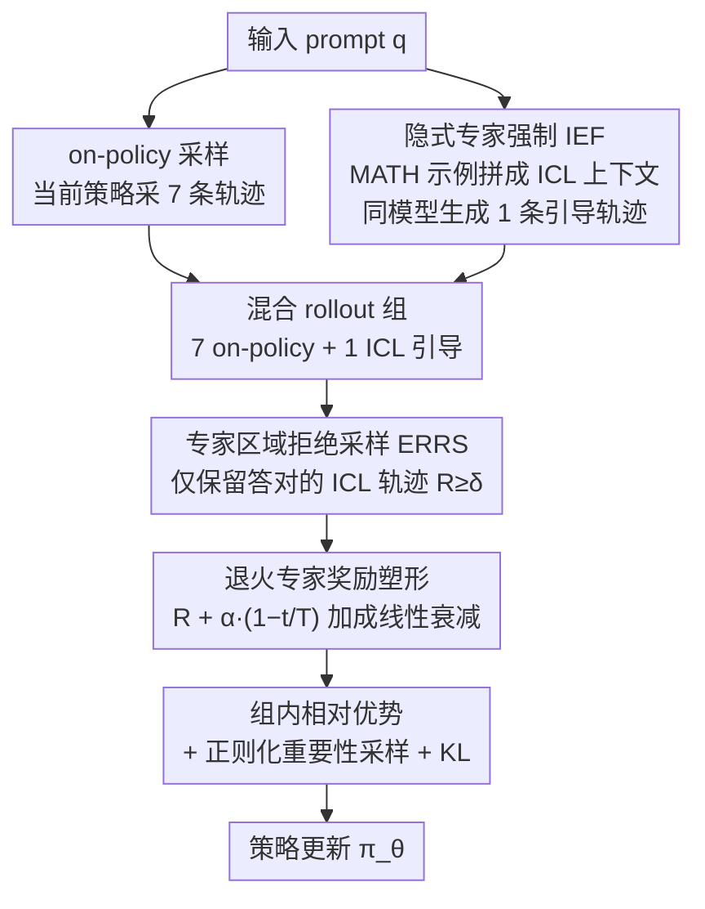

# Think Outside the Policy: In-Context Steered Policy Optimization

**会议**: ACL 2026 Findings  
**arXiv**: [2510.26519](https://arxiv.org/abs/2510.26519)  
**代码**: [GitHub](https://github.com/Celine-hxy/ICPO)  
**领域**: LLM Reasoning / Reinforcement Learning  
**关键词**: 强化学习, 上下文学习引导, 策略优化, 探索增强, 数学推理

## 一句话总结

提出 ICPO (In-Context Steered Policy Optimization)，利用大语言模型自身的上下文学习(ICL)能力作为隐式专家引导，在 RLVR 训练中扩展策略探索空间，无需依赖外部更强模型的推理轨迹。

## 研究背景与动机

**领域现状**：基于可验证奖励的强化学习(RLVR)，尤其是 GRPO 算法，已成为提升大语言推理模型(LRMs)数学推理能力的主流范式。然而 GRPO 依赖 on-policy 采样，所有轨迹都来自当前策略分布，导致探索多样性受限。

**现有痛点**：(1) On-policy 探索困于当前策略分布，轨迹多样性不足，易陷入局部最优；(2) 现有扩展探索空间的方法（如 LUFFY）依赖更强 LRM 生成的推理轨迹作为 off-policy 样本，但这些高级模型计算成本高且并非总是可获取；(3) 直接引入外部轨迹可能引入噪声，影响训练稳定性。

**核心矛盾**：RLVR 需要足够的探索多样性来发现更优策略，但 on-policy 采样天然限制了探索范围；而引入外部专家轨迹虽然有效，却引入了对外部资源的依赖。

**本文目标**：设计一个不依赖外部更强模型的 RLVR 框架，利用模型自身能力扩展探索空间并提升训练效果。

**切入角度**：ICL 本质上是一种隐式的专家条件推理——通过在输入中提供示例，模型会在不改变参数的情况下将推理分布偏移到更接近专家的区域。将这种 ICL 引导的轨迹纳入 GRPO 训练中，即可实现"隐式专家强制"(Implicit Expert Forcing)。

**核心idea**：用现有数据集（如 MATH 训练集）的示例作为 ICL demonstrations 来引导模型生成 off-policy 轨迹，无需外部更强模型，同时通过 reject sampling 和退火奖励塑形保证训练稳定性。

## 方法详解

### 整体框架

ICPO 在标准 GRPO 基础上引入三个组件：(1) 混合策略 GRPO + 隐式专家强制(IEF)：利用 ICL 生成 off-policy 轨迹扩展探索空间；(2) 专家区域拒绝采样(ERRS)：过滤低质量 off-policy 轨迹；(3) 退火专家奖励塑形(RS)：平衡早期专家引导与后期自主优化。每个 prompt 生成 8 个轨迹（7 个 on-policy + 1 个 off-policy ICL 引导），三者依次串在 GRPO 的"采样 → 筛选 → 算优势 → 更新"流程上。

### 关键设计

**1. 混合策略 GRPO + 隐式专家强制（IEF）：用模型自己的 ICL 能力造出 off-policy 轨迹，无需外部更强模型**

GRPO 的探索瓶颈在于所有轨迹都从当前策略分布里采，多样性天然受限、容易困在局部最优；而 LUFFY 那种引外部强模型轨迹的做法又贵又不一定拿得到。ICPO 的巧思是：对每个 prompt $q$，从 MATH 数据集随机采样几个示例 $\mathcal{D}$ 拼成 $x_{\mathrm{exp}}=[\mathcal{D};q]$，再让同一个模型生成 ICL 引导轨迹 $\tau_{\mathrm{exp}} \sim \pi_\theta(\tau|x_{\mathrm{exp}})$。从 ICL 的假设类视角看，Transformer 内部会把这些示例编码成一个任务向量 $\vartheta = A(\mathcal{D})$，相当于在不动参数的前提下隐式注入了一份专家先验，把推理分布往专家对齐的区域偏移。每个 prompt 最终凑成 8 条轨迹（7 条 on-policy + 1 条 ICL 引导），在混合 rollout 组上重新计算 group-relative advantage。虽然轨迹全来自同一个 $\pi_\theta$，但 ICL 条件化改变了输入分布，等于做了一次"输入条件化的 off-policy"，省掉了额外模型。

**2. 专家区域拒绝采样（ERRS）：只让答对的 ICL 轨迹进训练，挡住噪声梯度**

ICL 引导并不保证答案正确，要是把所有 off-policy 轨迹照单全收，错误轨迹会带来误导性梯度、污染策略更新。ERRS 因此定义一个专家区域 $\mathcal{E}_{\mathrm{exp}} = \{(x_{\mathrm{exp}}, \tau_j) \mid R(\tau_j) \geq \delta\}$，只有当 ICL 轨迹的奖励越过阈值 $\delta=1.0$（即答案正确）时才纳入训练，靠拒绝采样算子 $\rho$ 保证参与更新的都是高奖励轨迹。这一步是混合策略能稳住的关键——它把"扩展探索"和"保证信号可靠"解耦开。

**3. 退火专家奖励塑形：早期多模仿专家、后期放手自主探索**

固定的专家奖励加成会让模型一直黏着专家行为、过度依赖。ICPO 给专家区域内的正确轨迹加一个随时间线性衰减的奖励：

$$R_{\mathrm{shaped}}(\tau) = R(\tau) + \alpha \cdot \gamma(t), \quad \gamma(t) = 1 - t/T$$

训练早期 $\gamma(t)$ 接近 1，专家引导强、帮模型快速进入更好的策略区域；越往后 $\gamma(t)$ 越小，专家加成淡出，模型平滑过渡到自主推理。这种"先跟随、后放手"的退火安排，既吃到了专家引导的早期红利，又避免了对专家风格的长期路径依赖。

### 损失函数 / 训练策略

最终目标函数 $\mathcal{J}_{\mathrm{ICPO}}(\theta)$ 包含 on-policy 和 off-policy 两部分，off-policy 部分经过拒绝采样和重要性比率调整。使用正则化重要性采样 $f(x) = x/(x+\lambda)$（$\lambda=0.01$）对 off-policy 轨迹进行策略塑形。同时保留 KL 正则化项防止策略偏移过大。

## 实验关键数据

### 主实验

| 模型 | 方法 | AIME24/25 | MATH-500 | Olympiad | Avg. | Avg.提升 |
|------|------|-----------|----------|----------|------|---------|
| Qwen3-1.7B | GRPO | 28.4/22.5 | 83.6 | 48.2 | 48.4 | - |
| Qwen3-1.7B | ICPO | 31.3/26.3 | 86.8 | 56.4 | 52.5 | +4.1 |
| Qwen3-8B | GRPO | 54.8/38.5 | 91.0 | 62.4 | 63.5 | - |
| Qwen3-8B | ICPO | 55.2/43.7 | 92.0 | 65.2 | 65.7 | +2.2 |
| Qwen2.5-Math-7B | LUFFY | - | 87.6 | 57.2 | 50.1 | - |
| Qwen2.5-Math-7B | ICPO† | - | 86.6 | 53.6 | 53.4 | +3.3 vs LUFFY |

### 消融实验

| 配置 | Avg.(1.7B) | Avg.(8B) | 说明 |
|------|-----------|----------|------|
| ICPO (full) | 51.8 | 65.8 | 完整模型 |
| - ERRS | 50.6 | 65.0 | 去掉拒绝采样，性能下降 |
| - IEF (=GRPO) | 48.4 | 63.8 | 去掉 ICL 引导，回退到标准 GRPO |
| CoT vs PoT 专家数据 | 51.8 vs 51.5 | 65.8 vs 65.1 | 对专家数据类型鲁棒 |

### 关键发现
- ICL 引导轨迹不仅提高准确率，还增强了轨迹多样性（更大的编辑距离）和分布质量（更高的"翻转"比例——从错误变为正确）
- ICPO 在训练过程中维持更高的策略熵，反映了更广泛的策略支持和更充分的探索
- ICPO 对专家数据的选择具有鲁棒性——使用代码形式(PoT)的跨领域数据也能获得一致提升
- ICPO† 带奖励塑形的变体在 OOD 基准上表现更好，说明退火策略有助于泛化

## 亮点与洞察
- **ICL 作为隐式专家强制的理论视角**：将 ICL 的假设类分解与专家强制联系起来，提供了优雅的理论解释
- **零额外模型依赖**：与 LUFFY 等方法相比，ICPO 不需要任何外部更强模型，只需现有数据集作为 ICL demonstrations
- **即插即用的框架设计**：通过更换专家数据即可灵活调控目标策略分布，具有很好的可扩展性
- **训练动态的可视化**：奖励曲线和熵曲线清晰展示了 ICPO 相对于 GRPO 的优势

## 局限与展望
- 实验主要集中在数学推理领域，跨领域泛化性（如代码生成、常识推理）尚未充分验证
- ICL 引导的质量依赖于 demonstrations 的质量，对于极端困难的问题可能效果有限
- 每个 prompt 只使用 1 个 off-policy 轨迹（7+1 配置），更灵活的比例策略值得探索
- 未来可将 ICPO 与其他探索增强技术（如温度调节、重放缓冲区）结合

## 相关工作与启发
- **vs LUFFY**：LUFFY 需要更强 LRM 生成的推理轨迹作为 off-policy 样本，ICPO 用 ICL 替代外部模型，在 Qwen2.5-Math-7B 上超越 LUFFY +3.3
- **vs GRPO + Extra Rollouts**：简单增加 rollout 数量效果有限，ICPO 的 ICL 引导提供了更有效的探索信号
- **vs ReLIFT**：ReLIFT 在 RL 和 SFT 间交替切换，引入训练不稳定性；ICPO 在单一框架内统一了 SFT 信号和 RL 优化

## 评分
- 新颖性: ⭐⭐⭐⭐ 将 ICL 重新解读为隐式专家强制并融入 RLVR 框架，思路新颖
- 实验充分度: ⭐⭐⭐⭐ 多模型多基准的全面评估，含消融、专家数据类型分析和训练动态分析
- 写作质量: ⭐⭐⭐⭐ 框架清晰，公式推导完整，理论动机和实验验证结合良好
- 价值: ⭐⭐⭐⭐ 提供了一种低成本的 RLVR 探索增强范式，对 LRM 后训练具有实用价值

<!-- RELATED:START -->

## 相关论文

- [\[ICLR 2026\] Slow-Fast Policy Optimization: Reposition-Before-Update for LLM Reasoning](../../ICLR2026/llm_reasoning/slow-fast_policy_optimization_reposition-before-update_for_llm_reasoning.md)
- [\[ACL 2026\] Adapt to Thrive! Adaptive Power-Mean Policy Optimization for Improved LLM Reasoning](adapt_to_thrive_adaptive_power-mean_policy_optimization_for_improved_llm_reasoni.md)
- [\[CVPR 2026\] APPO: Attention-guided Perception Policy Optimization for Video Reasoning](../../CVPR2026/llm_reasoning/appo_attention-guided_perception_policy_optimization_for_video_reasoning.md)
- [\[ACL 2026\] Calibration-Aware Policy Optimization for Reasoning LLMs](calibration-aware_policy_optimization_for_reasoning_llms.md)
- [\[ICLR 2026\] Scaf-GRPO: Scaffolded Group Relative Policy Optimization for Enhancing LLM Reasoning](../../ICLR2026/llm_reasoning/scaf-grpo_scaffolded_group_relative_policy_optimization_for_enhancing_llm_reason.md)

<!-- RELATED:END -->
