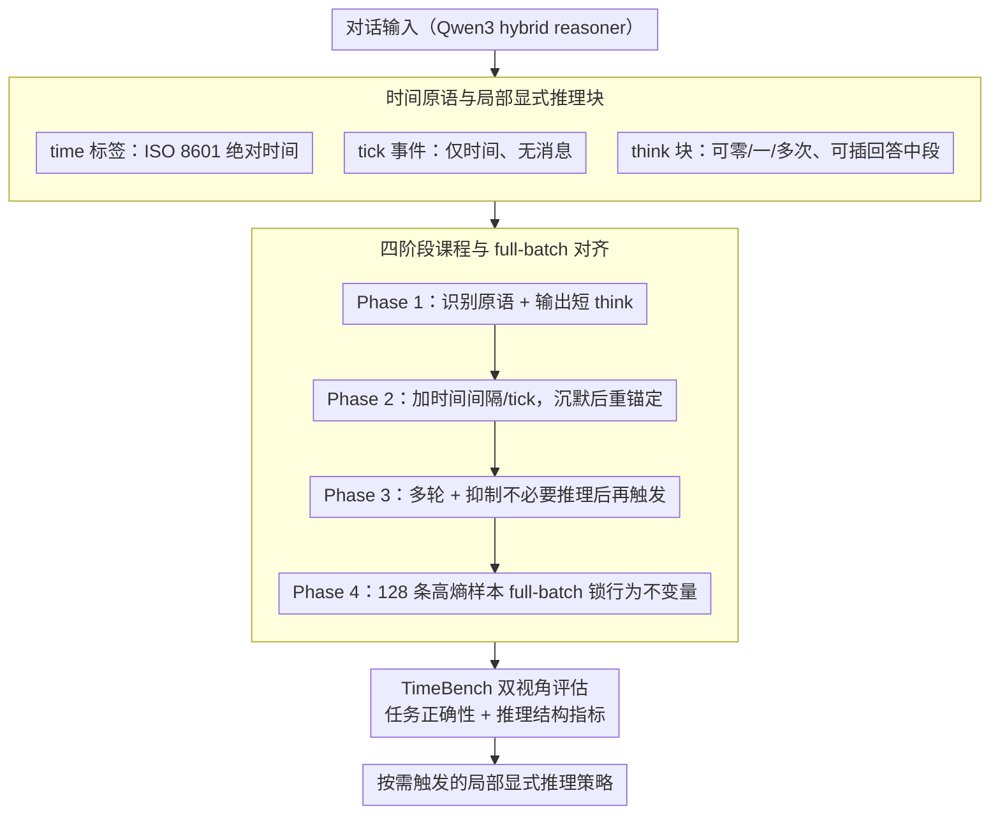

# TIME: Temporally Intelligent Meta-Reasoning Engine for Context-Triggered Explicit Reasoning

**会议**: ACL 2026  
**arXiv**: [2601.05300](https://arxiv.org/abs/2601.05300)  
**代码**: https://github.com/The-Coherence-Initiative/TIME / https://github.com/The-Coherence-Initiative/TIMEBench  
**领域**: LLM 推理 / 时间推理 / 行为对齐  
**关键词**: 显式推理控制、时间上下文、元推理、TimeBench、QLoRA 对齐  

## 一句话总结
TIME 把显式推理从“始终开启的长思维链”改造成由时间和语篇线索触发的局部控制策略，通过 `time` 标签、tick 事件、短 `think` 块和四阶段 QLoRA 课程训练，让 Qwen3 系列在 TimeBench 上显著超过 thinking/no-thinking 基线，同时把推理 token 压缩到原来的约十分之一量级。

## 研究背景与动机
**领域现状**：推理型语言模型通常用显式 reasoning trace 来提升算术、代码、多步问答等任务表现。许多系统把这种能力设计成 inference-time mode：要么总是输出长的 chain-of-thought，要么通过开关完全关闭。

**现有痛点**：固定推理模式很笨重。长且前置的 reasoning block 会增加 token 成本和延迟；它通常一次性覆盖整段回答，导致单个 claim 和具体依据之间的对应关系不清楚；更重要的是，一旦模型开始正式回答，就很难在中途因为新线索重新进入显式检查状态。

**核心矛盾**：真实对话中的推理需求不是只由任务类型决定，还由上下文状态变化决定。用户隔了两秒回复和隔了两周回复，表面文本可能相似，但潜在状态完全不同：截止时间可能已过、计划可能失效、用户处境可能变化。普通模型如果看不到或不会利用时间结构，就会把这些交互状态差异当作无关信息。

**本文目标**：作者希望把显式推理对齐成一种 context-triggered control policy：模型自己判断何时需要短暂显式推理，推理块可以出现在回答开头、中间或后面，而且只在时间、矛盾、沉默、目标变化等线索提示“需要重新锚定”时触发。

**切入角度**：时间是一个很好的 probe。它不是为了测试模型记住了多少时间事实，而是为了制造可控的潜在状态变化：长时间间隔、无文本 tick、非法日期、时区变化、截止时间临近、时间倒流等，都可以触发模型重新检查假设。

**核心 idea**：用轻量时间原语和短 `think` 块教模型“何时推理、在哪里推理、推理多长”，再用 TimeBench 同时评估任务正确性和显式推理的结构变化。

## 方法详解
TIME 的目标不是训练一个更会背时间知识的模型，而是训练一个更会分配显式推理资源的模型。它基于 Qwen3 dense hybrid reasoners，因为 Qwen3 原本就有 thinking 和 no-thinking 两种模式，适合学习更细粒度的中间策略。

### 整体框架
输入对话可以携带三种文本原语。第一种是 `time` 标签，用 ISO 8601 形式给用户 turn 加绝对时间。第二种是 `think` 块，作为模型输出中的短显式推理 burst，可以出现零次、一次或多次，也可以位于回答中间。第三种是 tick event，即用户 turn 里只有时间标签，没有消息，用来表示沉默和时间流逝。

训练采用四阶段 SFT curriculum。Phase 1 教模型识别原语和格式，输出短且边界清楚的 `think`；Phase 2 加入两轮对话、时间间隔和 tick，让模型在沉默后重新锚定；Phase 3 扩展到多轮、话题变化和上下文调制，训练抑制不必要推理以及在后续重新触发；Phase 4 用 128 条手工构造、表面极度多样但共享同一行为不变量的对话做 full-batch alignment，集中优化“由上下文线索触发局部推理”这一策略。

评测使用 TimeBench。它包含 77 个场景，7 个诊断类别，每类 11 个场景；每个场景采样 10 次，共 770 runs。TimeBench 不考时间事实记忆，而是考模型能否从时间结构推断潜在上下文状态，并调整最后一轮回答。除二元任务成功率外，它还记录 `think` 是否出现、位置、数量、推理 token、输出 token、markdown 使用和退化输出比例。

### 关键设计

**1. 时间原语与局部显式推理块：把推理从「回答开头的长前缀」拆成「随时可触发的短检查」**

固定推理模式最大的毛病是一旦模型开始正式作答，就很难因为新线索中途回到显式检查状态，而真实交互里的大量错误恰恰来自 stale assumption（假设过期）而非知识不足。TIME 给对话引入三种轻量文本原语来把这种隐含的状态变化变成可学习的信号：`time` 标签用 ISO 8601 给每个用户 turn 加绝对时间，让模型直接看到 turn 之间的间隔；tick event 是只有时间标签、没有消息的 turn，用来表达「沉默 + 时间继续流逝」；`think` 块则不再是回答开头一整段长思维链，而是可以出现零次、一次或多次、也可以插在回答中段的局部检查。这样模型在作答途中察觉「这个假设可能过期了」时，可以就地触发一段短推理重新锚定，而把推理成本严格限制在真正需要的位置。

**2. 四阶段课程与 full-batch 对齐：用逐级加难 + 高熵小样本，逼模型学「触发策略」而不是「话题/格式伪相关」**

直接拿少量目标样本做 SFT 很容易让模型记住话题、格式或风格等伪相关，学出来的是长模板化推理或干脆格式崩坏，而不是「按上下文线索触发局部推理」这个真正的行为不变量。TIME 因此把训练拆成四阶段课程：Phase 1 教模型识别原语和格式、输出边界清楚的短 `think`；Phase 2 加入两轮对话、时间间隔和 tick，让模型在沉默后重新锚定；Phase 3 扩展到多轮、话题变化和上下文调制，训练它抑制不必要推理并在后续重新触发；前三阶段都带 25% replay 来保住先前行为。Phase 4 则去掉 replay，用 128 条手工构造、表面极度多样但共享同一行为不变量的对话做 full-batch 更新——所有样本唯一的共同点就是「在时间或语篇线索需要时放一段简短 `think`，否则保持紧凑输出」。让每一步梯度都看到全部高熵多样性，更新就会集中在这个不变量上，而不是某个话题表面。

**3. TimeBench 的双视角评估：既看答得对不对，也看推理策略是否真的变了**

只看 accuracy 有个隐患：分数提升可能只是因为输出更长、judge 偏好长答案，而不是策略真的改变。TimeBench 因此同时记录任务正确性和推理结构两套信号。它含 77 个场景、7 个诊断类别（chronological retrospection、invalid time detection、temporal adaptivity、temporal contextual awareness、temporal flow anomaly detection、time gap awareness、timezone sensitivity），每类 11 个场景、每场景采样 10 次共 770 runs；每个输出由看不到原 prompt 和时间戳的盲 LLM-as-a-judge 按二元 objective 打分，再由结构分析统计 `think` 是否出现、出现位置、数量以及推理 token、输出 token、退化输出比例。两套指标合起来才能验证 TIME 是真的从长前置推理转向了短、局部、按需触发的推理，而非靠堆 token 刷分。值得强调的是，TimeBench 不考时间事实记忆，而是把时间当作 latent state change 的可观测探针——长间隔、非法日期、时区变化、时间倒流等都用来制造可控的潜在状态变化。

### 损失函数 / 训练策略
训练使用 QLoRA 监督微调，base model 权重冻结，只更新 LoRA adapter。Phases 1-3 的设置一致：rank 32、$\alpha=32$、dropout 0.05、AdamW-8bit、学习率 $2\times 10^{-5}$、effective batch size 32、3 epochs、gradient checkpointing，并加入 25% replay。数据规模分别为 Phase 1 的 2,188 train / 387 test，Phase 2 的 5,291 train / 935 test，Phase 3 的 5,878 train / 1,039 test。

Phase 4 使用 128 条手工多轮对话，effective batch size 128，即每步看到完整数据集；学习率 $1.5\times 10^{-4}$，6 warm-up steps。作者发现 Phase 4 有窄稳定窗口：过早停止策略没学好，过晚会出现 infinite loops、`think` 格式外溢和 style collapse。因此选取训练 loss 首次进入 $[1.045,1.050]$ 的 checkpoint，分别对应 32B/14B/8B/4B 的 epoch 18/24/30/31。

## 实验关键数据

### 主实验
TIME 在四个模型规模上都超过 Qwen3 thinking 和 no-thinking 基线。提升不只是小模型明显，32B 上也从 thinking mode 的 37.40 提到 64.81。作者用 scenario-level Wilcoxon signed-rank test 验证，每个规模相对 thinking baseline 的提升都达到 $p<0.001$。

| 模型规模 | Qwen3 No-Thinking | Qwen3 Thinking | TIME | 相对 Thinking 提升 |
|----------|-------------------|----------------|------|-------------------|
| 4B | 17.53 | 30.13 | 52.60 | +22.47 |
| 8B | 21.56 | 32.99 | 59.87 | +26.88 |
| 14B | 29.48 | 34.42 | 64.80 | +30.38 |
| 32B | 31.82 | 37.40 | 64.81 | +27.41 |

置信区间也支持这一结论。TIME-4B 的 95% CI 为 44.55-60.39，对应 thinking baseline 为 23.90-36.36；TIME-32B 为 58.18-71.17，对应 thinking baseline 为 31.56-43.51。四个规模上，TIME 的区间都不和匹配的 thinking baseline 重叠。

| 模型 | TimeBench Score | 95% CI | WSR p-value vs Thinking | 结论 |
|------|-----------------|--------|-------------------------|------|
| TIME-4B | 52.60 | 44.55-60.39 | 3.8e-4 | 小模型已明显学到时间触发策略 |
| TIME-8B | 59.87 | 53.38-66.23 | 1.9e-5 | 分数接近 14B/32B |
| TIME-14B | 64.80 | 59.09-70.39 | 1.6e-6 | 综合表现最高之一 |
| TIME-32B | 64.81 | 58.18-71.17 | 5.0e-7 | 大模型同样显著受益 |

### 消融实验
32B 的 phase-wise ablation 展示了能力和结构如何一起变化。普通 thinking mode 几乎每次都在开头输出一个长 `think`，平均 910.52 个 thinking tokens，输出总长 1573.47 tokens，退化率 18.18%。Phase 2 后，推理 token 降到 76.59，mid-turn `think` 开始出现；最终 TIME-32B 的平均 thinking tokens 为 84.16，输出 332.64 tokens，分数却最高。

| 模型 / 阶段 | Score | Runs w/ `think` | Mean # `think` | Think 位置 Start/Mid/End | Thinking Tokens | Output Tokens | Degeneracy |
|-------------|-------|-----------------|----------------|---------------------------|-----------------|---------------|------------|
| No-Thinking | 31.82 | 0.0% | 0.00 | - | 0.00 | 608.96 | 4.42% |
| Thinking | 37.40 | 99.2% | 0.99 | 100.0 / 0.0 / 0.0 | 910.52 | 1573.47 | 18.18% |
| Phase 1 | 42.47 | 99.5% | 0.99 | 100.0 / 0.0 / 0.0 | 803.52 | 1434.56 | 13.90% |
| Phase 2 | 56.88 | 95.6% | 1.12 | 70.7 / 29.1 / 0.2 | 76.59 | 362.45 | 4.68% |
| Phase 3 | 52.08 | 89.2% | 1.25 | 55.0 / 44.6 / 0.4 | 52.94 | 294.51 | 0.78% |
| TIME | 64.81 | 80.6% | 1.67 | 24.1 / 75.6 / 0.2 | 84.16 | 332.64 | 3.64% |

### 关键发现
- TIME 的收益不是来自“想得更长”。相比 Qwen3 thinking，TIME-32B 的 thinking tokens 从 910.52 降到 84.16，TimeBench score 却从 37.40 提到 64.81。
- Phase 2 是行为转折点。加入时间间隔和 tick 后，分数从 Phase 1 的 42.47 到 56.88，同时推理长度大幅下降，说明 temporal exposure 让模型开始摆脱固定前置推理。
- Phase 3 更强调抑制和稳定，退化率降到 0.78%，但部分异常/不连续类别收益回落。最终 Phase 4 重新拉高这些类别，同时保持短推理。
- Mid-turn reasoning 是关键结构变化。最终 TIME-32B 的 `think` 位置 75.6% 在中间，而 Qwen3 thinking 和 Phase 1 都是 100% 开头。
- 时间 cues 是 probe，不是唯一触发源。论文讨论中强调，训练后策略也可对矛盾、目标变化、不确定性等纯文本线索反应。

## 亮点与洞察
- 论文把显式推理从能力问题转成资源调度问题。关键不是“模型会不会思考”，而是“什么时候值得把思考显式化”。
- TimeBench 的设计很有启发：它不考历史日期知识，而是把时间当成 latent state change 的可观测信号。这比普通 temporal QA 更贴近对话和 agent 场景。
- Phase 4 的 full-batch alignment 是有趣的低数据行为对齐 recipe。128 条样本并不多，但通过最大表面多样性压低伪相关，让行为不变量成为主梯度方向。
- 结构指标让论文更可信。仅有分数提升可能被解释为 judge 偏好长答案，而推理 token 下降、mid-turn 增多、degeneracy 降低共同说明行为确实变了。

## 局限与展望
- 所有实验都基于 Qwen3 dense hybrid reasoners，它们本身支持 thinking/no-thinking。对纯 instruct 模型、MoE hybrid reasoners 或其它模型家族是否可迁移仍未验证。
- 评测只覆盖 TimeBench，没有系统测试数学、代码、工具使用、事实问答等通用 benchmark，因此不知道 TIME 对一般推理能力是否有副作用。
- TimeBench 只有 77 个场景，并且与框架一同开发，不是完全独立的大规模 benchmark。它足够支撑本文诊断，但还需要更多场景和多 judge 协议。
- 打分依赖 LLM-as-a-judge。虽然 judge 看不到原 prompt 和时间戳，并使用二元 objective、重复采样和 bootstrap，但仍可能有 false positive/negative，也无法做到严格 token-level reproducibility。
- 论文主要在英文场景中验证，没有讨论 multilingual、安全、公平性或高风险决策中的显式推理暴露问题。`think` 块可审计，但不等于机制可解释。

## 相关工作与启发
- **vs Chain-of-Thought prompting**: CoT 通常把推理作为长前置文本，TIME 则把推理变成可插入、可重复、短促的局部动作。
- **vs hybrid reasoning / think-only-when-needed**: 现有混合推理多按任务难度决定是否 thinking，TIME 更关注上下文状态变化，尤其是时间线索导致的假设失效。
- **vs temporal knowledge modeling**: Time-Aware LM、ChronoSense、TimE、EvolveBench 等更多关注时间事实、事件顺序或时间泛化，TIME 把时间作为对话状态和元推理触发器。
- **对后续研究的启发**: 可以把 `time` 换成其它状态信号，例如工具执行失败、用户目标变更、检索结果冲突、长时记忆更新，训练模型在这些节点触发短 reasoning burst。

## 评分
- 新颖性: ⭐⭐⭐⭐☆ 把时间线索用于显式推理控制而非时间事实问答，角度很新；核心原语本身较轻量。
- 实验充分度: ⭐⭐⭐⭐☆ 四个模型规模、课程消融、结构指标和置信区间都完整，但只在 TimeBench 上验证。
- 写作质量: ⭐⭐⭐⭐☆ 叙事清楚，方法和行为指标衔接自然；部分 claim 受限于自建 benchmark 和 LLM judge。
- 价值: ⭐⭐⭐⭐☆ 对交互式助手和 agent 的“按需短推理”很有启发，尤其适合需要低延迟又要能重新锚定上下文的场景。

<!-- RELATED:START -->

## 相关论文

- [\[ICML 2026\] Verifying Meta-Awareness via Predictive Rewards in Reasoning Models](../../ICML2026/llm_reasoning/verifying_meta-awareness_via_predictive_rewards_in_reasoning_models.md)
- [\[ACL 2026\] DELTA: Dynamic Layer-Aware Token Attention for Efficient Long-Context Reasoning](delta_dynamic_layer-aware_token_attention_for_efficient_long-context_reasoning.md)
- [\[ACL 2026\] Think Outside the Policy: In-Context Steered Policy Optimization](think_outside_the_policy_in-context_steered_policy_optimization.md)
- [\[ACL 2026\] Long-Context Reasoning Through Proxy-Based Chain-of-Thought Tuning](long-context_reasoning_through_proxy-based_chain-of-thought_tuning.md)
- [\[ACL 2026\] Efficient Test-Time Scaling via Temporal Reasoning Aggregation](efficient_test-time_scaling_via_temporal_reasoning_aggregation.md)

<!-- RELATED:END -->
