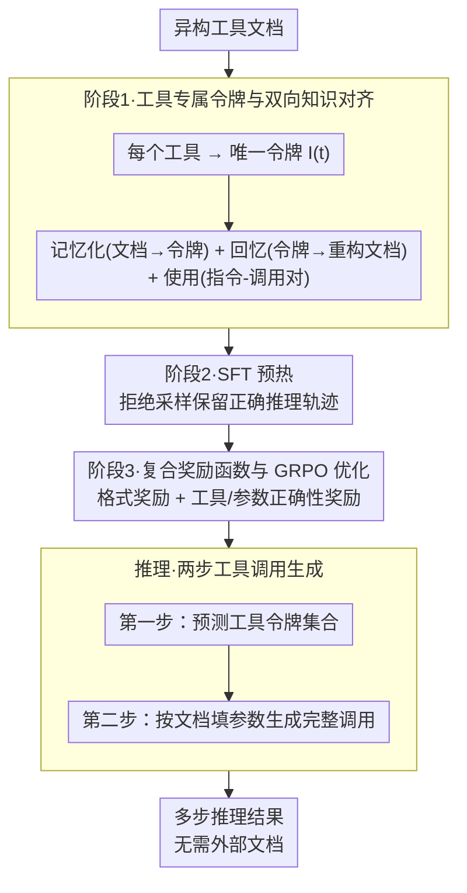

# TInR：探索大语言模型中的工具内化推理

**会议**: ACL 2026  
**arXiv**: [2604.10788](https://arxiv.org/abs/2604.10788)  
**代码**: https://github.com/travis-xu/TInR  
**领域**: LLM 推理 / 工具使用  
**关键词**: 工具内化、推理、LLM、强化学习、工具调用

## 一句话总结
本文提出 TInR-U 框架，通过将工具知识内化到 LLM 参数中（而非依赖外部文档），实现高效且可靠的工具辅助推理，在域内和域外测试中均优于现有方法。

## 研究背景与动机

**领域现状**：工具集成推理（TIR）已成为扩展 LLM 能力的主流方向，通过让模型在推理过程中调用外部工具来解决知识更新、实时查询等超出其原有能力的任务。现有 TIR 方法主要依赖两类训练策略：上下文学习（ICL）和监督微调（SFT）。此后，强化学习（RL）方法被引入以增强探索性和适应性。

**现有痛点**：尽管进展显著，但现有 TIR 方法仍存在三个根本问题。第一，工具文档形式多样且不一致，LLM 难以快速掌握异构工具知识，在外部文档与内部理解之间造成鸿沟。第二，工具数量增加时无法将所有文档纳入上下文窗口，虽然检索策略可部分缓解但增加了流程复杂性并可能导致检索与实际使用不匹配。第三，长工具文档显著增加提示长度，导致推理延迟和计算开销上升。

**核心矛盾**：当前范式在效率、可扩展性和准确性之间存在难以调和的权衡。外部依赖模式反映的是被动查询思维，而非主动掌握工具。

**本文目标**：探索工具内化推理（TInR），让 LLM 将工具知识编码到参数中，使模型能在不依赖外部文档的情况下进行推理。这要求满足两个关键需求：（1）工具内化——将工具功能与使用规则编入参数；（2）工具-推理协调——在推理过程中无缝整合工具知识进行自适应工具使用。

**切入角度**：受人类将工具知识内化到大脑并持续应用的启发，本文提出在 LLM 中实现类似的内化机制。核心观察是：如果能让模型"理解"工具而非每次都"查询"文档，则可同时获得知识统一性、上下文高效性和推理流畅性。

**核心 idea**：通过三阶段训练管道（工具内化→SFT 预热→强化学习）逐步赋予 LLM 工具内化推理能力，用专属工具令牌作为参数化表示，通过双向知识对齐确保细粒度保真与整体理解的均衡。

## 方法详解

### 整体框架

TInR-U 框架包含三个递进式训练阶段。首先在工具内化阶段，模型通过双向知识对齐策略学习将工具文档映射到专属令牌，反之亦然，同时进行工具使用训练以确保实际应用对齐。其次在 SFT 预热阶段，利用高质量推理轨迹通过拒绝采样构建，对模型进行监督微调以建立推理能力基础。最后在强化学习阶段，采用专为工具推理设计的复合奖励函数进行优化。推理时，模型仅需利用内化的工具知识进行多步推理和工具调用，无需外部文档。

### 关键设计

**1. 工具专属令牌与双向知识对齐：让模型「理解」工具而不是每次都「查文档」**

现有 TIR 把异构工具文档塞进上下文，既造成 prompt 膨胀和检索复杂度，又让外部文档与模型内部理解之间存在鸿沟。TInR-U 给每个工具分配一个唯一令牌 $I(t)$ 作为参数化表示，并用三个互补损失把工具知识真正写进参数。工具记忆化目标让模型学会从文档映射到令牌：

$$\mathcal{L}_{\text{memorization}}=-\sum_{t\in\mathcal{T}}\log P(I(t)\mid D(t))$$

工具回忆目标反过来要求模型能从令牌重构原始文档，保住细粒度细节：

$$\mathcal{L}_{\text{recall}}=-\sum_{t\in\mathcal{T}}\sum_{s=1}^{|D(t)|}\log P(D(t)_s\mid I(t),D(t)_{<s})$$

工具使用目标 $\mathcal{L}_{\text{usage}}$ 则直接在指令-工具调用对上训练，保证内化的知识能真的用起来。三者合成 $\mathcal{L}_{\text{Phase1}}=\mathcal{L}_{\text{memorization}}+\alpha\mathcal{L}_{\text{recall}}+\beta\mathcal{L}_{\text{usage}}$。这种「记忆 + 回忆」的双向设计是关键：记忆化建立整体理解、回忆任务逼模型不丢失文档细节，两者形成互补的学习信号，使用任务再把它锚定到实际推理上。

**2. 两步工具调用生成：先选工具、再填参数，把一个难任务拆成两个简单子任务**

一次到位地生成完整 JSON 工具调用，模型要同时操心选哪个函数和每个参数填什么，负担很重也更容易出错。TInR-U 用两个控制标签把过程解耦：第一步在 `<tool_token>` 范围内只预测工具令牌集合 $\{I(t_i)\}_{i=1}^K$，第二步在 `<tool_call>` 范围内根据对应文档 $\{D(t_i)\}_{i=1}^K$ 把每个令牌和具体参数配对、生成完整调用。先定结构再填细节，每一步的约束都更强、空间更小，模型更容易做对。这个解耦不是锦上添花而是骨架：消融里去掉两步设计后工具调用 EM 从 61.31% 直接跌到 43.40%。

**3. 复合奖励函数与 GRPO 优化：在 RL 阶段同时约束结构合法性和语义正确性**

光靠 SFT 学到的工具推理在多步、未见工具场景下还不够稳，需要 RL 来增强探索和适应。TInR-U 在第三阶段用复合奖励：格式奖励 $R_{\text{format}}$ 检查轨迹是否包含顺序正确的特殊标签，保证结构合法；正确性侧的工具奖励 $r_{\text{tool}}$ 和参数奖励 $r_{\text{param}}$ 分别用 Jaccard 相似度衡量选对的工具和参数，最终奖励 $R=R_{\text{format}}+R_{\text{correct}}$。优化用群组相对策略优化（GRPO），采用 PPO 风格目标并把相对优势在同一批内归一化来稳定训练。把格式和正确性拆成两路奖励，既不会因为 JSON 写歪就全盘否定语义，也不会语义对了却格式非法，两个目标各自有梯度、互不淹没。

### 数据构造与训练策略

在 SFT 阶段，从 ToolACE、xLAM 和 BFCL 等数据集为每条指令收集 10 个候选工具（包含真实工具、检索工具和随机工具），使用大规模推理模型（LRM）生成多条推理轨迹并仅保留由真实工具验证的正确轨迹。进一步通过数据格式化将推理内容中的工具名替换为对应令牌。

## 实验关键数据

### 域内结果（见工具/未见工具）

| 方法 | 见-工具 EM | 见-工具调用 EM | 未见-工具 EM | 未见-工具调用 EM |
|------|-----|-----|-----|-----|
| ToolRetriever+ToolRL | 63.78 | 61.08 | 59.66 | 51.72 |
| ToolGen | 83.78 | 71.89 | 73.79 | 55.86 |
| **TInR-U** | **85.95** | **74.05** | **75.86** | **57.24** |

### 域外 BFCL 结果

| 方法 | 工具识别-EM | 工具调用-EM | 工具准确率 | 参数准确率 |
|------|-----------|----------|---------|---------|
| ToolRetriever+ToolRL | 30.56 | 16.63 | 37.35 | 28.45 |
| ToolGen | 34.89 | 22.01 | 30.91 | 48.24 |
| **TInR-U** | **38.06** | **26.00** | **35.83** | **50.12** |
| 相对提升 | +9.09% | +18.13% | -4.07% | +3.90% |

### 消融实验

| 配置 | 工具识别-EM | 工具调用-EM | 工具准确率 |
|------|-----------|----------|---------|
| 完整模型 | 78.30 | 61.31 | 77.25 |
| 去除双向对齐 | 49.67 | 40.39 | 48.63 |
| 去除 RL | 76.47 | 59.61 | 74.90 |
| 去除两步设计 | — | 43.40 | 72.94 |
| 仅保留记忆化目标 | 58.43 | 45.49 | 57.25 |

### 关键发现

- **泛化性能突出**：在未见工具集合上，TInR-U 相比 ToolGen 在工具识别 EM 上提升 2.81%，域外泛化更达 18.13% 相对提升。
- **推理效率优势明显**：随着工具集合大小增加，ToolRL 的推理速度持续下降，而 TInR-U 保持恒定效率。
- **多步推理能力强**：在多步/多轮工具使用场景上，TInR-U 稳定优于 ToolGen。
- **模型兼容性好**：在 Qwen-2.5B、LLaMA-3.1-8B 和 Mistral-7B 三种主流模型上均优于 ToolGen。
- 消融实验：双向知识对齐和 RL 训练均为必要组件；两步工具调用生成至关重要（移除导致工具调用 EM 跌 30%+）。

## 亮点与洞察

- **架构创新**：工具专属令牌与双向对齐的组合是巧妙的设计，避免了传统 embedding 方法的歧义问题。相比纯语义索引、数字索引和层级索引，专属令牌在工具识别 EM 上领先超过 30 个百分点。
- **解耦推理与工具调用**：两步生成框架将复杂任务分解为两个约束更强的子问题，这种"先选工具后填参数"的设计思路可迁移到任何多步决策问题。
- **高效推理范式**：不同于检索或代理式框架的动态查询，TInR-U 实现了"推理即编码"的全参数化模式，推理速度与工具集大小解耦。
- **强化学习的巧用**：复合奖励设计同时约束格式和语义，GRPO 的群组相对归一化避免了稀疏奖励问题。

## 局限与展望

**作者承认的局限**：

- 评估数据集可能未充分覆盖现实世界工具的多样性。
- 数据集中可能存在"假阴性"（功能相似的工具未被标注为有效）。

**自发现的局限**：

- **工具更新成本**：模型参数化意味着新工具引入需要微调；对于频繁更新的工具生态可能不够灵活。
- **文档保真度的权衡**：参数化压缩总会损失部分信息。
- **基础模型依赖**：在小模型上的绝对性能仍有上限。

**具体改进思路**：开发增量适配算法以更高效地整合新工具；引入可验证的知识蒸馏方法；扩展到多模态工具场景；设计混合范式在极度资源受限时保留少量文档召回作为回退机制。

## 相关工作与启发

**vs 传统工具集成推理方法（TIR）**：传统方法在推理时依赖外部文档，本文通过参数化内化知识避免了上下文膨胀和频繁检索的成本。

**vs 工具学习的其他内化尝试（ToolkenGPT 等）**：先前工作局限于小工具集、简单推理策略或不稳定的 LLM 评估。本文提供了更严格的评估、复杂工具环境的验证，以及专为推理设计的三阶段管道。

**vs 代理式框架（DeepAgent 等）**：代理框架通过迭代推理和可扩展工具搜索改进了工具选择，但仍依赖动态检索且引入额外延迟。TInR-U 通过完全参数化避免此类开销。

**启发意义**：本文证明了 LLM 能够有效内化大规模异构知识并在推理中灵活应用，这打开了参数化知识表示在多个领域的可能性。

## 评分

- **新颖性**: ⭐⭐⭐⭐⭐ 工具内化这一范式转变（从"查文档"到"参数内化"）提出了本质不同的技术路线。
- **实验充分度**: ⭐⭐⭐⭐⭐ 涵盖三个大规模数据集，同时评测域内和域外泛化，进行了详细消融、多基础模型验证、推理效率分析。
- **写作质量**: ⭐⭐⭐⭐ 论文逻辑清晰、动机阐述充分，但部分数学表述可更直观。
- **价值**: ⭐⭐⭐⭐⭐ 对实际工业应用价值高，显著提升推理效率，在数据中心、API 网关等大规模工具环境中具有直接应用潜力。

<!-- RELATED:START -->

## 相关论文

- [\[ACL 2026\] Think Outside the Policy: In-Context Steered Policy Optimization](think_outside_the_policy_in-context_steered_policy_optimization.md)
- [\[ACL 2026\] Do Not Step Into the Same River Twice: Learning to Reason from Trial and Error](do_not_step_into_the_same_river_twice_learning_to_reason_from_trial_and_error.md)
- [\[ACL 2026\] TemplateRL: Structured Template-Guided Reinforcement Learning for LLM Reasoning](templaterl_structured_template-guided_reinforcement_learning_for_llm_reasoning.md)
- [\[ACL 2026\] Language Model as Planner and Formalizer under Constraints](language_model_as_planner_and_formalizer_under_constraints.md)
- [\[ACL 2026\] When Is Thinking Enough? Early Exit via Sufficiency Assessment for Efficient Reasoning](when_is_thinking_enough_early_exit_via_sufficiency_assessment_for_efficient_reas.md)

<!-- RELATED:END -->
