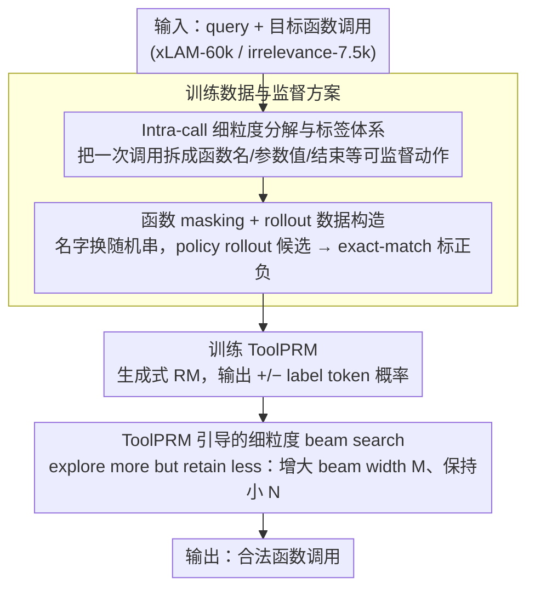

# ToolPRM: Fine-Grained Inference Scaling of Structured Outputs for Function Calling

**会议**: ACL2026  
**arXiv**: [2510.14703](https://arxiv.org/abs/2510.14703)  
**代码**: 待确认  
**领域**: llm_reasoning / 工具调用  
**关键词**: 函数调用, 过程奖励模型, 结构化输出, 推理扩展, Beam Search

## 一句话总结
ToolPRM 将函数调用拆成函数名选择、参数名选择、参数值填写等细粒度决策，训练 intra-call 过程奖励模型来指导 beam search，并提出“explore more but retain less”的结构化输出推理扩展原则，在 BFCL 和 ToolAlpaca 上稳定提升 Hammer2.1 系列工具调用模型。

## 研究背景与动机
**领域现状**：推理时扩展已经在数学、逻辑推理等非结构化生成任务中被广泛使用，例如 self-consistency、Best-of-N、Tree-of-Thought、beam search 或 MCTS。它们通常依赖 outcome reward model 或 process reward model，对多个候选推理路径进行评分和筛选。

**现有痛点**：函数调用属于结构化输出：模型不仅要生成自然语言，还要选择正确函数名、填对参数名和参数值，并保持 JSON / Python-style 调用格式合法。已有推理扩展方法大多把一次函数调用当作整体候选来打分，粒度太粗，无法在“函数名刚选错”“某个参数值错了”这类早期错误发生时及时剪枝。

**核心矛盾**：非结构化推理中，早期错误有时可以通过后续反思或修正补回来；但函数调用的结构化输出通常不可恢复，一个错误函数名或错误参数会让整条轨迹失效。也就是说，结构化输出需要更宽的探索来找正确决策，却不能保留太多错误候选继续消耗预算。

**本文目标**：作者希望构造第一个面向函数调用 intra-call 决策的细粒度过程监督数据集，训练 ToolPRM 对每个局部决策打分，并用它指导搜索，让小工具调用模型在测试时通过额外计算获得更高准确率。

**切入角度**：论文把一次函数调用拆成状态转移过程：先选择函数名，再逐个选择参数名、填写参数值，最后判断参数和函数调用是否结束。这样 PRM 不必等完整 JSON 生成完才打分，而是能在每个局部动作后判断它是否正确。

**核心 idea**：用函数 masking 和 rollout 自动收集细粒度正负步骤标签，训练生成式 reward model 输出 “+” 或 “-”，再在 beam search 中扩大每步候选宽度、减少保留 beam 数，从而把计算预算集中在正确结构路径上。

## 方法详解

### 整体框架
ToolPRM 的流程可以分成三步。第一步是构造细粒度监督数据：从 xLAM-function-calling-60k 和 xLAM-irrelevance-7.5k 获取自然语言 query 与目标函数调用，对函数名和参数名做 masking，迫使模型根据描述理解工具，而不是记住名字；再用 Hammer2.1-3B/7B 作为 policy model rollout 出候选函数调用。

第二步是自动标注每个候选轨迹中的局部决策。论文为函数调用定义多种标签：选函数名是否正确、一个参数名-值对是否正确、所有参数是否填完、单个函数调用是否正确、整体 response 是否正确。每个标签都通过与可能 ground truth 精确匹配得到二元正负监督。

第三步是训练 ToolPRM 并用于推理扩展。ToolPRM 本身也是 LLM，输入当前状态和候选动作，输出 “+” 或 “-” 的概率；beam search 每步展开多个候选，用 ToolPRM 分数排序并剪枝。由于结构化输出早期错误不可恢复，作者主张扩大 beam width 来探索更多局部选择，但保留较少 beam，形成“explore more but retain less”的策略。

### 关键设计
**1. Intra-call 细粒度分解与标签体系：把一次函数调用从「整体 JSON」拆成可逐步监督的局部决策**

已有推理扩展方法大多把整次函数调用当成一个候选来打分，粒度太粗——等到完整 JSON 生成完才知道对错，「函数名刚选错」「某个参数值填错」这类早期错误根本来不及剪枝。ToolPRM 把一次调用拆成一连串可监督的局部动作，并为每个动作定义标签：`<FUNC_NAME>` 判断函数名是否正确、`<ARG_VALUE>` 判断某个参数名和值是否匹配 ground truth、`<TOTAL_FINISH>` 判断整个函数调用列表是否完成且正确，此外还有参数结束、函数结束等标签。这样 reward model 不必等 JSON 写完就能在每个局部动作后判断对错，更早发现错误来源。看似冗余的细标签反而有用：论文实验显示保留 `<ARG_VALUE>` 这类参数级标签反而提高了 trajectory-level 的判断能力，局部监督并没有让模型只盯局部。

**2. 函数 masking + rollout 数据构造：逼 reward model 看懂语义，而不是背工具名**

如果训练数据里函数名、参数名都是真实可辨识的，reward model 很容易退化成靠记忆工具名来打分，一旦部署时工具命名或 schema 变了就泛化崩盘。ToolPRM 在构造数据时把函数名和参数标识符替换成随机字符串，再给 policy model 一组 masked function candidates 去 rollout 出候选函数调用，最后用 exact match 对每个步骤标注正负，得到 step-level 与 trajectory-level 两种粒度的数据。masking 掉表面名字后，reward model 只能转而关注 query 意图、函数描述、参数语义和已经生成的结构上下文，学到的是真正可迁移的判断能力。

**3. ToolPRM 引导的细粒度 beam search：在测试时把额外预算花在「多探索、少保留」上**

结构化输出和自由文本推理有个本质差异：数学推理里早期错误还能靠后续反思补回来，函数调用的错误 JSON 分支几乎不可恢复，一个错函数名就让整条轨迹作废。所以正确策略不是保留一大堆候选慢慢修，而是早剪枝、把预算让给正确结构。搜索时 ToolPRM 对每个候选动作输出 “+” 与 “-” 两个 label token 的 logits，算出局部正确性分数

$$s=\frac{e^{s_+}}{e^{s_+}+e^{s_-}}$$

beam search 保留 top-$N$ 个 beam、每个 beam 展开 $M$ 个后续候选。作者主张提高 $M$ 来扩大每一步的横向探索，同时保持较小的 $N$ 不让错误候选继续占用预算——这就是「explore more but retain less」原则。预算分析印证了它：固定 $N=4$ 增大 $M$ 时 ToolAlpaca F1 随预算上升，而固定 $M=4$ 增大 $N$ 收益很小甚至下降。

### 损失函数 / 训练策略
ToolPRM 采用生成式过程奖励建模。给定轨迹 $\mathcal{T}=\{(s_t,a_t,r_t)\}$，其中 $r_t\in\{+,-\}$，训练目标是最大化正确标签 token 的概率，即最小化 $-\log p_\theta(r_t|s_t,a_t)$。作者使用 Hammer2.1-3B 作为 reward model backbone，SFT 训练 5 个 epoch，Adam 优化器，batch size 1024，学习率 $1e-3$，warmup ratio 0.008，weight decay $1e-5$。推理时温度设为 0.8，beam 数 $N$ 和 beam width $M$ 从 $\{1,2,4,8,16\}$ 中选择。

## 实验关键数据

### 主实验
ToolPRM 数据集规模很大，且同时报告 step 与 trajectory 两种粒度。下表摘自论文表 1。

| 样本粒度 / Split | Positive | Negative | Total |
|------------------|----------|----------|-------|
| Step / Train | 4,380,323 | 731,665 | 5,111,988 |
| Trajectory / Train | 466,786 | 127,648 | 594,434 |
| Step / Test | 488,611 | 81,366 | 569,977 |
| Trajectory / Test | 52,030 | 14,019 | 66,049 |

奖励模型预测准确率显示，监督粒度越细，模型越会判断完整函数调用轨迹。ToolPRM 在 loss、step accuracy、trajectory accuracy 上都优于 outcome-only 和 coarse PRM。

| Reward Model | Loss ↓ | Step Acc ↑ | Trajectory Acc ↑ |
|--------------|--------|------------|------------------|
| ORM | 0.0536 | 98.39% | 98.39% |
| C-PRM | 0.0371 | 98.87% | 99.06% |
| ToolPRM | 0.0286 | 99.11% | 99.38% |

### 消融实验
推理扩展结果表明，ToolPRM 相比 token-level beam search、majority voting 和 Best-of-N 更稳定，尤其对小模型帮助更明显。

| Policy 模型 | 方法 | BFCL Avg. | ToolAlpaca Avg. | 主要结论 |
|-------------|------|-----------|-----------------|----------|
| Hammer2.1-7B | Base | 88.65 | 72.77 | 强 base 已较高 |
| Hammer2.1-7B | + ToolPRM | 89.52 | 73.36 | 小幅但稳定提升 |
| Hammer2.1-3B | Base | 86.86 | 71.57 | 接近 7B base |
| Hammer2.1-3B | + ToolPRM | 88.88 | 71.96 | BFCL 接近 7B + ToolPRM |
| Hammer2.1-1.5B | Base | 82.79 | 69.30 | 小模型结构错误更多 |
| Hammer2.1-1.5B | + ToolPRM | 85.61 | 72.93 | 提升最明显，接近/超过更大 base |

预算分析进一步验证“explore more but retain less”：固定保留 beam 数 $N=4$ 并增大 beam width $M$ 时，ToolAlpaca F1 通常随预算增加而上升；反过来固定 $M=4$、增大保留候选数 $N$ 时收益较小，有时还会下降。这说明结构化输出中保留更多候选并不总是好事，错误候选会把后续预算带偏。

### 关键发现
- 细粒度监督不仅提高 step-level accuracy，也提高 trajectory-level accuracy，说明局部标签并没有让模型只盯局部，而是帮助它更好判断整体正确性。
- ToolPRM 对小模型的边际收益更大。1.5B Hammer 加上 ToolPRM 后，BFCL Avg. 从 82.79 提升到 85.61，ToolAlpaca Avg. 从 69.30 提升到 72.93，接近甚至超过部分更大模型。
- 普通推理扩展方法不稳定。token-level beam search 在多个设置下反而低于 base model，原因正是结构化生成里的早期错误不可恢复。

## 亮点与洞察
- 论文抓住了结构化输出与自由文本推理的本质差异：数学推理可以保留多个中间思路等后续修正，函数调用却更像程序构造，早期 schema 决策错了就很难补救。
- “explore more but retain less” 是一个很实用的推理扩展原则。它比笼统地增加 test-time compute 更具体，指出预算应花在每一步横向探索，而不是保留大量历史错误分支。
- ToolPRM 的数据构造方式也有迁移价值。函数 masking、step-level exact-match 标注、生成式正负标签预测，可以推广到 SQL 生成、工作流编排、机器人动作参数化等结构化输出任务。

## 局限与展望
- ToolPRM 把函数调用离散化为显式状态和标签，但真实模型内部可能有隐式推理和不确定性，未必完全能被这些状态覆盖。
- 当前方法需要额外 reward model、masking 规则和状态定义，工程复杂度高于简单 Best-of-N；不同 API schema 下标签构造质量会直接影响效果。
- “explore more but retain less”的最优 $M/N$ trade-off 目前靠网格搜索，尚未根据输入复杂度或 ToolPRM 置信度自适应调整。
- 自动标注依赖 exact match ground truth，可能低估语义等价但格式不同的调用，也可能无法覆盖真实工具环境中的副作用、权限和运行时失败。

## 相关工作与启发
- **vs ORM / Best-of-N**: ORM 只看最终候选，适合完整答案筛选；ToolPRM 能在函数名和参数值阶段提前剪枝，更适合错误不可恢复的结构化输出。
- **vs coarse PRM**: C-PRM 已经比 ORM 更细，但去掉了 `<ARG_VALUE>` 等参数级标签；ToolPRM 保留最细步骤，带来更高 trajectory accuracy。
- **vs 通用 beam search / majority voting**: 这些方法增加候选数量，却缺少结构化局部奖励，容易保留错误 JSON 分支。ToolPRM 的价值在于用 process reward 决定哪些分支值得继续。

## 评分
- 新颖性: ⭐⭐⭐⭐☆ 把 PRM 做到函数调用 intra-call 级别并总结结构化推理扩展原则，问题抓得很准。
- 实验充分度: ⭐⭐⭐⭐☆ 数据统计、RM 粒度对比、BFCL/ToolAlpaca 主实验和预算分析都比较完整，但真实多轮工具环境还可加强。
- 写作质量: ⭐⭐⭐⭐☆ 结构清楚，方法图和状态转移解释充分；个别术语和表格排版略有瑕疵。
- 价值: ⭐⭐⭐⭐⭐ 对函数调用和 agent 工程很有实用价值，尤其适合用额外推理预算增强端侧小模型。

<!-- RELATED:START -->

## 相关论文

- [\[ACL 2026\] DVMap: Fine-Grained Pluralistic Value Alignment via High-Consensus Demographic-Value Mapping](dvmap_fine-grained_pluralistic_value_alignment_via_high-consensus_demographic-va.md)
- [\[ICLR 2026\] Fine-R1: Make Multi-modal LLMs Excel in Fine-Grained Visual Recognition by Chain-of-Thought Reasoning](../../ICLR2026/llm_reasoning/fine-r1_make_multi-modal_llms_excel_in_fine-grained_visual_recognition_by_chain-.md)
- [\[AAAI 2026\] Small Language Models for Efficient Agentic Tool Calling: Outperforming Large Models with Targeted Fine-tuning](../../AAAI2026/llm_reasoning/small_language_models_for_efficient_agentic_tool_calling_outperforming_large_mod.md)
- [\[CVPR 2026\] E-comIQ-ZH: A Human-Aligned Dataset and Benchmark for Fine-Grained Evaluation of E-commerce Posters with Chain-of-Thought](../../CVPR2026/llm_reasoning/e-comiq-zh_a_human-aligned_dataset_and_benchmark_for_fine-grained_evaluation_of_.md)
- [\[ACL 2025\] Beyond the Answer: Advancing Multi-Hop QA with Fine-Grained Graph Reasoning and Evaluation](../../ACL2025/llm_reasoning/beyond_the_answer_advancing_multi-hop_qa_with_fine-grained_graph_reasoning_and_e.md)

<!-- RELATED:END -->
