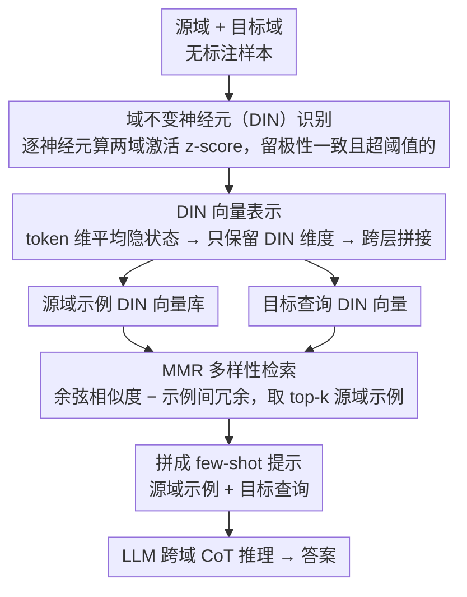

# Towards Effective In-context Cross-domain Knowledge Transfer via Domain-invariant-neurons-based Retrieval

**会议**: ACL 2026 Findings  
**arXiv**: [2604.05383](https://arxiv.org/abs/2604.05383)  
**代码**: [GitHub](https://github.com/Leon221220/DIN-Retrieval)  
**领域**: LLM推理  
**关键词**: 跨域知识迁移, 域不变神经元, 上下文学习检索, 推理结构对齐, 数学逻辑推理

## 一句话总结

本文提出 DIN-Retrieval，通过识别 LLM 中跨域激活极性一致的域不变神经元（DIN），构建域鲁棒的表示子空间用于检索结构兼容的跨域示例，首次证明了使用跨域 ICL 示例提升 LLM 推理性能的可行性，在数学-逻辑推理迁移上平均提升 1.8%。

## 研究背景与动机

**领域现状**：上下文学习（ICL）让 LLM 无需参数更新即可适应新任务。但现有 ICL 研究预设可获取同域专家标注示例，在专业知识稀缺的领域（如特化数学推理、形式逻辑、法律分析）中适用性受限。

**现有痛点**：(1) 零样本 LLM 在推理时容易出现三类失败——缺失中间链接、分支整合不完整、忽略阻塞条件；(2) 虽然不同域的推理任务表面语义差异大，但共享许多可复用的隐式逻辑结构（如链式推理、条件分支）；(3) 手动选择结构对齐的跨域示例不现实，推理结构在任务间差异巨大。

**核心矛盾**：跨域示例可以恢复正确的推理拓扑结构（已有工作证明），但缺乏自动检索结构兼容示例的机制。

**本文目标**：开发一种自动化检索方法，能够从其他域中找到与目标查询结构兼容的 ICL 示例。

**切入角度**：利用域适应理论中的域不变特征思想——在 LLM 的隐藏层中识别跨域激活极性一致的神经元，这些神经元编码了域无关的推理结构信息。

**核心 idea**：在 LLM 内部发现域不变神经元（DIN），用其激活构建域鲁棒的检索表示，通过余弦相似度检索结构对齐的跨域示例。

## 方法详解

### 整体框架

DIN-Retrieval 想解决的是：当目标域没有专家标注示例时，能不能从别的域借推理示例来帮 LLM 做对题。它的整条链路是「先在模型内部找到跨域共享的推理神经元，再用这些神经元的激活当检索指纹，从源域里捞回结构最像的几个示例，最后拼成 few-shot 提示让 LLM 照着推」。落到步骤上：先用源域、目标域的无标注样本算出每个神经元的激活 z-score，挑出两域里极性一致的「域不变神经元」（DIN）；再把这些 DIN 的激活跨层拼成一个紧凑的 DIN 向量；然后在 DIN 向量空间里用余弦相似度加 MMR 检索 top-k 源域示例；最后把检索到的源域示例当作 few-shot 示范，接上目标查询做跨域 CoT 推理。

### 关键设计

**1. 域不变神经元（DIN）识别：在模型内部找出对"换域"不敏感的那批神经元**

跨域示例之所以可能有用，是因为不同任务表面语义差很远、底层却共享链式推理、条件分支这类逻辑骨架；难点在于怎么自动定位编码这套骨架的地方。DIN-Retrieval 的做法是对每层每个神经元 $k$ 分别在源域、目标域样本上算激活 z-score $z_k^S$ 和 $z_k^T$，只保留两域极性一致且都超过阈值的神经元：$\mathcal{I} = \{k \mid z_k^S > \tau \wedge z_k^T > \tau\} \cup \{k \mid z_k^S < -\tau \wedge z_k^T < -\tau\}$；若入选数量超过预算 $K$，再按 $|z_k^S| + |z_k^T|$ 取 top-K。直觉是：一个神经元如果在两个差异巨大的域里都被同向强烈激活，说明它响应的是跨域共享的抽象特征、而非某个域的表面词汇。剪枝实验也佐证了这点——移除 DIN 带来的困惑度增幅远大于随机剪掉同样多的神经元，说明它们确实承担着推理相关的功能。

**2. DIN 向量表示：只留 DIN 维度，把检索指纹从"语义"收窄到"结构"**

如果直接拿完整隐状态做跨域相似度，里面大量域特异信息（话题词、领域术语）会盖过推理结构信号，检索回来的往往是"话题像"而非"推理结构像"的示例。所以这里对输入 $x$ 的每层隐状态先做 token 维度平均得到 $\bar{h}^{(l)}(x)$，再只保留该层的 DIN 维度并跨层拼接成一个紧凑向量：$\mathbf{v}_{\text{DIN}}(x) = \bigoplus_{l \in \mathcal{L}} h^{(l)}(x)_{\mathcal{I}^{(l)}}$。经过这层过滤，向量编码的主要是"这道题怎么推"，而不是"这道题在讲什么"，跨域检索才对得上结构。

**3. MMR 多样性检索：既要结构贴近查询，又不让几个示例彼此雷同**

只按与查询的相似度取 top-k，容易捞回几个推理模式几乎一样的示例，给 LLM 的结构线索反而单一。检索打分因此用 MMR 在"贴近查询"和"示例间互不重复"之间做权衡：$\text{Score}(i) = \lambda \cdot \cos(\mathbf{v}_q, \mathbf{v}_i) - (1-\lambda) \cdot \max_{j \in \mathcal{S}} \cos(\mathbf{v}_i, \mathbf{v}_j)$，默认检索 $k=2$ 个源域示例。这样选出的示例既都和目标查询结构兼容，又覆盖了不同的推理模式，能给 LLM 更全面的结构提示。

### 损失函数 / 训练策略

DIN-Retrieval 不需要训练。DIN 识别基于激活统计量，检索基于余弦相似度。使用 LLaMA-3.1-8B、Gemma-3-12B/27B、Qwen2.5/3-7B~32B 等模型评估。

## 实验关键数据

### 主实验

**跨域推理准确率（四个迁移方向平均）**

| 方法 | Qwen2.5-7B | Qwen3-8B | Gemma-3-27B |
|------|-----------|---------|------------|
| Zero-shot | 84.6 | 91.8 | 88.75 |
| X-ICL（嵌入检索） | 83.4 | 91.2 | — |
| **DIN-Retrieval** | **86.8** | **93.1** | **90.3** |

### 消融实验

**DIN vs 随机神经元选择（GSM8K→FOLIO）**

| 模型 | DIN Acc. | Random Acc. | 差异 |
|------|----------|-------------|------|
| LLaMA-3.1-8B | 62.7 | 60.3 | +2.4 |
| Qwen2.5-7B | 62.8 | 59.5 | +3.3 |
| Qwen3-8B | 85.5 | 84.0 | +1.5 |

### 关键发现

- DIN-Retrieval 在所有模型和所有迁移方向上一致优于 zero-shot 和基于嵌入的跨域 ICL
- DIN 剪枝导致的困惑度增加远大于随机剪枝，验证了 DIN 的功能重要性
- 首次系统证明跨域 ICL 示例可以提升 LLM 推理性能——打破了 ICL 必须用同域示例的假设
- GSM8K→FOLIO（数学→逻辑）和 FOLIO→GSM8K（逻辑→数学）双向迁移都有效
- 改进幅度虽不大（平均 1.8%），但在统计上显著且一致

## 亮点与洞察

- "不同域共享推理结构"的洞察有深远意义——推理能力不是域特异的，而是可跨域复用的
- DIN 的发现为理解 LLM 内部的推理表示提供了新视角——存在编码域无关推理模式的专用神经元
- 方法设计优雅且轻量——不需要训练，仅基于激活统计量和余弦相似度

## 局限与展望

- 平均 1.8% 的提升幅度有限，部分模型在强 zero-shot 基线上提升空间已小
- 仅在数学-逻辑推理的互相迁移上验证，未扩展到更多域（如法律→医疗）
- DIN 识别需要源域和目标域的无标注样本来计算 z-score，不是完全零资源的
- 阈值 $\tau$ 和神经元比例 $k_{\text{ratio}}$ 的选择缺乏自适应机制

## 相关工作与启发

- **vs X-ICL (嵌入检索)**: 使用全隐状态嵌入检索，包含域特异噪声；DIN 过滤后聚焦结构信息
- **vs 同域 ICL**: 同域示例在可获取时通常更优，但本文证明在域内标注不可用时跨域也有效
- **vs 域适应（DANN等）**: 经典域适应需要训练，DIN-Retrieval 完全无训练——将域不变特征思想从训练迁移到推理检索

## 评分

- 新颖性: ⭐⭐⭐⭐ 首次系统研究跨域 ICL，DIN 的发现有理论意义
- 实验充分度: ⭐⭐⭐⭐ 多模型 × 多迁移方向 + DIN 存在性验证 + 统计显著性检验
- 写作质量: ⭐⭐⭐⭐ 从失败模式分析到方法设计的动机链清晰
- 价值: ⭐⭐⭐⭐ 为专家知识稀缺领域的 ICL 提供了新思路

<!-- RELATED:START -->

## 相关论文

- [\[AAAI 2026\] L2V-CoT: Cross-Modal Transfer of Chain-of-Thought Reasoning via Latent Intervention](../../AAAI2026/llm_reasoning/l2v-cot_cross-modal_transfer_of_chain-of-thought_reasoning_v.md)
- [\[AAAI 2026\] SERL: Self-Examining Reinforcement Learning on Open-Domain](../../AAAI2026/llm_reasoning/serl_self-examining_reinforcement_learning_on_open-domain.md)
- [\[NeurIPS 2025\] DreamPRM: Domain-Reweighted Process Reward Model for Multimodal Reasoning](../../NeurIPS2025/llm_reasoning/dreamprm_domain-reweighted_process_reward_model_for_multimodal_reasoning.md)
- [\[CVPR 2025\] Style Evolving along Chain-of-Thought for Unknown-Domain Object Detection](../../CVPR2025/llm_reasoning/style_evolving_along_chain-of-thought_for_unknown-domain_object_detection.md)
- [\[AAAI 2026\] RPM-MCTS: Knowledge-Retrieval as Process Reward Model with Monte Carlo Tree Search for Code Generation](../../AAAI2026/llm_reasoning/rpm-mcts_knowledge-retrieval_as_process_reward_model_with_monte_carlo_tree_searc.md)

<!-- RELATED:END -->
