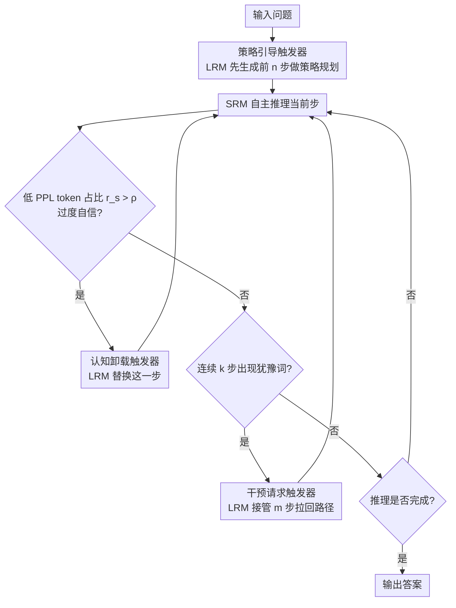

# TrigReason: Trigger-Based Collaboration between Small and Large Reasoning Models

**会议**: ACL 2026 Findings  
**arXiv**: [2604.14847](https://arxiv.org/abs/2604.14847)  
**代码**: [https://github.com/QQQ-yi/TrigReason](https://github.com/QQQ-yi/TrigReason)  
**领域**: LLM推理  
**关键词**: 推理加速, 大小模型协作, 推测推理, 事件触发, 推理模型

## 一句话总结

TrigReason 提出基于事件触发的大小推理模型协作框架，通过分析小模型三类推理风险（路径偏离、认知过载、恢复失能），设计策略引导、认知卸载和干预请求三种触发器替代逐步轮询验证，在保持 LRM 精度的同时将 1.70-4.79 倍更多推理步骤卸载给小模型，延迟降低 43.9%、API 成本降低 73.3%。

## 研究背景与动机

**领域现状**：大型推理模型（LRM）如 DeepSeek-R1、QwQ 通过扩展思维链实现了强大的复杂推理能力，但自回归生成数千 thinking tokens 导致严重推理延迟。近期 SpecReason 提出用小推理模型（SRM）生成推理步骤、LRM 逐步验证的推测推理范式。

**现有痛点**：SpecReason 存在两个关键问题：(1) LRM-as-Judge 不可靠——实验显示四个不同 LRM 对同一推理轨迹评分从 1.87 到 8.93 差异巨大，LRM 甚至拒绝了自己生成的 63.7% 的推理步骤；(2) 逐步轮询效率低——无论步骤难度如何都调用 LRM 验证，在边缘-云协作场景下延迟反而比纯 LRM 增加 22.44%，API 成本增加 42.31%。

**核心矛盾**：现有方法对"SRM 何时失败、为何失败"缺乏系统理解，只能用频繁盲目验证来保证质量，导致最终输出大部分由 LRM 修正生成，推测推理名不副实。

**本文目标**：系统刻画 SRM 推理能力边界，设计"按需介入"而非"逐步验证"的协作策略。

**切入角度**：作者通过对比 SRM 和 LRM 推理轨迹，识别出三类系统性风险模式。关键发现是 SRM 失败前往往伴随异常低的 token perplexity（过度自信），可作为认知过载的预警信号。

**核心 idea**：将 LRM 干预从连续轮询改为事件触发——仅在开头策略规划、检测到异常过度自信、以及推理陷入停滞循环时才调用 LRM，让 SRM 自主推理绝大部分步骤。

## 方法详解

### 整体框架

TrigReason 要解决的痛点是：现有推测推理（SpecReason）让小推理模型（SRM）生成、大推理模型（LRM）逐步验证，但 LRM 当裁判既不可靠又贵，最后大部分步骤还是被 LRM 重做，加速名不副实。它换了个思路——把 LRM 的介入从"每步都验"改成"按事件触发"：默认让 SRM 自主推完绝大多数步骤，只在三个时刻请 LRM 出手。一是开局让 LRM 先生成前 $n$ 步做策略规划再交棒给 SRM；二是 SRM 推理途中检测到"过度自信"这种认知过载信号时，LRM 替换掉当前这一步；三是 SRM 连续冒出犹豫词、陷入打转时，LRM 接管 $m$ 步把路径拉回来。全程 LRM 不对每一步做对错评判。

### 关键设计

**1. 策略引导触发器（Strategic Priming Trigger）：开局先让 LRM 定方向，避免 SRM 一上来就走偏**

SRM 的第一类风险是"路径偏离"——它缺乏战略前瞻，拿到题往往直接跳进计算，或套用熟悉但不适用的解法，开头一步错满盘皆输。TrigReason 让 LRM 先生成前 $n$ 步推理（默认 $n=20$）完成问题分解和策略规划，再把控制权交给 SRM 续推：$y_{1:n} \sim p_L(y_{1:n}\mid x)$，其后 $y_t \sim p_S(y_t \mid y_{<t}, x)$（$t > n$）。这一步看似只是"开个头"，实则最关键——消融里把它去掉（$n=0$）准确率直接暴跌 25.4%，说明对 SRM 来说"方向"比"算力"更稀缺。

**2. 认知卸载触发器（Cognitive Offload Trigger）：用 SRM 自己的过度自信当报警器，在它顶不住的步骤换 LRM**

第二类风险是"认知过载"——SRM 在超出能力的关键步骤会失败，难点是怎么不靠 LRM 评判就提前发现。作者的关键观察是：SRM 出错前往往伴随异常低的 token perplexity，即"过度自信"。于是监控每个推理步里 PPL 低于阈值 $\tau=1.05$ 的 token 占比 $r_s$，当 $r_s > \rho$ 就判定认知过载、触发 LRM 替换这一步。统计上 94.6% 的 SRM 错误步骤都伴随这种过度自信，而全体步骤里只有 38.1% 表现过度自信，信号区分度足够。妙处在于这个报警信号直接取自 SRM 内部状态，无需任何外部裁判，从根上绕开了"LRM 评分不可靠"的问题。

**3. 干预请求触发器（Intervention Request Trigger）：SRM 自己打转时举手求助，LRM 只修一步就放手**

第三类风险是"恢复失能"——SRM 缺乏自我反思和纠错能力，一旦推理卡住就反复兜圈出不来，但它会隐式地冒出犹豫信号。TrigReason 维护一个犹豫词集合 $\mathcal{H}$（如 "wait"、"hmm"、"alternatively"），当连续 $k$ 个步骤都出现犹豫词时，触发 LRM 接管 $m$ 步（默认 $m=1$）做路径修正。消融显示通常 1 步 LRM 修正就足以把推理重新对齐，说明 LRM 的价值是"指个方向"而非"全程陪跑"。

### 一个完整示例：一道难题怎么在大小模型间流转

设默认配置 SRM=R1-1.5B、LRM=QwQ-32B、$n=20$、$\tau=1.05$、$m=1$，一道 AIME 数学题的处理流程大致是：

1. **开局（策略引导）**：题目进来，LRM 先写前 20 步——读懂题意、判断该用哪条解题路线、定下整体策略，然后把笔交给 SRM。
2. **SRM 自主推理**：第 21 步起 SRM 接手，顺着 LRM 定好的方向逐步代入、化简，大段常规计算它都能稳稳完成，LRM 全程旁观不介入。
3. **触发认知卸载**：推到某个非平凡的关键步骤时，SRM 这一步里超过 $\rho$ 比例的 token 都 PPL < 1.05（机械地"自信"补全），$r_s > \rho$ 报警——LRM 替换掉这一步给出正确结果，再把笔交回 SRM。
4. **触发干预请求**：临近收尾，SRM 连着几步冒出 "wait... hmm... alternatively"，连续犹豫达到 $k$ 步、陷入兜圈——LRM 接管 1 步把路径拉回正轨，SRM 随即对齐、推完最后几步。
5. **结果**：整道题 LRM 只动了开头 20 步 + 中途 1 步替换 + 收尾 1 步修正，其余六成以上步骤由便宜的 SRM 完成——既保住了 LRM 级别的精度，又把大部分 token 卸载下去。

### 损失函数 / 训练策略

TrigReason 完全免训练，是纯推理时的协作策略。使用 SGLang 推理引擎，温度 0.6，top-p 0.95，默认 token 预算 8192。评估使用 pass@1 with k=16。

## 实验关键数据

### 主实验

| 配置 | AIME24 精度 | AIME25 精度 | GPQA-D 精度 | SRM Token 比例 |
|------|------------|------------|------------|---------------|
| LRM only (QwQ-32B) | 基准 | 基准 | 基准 | 0% |
| SRM only (R1-1.5B) | 显著低 | 显著低 | 显著低 | 100% |
| SpecReason | ≈LRM | ≈LRM | ≈LRM | ~35.6% |
| **TrigReason** | **105.8% LRM** | **104.7% LRM** | **99.6% LRM** | **~61.4%** |

### 消融实验

| 配置 | AIME24 精度影响 | 说明 |
|------|----------------|------|
| 去掉策略引导 (n=0) | -25.4% | 最关键模块，初始规划不可或缺 |
| 去掉认知卸载 (ρ=1) | 显著下降 | 防止错误累积 |
| 增加修正步数 (m=1→3) | 边际提升 | 1 步修正已足够 |
| 增加引导步数 (n>30) | 收益递减 | 过多引导浪费 LRM 资源 |

### 关键发现

- TrigReason 在部分配置下甚至超过纯 LRM 性能（如 Qwen3-0.6B + Qwen3-30B 在 AIME24 达 LRM 的 119.3%）
- SRM token 使用比例从 SpecReason 的 ~35% 提升到 ~61%，效率提升 1.70-4.79 倍
- 边缘-云部署下延迟降低 43.9%、API 成本降低 73.3%
- 在 BBH（逻辑推理）和 ARC（常识推理）上同样有效，证明触发器捕捉的是通用推理困难信号
- 认知过载阈值 $\rho$ 是模型相关的：DeepSeek-R1-1.5B 最优 0.85，Qwen3-0.6B 最优 0.75

## 亮点与洞察

- "过度自信作为认知过载信号"这个发现非常深刻——94.6% 的 SRM 错误步骤都伴随异常低 perplexity。这将主观的 LRM 评判替换为客观的统计信号，从根本上解决了验证不可靠的问题
- 事件触发替代连续轮询的范式转变值得推广：不是问"这步对不对"，而是问"什么时候可能出错"。这个思路适用于所有大小模型协作场景
- 仅 1 步 LRM 修正即可恢复推理路径的发现说明 LRM 的价值在于"方向指引"而非"全程参与"

## 局限与展望

- 触发器设计基于启发式规则，过度自信与实际推理错误的因果关系尚不完全清楚
- 与推测解码类似，需要额外内存运行小模型，在内存受限环境可能受限
- 在高 token 预算（32K）下与纯 LRM 的差距略有扩大，超长推理场景有待优化
- 犹豫词集合 $\mathcal{H}$ 的定义依赖经验，跨语言泛化需验证

## 相关工作与启发

- **vs SpecReason**: SpecReason 每步都需 LRM 验证，且验证本身不可靠（拒绝率高达 80%）。TrigReason 通过精准触发将 LRM 调用减少到关键时刻，SRM 贡献从 35% 提升到 61%
- **vs 推理长度压缩方法**: 长度惩罚 RL 等方法直接压缩 token 预算，可能跳过关键步骤。TrigReason 保持完整推理但用便宜的 SRM 执行大部分步骤，不牺牲推理质量

## 评分

- 新颖性: ⭐⭐⭐⭐⭐ 系统刻画 SRM 推理风险并设计针对性触发器，"过度自信=认知过载"的发现极具洞察力
- 实验充分度: ⭐⭐⭐⭐⭐ 4 种模型组合、3 个数学基准 + 2 个额外领域、详尽消融、边缘-云部署验证
- 写作质量: ⭐⭐⭐⭐⭐ motivation 论证严密，从问题分析到解决方案逻辑流畅
- 价值: ⭐⭐⭐⭐⭐ 为大小推理模型协作建立了新范式，实用价值极高

<!-- RELATED:START -->

## 相关论文

- [\[ACL 2026\] Chain-of-Thought as a Lens: Evaluating Structured Reasoning Alignment between Human Preferences and Large Language Models](chain-of-thought_as_a_lens_evaluating_structured_reasoning_alignment_between_hum.md)
- [\[ACL 2026\] Revisiting Entropy in Reinforcement Learning for Large Reasoning Models](revisiting_entropy_in_reinforcement_learning_for_large_reasoning_models.md)
- [\[ACL 2026\] Large Reasoning Models Are (Not Yet) Multilingual Latent Reasoners](large_reasoning_models_are_not_yet_multilingual_latent_reasoners.md)
- [\[ACL 2026\] LegalDrill: Diagnosis-Driven Synthesis for Legal Reasoning in Small Language Models](legaldrill_diagnosis-driven_synthesis_for_legal_reasoning_in_small_language_mode.md)
- [\[AAAI 2026\] Small Language Models for Efficient Agentic Tool Calling: Outperforming Large Models with Targeted Fine-tuning](../../AAAI2026/llm_reasoning/small_language_models_for_efficient_agentic_tool_calling_outperforming_large_mod.md)

<!-- RELATED:END -->
