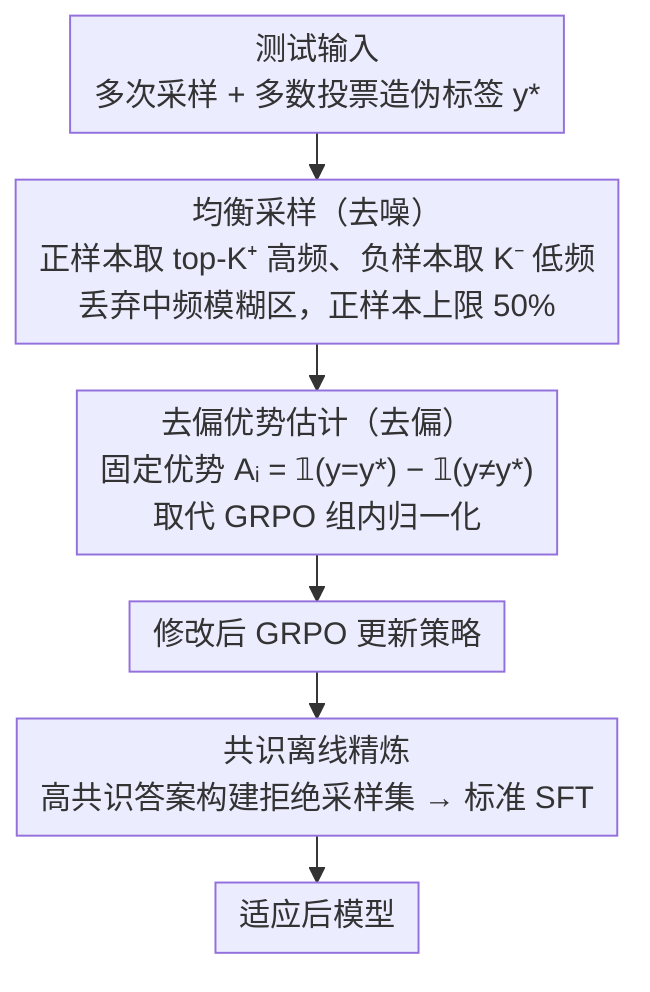

# Understanding and Mitigating Spurious Signal Amplification in Test-Time Reinforcement Learning for Math Reasoning

**会议**: ACL 2026 Findings  
**arXiv**: [2604.21327](https://arxiv.org/abs/2604.21327)  
**代码**: [https://github.com/yuyongcan/DDRL](https://github.com/yuyongcan/DDRL)  
**领域**: 图像复原  
**关键词**: 测试时强化学习, 伪标签噪声, GRPO偏差, 去噪去偏, 数学推理

## 一句话总结

系统分析测试时强化学习（TTRL）中虚假信号的来源和放大机制——中频答案构成模糊区域是主要噪声源，GRPO 的组内归一化会放大这些虚假信号——提出 DDRL 框架通过均衡采样、固定优势值和共识离线精炼三管齐下缓解问题，在 Qwen2.5-Math-1.5B 上相对提升15.3%。

## 研究背景与动机

**领域现状**：TTRL 在测试时通过多次采样和多数投票构建伪标签，用 GRPO 进行无监督 RL 来适应分布偏移。但其在完全无监督的条件下运行，奖励信号完全来自模型自身输出。

**现有痛点**：TTRL 容易受虚假奖励信号影响——错误回答可能被错误奖励，正确回答可能被惩罚。但虚假信号的具体来源和传播机制尚未被系统分析。

**核心矛盾**：（1）来源层面——答案频率和可靠性的关系非线性：高频答案大多正确，低频答案大多错误，中频答案高度模糊（正确率剧烈波动），但标准 TTRL 对所有采样回滚同等对待；（2）放大层面——GRPO 的组内归一化在正样本稀少时赋予极大优势值。在监督 RL 中这是合理的（稀有正样本代表有价值的信号），但在 TTRL 中，少量正样本意味着低共识/高不确定性，GRPO 恰恰对最不可靠的样本赋予最大权重。

**本文目标**：系统理解 TTRL 中虚假信号的来源和放大机制，并设计有效的缓解策略。

**切入角度**：从答案采样频率角度分析伪标签可靠性，从 GRPO 优势估计的数学性质分析信号放大。

**核心 idea**：（1）均衡置信度采样——排除中频模糊样本，保持正负样本平衡；（2）去偏优势估计——用固定优势值 $A_i = \mathbb{I}(y=y^*) - \mathbb{I}(y \neq y^*)$ 替代组内归一化，消除放大效应；（3）共识离线精炼——RL 阶段后用拒绝采样数据集进行高效稳定的后续优化。

## 方法详解

### 整体框架

DDRL 针对的是 TTRL（测试时强化学习）的一个老毛病：它靠多次采样 + 多数投票造伪标签，再用 GRPO 做无监督 RL，但伪标签里混着大量虚假信号，GRPO 还会把这些噪声放大。这篇先把"虚假信号从哪来、怎么被放大"诊断清楚，再对症下三味药：先按答案频率挑出可靠的正负样本、把模糊的中频区域整段丢掉（去噪）；再把 GRPO 的组内归一化换成固定的 ±1 优势值（去偏）；最后用高共识样本做一轮离线 SFT 精炼收尾。

### 关键设计

**1. 虚假信号来源分析与均衡采样：把最不可靠的中频答案整段剔除**

虚假信号的第一个来源在数据侧：答案频率和正确率不是线性关系——高频答案几乎都对（可靠正样本）、低频答案几乎都错（可靠负样本），唯独中频答案正确率剧烈波动，是噪声的主要产地，可标准 TTRL 对所有采样回滚一视同仁。均衡采样因此只取两头、丢掉中间：正样本选 top-$K^+$ 个频率最高且匹配伪标签的样本（上限 $\lfloor K/2 \rfloor$），负样本选 $K^-$ 个频率最低的样本，中频模糊区直接弃用。$50\%$ 的正样本上限则是为了防止正样本主导、保持正负平衡。

**2. 去偏优势估计：用固定 ±1 优势替掉 GRPO 的组内归一化，斩断放大链路**

虚假信号的第二个来源在算法侧：GRPO 的组内归一化在正样本稀少时会赋予极大优势值。这在监督 RL 里合理（稀有正样本=有价值信号），但在 TTRL 里"稀有正样本=低共识=高不确定性"，归一化恰恰把最大权重压在了最不可靠的样本上，形成"正样本越少→优势越大→越放大噪声"的恶性循环。DDRL 干脆把优势值固定为 $A_i = \mathbb{I}(y=y^*) - \mathbb{I}(y \neq y^*)$，即正样本 $+1$、负样本 $-1$，不再做组内归一化。效果立竿见影——表 1 的初步实验里，仅去掉归一化就把 AIME2024 从 $15.8\%$ 拉到 $20.6\%$。

**3. 共识离线精炼：RL 之后再用干净数据做一轮 SFT 收尾**

即便去了噪、去了偏，无监督 RL 本身仍带一定波动。DDRL 在 RL 阶段后，用多次采样里高度一致的答案构建一个拒绝采样数据集，对模型再做一轮标准 SFT 精炼。这一步等于拿"全场最有共识"的干净监督信号，把 RL 训练可能引入的抖动抚平，作为整个流程的稳定性兜底。

### 损失函数 / 训练策略

RL 阶段使用修改后的 GRPO（固定优势值 + 均衡采样），精炼阶段使用标准 SFT 损失。在 Qwen2.5-Math-1.5B/3B 和 LLaMA-3.1-8B-Instruct 上评估，基准包括 MATH-500、AIME2024 等。

## 实验关键数据

### 主实验

| 模型/方法 | AIME2024 | MATH-500 | 相对提升 |
|----------|---------|---------|---------|
| Qwen2.5-Math-1.5B + TTRL | 15.8 | 73.0 | - |
| Qwen2.5-Math-1.5B + DDRL | **18.2** | **84.2** | **+15.3%** |
| LLaMA-3.1-8B + TTRL | - | - | - |
| LLaMA-3.1-8B + DDRL | - | - | **+12.7%** |

### 消融实验

| 配置 | AIME2024 | MATH | 说明 |
|------|---------|------|------|
| GRPO (标准归一化) | 15.8 | 73.0 | 放大虚假信号 |
| GRPO (无归一化) | 20.6 | 75.0 | 仅去偏就有提升 |
| + 均衡采样 | 进一步提升 | 进一步提升 | 去噪 |
| + 离线精炼 | 最优 | 最优 | 完整 DDRL |

### 关键发现

- 中频答案是虚假信号的主要来源——其正确率方差极大，作为伪标签不可靠
- GRPO 归一化在低共识场景中对虚假信号有系统性放大效应——仅去掉归一化就能显著提升
- DDRL 的三个组件各自贡献独立增益，可叠加
- 均衡采样中的50%正样本上限对稳定训练很重要
- 在三个不同规模的 LLM 上均有一致提升

## 亮点与洞察

- **"频率-可靠性"关系的分析透彻**：将答案频率分为高/中/低三区，清晰定位了虚假信号的来源（中频区域），为后续的采样策略提供了直接指导
- **GRPO 偏差的理论分析有深度**：揭示了"监督RL中的合理假设在无监督TTRL中被违反"的核心矛盾，这一洞察对所有使用 GRPO 的无监督方法都有指导意义
- **固定优势值的简洁性**：用最简单的 $+1/-1$ 固定优势替代复杂的组内归一化，效果反而更好，体现了"在噪声环境中简单更鲁棒"的原则

## 局限与展望

- 仅在数学推理任务上验证，其他推理任务（如代码、逻辑）未测试
- 频率阈值（区分高/中/低频）的设定可能需要针对不同任务调整
- 离线精炼阶段增加了额外的计算成本
- 当模型能力极弱（多数投票本身不可靠）时，DDRL 的效果可能有限

## 相关工作与启发

- **vs 标准 TTRL**: TTRL 对所有采样同等对待且使用标准 GRPO，导致虚假信号被放大。DDRL 从去噪（采样）和去偏（优势估计）两个维度解决问题
- **vs EMPO/STILL（无监督RL）**: 这些方法也尝试无监督 RL 但未分析虚假信号的机制。DDRL 提供了系统性的分析和针对性的解决方案

## 评分

- 新颖性: ⭐⭐⭐⭐ 虚假信号的系统分析有洞察力，但解决方案（固定优势+采样过滤）技术上不算复杂
- 实验充分度: ⭐⭐⭐⭐ 三个模型+多个基准+逐步消融，较充分
- 写作质量: ⭐⭐⭐⭐⭐ 问题分析（频率-可靠性+GRPO偏差）的逻辑链非常清晰

<!-- RELATED:START -->

## 相关论文

- [\[ICLR 2026\] Understanding the Role of Training Data in Test-Time Scaling](../../ICLR2026/llm_reasoning/understanding_the_role_of_training_data_in_test-time_scaling.md)
- [\[ACL 2026\] Revisiting Entropy in Reinforcement Learning for Large Reasoning Models](revisiting_entropy_in_reinforcement_learning_for_large_reasoning_models.md)
- [\[ACL 2026\] Efficient Test-Time Scaling via Temporal Reasoning Aggregation](efficient_test-time_scaling_via_temporal_reasoning_aggregation.md)
- [\[ACL 2026\] TemplateRL: Structured Template-Guided Reinforcement Learning for LLM Reasoning](templaterl_structured_template-guided_reinforcement_learning_for_llm_reasoning.md)
- [\[ACL 2026\] Parallel Test-Time Scaling for Latent Reasoning Models](parallel_test-time_scaling_for_latent_reasoning_models.md)

<!-- RELATED:END -->
