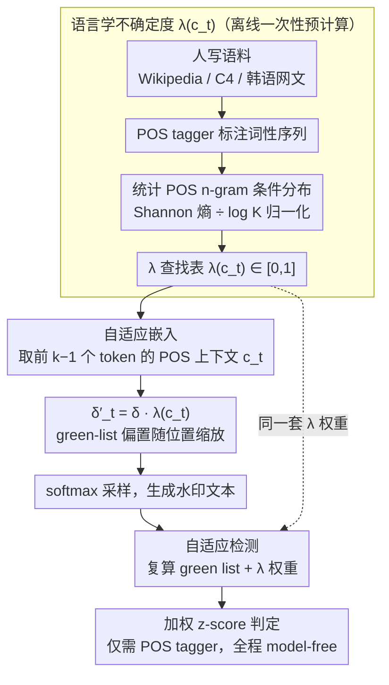

# STELA: A Linguistics-Aware LLM Watermarking via Syntactic Predictability

**会议**: ACL 2026  
**arXiv**: [2510.13829](https://arxiv.org/abs/2510.13829)  
**代码**: https://github.com/Shinwoo-Park/stela_watermark  
**领域**: LLM 安全 / Watermarking / 可公开验证检测  
**关键词**: 水印, POS n-gram, 语言不确定度, 可公开验证, 跨语言

## 一句话总结
STELA 用 POS n-gram 估计的「语言学不确定度」$\lambda(c_t)$ 作为水印强度调制信号，在语法约束高的位置弱化水印（保质量）、在语法自由位置增强水印（提检测力），与 KGW 一样仅靠 POS 分析器即可公开验证，无需访问模型 logits。

## 研究背景与动机
**领域现状**：LLM 水印的奠基方案 KGW 用 hash 把词表分 green/red list，对 green list logits 加偏置 $\delta$ 来嵌入统计信号，检测端只要复算 hash + z-test，无需模型内部，因此可公开验证。但 KGW 在「token 熵很低」的位置（如专有名词、必填虚词后），加偏置无法改变最可能 token，强行加只会生成奇怪词。

**现有痛点**：为解决低熵问题，SWEET（按 token entropy 阈值选位置）、EWD（按 token entropy 加权 z-score）应运而生，效果是好，但**都需要访问 LLM 的 logits 才能检测**，破坏了「可公开验证」这一 KGW 的核心优势。MorphMark 在嵌入端自适应但仍依赖输出概率，自由度依然受限。

**核心矛盾**：「自适应水印强度」(adaptive strength) 与「model-free 可公开检测」长期是 trade-off：要前者就要 token-level entropy，要后者就只能静态。

**本文目标**：找一个「model-independent 且能调制水印强度」的信号，让插入和检测都自适应、且都不依赖 LLM 内部。

**切入角度**：作者把 token-level entropy 拆成两种成因——「语义固定（如专有名词）」和「语法必填（如韩语助词）」。后者由语言的句法结构决定，不依赖具体模型；前者才与模型相关。把「语法可预测性」用 POS n-gram 条件熵建模出来，就得到一个真正 model-free 的不确定度信号。

**核心 idea**：用「POS n-gram 条件熵 + 语言指定的 $K$ 归一化」算出一个 $\lambda(c_t) \in [0, 1]$ 作为水印调制因子，嵌入端 $\delta'_t = \delta \cdot \lambda(c_t)$，检测端 z-score 也用 $\lambda$ 加权，整个流程只需 POS tagger。

## 方法详解

### 整体框架
离线一次性预计算：在大型人写语料（Wikipedia / OpenWebText2 / C4 / KOREAN-WEBTEXT）上跑 POS tagger，统计每个长度 $k-1$ 的 POS 上下文 $c_t$ 后接各 POS tag 的条件概率分布 $P(\pi_t \mid c_t)$，得到 $\lambda$ 查找表。

在线生成：每步 $t$ 提取前 $k-1$ 个 token 的 POS 上下文 $c_t$，查表得 $\lambda(c_t)$，把 KGW 的固定偏置 $\delta$ 改成 $\delta'_t = \delta \cdot \lambda(c_t)$，再 softmax 采样。

在线检测：复算每个位置的 green list 与 $\lambda$ 权重，用加权 z-score 判定。整个 pipeline 只需 POS tagger + hash 函数，detector 完全 model-free。

### 关键设计

**1. 语言学不确定度 $\lambda(c_t)$（Linguistic Indeterminacy）：把"调制信号"从模型空间搬到语言空间**

过去的自适应水印都假设 token entropy 是唯一能衡量"该位置该不该加水印"的信号，可 entropy 必须读模型 logits，一旦检测端也要算它，就丢了 KGW 公开验证的核心优势。作者的破局点是：token 的低熵其实有两种成因，一种是语义被定死（如专有名词），另一种是语法必填（如韩语助词），而后者完全由语言的句法结构决定、与具体模型无关。只要把"语法可预测性"单独建模出来，就得到一个真正 model-free 的不确定度信号。

具体做法是对长度 $k-1$ 的 POS 上下文 $c_t$，统计下一个 POS tag 的条件分布并算其 Shannon 熵 $H(P(\pi_t \mid c_t)) = -\sum_{\pi'} P(\pi' \mid c_t) \log P(\pi' \mid c_t)$，再用该上下文后实际出现的不同 tag 数 $K_{c_t}$ 归一化：

$$\lambda(c_t) = \frac{H(P(\pi_t \mid c_t))}{\log K_{c_t}} \in [0, 1]$$

$\lambda \to 1$ 表示"下一个 POS 几乎任意"（语法很自由），$\lambda \to 0$ 表示"下一个 POS 被语法定死"。上下文窗口 $k$ 按语言类型学取值，英文 $k=2$、中文/韩文 $k=4$。归一化保证不同语言、不同上下文之间的 $\lambda$ 可比，这一步彻底切断了"自适应 → 必须读 logits"的耦合。

**2. 自适应嵌入 $\delta'_t = \delta \cdot \lambda(c_t)$（Adaptive Insertion）：让水印"随波逐流"地嵌进文本**

有了 model-free 的 $\lambda$，生成端就把 KGW 的固定 green-list 偏置 $\delta$ 改成随位置缩放的 $\delta'_t = \delta \cdot \lambda(c_t)$，作用在 logits 上即 $l'_{t, i} = l_{t, i} + \delta'_t \cdot \mathbb{I}[i \in \mathcal{V}_G]$，再 softmax 采样。语法约束高的位置（如韩语主格助词必须出现处）$\lambda \approx 0$，水印几乎不干扰，避免硬加偏置逼出奇怪词、损害质量；语法自由的位置 $\lambda \approx 1$，水印按全强度嵌入以攒足检测信号。

这种"在语言本身允许选择的地方做手脚、在不允许的地方让步"的策略，恰好顺应了人写文本的统计性质，因而 perplexity 几乎不变——水印强度高了，质量却没掉。

**3. 自适应检测（Adaptive Detection）：把同一套 $\lambda$ 权重搬到检测端的加权 z-score**

如果只有插入端自适应、检测端仍按 KGW 那样均匀统计 green token，两端就对不齐，检测信号会被低 indeterminacy 位置的噪声稀释。STELA 让检测端复用同样的权重 $w_t = \lambda(c_t)$：高自由度位置的 green token 贡献更大、低自由度位置贡献更小。加权统计量 $W_G = \sum_t w_t \cdot \mathbb{I}(x_t \in \mathcal{V}_{G, t})$，在零假设 $H_0$ 下 $\mathbb{E}[W_G] = \gamma \sum_t w_t$、$\text{Var}(W_G) = \gamma(1-\gamma) \sum_t w_t^2$，于是 z-score 为

$$z' = \frac{W_G - \gamma \sum_t w_t}{\sqrt{\gamma(1-\gamma) \sum_t w_t^2}}$$

整个检测流程只用到 POS tagger + hash，全程不读 LLM logits，因此双端都自适应的同时还完整保住了 KGW 的公开验证属性。

### 损失函数 / 训练策略
STELA 是 training-free 方法，无 loss / 无梯度，仅需离线统计 + 在线插值。生成时温度固定 0.7，green list 比例 $\gamma = 0.5$，$\delta = 2.0 / \mathbb{E}[\lambda(c_t)]$（按语言校准，英文 0.575、中文 0.523、韩文 0.475），保证平均嵌入强度可与 KGW/EWD/SWEET 公平比较。

## 实验关键数据

### 主实验：三模型 × 三语言检测性能（TPR@5%FPR / Best F1）

| LLM | Method | English TPR / F1 | Chinese TPR / F1 | Korean TPR / F1 |
|-----|--------|------------------|------------------|-----------------|
| Llama-3.2 | KGW | 0.950 / 0.963 | 0.962 / 0.963 | 0.906 / 0.932 |
| Llama-3.2 | SWEET | 0.850 / 0.906 | 0.872 / 0.910 | 0.862 / 0.912 |
| Llama-3.2 | EWD | 0.870 / 0.916 | 0.850 / 0.902 | 0.896 / 0.928 |
| Llama-3.2 | MorphMark | 0.926 / 0.943 | 0.936 / 0.945 | 0.826 / 0.893 |
| Llama-3.2 | **STELA** | 0.938 / 0.953 | **0.976 / 0.972** | **0.950 / 0.954** |
| Qwen-3 | STELA | 0.978 / 0.966 | **0.996 / 0.994** | **0.950 / 0.950** |
| HyperCLOVA | STELA | **0.988 / 0.975** | **0.932 / 0.942** | **0.960 / 0.960** |

在 9 个 (model, language) 组合中 STELA 拿下平均最高 F1；HyperCLOVA 上 STELA 在三语言全部第一。

### 消融：POS 上下文长度 $k$ 与 tagset 粒度

| 语言 | 最优 $k$ | 通用 UD tagset TPR | 语种专用 tagset TPR | 增益 |
|------|---------|--------------------|---------------------|------|
| English | 2 | 0.948 / 0.972 / 0.984 (3 LLM) | 0.938 / 0.978 / 0.988 | 几乎持平 |
| Chinese | 4 | 0.976 / 0.998 / 0.930 | 0.976 / 0.996 / 0.932 | 几乎持平 |
| Korean | 4 | 0.928 / 0.932 / 0.950 | 0.950 / 0.950 / 0.960 | **+1–2 个点** |

对抗鲁棒（English Llama-3.2，Dipper 改写攻击）：基线 F1 0.953；L=10 0.862；L=20 0.869；L=40 0.813；L=50（重度改写）仍 **0.825**；同义词替换 50% 仍保持 F1 > 0.85。

### 关键发现
- 语法越复杂的语言 STELA 优势越大：中文、韩文比英文领先更明显（英文相对差距小），印证「STELA 的优势来自捕捉句法约束」。
- 韩文有显著的 fine-grained tagset 增益（+1.6 TPR），因为通用 UD 把所有助词归一类，而 STELA 需要更细的语法区分（主格 JKS / 宾格 JKO）来精确定位约束位置。
- 模型独立性强：在 Llama / Qwen / HyperCLOVA 三种不同架构、不同区域优化的 LLM 上排名一致，证明信号来自语言而非模型。
- 对结构改写（Dipper）异常鲁棒：即使 50% 重度改写 F1 仍 > 0.80，因为水印信号深嵌在句法结构中，单词替换/句子改写难以系统性消除。
- 词类贡献分布印证语言类型学：英文中实词/虚词各贡献 ~43% 的 z-score，中文实词 67%，韩文实词 74%——STELA 自动把水印放在语言「自由度高」的地方。

## 亮点与洞察
- **「model-specific 信号 → language-universal 信号」的概念跃迁**：之前所有 adaptive watermark 都假设 token entropy 是不可替代的不确定度衡量，本文换了一个完全不依赖模型的等价物（POS n-gram 熵），同时拿回了 KGW 的公开验证属性。这种「换信号源」的思路可借鉴到其他需要 model-free 的场景（如 detection of AI text、对齐 audit）。
- **跨语言类型学验证设计很值**：把分析型（英文）、孤立型（中文）、黏着型（韩文）三种典型类型都包进来，证明方法不是英文偏见的产物。后续做 NLP universal 工具的工作可以参考这种 typology-aware evaluation。
- **「水印附在句法结构上」自然抗改写**：句法约束是改写攻击难以扁平化的部分（Dipper 重写句子也得遵守语法），所以 STELA 在重攻击下仍稳——这给「robust watermark」开了一条不靠加密的物理直觉路线。
- **超参数 $k$ 与语言类型耦合是个干净的实验**：仅用 $k=2/4$ 一个超参就能解释三种语言性能差异，说明设计有原则而非穷举调参。

## 局限与展望
- 强依赖 POS tagger 准确性，低资源/无 POS 工具的语言可能直接不可用；尽管 UD tagset 提供 fallback，性能仍会下降。
- 文本质量评估只用 perplexity + 简单 LLM-as-judge A/B，没有覆盖语义连贯、风格自然等更细维度。
- $\lambda$ 从参考语料估计，与目标领域差异大时会失准（医学/法律等专业领域可能需要 domain-specific $\lambda$ 表）。
- 三种语言类型不够全面：缺融合型（俄语/拉丁语系深度屈折）和多聚合型（爱斯基摩语）；未覆盖低资源语言。
- 没有针对「攻击者已知 STELA」的对抗分析：如果攻击者也算 $\lambda$，针对低 indeterminacy 位置专门攻击 green token 是否能逃避？

## 相关工作与启发
- **vs KGW**: KGW 静态偏置；STELA 把偏置 $\delta$ 乘上 $\lambda(c_t)$ 做自适应，同样可公开验证但检测准确率显著更高。
- **vs SWEET / EWD（model-dependent adaptive）**: 它们用 token entropy 自适应但破坏 model-free 性；STELA 用 POS 熵自适应同时保留 model-free，是个 strict 改进。
- **vs MorphMark**: MorphMark 插入端自适应（用 green token 累积概率），检测端仍 uniform；STELA 双端都自适应，检测信号更密集。
- **vs Semantic-aware watermark（Guo et al. 2024）**: 后者用 LSH 把语义相似 token 聚类，强调改写鲁棒；STELA 用句法 invariance 达到类似鲁棒目标，但成本更低（只需 POS）。

## 评分
- 新颖性: ⭐⭐⭐⭐⭐ 「用 POS n-gram 熵替代 token entropy」是干净的概念置换，第一次把句法可预测性引入水印，思路有原创性。
- 实验充分度: ⭐⭐⭐⭐⭐ 三模型 × 三语言 × 多 baseline + 同义词/Dipper 攻击 + 词类贡献分析 + tagset 消融，覆盖非常全。
- 写作质量: ⭐⭐⭐⭐⭐ 推导清晰、对比公平（按 $\mathbb{E}[\lambda]$ 校准 $\delta$）、有 typology 视角和 word-class decomposition 等可解释性分析。
- 价值: ⭐⭐⭐⭐⭐ 在 EU AI Act 等合规背景下，「可公开验证 + 自适应强度」的水印有直接监管价值；代码开源，迁移成本低。

<!-- RELATED:START -->

## 相关论文

- [\[ACL 2026\] SSG: Logit-Balanced Vocabulary Partitioning for LLM Watermarking](ssg_logit-balanced_vocabulary_partitioning_for_llm_watermarking.md)
- [\[ACL 2026\] XMark: Reliable Multi-Bit Watermarking for LLM-Generated Texts](xmark_reliable_multi-bit_watermarking_for_llm-generated_texts.md)
- [\[ICML 2026\] Watermarking LLM Agent Trajectories (ACTHOOK)](../../ICML2026/llm_safety/watermarking_llm_agent_trajectories.md)
- [\[ACL 2026\] Privacy-R1: Privacy-Aware Multi-LLM Agent Collaboration via Reinforcement Learning](privacy-r1_privacy-aware_multi-llm_agent_collaboration_via_reinforcement_learnin.md)
- [\[ACL 2026\] Maximizing Local Entropy Where It Matters: Prefix-Aware Localized LLM Unlearning](maximizing_local_entropy_where_it_matters_prefix-aware_localized_llm_unlearning.md)

<!-- RELATED:END -->
