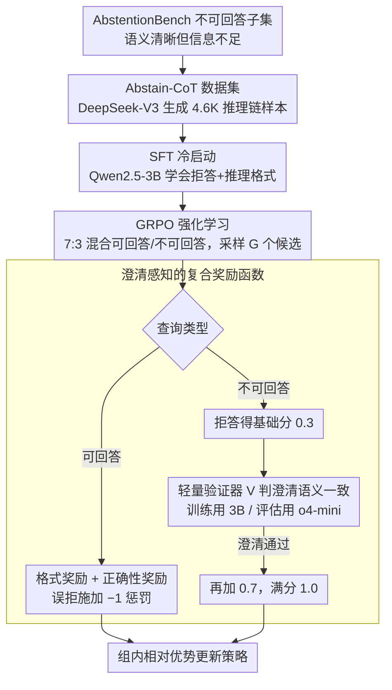

# Abstain-R1: Calibrated Abstention and Post-Refusal Clarification via Verifiable RL

**会议**: ACL 2026  
**arXiv**: [2604.17073](https://arxiv.org/abs/2604.17073)  
**代码**: 无  
**领域**: LLM评测  
**关键词**: 拒答校准、后拒答澄清、可验证奖励、GRPO、不可回答查询

## 一句话总结
Abstain-R1 提出一种**澄清感知的 RLVR 奖励**，在不可回答查询上联合优化"明确拒答"和"拒答后给出有用澄清（指出缺失信息）"，使 3B 模型在拒答和澄清质量上接近甚至超越 DeepSeek-R1 等大模型。

## 研究背景与动机

**领域现状**：RL 后训练（如 RLVR/GRPO）显著提升了 LLM 的推理能力，但现有训练目标默认所有查询都可回答，奖励"给出答案"本身，即使查询实际不可解。

**现有痛点**：当查询语义清晰但信息不足（如缺少变量定义、前提矛盾）时，模型倾向于猜测或"填补世界"来生成看似完整的答案，产生所谓的"幻觉税"（Hallucination Tax）。现有拒答方法要么训练模型产生通用拒绝（"I don't know"），要么鼓励追问但不验证追问是否准确指出了缺失的关键信息。

**核心矛盾**：单纯的拒答没有价值——用户需要知道**为什么无法回答、缺少什么信息**；但现有 RL 训练中没有可验证的信号来评估拒答后澄清的质量。

**本文目标**：让模型学会 (1) 在不可回答查询上明确拒答；(2) 拒答后给出**语义对齐的澄清**，准确指出缺失信息；(3) 同时保持可回答查询上的性能。

**切入角度**：将澄清质量纳入 RLVR 奖励设计，通过轻量验证器模型判断模型澄清是否与参考澄清语义一致。

**核心 idea**：在标准 GRPO 训练中混入不可回答样本，用"拒答格式奖励 + 澄清正确性奖励"的分层奖励函数联合优化拒答和澄清。

## 方法详解

### 整体框架
方法是一条三阶段训练流水线，从"教会格式"到"强化时机"层层递进：(1) 从 AbstentionBench 筛出"语义清晰但信息不足"的不可回答查询，用 DeepSeek-V3 生成带推理链与"拒答+澄清"标注的 Abstain-CoT 数据集；(2) 在 Qwen2.5-3B-Instruct 上做 SFT 冷启动，先把拒答与推理格式教会；(3) 用 GRPO 做强化学习，按 7:3 混合可回答与不可回答查询，对每个查询采样多个候选，再用一个**澄清感知的复合奖励函数**打分——其中不可回答分支会调用一个**轻量验证器**判断澄清是否准确指出了缺失信息，最后按组内相对优势更新策略。

### 关键设计

**1. Abstain-CoT 数据集与 SFT 冷启动：先用 SFT 把拒答+推理格式教会，RL 才学得动**

拒答+澄清是一种结构化输出，若直接上 RL，模型要在稀疏奖励下从零摸索这套格式，几乎不可能收敛。本文从 AbstentionBench 选出"语义清晰但不可回答"的子集，用 DeepSeek-V3 生成带 `<thinking>` 推理链的结构化样本共 4.6K 条，覆盖数学、生命科学、事实核查等多领域，先做 SFT 冷启动。后续消融也印证了这一步的分量——去掉 SFT 后澄清正确率从 55.1% 暴跌到 8.5%，说明澄清能力主要来自 SFT，RL 更多是在强化"何时该拒"。

**2. 澄清感知的复合奖励函数：给"拒答后还要说清缺什么"装上可学习的分层奖励**

只奖励"给出答案"会让模型在信息不足时也硬填世界、制造幻觉（即所谓幻觉税 Hallucination Tax）；而只奖励拒答又会让模型"万事皆拒"。本文按查询类型设计总奖励 $r(o,y)$：可回答查询用格式奖励 $r_{\text{fmt}}$ 加正确性奖励 $r_{\text{ans}}$；不可回答查询用格式奖励加拒答奖励 $r_{\text{ref}}$。关键在 $r_{\text{ref}}$ 的分层——模型输出 boxed "I don't know" 先得基础分 0.3，若给出的澄清还通过验证器 $\mathcal{V}$ 判定为与参考澄清语义一致，再加 0.7，满分 1.0；与此同时，对可回答查询若输出拒答则施加 $-1$ 惩罚。基础拒答分保证模型敢拒，澄清正确分逼它说清缺什么，可回答端的负惩罚则压住过度拒答，三者形成双向约束。

**3. 轻量验证器模型 $\mathcal{V}$：用 LLM 做语义级判分，并故意训练弱、评估强来防奖励作弊**

澄清正确与否没法靠字符串匹配判断——同一个"缺少变量定义"可以有无数种说法。本文把原始问题改写成元层面的"为什么不可回答"查询，让验证器比较模型澄清 $\hat{c}$ 与参考澄清 $c^\star$ 的语义一致性。一个容易被忽视的细节是训练和评估用不同强度的验证器：训练时用保守的 3B 验证器（xVerify-3B-Ia），故意留一点"判得没那么严"以减少模型钻奖励空子（reward hacking）；评估时换上更强的 o4-mini 做严格打分。这种"训练弱、评估强"的错配既让 RL 信号鲁棒，又避免模型对验证器过拟合。

### 损失函数 / 训练策略
RL 阶段用标准 GRPO 目标：每个查询采样 $G$ 个候选输出，按组内相对优势 $A_i$ 计算策略梯度，并加 KL 正则化防止偏离参考策略。可回答与不可回答查询按 7:3 比例混合训练。

## 实验关键数据

### 主实验

| 数据集 | 指标 | Abstain-R1 (3B) | Qwen2.5-3B | DeepSeek-R1 | 提升(vs base) |
|--------|------|------|----------|------|------|
| Abstain-Test | U-Ref (拒答率) | **68.1%** | 9.4% | 52.2% | +58.7% |
| Abstain-Test | U-Clar (澄清正确率) | **55.1%** | 0.6% | 46.5% | +54.5% |
| Abstain-Test | A-Acc (可回答准确率) | 57.2% | 48.8% | **78.6%** | +8.4% |
| SelfAware | U-Ref | **91.4%** | 82.3% | 63.8% | +9.1% |
| Abstain-QA | U-Ref | **40.1%** | 30.0% | 9.1% | +10.1% |

### 消融实验

| 配置 | A-Acc | U-Ref | U-Clar | 说明 |
|------|---------|------|------|------|
| Abstain-R1 | 57.2% | 68.1% | 55.1% | 完整模型 |
| w/o SFT | 53.3% | 65.1% | 8.5% | 无冷启动，澄清质量暴跌 |
| w/o RL | 55.4% | 51.9% | 37.0% | 纯 SFT，拒答不够 |
| w/o Unans | 67.5% | 4.4% | 3.1% | 无不可回答数据，几乎不拒答 |
| w/o clari reward | 55.9% | 64.5% | 50.2% | 无澄清奖励，澄清下降 |

### 关键发现
- SFT 是澄清能力的关键来源（去掉后 U-Clar 从 55.1% 降到 8.5%），RL 主要强化拒答时机
- 可回答端的拒答惩罚至关重要：无惩罚时 A-FU（误拒率）从 20.4% 飙升到 36.2%
- 3B 模型在拒答和澄清上超越了 DeepSeek-R1 等大模型，证明校准拒答可以通过针对性训练而非单靠规模获得
- RL 训练过程中模型逐渐变得更简洁，同时拒答率、澄清正确率、回答准确率同步提升

## 亮点与洞察
- **将拒答后澄清作为一等训练目标**是本文最核心的贡献：不是简单的"说不知道"，而是"说不知道+说清楚为什么不知道"，这对高风险应用场景（医疗、法律）极有价值
- **分层奖励设计**（0.3 基础拒答 + 0.7 澄清正确）在简洁性和信息量之间找到了好的平衡，可迁移到其他需要结构化输出的 RL 训练场景
- 训练/评估用不同强度验证器的做法（训练用保守 3B、评估用强 o4-mini）是对抗 reward hacking 的实用技巧

## 局限与展望
- 可回答准确率仍显著低于大模型（57.2% vs DeepSeek-R1 的 78.6%），3B 底座的推理能力是瓶颈
- 误拒率 20.4% 偏高，约 1/5 的可回答问题被错误拒绝
- 澄清质量依赖参考澄清的质量，而参考澄清由 DeepSeek-V3 生成，可能引入偏差
- 仅针对"语义清晰但信息不足"的不可回答类型，未覆盖语义歧义等其他不可回答场景

## 相关工作与启发
- **vs AbstentionBench**: 后者评估拒答能力但不涉及训练方法，Abstain-R1 提供了完整的训练-评估框架
- **vs Hallucination Tax (Song et al.)**: 后者诊断了 RL 训练加剧幻觉的问题，Abstain-R1 直接给出了解决方案（混入不可回答样本+复合奖励）
- **vs CoCoNot**: 后者通过 SFT 学习上下文不合规，但在分布外场景脆弱；Abstain-R1 用 RL 获得更强泛化性

## 评分
- 新颖性: ⭐⭐⭐⭐ 将澄清质量纳入 RLVR 是新颖的视角，但核心技术仍基于标准 GRPO
- 实验充分度: ⭐⭐⭐⭐⭐ 三个基准、多维度指标、详细消融、奖励敏感性分析、训练动态分析
- 写作质量: ⭐⭐⭐⭐⭐ 研究问题定义精准，RQ 组织清晰，图表信息密度高

<!-- RELATED:START -->

## 相关论文

- [\[ACL 2026\] Privacy-R1: Privacy-Aware Multi-LLM Agent Collaboration via Reinforcement Learning](privacy-r1_privacy-aware_multi-llm_agent_collaboration_via_reinforcement_learnin.md)
- [\[ACL 2026\] Please Refuse to Answer Me: Mitigating Over-Refusal in LLMs via Adaptive Contrastive Decoding](please_refuse_to_answer_me_mitigating_over-refusal_in_large_language_models_via_.md)
- [\[ICML 2026\] Optimizing Token Choice for Code Watermarking: An RL Approach](../../ICML2026/llm_safety/optimizing_token_choice_for_code_watermarking_an_rl_approach.md)
- [\[ICML 2026\] ACTG-ARL: Differentially Private Conditional Text Generation with RL-Boosted Control](../../ICML2026/llm_safety/actg-arl_differentially_private_conditional_text_generation_with_rl-boosted_cont.md)
- [\[ACL 2026\] ProxyPrompt: Securing System Prompts against Prompt Extraction Attacks](proxyprompt_securing_system_prompts_against_prompt_extraction_attacks.md)

<!-- RELATED:END -->
